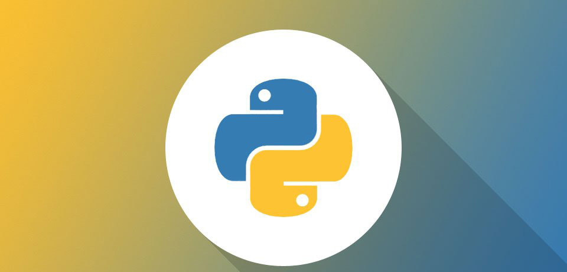
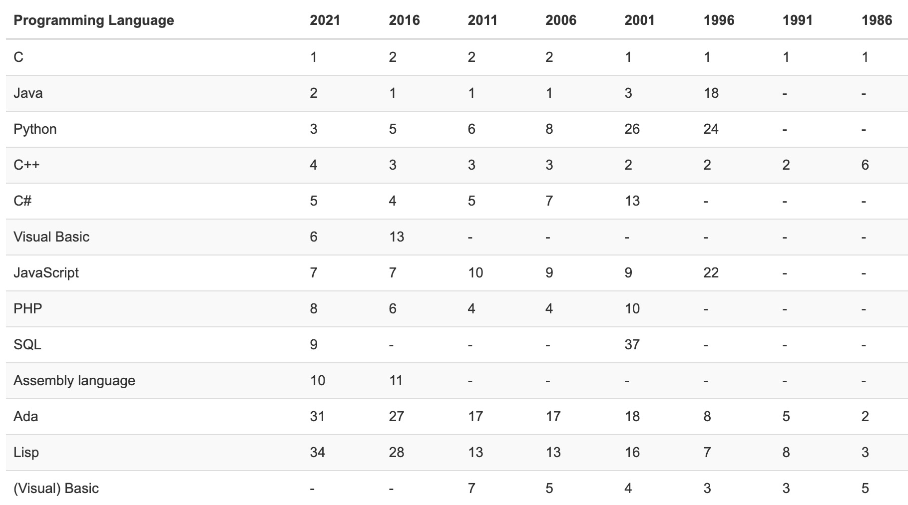
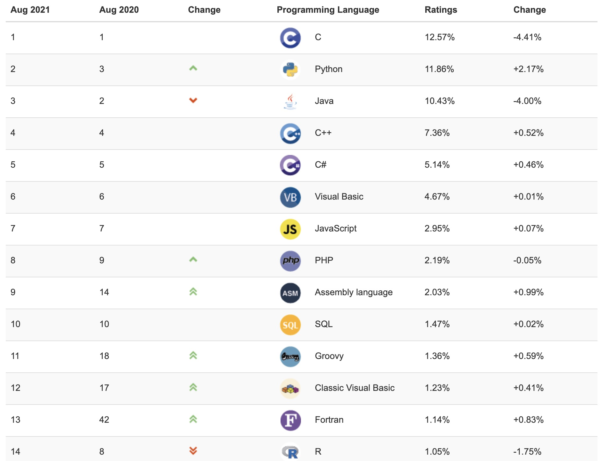
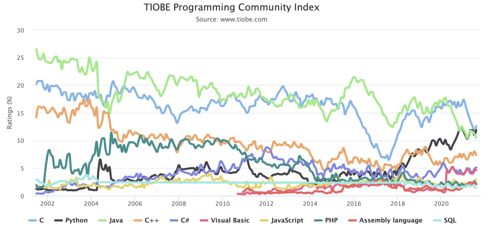
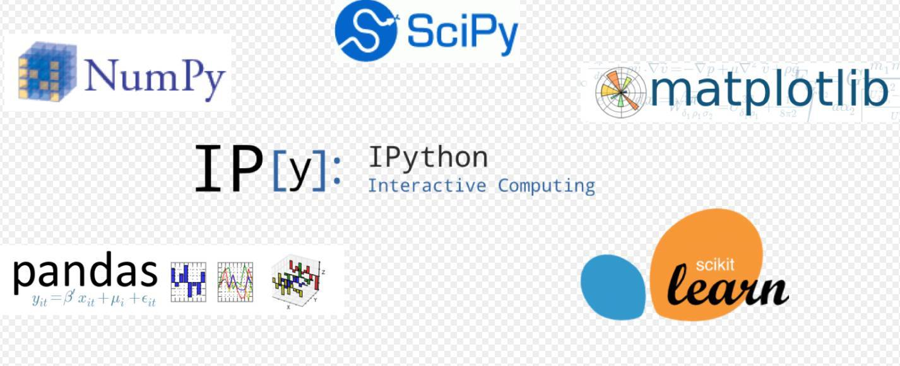
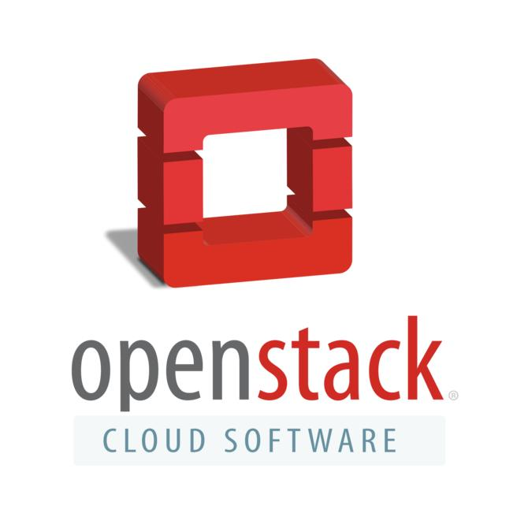
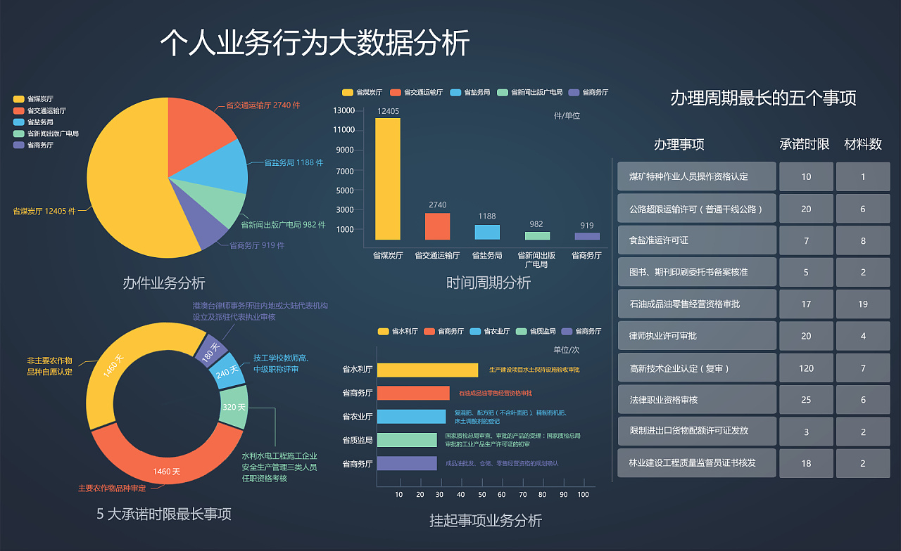
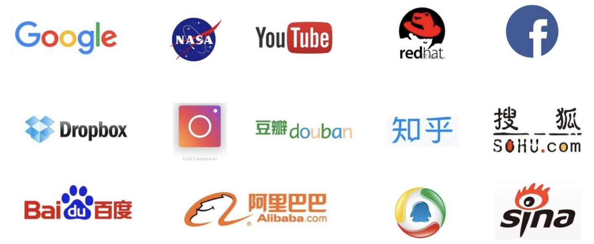

## hellopython

> 学习目的：掌握Python的使用以及文件读取、画图等实际操作
>
> 课程学习内容：Python语法、Python画图、文件I/O操作
>
> 参考：[Python简介及发展历史(学习小助手)](https://zhuanlan.zhihu.com/p/169624095)
>
> [matplotlib](https://matplotlib.org/stable/gallery/index.html)

### 课程介绍

<p align="center">

</p>

#### 一、Python的起源与发展

Python，读作`['paɪθɑn]`，翻译成汉语是蟒蛇的意思，并且Python的logo也是两条缠绕在一起蟒蛇的样子，然而Python语言和蟒蛇实际上并没有一毛钱关系。Python的口号是："人生苦短，我用Python!"。Python语言是由荷兰程序员**Guido van Rossum**，江湖人称“龟叔”，独立开发完成初版的 。1989年圣诞节期间，在阿姆斯特丹，为了打发圣诞节的无趣，决心开发一个新的脚本解释语言，作为ABC语言的一种继承，然后完成了python语言初始版本的开发（龟叔很硬核）。之所以选中Python作为该编程语言的名字，是因为他是一个叫**Monty Python**喜剧团体的粉丝，其本意并不是想选条蟒蛇。Python第一个公开发行版发行于1991年，所以这年被当作Python的诞生年。Python 源代码遵循 GPL(GNU General Public License)协议，这是一个开源的协议，也就是说你可以免费使用和传播它，而不用担心版权的问题。

<p align="center">

</p>

1. [Python 3.9.6](https://www.python.org/downloads/release/python-396/) June 28, 2021 [ Download](https://www.python.org/downloads/release/python-396/) [Release Notes](https://docs.python.org/release/3.9.6/whatsnew/changelog.html#changelog)
2. [Python 3.8.11](https://www.python.org/downloads/release/python-3811/) June 28, 2021 [ Download](https://www.python.org/downloads/release/python-3811/) [Release Notes](https://docs.python.org/release/3.8.11/whatsnew/changelog.html#changelog)
3. [Python 3.7.11](https://www.python.org/downloads/release/python-3711/) June 28, 2021 [ Download](https://www.python.org/downloads/release/python-3711/) [Release Notes](https://docs.python.org/release/3.7.11/whatsnew/changelog.html#changelog)
4. [Python 3.6.14](https://www.python.org/downloads/release/python-3614/) June 28, 2021 [ Download](https://www.python.org/downloads/release/python-3614/) [Release Notes](https://docs.python.org/release/3.6.14/whatsnew/changelog.html#changelog)
5. [Python 3.9.5](https://www.python.org/downloads/release/python-395/) May 3, 2021 [ Download](https://www.python.org/downloads/release/python-395/) [Release Notes](https://docs.python.org/release/3.9.5/whatsnew/changelog.html)
6. [Python 3.8.10](https://www.python.org/downloads/release/python-3810/) May 3, 2021 [ Download](https://www.python.org/downloads/release/python-3810/) [Release Notes](https://docs.python.org/release/3.8.10/whatsnew/changelog.html)
7. [Python 3.9.4](https://www.python.org/downloads/release/python-394/) April 4, 2021 [ Download](https://www.python.org/downloads/release/python-394/) [Release Notes](https://docs.python.org/release/3.9.4/whatsnew/changelog.html#changelog)
8. [Python 3.8.9](https://www.python.org/downloads/release/python-389/) April 2, 2021 [ Download](https://www.python.org/downloads/release/python-389/) [Release Notes](https://docs.python.org/release/3.8.9/whatsnew/changelog.html#python-3-8-9)
9. [Python 3.9.2](https://www.python.org/downloads/release/python-392/) Feb. 19, 2021 [ Download](https://www.python.org/downloads/release/python-392/) [Release Notes](https://docs.python.org/release/3.9.2/whatsnew/changelog.html#changelog)
10. [Python 3.8.8](https://www.python.org/downloads/release/python-388/) Feb. 19, 2021 [ Download](https://www.python.org/downloads/release/python-388/) [Release Notes](https://docs.python.org/release/3.8.8/whatsnew/changelog.html#changelog)
11. [Python 3.6.13](https://www.python.org/downloads/release/python-3613/) Feb. 15, 2021 [ Download](https://www.python.org/downloads/release/python-3613/) [Release Notes](https://docs.python.org/release/3.6.13/whatsnew/changelog.html#changelog)
12. [Python 3.7.10](https://www.python.org/downloads/release/python-3710/) Feb. 15, 2021 [ Download](https://www.python.org/downloads/release/python-3710/) [Release Notes](https://docs.python.org/release/3.7.10/whatsnew/changelog.html#changelog)
13. [Python 3.8.7](https://www.python.org/downloads/release/python-387/) Dec. 21, 2020 [ Download](https://www.python.org/downloads/release/python-387/) [Release Notes](https://docs.python.org/release/3.8.7/whatsnew/changelog.html)
14. [Python 3.9.1](https://www.python.org/downloads/release/python-391/) Dec. 7, 2020 [ Download](https://www.python.org/downloads/release/python-391/) [Release Notes](https://docs.python.org/release/3.9.1/whatsnew/changelog.html#changelog)
15. [Python 3.9.0](https://www.python.org/downloads/release/python-390/) Oct. 5, 2020 [ Download](https://www.python.org/downloads/release/python-390/) [Release Notes](https://docs.python.org/release/3.9.0/whatsnew/changelog.html#changelog)
16. [Python 3.8.6](https://www.python.org/downloads/release/python-386/) Sept. 24, 2020 [ Download](https://www.python.org/downloads/release/python-386/) [Release Notes](https://docs.python.org/release/3.8.6/whatsnew/changelog.html#changelog)
17. [Python 3.5.10](https://www.python.org/downloads/release/python-3510/) Sept. 5, 2020 [ Download](https://www.python.org/downloads/release/python-3510/) [Release Notes](https://docs.python.org/3.5/whatsnew/changelog.html#python-3-5-10)
18. [Python 3.7.9](https://www.python.org/downloads/release/python-379/) Aug. 17, 2020 [ Download](https://www.python.org/downloads/release/python-379/) [Release Notes](https://docs.python.org/release/3.7.9/whatsnew/changelog.html#changelog)
19. [Python 3.6.12](https://www.python.org/downloads/release/python-3612/) Aug. 17, 2020 [ Download](https://www.python.org/downloads/release/python-3612/) [Release Notes](https://docs.python.org/release/3.6.12/whatsnew/changelog.html#changelog)
20. [Python 3.8.5](https://www.python.org/downloads/release/python-385/) July 20, 2020 [ Download](https://www.python.org/downloads/release/python-385/) [Release Notes](https://docs.python.org/release/3.8.5/whatsnew/changelog.html#changelog)
21. [Python 3.8.4](https://www.python.org/downloads/release/python-384/) July 13, 2020 [ Download](https://www.python.org/downloads/release/python-384/) [Release Notes](https://docs.python.org/release/3.8.4/whatsnew/changelog.html#changelog)
22. [Python 3.7.8](https://www.python.org/downloads/release/python-378/) June 27, 2020 [ Download](https://www.python.org/downloads/release/python-378/) [Release Notes](https://docs.python.org/release/3.7.8/whatsnew/changelog.html#changelog)
23. [Python 3.6.11](https://www.python.org/downloads/release/python-3611/) June 27, 2020 [ Download](https://www.python.org/downloads/release/python-3611/) [Release Notes](https://docs.python.org/release/3.6.11/whatsnew/changelog.html#changelog)
24. [Python 3.8.3](https://www.python.org/downloads/release/python-383/) May 13, 2020 [ Download](https://www.python.org/downloads/release/python-383/) [Release Notes](https://docs.python.org/release/3.8.3/whatsnew/changelog.html#changelog)
25. [Python 2.7.18](https://www.python.org/downloads/release/python-2718/) April 20, 2020 [ Download](https://www.python.org/downloads/release/python-2718/) [Release Notes](https://www.python.org/getit/)
26. [Python 3.7.7](https://www.python.org/downloads/release/python-377/) March 10, 2020 [ Download](https://www.python.org/downloads/release/python-377/) [Release Notes](https://docs.python.org/3.7/whatsnew/changelog.html#python-3-7-7-final)
27. [Python 3.8.2](https://www.python.org/downloads/release/python-382/) Feb. 24, 2020 [ Download](https://www.python.org/downloads/release/python-382/) [Release Notes](https://docs.python.org/release/3.8.2/whatsnew/changelog.html#python-3-8-2-final)
28. [Python 3.8.1](https://www.python.org/downloads/release/python-381/) Dec. 18, 2019 [ Download](https://www.python.org/downloads/release/python-381/) [Release Notes](https://docs.python.org/3.8/whatsnew/changelog.html#python-3-8-1)
29. [Python 3.7.6](https://www.python.org/downloads/release/python-376/) Dec. 18, 2019 [ Download](https://www.python.org/downloads/release/python-376/) [Release Notes](https://docs.python.org/3.7/whatsnew/changelog.html#python-3-7-6-final)
30. [Python 3.6.10](https://www.python.org/downloads/release/python-3610/) Dec. 18, 2019 [ Download](https://www.python.org/downloads/release/python-3610/) [Release Notes](https://docs.python.org/3.6/whatsnew/changelog.html#python-3-6-10-final)
31. [Python 3.5.9](https://www.python.org/downloads/release/python-359/) Nov. 2, 2019 [ Download](https://www.python.org/downloads/release/python-359/) [Release Notes](https://docs.python.org/3.5/whatsnew/changelog.html#python-3-5-9)
32. [Python 3.5.8](https://www.python.org/downloads/release/python-358/) Oct. 29, 2019 [ Download](https://www.python.org/downloads/release/python-358/) [Release Notes](https://docs.python.org/3.5/whatsnew/changelog.html#python-3-5-8)
33. [Python 2.7.17](https://www.python.org/downloads/release/python-2717/) Oct. 19, 2019 [ Download](https://www.python.org/downloads/release/python-2717/) [Release Notes](https://raw.githubusercontent.com/python/cpython/c2f86d86e6c8f5fd1ef602128b537a48f3f5c063/Misc/NEWS.d/2.7.17rc1.rst)
34. [Python 3.7.5](https://www.python.org/downloads/release/python-375/) Oct. 15, 2019 [ Download](https://www.python.org/downloads/release/python-375/) [Release Notes](https://docs.python.org/3.7/whatsnew/changelog.html#python-3-7-5-final)
35. [Python 3.8.0](https://www.python.org/downloads/release/python-380/) Oct. 14, 2019 [ Download](https://www.python.org/downloads/release/python-380/) [Release Notes](https://docs.python.org/3.8/whatsnew/changelog.html#python-3-8-0-final)
36. [Python 3.7.4](https://www.python.org/downloads/release/python-374/) July 8, 2019 [ Download](https://www.python.org/downloads/release/python-374/) [Release Notes](https://docs.python.org/3.7/whatsnew/changelog.html#python-3-7-4-final)
37. [Python 3.6.9](https://www.python.org/downloads/release/python-369/) July 2, 2019 [ Download](https://www.python.org/downloads/release/python-369/) [Release Notes](https://docs.python.org/3.6/whatsnew/changelog.html#python-3-6-9-final)
38. [Python 3.7.3](https://www.python.org/downloads/release/python-373/) March 25, 2019 [ Download](https://www.python.org/downloads/release/python-373/) [Release Notes](https://docs.python.org/3.7/whatsnew/changelog.html#python-3-7-3-final)
39. [Python 3.4.10](https://www.python.org/downloads/release/python-3410/) March 18, 2019 [ Download](https://www.python.org/downloads/release/python-3410/) [Release Notes](https://docs.python.org/3.4/whatsnew/changelog.html#python-3-4-10)
40. [Python 3.5.7](https://www.python.org/downloads/release/python-357/) March 18, 2019
41. Python 3.5 - September 13, 2015
42. Python 3.4 - March 16, 2014
43. Python 3.3 - September 29, 2012
44. Python 3.2 - February 20, 2011
45. Python 3.1 - June 27, 2009
46. Python 3.0 - December 3, 2008
47. Python 2.7 - July 3, 2010
48. Python 2.6 - October 1, 2008
49. Python 2.5 - September 19, 2006
50. Python 2.4 - November 30, 2004, 同年目前最流行的WEB框架Django 诞生
51. Python 2.0 - October 16, 2000，加入了内存回收机制，构成了现在Python语言框架的基础
52. Python 1.0 - January 1994 增加了 lambda, map, filter and reduce.
53. 1992年，Python之父发布了Python的web框架Zope1.

[Python官网](https://www.python.org/getit/) [Python官方文档](https://docs.python.org/3/) [TIOBE编程语言排行榜](https://www.tiobe.com/tiobe-index/)

<p align="center">

</p>

<p align="center">

</p>

<p align="center">

</p>

前面我们说了Python诞生自1991年，算算Python已经走过了30个年头，比1995年的JAVA都早了4年，为何现在才得到普遍推广呢？个人认为主要存在如下原因：

**其一**，在1990那个年代，计算机性能相比现在差很多，程序执行速度和效率很重要，快速开发不是第一要务，压榨机器性能才是。Python作为一门解释型动态语言，在解释方式上它天生就存在运行速度较慢的问题，因此不被当时编程界看好，其追求开发速度、强调简洁优雅、降低编程门槛的核心理念有点超越当时主流。而时至今日，计算机的硬件性能已经得到数量级的提高，计算能力不再是限制编程语言的最重要的因素，敏捷开发成为生产环境下对语言选择的重要因素，Python很好的满足了这一点，从而得到快速发展。

**其二**，Python出生不好。作为对比的JAVA出身名门，其东家为SUN，当时互联网的头号公司，类似现在Google的地位，因而得到大力推广，并且有一群能力强、专职、有组织的团队进行开发和维护，所以很快获得成功，普及开来，至今仍然霸占着编程语言的榜首位置。而Python是个人编写的，寒门出身，龟叔没有三头六臂，个人时间精力都是有限的，虽然有一些志愿者帮忙做一些事情，但无疑和JAVA的正规军相比，能量还是要差了很多，这些都导致Python在初期发展得较为缓慢，甚至到如今都还未解决其被诟病的GIL问题。

#### 二、Python的特点

##### 1. 简单易学、明确优雅、开发速度快

- **简单易学**：与C和Java比，Python的学习成本和难度曲线不是低一点，更适合新手入门，自底向上的技术攀爬路线。先订个小目标爬个小山，然后再往更高的山峰前进。而不像C和JAVA光语言学习本身，对于很多人来说就像珠穆朗玛峰一样高不可攀。

- **明确优雅**：Python的语法非常简洁，代码量少，非常容易编写，代码的测试、重构、维护等都非常容易。一个小小的脚本，用C可能需要1000行，用JAVA可能几百行，但是用Python往往只需要几十行！

- **开发速度快**：当前互联网企业的生命线是什么？产品开发速度！如果你的开发速度不够快，在你的产品推出之前别人家的产品已经上线了，你也就没有生存空间了，这里的真实例子数不胜数。那么，Python的开发速度说第二没人敢称第一!（不欢迎辩论^_^）

##### 2、跨平台、可移植、可扩展、交互式、解释型、面向对象的动态语言

* **跨平台**：Python支持Windows、Linux和MAC os等主流操作系统。

* **可移植**：代码通常不需要多少改动就能移植到别的平台上使用。

* **可扩展**：Python语言本身由C语言编写而成的，你完全可以在Python中嵌入C，从而提高代码的运行速度和效率。你也可以使用C语言重写Python的任何模块，从根本上改写Python，PyPy就是这么干的。

* **交互式**：Python提供很好的人机交互界面，比如IDLE和IPython。可以从终端输入执行代码并获得结果，互动的测试和调试代码片断。

* **解释型**：Python语言在执行过程中由解释器逐行分析，逐行运行并输出结果。

* **面向对象**：Python语言具备所有的面向对象特性和功能，支持基于类的程序开发。

* **动态语言**：在运行时可以改变其结构。例如新的函数、对象、甚至代码可以被引进，已有的函数可以被删除或是其他结构上的变化。动态语言非常具有活力。

##### 3、“内置电池”，大量的标准库和第三方库

Python为我们提供了非常完善的基础库，覆盖了系统、网络、文件、GUI、数据库、文本处理等方方面面，这些是随同	解释器被默认安装的，各平台通用，你无需安装第三方支持就可以完成大多数工作，这一特点被形象地称作“内置电池（batteries included）”。在程序员界，有一句话叫做“不要重复造轮子”。什么意思呢？就是说不要做重复的开发工作，如果对某个问题已经有开源的解决方案或者说第三方库，就不要自己去开发，直接用别人的就好。不要过分迷信自己的代码能力，要知道，能作为标准库被Python内置，必然在可靠性和算法效率上达到了目前最高水平，能被广泛使用的第三方库，必然也是经受了大量的应用考验。除非公司要求，不要自己去开发，请使用现成的库。那些造轮子的事情，就交给世界最顶尖的那一波程序员去干吧，没有极致的思维和数学能力，想创造好用的轮子是很难的。

##### 4. 社区活跃，贡献者多，互帮互助

技术社区的存在就相当于程序员手中的指南针，没有指南针，很多时候，碰到了问题，就像无头的苍蝇只能到处乱飞，最终在茫茫的海洋中转晕致死。技术社区可以给我们对语言的学习和使用提供巨大的帮助，无论是前期的学习，还是日后的工作，只要有问题，技术社区的大牛都可以帮我们解决，有这些助力，可以帮我们更好地了解、学习和使用一门语言。技术社区同时还推动Python语言的发展方向，功能需求，促使公司企业更多的使用Python语言，招聘Python程序员。

##### 5. 开源语言，发展动力巨大

Python是基于C语言编写的，并且使用GPL开源协议，你可以免费获取它的源代码，进行学习、研究甚至改进。众人拾柴火焰高，有更多的人参与Python的开发，促使它更好的发展，被更多的应用，形成良性循环。Python为什么会越来越火就是因为它的开放性，自由性，聚起了人气，形成了社区，有很多人在其中做贡献，用的人越来越多，自然就提高了市场占有率，企业、公司、厂家就不得不使用Python，提供的Python程序员岗位就越来越多，这就是开源的力量。

#### 三、Python的使用领域

##### 1、常规的软件开发

Python支持函数式编程和OOP面向对象编程，能够承担任何种类软件的开发工作，因此常规的软件开发、脚本编写、网络编程等都属于标配能力。

<p align="center">

</p>

##### 2、科学计算

随着NumPy, SciPy, Matplotlib, Enthought librarys等众多程序库的开发，Python越来越适合于做科学计算、绘制高质量的2D和3D图像。和科学计算领域最流行的商业软件Matlab相比，Python是一门通用的程序设计语言，比Matlab所采用的脚本语言的应用范围更广泛，有更多的程序库的支持。虽然Matlab中的许多高级功能和toolbox目前还是无法替代的，不过在日常的科研开发之中仍然有很多的工作是可以用Python代劳的。

<p align="center">

</p>

##### 3、自动化运维

这几乎是Python应用的自留地，作为运维工程师首选的编程语言，Python在自动化运维方面已经深入人心，比如Saltstack和Ansible都是大名鼎鼎的自动化平台。

<p align="center">

</p>

##### 4、云计算

开源云计算解决方案OpenStack就是基于Python开发的

<p align="center">

</p>

##### 5、WEB开发

基于Python的Web开发框架不要太多，比如耳熟能详的Django，还有Tornado，Flask。其中的Python+Django架构，应用范围非常广，开发速度非常快，学习门槛也很低，能够帮助你快速的搭建起可用的WEB服务。

<p align="center">

</p>

##### 6、网络爬虫

也称网络蜘蛛，是大数据行业获取数据的核心工具。没有网络爬虫自动地、不分昼夜地、高智能地在互联网上爬取免费的数据，那些大数据相关的公司恐怕要少四分之三。能够编写网络爬虫的编程语言有不少，但Python绝对是其中的主流之一，其Scripy爬虫框架应用非常广泛。[ Python网络爬虫与推荐算法的新闻推荐平台](https://gitee.com/z812483032/NewsRecommends?_from=gitee_search)、[ 网络爬虫实战](https://gitee.com/chen_weipeng/wangluopachongshizhan?_from=gitee_search)

<p align="center">

</p>

##### 7、数据分析

在大量数据的基础上，结合科学计算、机器学习等技术，对数据进行清洗、去重、规格化和针对性的分析是大数据行业的基石。Python是数据分析的主流语言之一。

<p align="center">

</p>

##### 8、人工智能

Python在人工智能大范畴领域内的机器学习、神经网络、深度学习等方面都是主流的编程语言，得到广泛的支持和应用。

<p align="center">

</p>

#### 四、Python的使用者

在国内最有名的就是知乎和豆瓣了，它们就是基于Python开发的Web服务。其它的例如百度、阿里、淘宝 、搜狐、金山、腾讯、盛大、网易、土豆、新浪、果壳等公司都在使用Python完成各种各样的任务，几乎所有的互联网企业都在招聘Python程序员。

在国外，更是数不胜数。谷歌的Google App Engine 、[http://code.google.com](https://link.zhihu.com/?target=http%3A//code.google.com) 、Google earth 、谷歌爬虫、广告等项目都在大量使用Python进行开发。还有Facebook、Twitter等等等等。几乎所有的Linux发行版都内置Python解释器。

<p align="center">

</p>

### 结束语——Python之禅

在Python的IDLE或者交互式解释器中，输入`import this`，你就会看到下面的一段话：

The Zen of Python, by Tim Peters

Beautiful is better than ugly.
Explicit is better than implicit.
Simple is better than complex.
Complex is better than complicated.
Flat is better than nested.
Sparse is better than dense.
Readability counts.
Special cases aren't special enough to break the rules.
Although practicality beats purity.
Errors should never pass silently.
Unless explicitly silenced.
In the face of ambiguity, refuse the temptation to guess.
There should be one-- and preferably only one --obvious way to do it.
Although that way may not be obvious at first unless you're Dutch.
Now is better than never.
Although never is often better than *right* now.
If the implementation is hard to explain, it's a bad idea.
If the implementation is easy to explain, it may be a good idea.
Namespaces are one honking great idea -- let's do more of those!

翻译过来的意思就是：

优美胜于丑陋（Python 以编写优美的代码为目标）<br></br>
明了胜于晦涩（优美的代码应当是明了的，命名规范，风格相似）<br></br>
简洁胜于复杂（优美的代码应当是简洁的，不要有复杂的内部实现）<br></br>
复杂胜于凌乱（如果复杂不可避免，那代码间也不能有难懂的关系，要保持接口简洁）<br></br>
扁平胜于嵌套（优美的代码应当是扁平的，不能有太多的嵌套）<br></br>
间隔胜于紧凑（优美的代码有适当的间隔，不要奢望一行代码解决问题）<br></br>
可读性很重要（优美的代码是可读的）<br></br>
即便假借特例的实用性之名，也不可违背这些规则（这些规则至高无上）<br></br>
不要包容所有错误，除非你确定需要这样做（精准地捕获异常，不写 except:pass 风格的代码）<br></br>
当存在多种可能，不要尝试去猜测而是尽量找一种，最好是唯一一种明显的解决方案（如果不确定，就用穷举法）<br></br>
虽然这并不容易，因为你不是 Python 之父（这里的 Dutch 是指 Guido ）<br></br>
做也许好过不做，但不假思索就动手还不如不做（动手之前要细思量）<br></br>
如果你无法向人描述你的方案，那肯定不是一个好方案；反之亦然（方案测评标准）<br></br>
命名空间是一种绝妙的理念，我们应当多加利用（倡导与号召）<br></br>

本节课结合具体的例子讲解Python的一些入门知识，并且后面结合具体的应用实例，讲解了python在画图中的应用。
python的画图功能主要涉及matplotlib以及seaborn两个模块。这里主要参考了[Top 50 matplotlib Visualizations – The Master Plots (with full python code)](https://www.machinelearningplus.com/plots/top-50-matplotlib-visualizations-the-master-plots-python/)50个python画图应用实例，但是针对作者给出的实例，这里对其做了一定的修改，并采用pycharm本地IDE软件对其进行了重写，主要做了如下的一些改动：

*  删除了代码中错误引用的数据
* 对库函数已经不支持的一些函数进行了修改、替换
* 将图表按照不同的使用场景分为了7个组【**关联（correlation）**、**偏差(deviation)**、**分布(distribution)**、**组成(composition)**、**变化(change)**、**分组(groups)**、**排序(ranking)**】，可根据不同的使用需求进行阅读
* 提供了**Pycharm工程**，可以在本地实时运行， 解决了原代码直接线上读取数据读取时间超时问题

### 课程目录
* 基本语法

* 核心数据结构 -- 字符串  

* 核心数据结构 -- 列表  

* 核心数据结构 -- 元祖  

* 核心数据结构 -- 字典  

* 表达式与运算符
* 选择语句
* 循环语句

### 课程作业

* **文件I/O练习**

  自己学习如何读取文件，并对文件中的内容进行相关操作，相关的例子可以参考：

  ```python
  ### Working with paths
  import os
  
  current_file = os.path.realpath('file_io.ipynb')  
  print('current file: {}'.format(current_file))
  # Note: in .py files you can get the path of current file by __file__
  
  current_dir = os.path.dirname(current_file)  
  print('current directory: {}'.format(current_dir))
  # Note: in .py files you can get the dir of current file by os.path.dirname(__file__)
  
  data_dir = os.path.join(os.path.dirname(current_dir), 'data')
  print('data directory: {}'.format(data_dir))
  print('exists: {}'.format(os.path.exists(data_dir)))
  print('is file: {}'.format(os.path.isfile(data_dir)))
  print('is directory: {}'.format(os.path.isdir(data_dir)))
  ```

  ```python
  file_path = os.path.join(data_dir, 'simple_file.txt')
  
  with open(file_path, 'r') as simple_file:
      for line in simple_file:
          print(line.strip())
  ```

  

* **画图练习**

  根据线上讲解内容，将画图剩余的部分自己实现一遍，可以结合自己在论文写作中的实际需求，调用不同类别的画图程序快速写出适合自己的画图程序，减少代码的写作时间