[TOC]
# **$ \color {gray}Unsupervised \quad  Learning $**
​     利用无标签的数据学习 *数据的分布* 或 *数据与数据之间的关系* 被称作无监督学习
有监督学习和无监督学习的最大区别在于数据是否有标签 
无监督学习最常应用的场景是**聚类**(clustering)和**降维**(DimensionReduction)
##  聚类
	聚类(clustering)，就是根据数据的"相似性"将数据分为多类的过程
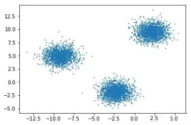
### 聚类算法
+ 分散型聚类（k-means）
+ 结构型聚类（层次聚类）
### 距离函数
	(相似性或相异性)：度量两个数据点的相似程度
### 聚类评价
+ 类内差异(聚类内部距离)：最小化
+ 类间差异(聚类外部距离)：最大化
聚类结果的质量与**算法、距离函数**和**应用领域**有很大关系
## $\color{red} k-均值聚类 $
+ k-均值算法是划分聚类算法
+ 根据某个距离函数反复地把数据分入k个聚类中
+ **k-均值算法把给定的数据划分为k个聚类**
    + 每个聚类中有一个聚类的中心，用来表示某个聚类，这个中心时聚类中所有数据点的均值
    + k是由用户指定的
### k-均值算法执行步骤
```
1. 随机选取k个数据点作为初始聚类中心
2. 计算每个数据点与各个中心之间的距离，把每个数据点分配给距离他最近的聚类中心
3. 数据点分配以后，每个聚类的聚类中心会根据聚类现有的数据点重新计算
4. 不断重复直到满足某个终止条件为止
```
### 终止条件
+ 没有(或最小数目)数据点被重新分配给不同的聚类
+ 没有(或最小数目)聚类中心再发生变化
+ `误差平方和`(sum of squared error,SSE)局部最小
$$
\sum_{j=1}^k \sum  {x\in C_j}     dist(x,m_j)^2
$$
其中，$ C_j $表示第$j$个聚类，$m_j$是聚类$C_j$的聚类中心（$C_j$中所有数据点的均值向量）,$dist(x,m_j)$表示数据点$x$和聚类中心$m_j$之间的距离。
###  示例
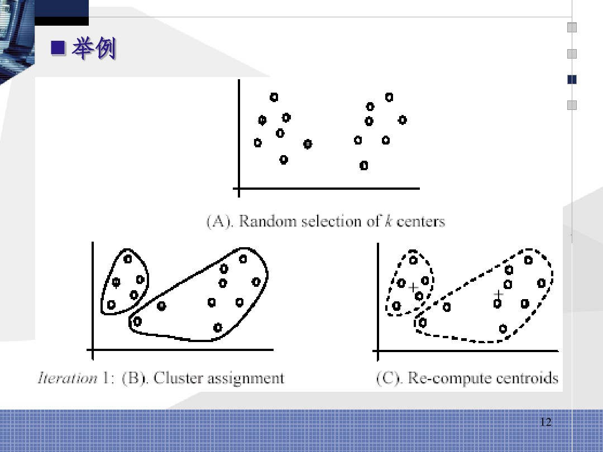
![]./pic/03.jpeg)
### 距离计算
+ 在那些均值能被定义和计算的数据集上均能使用k-均值算法
+ 在`欧式空间`，聚类均值可以使用如下公式 $m_j = {1\over \mid C_j \mid} \sum_ {x_i \in C_j} X_i$
+ 数据点与聚类中心的距离使用如下公式计算$dist(x_i,m_j)=\mid\mid x_i - m_j \mid\mid = \sqrt{(x_{i1} - m_{j1}) ^2  + (x_{i2} - m_{j2}) ^2 +...+ (x_{ir} - m_{jr}) ^2}  $
### 算法举例

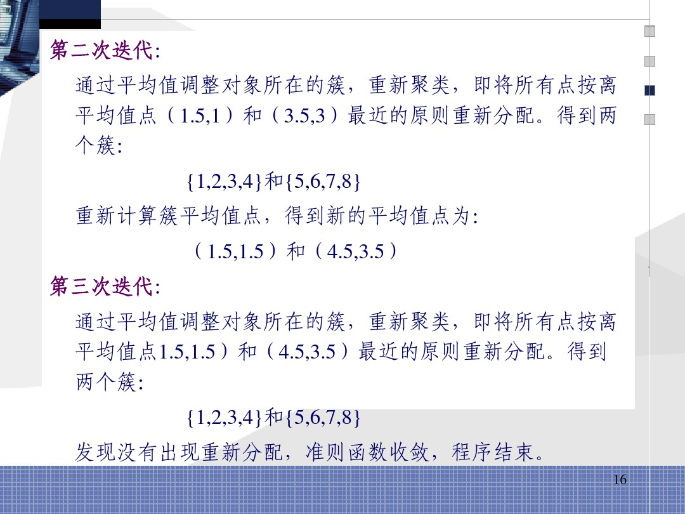

### 优势与劣势
#### 优势
+ 简单：容易被理解，同时也容易被实现
+ 效率：时间复杂度为$O(tkn)$（其中，$k$是聚类的个数；$t$是循环次数）
+ 由于$k$和$t$通常都远远小于$n$，k-均值算法被认为相对于数据点的数目来说是线性的
+ k-均值算法时聚类算法中最流行的一种算法
#### 劣势
+ 算法只能用于那些均值能够被定义的数据集上。
    + 对于`范畴数据`，有一种k-均值算法的变体——`k-模算法`。
+ 需要事先指定聚类数目k
+ 算法对于`异常值`十分敏感
    +  异常值是指数据中那些与其他数据点相隔很远的数据点
    +  异常值可能是数据采集时产生的错误或者一些具有不同值的特殊点
#### 解决异常值问题
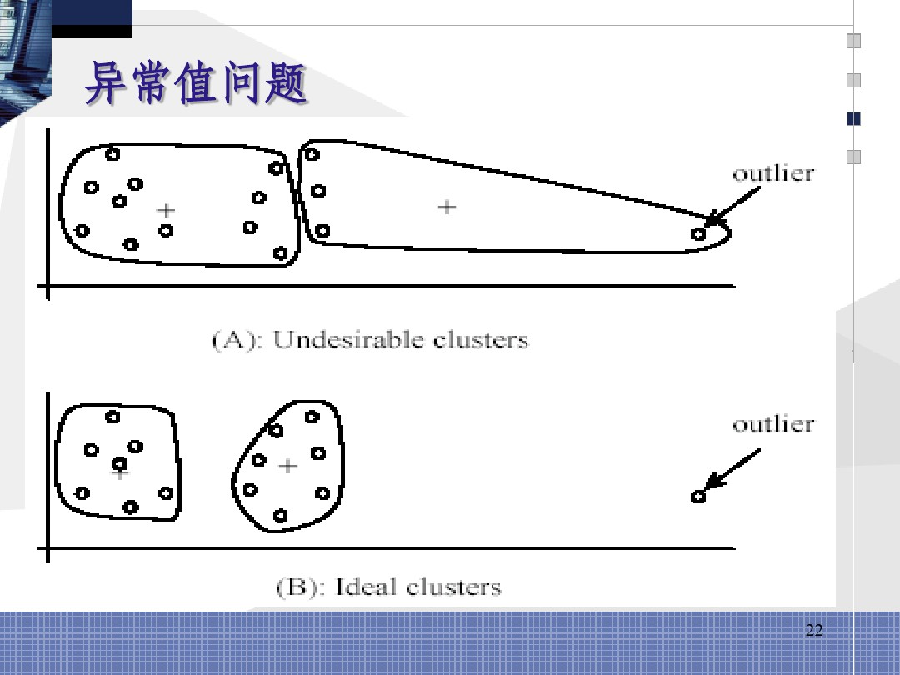
+ 一种方法：在聚类过程中去除那些比其他数据点离聚类中心都要远的数据点（一般需要在多次循环中监控这些潜在的异常值，然后再决定是否删除他们）
+ 另一种方法：`随机采样`，因为采样过程中只选择很少一部分的数据点，因此选中异常值的概率将会很小（可以先用采样点进行预先聚类然后把其他数据点分配给这些聚类）
####  算法对初始种子十分敏感
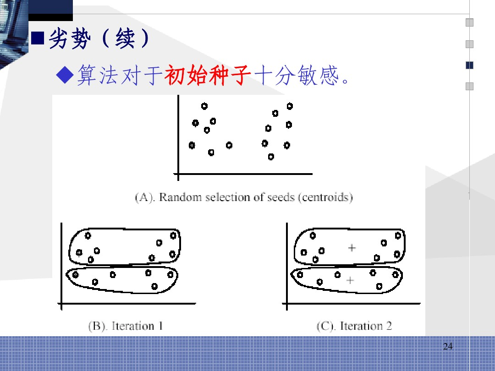

#### 算法不适合发现那些形状不是`超维椭圆体`（或超维球体）的聚类

## 层次聚类
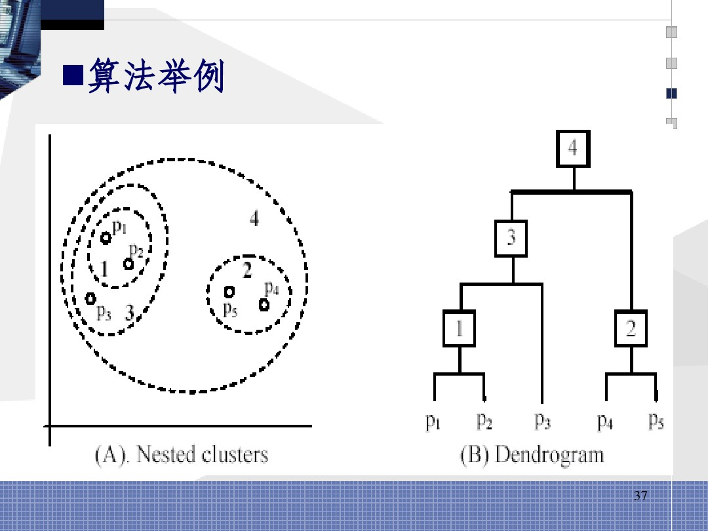
### 合并（自下而上）聚类：
从树状图的最底层开始构建树：
+ 合并最相似（距离最近）的聚类来形成山一层中的聚类
+ 整个过程当全部数据点都合并到一个聚类中时停止
### 分裂（自上而下）聚类：
从一个包含全部数据点的聚类开始：
+ 根节点聚类分裂成一些子聚类。每个子聚类在递归地继续向下分裂
+ 直到出现只包含一个数据点的单节点聚类出现时停止
#### 样例

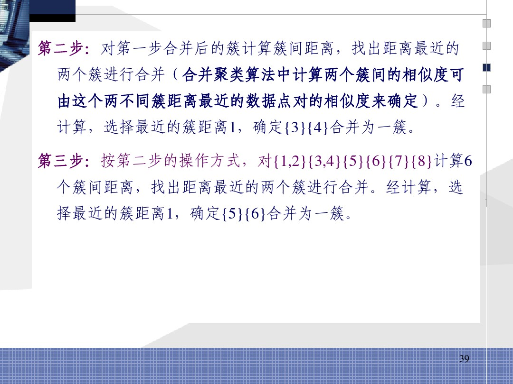
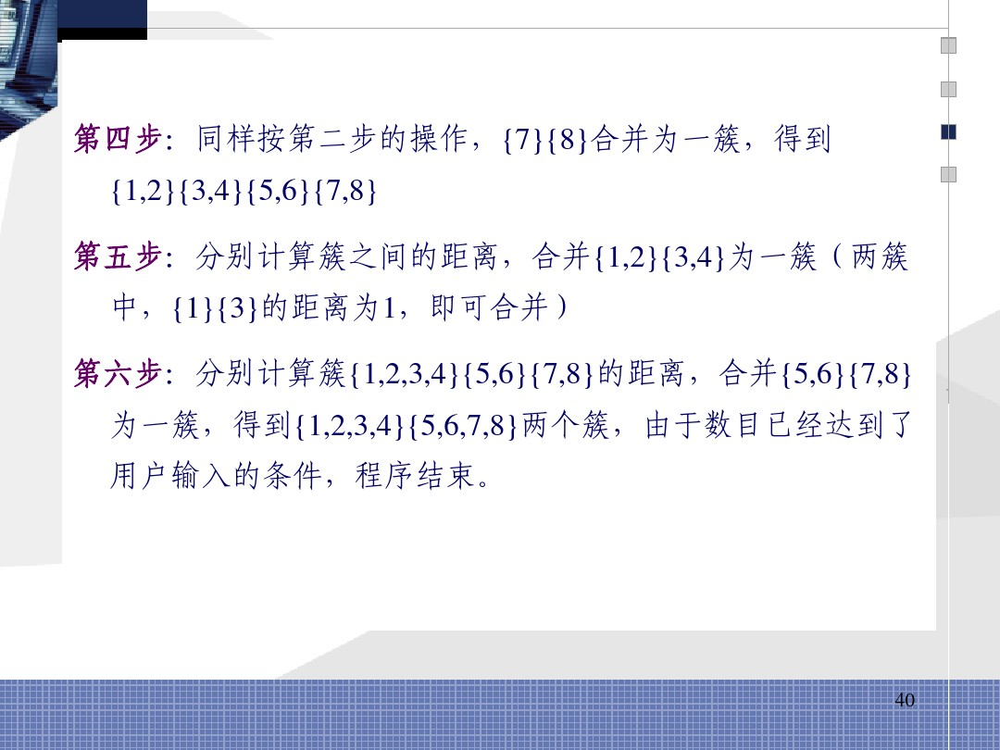

### 两个聚类之间距离的计算
+ 单链接方法
+ 全链接方法
+ 平均链接方法
+ 聚类中心方法
+ ...
#### 单链接方法
+ 两个聚类中距离最近的两个数据点之间的距离
+ 适合于寻找那些形状怪异的聚类
+ 对数据中的噪声值十分敏感
#### 全链接方法
+ 两个聚类中所有数据点之间聚类的最大值
+ 对异常值十分敏感
#### 平均链接方法
+ 介于全链接防范对于异常值的而敏感型和单链接方法形成长链（这种倡廉不符合聚类时紧密的椭圆体对象这一常识）的趋势之间的折中办法
+ 两个聚类之间距离是两个聚类之中多个数据点对之间距离值和的平均值
#### 聚类中心方法
两个聚类之间的距离是两个聚类中心之间的距离
#### 复杂度
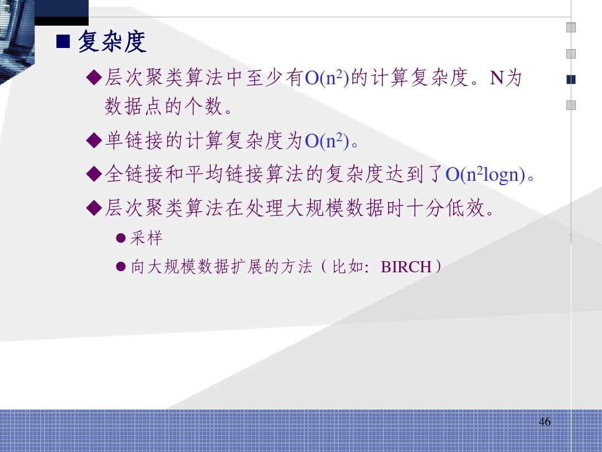

## $\color{red} PCA$

### 问题

     真实的训练数据总是存在各种各样的问题：

- 比如拿到一个汽车的样本，里面既有以“千米/每小时”度量的最大速度特征，也有“英里/小时”的最大速度特征，显然这两个特征有一个多余。
- 拿到一个数学系的本科生期末考试成绩单，里面有三列，一列是对数学的兴趣程度，一列是复习时间，还有一列是考试成绩。我们知道要学好数学，需要有浓厚的兴趣，所以第二项与第一项强相关，第三项和第二项也是强相关。那是不是可以合并第一项和第二项呢？
-  拿到一个样本，特征非常多，而样例特别少，这样用回归去直接拟合非常困难，容易过度拟合。比如北京的房价：假设房子的特征是（大小、位置、朝向、是否学区房、建造年代、是否二手、层数、所在层数），搞了这么多特征，结果只有不到十个房子的样例。要拟合房子特征->房价的这么多特征，就会造成过度拟合。

下面探讨一种称作主成分分析（PCA）的方法来解决部分上述问题。PCA的思想是将$n$维特征映射到k维$（k<n）$，这$k$维是全新的正交特征。这$k$维特征称为主元，是重新构造出来的$k$维特征，而不是简单地从$n$维特征中去除其余$n-k$维特征。

### 计算过程

1. 计算各个特征的平均值。
2. 求特征协方差矩阵。
3. 求协方差的特征值和特征向量。
4. 将特征值按照从大到小的顺序排序，选择其中最大的$k$个，然后将其对应的$k$个特征向量分别作为列向量组成特征向量矩阵。
5. 将样本点投影到选取的特征向量上。假设样例数为$m$，特征数为$n$，减去均值后的样本矩阵为DataAdjust$(m*n)$，协方差矩阵为$m*n$，选取的$k$个特征向量组成的矩阵为EigenVectors$(n*k)$。那么投影后的数据$FinalData$为

$$
FinalData(m*k)=DataAdjust(m*n)×EigenVectors(n*k)
$$

### 样例
+ 首先我们假设得到的2维数据如下：

行代表了样例，列代表特征，这里有10个样例，每个样例两个特征。可以这样认为，有10篇文档，$x$是10篇文档中“learn”出现的TF-IDF，$y$是10篇文档中“study”出现的TF-IDF。也可以认为有10辆汽车，$x$是千米/小时的速度，$y$是英里/小时的速度，等等。
1. 第一步：分别求$x$和$y$的平均值，然后对于所有的样例，都减去对应的均值。这里$x$的均值是1.81，$y$的均值是1.91，那么一个样例减去均值后即为（0.69,0.49），得到
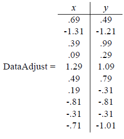

2. 第二步：求特征协方差矩阵,数据是2维，协方差矩阵为
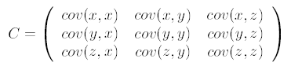
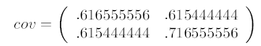
对角线上分别是$x$和$y$的方差，非对角线上是协方差。协方差大于0表示$x$和$y$若有一个增，另一个也增；小于0表示一个增，一个减；协方差为0时，两者独立。协方差绝对值越大，两者对彼此的影响越大，反之越小。

3. 求协方差的特征值和特征向量，得到 

上面是两个特征值，下面是对应的特征向量，特征值0.0490833989对应特征向量为$ (-0.735178656,0.677873399)^T$，这里的特征向量都归一化为单位向量。

4. 将特征值按照从大到小的顺序排序，选择其中最大的$k$个，然后将其对应的$k$个特征向量分别作为列向量组成特征向量矩阵。这里特征值只有两个，我们选择其中最大的那个，这里是1.28402771，对应的特征向量是$(0.6)77873399,-0.735178656)^T$

5. 将样本点投影到选取的特征向量上。假设样例数为m，特征数为n，减去均值后的样本矩阵为$DataAdjust(m*n)$，协方差矩阵是$n*n$，选取的k个特征向量组成的矩阵为$EigenVectors(n*k)$。那么投影后的数据$FinalData$为$FinalData(m*k) = DataAdjust(m*n)   \times EigenVectors(n*k)$
得到结果是:
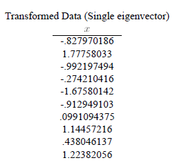
这样，就将原始样例的n维特征变成了k维，这k维就是原始特征在k维上的投影。
上面的数据可以认为是learn和study特征融合为一个新的特征叫做LS特征，该特征基本上代表了这两个特征。
上述过程有个图描述
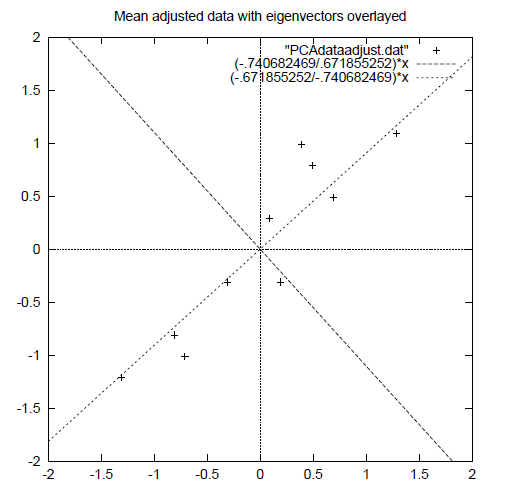
正号表示预处理后的样本点，斜着的两条线就分别是正交的特征向量（由于协方差矩阵是对称的，因此其特征向量正交），最后一步的矩阵乘法就是将原始样本点分别往特征向量对应的轴上做投影。
如果取的k=2，那么结果是
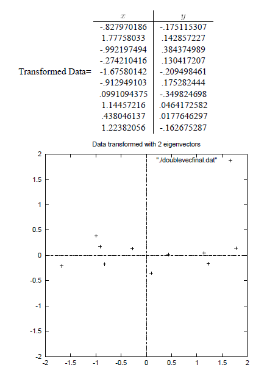

这就是经过PCA处理后的样本数据，水平轴（上面举例为LS特征）基本上可以代表全部样本点。整个过程看起来就像将坐标系做了旋转，当然二维可以图形化表示，高维就不行了。上面的如果k=1，那么只会留下这里的水平轴，轴上是所有点在该轴的投影。

这样PCA的过程基本结束。在第一步减均值之后，其实应该还有一步对特征做方差归一化。比如一个特征是汽车速度（0到100），一个是汽车的座位数（2到6），显然第二个的方差比第一个小。因此，如果样本特征中存在这种情况，那么在第一步之后，求每个特征的标准差$\sigma$，然后对每个样例在该特征下的数据除以$\sigma$。

归纳一下，使用我们之前熟悉的表示方法，在求协方差之前的步骤是：
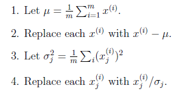
其中$x^{(i)}$ 是样例，共m个，每个样例n个特征，也就是说$x^{(i)}$是n维向量，$x_j^{(i)}$是第i个样例的第j个特征，$\mu$是样例均值，$\sigma_j$是第j个特征的标准差。

整个PCA过程貌似及其简单，就是求协方差的特征值和特征向量，然后做数据转换。但是有没有觉得很神奇，为什么求协方差的特征向量就是最理想的k维向量？其背后隐藏的意义是什么？整个PCA的意义是什么？

### 理论基础

##### 最大方差理论

     在信号处理中认为信号具有较大的方差，噪声有较小的方差，信噪比就是信号与噪声的方差比，越大越好。因此我们认为，最好的k维特征是将n维样本点转换为k维后，每一维上的样本方差都很大。

      比如下图有5个样本点：（已经做过预处理，均值为0，特征方差归一）


      下面将样本投影到某一维上，这里用一条过原点的直线表示（前处理的过程实质是将原点移到样本点的中心点）。


​	假设我们选择两条不同的直线做投影，那么左右两条中哪个好呢？根据我们之前的方差最大化理论，左边的好，因为投影后的样本点之间方差最大。


    

​	红色点表示样例$x^{(i)}​$，蓝色点表示$x^{(i)}​$在$u​$上的投影，$u​$是直线的斜率也是直线的方向向量，而且是单位向量。蓝色点是$x^{(i)}​$在$u​$上的投影点，离原点的距离是$\mid| x^{(i)},u \mid \mid​$(即$x^{(i)^T}u​$或者$u^Tx^{(i)}​$)由于这些样本点（样例）的每一维特征均值都为0，因此投影到$u​$上的样本点（只有一个到原点的距离值）的均值仍然是0。

​	 回到上面左右图中的左图，我们要求的是最佳的u，使得投影后的样本点方差最大。由于投影后均值为0，因此方差为：
$$
\begin{align}
\frac {1}{m}\sum_{i=1}^{m}(x^{(i)^T}u)^2 &= \frac{1}{m}\sum_{m=1}^{m}u^Tx^{{(i)}}x^{{(i)^T}}u\\
&= u^T(\frac{1}{m}\sum_{i=1}^{m}x^{(i)}x^{(i)^T})u.
\end{align}
$$

​	中间那部分很熟悉啊，不就是样本特征的协方差矩阵么，（$x^{{(i)}}$的均值为0，一般协方差矩阵都除以$m-1$，这里用$m$）。

​	用$λ$来表示$\frac {1}{m}\sum_{i=1}^{m}(x^{(i)^T}u)^2$，$Σ$表示$ \frac{1}{m}\sum_{i=1}^{m}x^{(i)}x^{(i)^T} $，那么上式写作
$$
λ=u^T\sum u
$$
​	由于$u$是单位向量，即$u^Tu=1$，上式两边都左乘$u$得，$uλ=λu=uu^T\sum u=\sum u$

​	即$\sum u = λu$

​	We got it！$\lambda$就是$\sum$的特征值，$u$是特征向量。最佳的投影只显示特征值$\lambda$最大时对应的特征向量，其次是$\lambda$第二大对应的特征向量，依次类推。

​	因此，我们只需要对协方差矩阵进行特征值分解，得到的前$k$大特征值对应的特征向量就是最佳的$k$维新特征，而且这$k$维新特征是正交的。得到前$k$个$u$以后，样例$x^{(i)}$通过以下变换可以得到新的样本。
$$
y^{(i)}=\left\{
\begin{matrix}
   u_1^Tx^{(i)}  \\
   u_2^Tx^{(i)}   \\
   ...  \\
   u_k^Tx^{(i)} 
  \end{matrix} 
  \right\}
$$
​	其中第$j$维就是$x^{(i)}$在$u_j$上的投影，通过选取最大的$k$个$u$，使得方差较小的特征（如噪声）被丢弃。
### 总结与讨论

​	PCA技术的一大好处是对数据进行降维的处理。我们可以对新求出的“主元”向量的重要性进行排序，根据需要取前面最重要的部分，将后面的维数省去，可以达到降维从而简化模型或是对数据进行压缩的效果。同时最大程度的保持了原有数据的信息。

​	PCA技术的一个很大的优点是，它是完全无参数限制的。在PCA的计算过程中完全不需要人为的设定参数或是根据任何经验模型对计算进行干预，最后的结果只与数p据相关，与用户是独立的。 但是，这一点同时也可以看作是缺点。如果用户对观测对象有一定的先验知识，掌握了数据的一些特征，却无法通过参数化等方法对处理过程进行干预，可能会得不到预期的效果，效率也不高。

​	有时数据的分布并不是满足高斯分布。如下图所示，在非高斯分布的情况下，PCA方法得出的主元可能并不是最优的。在寻找主元时不能将方差作为衡量重要性的标准。要根据数据的分布情况选择合适的描述完全分布的变量，然后根据概率分布式
$$
P(y_1,y_2)=P(y_1)P(y_2)
$$
​	来计算两个向量上数据分布的相关性。等价的，保持主元间的正交假设，寻找的主元同样要使$P(y_1,y_2)=0$。这一类方法被称为独立主元分解(ICA)。在下图中，数据的分布并不满足高斯分布，呈明显的十字星状。 这种情况下，方差最大的方向并不是最优主元方向。

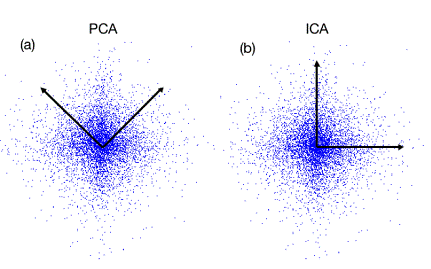
## 笔记
1. PCA可以降维也可以升维
2. PCA的矩阵求解可以和slam线性优化中的`SVD分解`原理相同
3. 关于矩阵求解：特征值特征向量的求解方法计算量大，一般实际工程中采用SVD分解
4. PCA的实质是实对称矩阵的对角化来解决特征冗余
5. PCA的优点与应用：降噪，便于分类，pre-trained 深度网络的参数，便于后续的分类等操作
6. 练习使用`sklearn` 和` jupyter notebook`的使用
