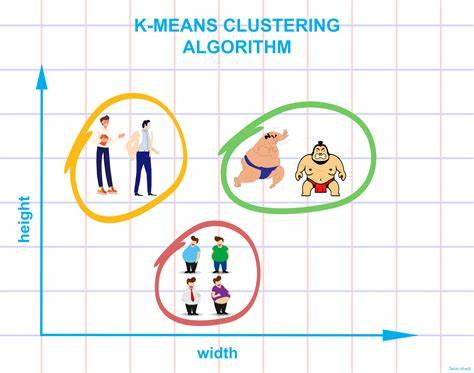

## k-Means

k-Means算法是无监督学习领域最为经典的算法之一。k-means算法就是将n个数据点进行聚类分析，得到 k  个聚类，使得每个数据点到聚类中心的距离最小。而实际上，这个问题往往是NP-hard的，以此有许多启发式的方法求解，从而避开局部最小值。

## 内容

* [k-Means原理、算法](1-k-means.ipynb)
* [应用-图像压缩](2-kmeans-color-vq.ipynb)
* [聚类算法对比](3-ClusteringAlgorithms.ipynb)

## References

* [如何使用 Keras 实现无监督聚类](http://m.sohu.com/a/236221126_717210)

* [Bag-of-words模型入门](https://blog.csdn.net/wsj998689aa/article/details/47089153)
