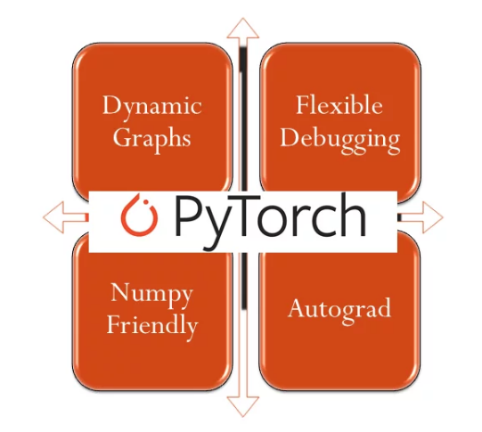

# PyTorch

PyTorch是基于Python的科学计算包，其旨在服务两类场合：
* 替代NumPy发挥GPU潜能
* 提供了高度灵活性和效率的深度学习平台

PyTorch的简洁设计使得它入门很简单，本部分内容在深入介绍PyTorch之前，先介绍一些PyTorch的基础知识，让大家能够对PyTorch有一个大致的了解，并能够用PyTorch搭建一个简单的神经网络，然后在深入学习如何使用PyTorch实现各类网络结构。在学习过程，可能部分内容暂时不太理解，可先不予以深究，后续的课程将会对此进行深入讲解。

## 内容

- [Tensor](1-tensor.ipynb)
- [autograd](2-autograd.ipynb)
- [linear-regression](3-linear-regression.ipynb)
- [logistic-regression](4-logistic-regression.ipynb)
- [nn-sequential-module](5-nn-sequential-module.ipynb)
- [deep-nn](6-deep-nn.ipynb)
- [param_initialize](7-param_initialize.ipynb)
- [optim/sgd](optimizer/6_1-sgd.ipynb)
- [optim/adam](optimizer/6_6-adam.ipynb)

## References

* [code of book "Learn Deep Learning with PyTorch"](https://github.com/L1aoXingyu/code-of-learn-deep-learning-with-pytorch)
* [PyTorch tutorials and fun projects including neural talk, neural style, poem writing, anime generation](https://github.com/chenyuntc/pytorch-book)
* [Awesome-Pytorch-list](https://github.com/bharathgs/Awesome-pytorch-list)
* [PyTorch Tutorial for Deep Learning Researchers](https://github.com/yunjey/pytorch-tutorial)
* [The Incredible PyTorch: a curated list of tutorials, papers, projects, communities and more relating to PyTorch.](https://github.com/ritchieng/the-incredible-pytorch)
* [Simple examples to introduce PyTorch](https://github.com/jcjohnson/pytorch-examples)
* [Simple PyTorch Tutorials Zero to ALL!](https://github.com/hunkim/PyTorchZeroToAll)
* [从基础概念到实现，小白如何快速入门PyTorch](https://mp.weixin.qq.com/s/zhkaenFdnB5KgaEYb-XDEQ)
