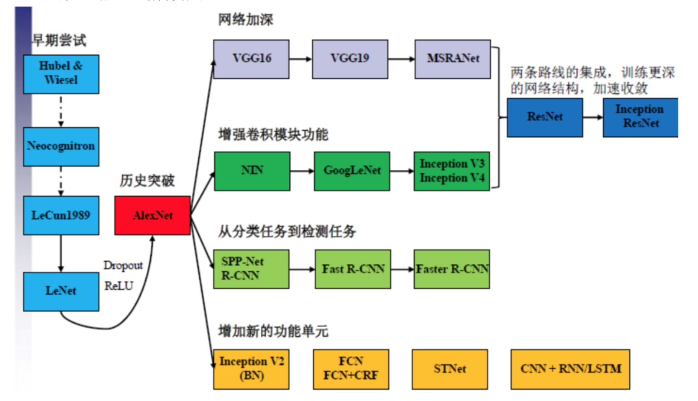

# 卷积神经网络

卷积神经网络的发展历程

## 参考

* [一文搞懂CNN中的卷积和反卷积](https://www.toutiao.com/i6642655643314422275/) 
* [卷积可视化github](https://github.com/vdumoulin/conv_arithmetic)
* https://poloclub.github.io/cnn-explainer/ CNN网络架构的可视化

视频讲解：
* 卷积
    * [卷积 - 直观形象的实例，10分钟彻底搞懂](https://www.bilibili.com/video/BV1Di4y1o7vX)
    * [卷积究竟卷了啥？](https://www.bilibili.com/video/BV1JX4y1K7Dr)
    * [什么是卷积](https://www.bilibili.com/video/BV1Vd4y1e7pj)
* 卷积神经网络
    * [Video : The moment we stopped understanding AI - AlexNet](https://www.youtube.com/watch?v=UZDiGooFs54)
