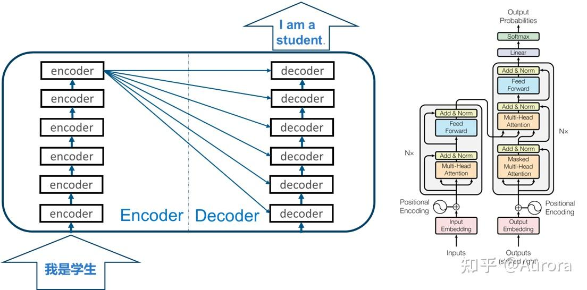

# Transformer

Transformers是神经机器翻译中使用的一种神经网络，它主要涉及将输入序列转换为输出序列的任务。Transformer中抛弃了传统的CNN和RNN，整个网络结构完全是由**Attention机制**组成。采用Attention机制的原因是考虑到RNN（或者LSTM，GRU等）的计算限制为是串行的，即RNN相关算法只能从左向右依次计算或者从右向左依次计算，这种机制带来了两个问题：

1. 时间片`t`的计算依赖`t−1`时刻的计算结果，这样限制了模型的**并行能力**。
2. 串行计算的过程中信息会丢失，尽管LSTM等门机制的结构一定程度上**缓解了长期依赖**的问题，但是对于特别长期的依赖现象，LSTM依旧无能为力。

Transformer的提出解决了上面两个问题，首先它使用了Attention机制，将序列中的任意两个位置之间的距离是缩小为一个常量；然后它使用的不是类似RNN的顺序结构，**具有更好的并行性，符合现有的GPU框架**。

### Transformer模型组成

Transformer是一种基于自注意力机制（self-attention mechanism）的模型架构。Transformer 是 seq2seq 模型，分为Encoder和Decoder两大部分，如下图，Encoder部分是由6个相同的encoder组成，Decoder部分也是由6个相同的decoder组成，与encoder不同的是，每一个decoder都会接受最后一个encoder的输出。



Transformer模型通常由以下几个关键部分组成：

* **嵌入层（Embedding Layer）**： 将输入序列中的词或字符转换为连续的向量表示。通常会有两种嵌入层，分别是词嵌入层（Word Embedding）和位置嵌入层（Positional Embedding）。
* **编码器（Encoder）**： 由多个编码器层堆叠而成。每个编码器层都包含了多头自注意力机制（Multi-Head Self-Attention）和全连接前馈网络（Feed-Forward Neural Network）两部分。编码器用于将输入序列转换为上下文感知的编码表示。
* **解码器（Decoder）（可选）**： 在某些任务中可能需要使用解码器来生成目标序列。解码器也由多个解码器层堆叠而成，每个解码器层包含了多头自注意力机制、编码器-解码器注意力机制（Encoder-Decoder Attention）和全连接前馈网络。
* **自注意力机制（Self-Attention Mechanism）**： 用于计算输入序列中每个位置的上下文相关性。自注意力机制使模型能够在输入序列中建立全局的依赖关系，从而更好地捕获序列中的长距离依赖关系。
* **全连接前馈网络（Feed-Forward Neural Network）**： 对于每个位置的表示，都会经过一个全连接前馈网络进行非线性变换和映射。
* **残差连接（Residual Connections）和层归一化（Layer Normalization）**： 在每个编码器和解码器层之间都会添加残差连接和层归一化，以稳定模型训练过程并加速模型收敛。

通过堆叠多个编码器层和解码器层，Transformer模型能够处理不同长度的输入序列，并且具有较好的并行性和可扩展性。这种模型结构已被证明在语言建模、机器翻译、文本生成等各种自然语言处理任务中取得了很好的效果。

### 核心优势

Transformer通过自注意力机制实现了：
- 完全并行计算
- 长距离依赖建模
- 可扩展架构设计

## 学习路径

### 基础阶段
1. [注意力机制基础](01-attention-mechanism.ipynb)
   - 注意力机制的动机和原理
   - Query、Key、Value概念
   - 简单注意力实现和可视化

2. [自注意力机制](02-self-attention.ipynb)
   - 自注意力vs传统注意力
   - 数学公式推导
   - 掩码注意力（因果掩码、填充掩码）

3. [多头注意力](03-multi-head-attention.ipynb)
   - 多头机制的必要性
   - 并行计算多种注意力模式
   - 注意力头的功能分析

### 核心阶段
4. [位置编码](04-positional-encoding.ipynb)
   - 位置编码的必要性
   - 正弦位置编码详解
   - 可学习位置编码对比
   - RoPE、ALiBi等现代变体

5. [Transformer基本块](05-transformer-block.ipynb)
   - 前馈神经网络
   - 残差连接和层归一化
   - Pre-LN vs Post-LN架构对比

### 进阶阶段
6. [完整Transformer实现](06-complete-transformer.ipynb)
   - 编码器-解码器架构
   - 机器翻译任务实战
   - 训练技巧和优化

7. [Transformer变体](07-transformer-variants.ipynb)
   - BERT、GPT系列模型
   - Vision Transformer
   - 效率优化变体

## 工具和资源

- [utils.py](utils.py) - 完整的工具函数库
  - 核心组件实现（注意力、位置编码等）
  - 可视化函数
  - 训练辅助工具
  - 模型管理函数


## 快速开始

```python
# 导入工具函数
from utils import *

# 创建多头注意力
attention = MultiHeadAttention(d_model=512, num_heads=8)

# 创建位置编码
pos_encoding = SinusoidalPositionalEncoding(d_model=512)

# 创建Transformer块
transformer_block = TransformerBlock(d_model=512, num_heads=8, d_ff=2048)

# 可视化注意力权重
visualize_attention_weights(attention_weights, tokens=['Hello', 'World'])
```


## 最新技术
- [2026 Attention Residuals](https://arxiv.org/abs/2603.15031)
    - 现代大型语言模型中，预范数残留连接是标准配置，但它们会累积所有层输出的单位权重固定。这种均匀聚集导致深度失控的隐藏态增长，逐渐稀释各层的贡献。我们提出了注意力残差（AttnRes），它用对前一层输出的软最大注意力（softmax attention）取代了固定累积，允许每层选择性地聚合早期表示并赋予学习的、依赖输入的权重。为了解决大规模模型训练中对所有前一层输出进行关注的内存和通信开销，我们引入了块敏感度，将层划分为块，并在块级表示上进行关注，减少内存占用，同时保留了大部分全响应响应的收益。结合基于缓存的流水线通信和两阶段计算策略，块敏感度成为标准残余连接的实用替代，且开销最小。缩放定律实验证实，模型大小间的改进是一致的，消融验证了内容依赖深度选择的益处。我们进一步将 AttnRes 集成到 Kimi 线性架构（总参数 48B / 激活参数 3B），并对 1.4T 代币进行预训练，AttnRes 缓解了预范数稀释，实现更均匀的输出幅度和深度梯度分布，并提升所有评估任务的下游性能。
- [2026 mHC: Manifold-Constrained Hyper-Connections](https://arxiv.org/abs/2512.24880)
    - 最近，以超连接（HC）为代表的研究通过扩展残差流宽度和多样化连接模式，扩展了过去十年建立的普遍残差连接范式。虽然带来了显著的性能提升，但这种多样化从根本上破坏了残余连接固有的身份映射特性，导致严重的训练不稳定性和扩展性受限，同时还会带来显著的内存访问开销。为应对这些挑战，我们提出了流形约束超连接（mHC）的通用框架，该框架将 HC 的剩余连接空间投影到特定流形上，以恢复身份映射性质，同时结合严格的基础设施优化以确保效率。实证实验表明，mHC 在大规模训练中非常有效，能够带来切实的性能提升和更优的可扩展性。我们预计，作为 HC 的灵活且实用的扩展，mHC 将有助于更深入理解拓扑架构设计，并为基础模型的发展提出有前景的方向。
- [2026 Conditional Memory via Scalable Lookup: A New Axis of Sparsity for Large Language Models](https://arxiv.org/abs/2601.07372)
    - https://github.com/deepseek-ai/Engram
    - 专家混合（MoE）通过条件计算扩展容量，而 Transformer 缺乏原生的知识查找原语，迫使它们通过计算低效地模拟检索。为此，我们引入了条件记忆作为互补稀疏度轴，通过 Engram 实现，该模块现代化了经典 N -gram 嵌入，用于 O（1） 查找。通过提出稀疏分配问题，我们发现了一个 U 型缩放律，优化了神经计算（MoE）与静态记忆（Engram）之间的权衡。根据该定律，我们将 Engram 扩展至 27B 参数，在严格的 ISO 参数和等 FLOPs 的 MoE 基线上实现了更优的性能。最显著的是，虽然内存模块被期望有助于知识检索（例如，MMLU +3.4;CMMLU +4.0），我们在一般推理中观察到更大的提升（例如，BBH +5.0;ARC-Challenge +3.7）以及代码/数学领域~（HumanEval +3.0;数学+2.4）。机制分析显示，恩格拉姆减轻了骨干早期层的静态重建，有效地深化了复杂推理的网络。此外，通过将局部依赖关系委托给查找，释放了全局上下文的注意力容量，显著提升了长上下文检索能力（例如，Multi-Query NIAH： 84.2 to 97.0）。最后，Engram 实现了基础设施感知效率：其确定性寻址技术使运行时对主机内存进行预取，几乎没有开销。我们设想条件记忆作为下一代稀疏模型不可或缺的建模原语。


## 参考

* 10分钟学会Transformer | Pytorch代码讲解  https://zhuanlan.zhihu.com/p/403433120

* 搞懂Transformer结构，看这篇PyTorch实现就够了（上）https://zhuanlan.zhihu.com/p/48731949

* [QKV详细解释](https://mp.weixin.qq.com/s/umEwoVOdTJxb6rAlNmuPQw)

* [Build a transformer model from scratch using pytorch to understand its inner workings and gain hands-on experience with deep learning models in PyTorch](https://github.com/SirawitC/Transformer_from_scratch_pytorch)
    * https://blog.gopenai.com/build-a-transformer-model-from-scratch-using-pytorch-99b06408003e
* [The Illustrated Transformer](http://jalammar.github.io/illustrated-transformer/)
* [Transformer from scratch using pytorch](https://www.kaggle.com/code/arunmohan003/transformer-from-scratch-using-pytorch/notebook)
* [Transformer Model Tutorial in PyTorch: From Theory to Code](https://www.datacamp.com/tutorial/building-a-transformer-with-py-torch)


### 视频、教程
中文综合教程：
* [为什么Transformer正在取代CNN - Julia Turc](https://www.bilibili.com/video/BV16z2eB2EPw)
* [白话Transformer01 (飞天闪客)](https://www.bilibili.com/video/BV1kiyHBVEtq)
* [Transformer 其实是个简单到令人困惑的模型 (飞天闪客)](https://www.bilibili.com/video/BV1C3dqYxE3q)
* [白话transformer](https://www.bilibili.com/video/BV1bu4m137W1)
* [台大李宏毅自注意力机制和Transformer详解！](https://www.bilibili.com/video/BV1v3411r78R)
* [一步一步深入浅出解释Transformer原理](https://www.bilibili.com/video/BV14yQgY5EwJ)

注意力机制：
* [直观解释注意力机制，Transformer的核心](https://www.bilibili.com/video/BV1TZ421j7Ke)
* [Transformer模型的多头注意力机制](https://www.bilibili.com/video/BV12DzfYnErS)

英文教程：
* [Transformers, explained: Understand the model behind GPT, BERT, and T5](https://www.youtube.com/watch?v=SZorAJ4I-sA)
* [Transformer Neural Networks, ChatGPT's foundation, Clearly Explained!!!](https://www.youtube.com/watch?v=zxQyTK8quyY)
* [What are Transformers (Machine Learning Model)?](https://www.youtube.com/watch?v=ZXiruGOCn9s)
* [Illustrated Guide to Transformers Neural Network: A step by step explanation](https://www.youtube.com/watch?v=4Bdc55j80l8)

网络可视化：

* https://poloclub.github.io/transformer-explainer/ Transformer可视化
