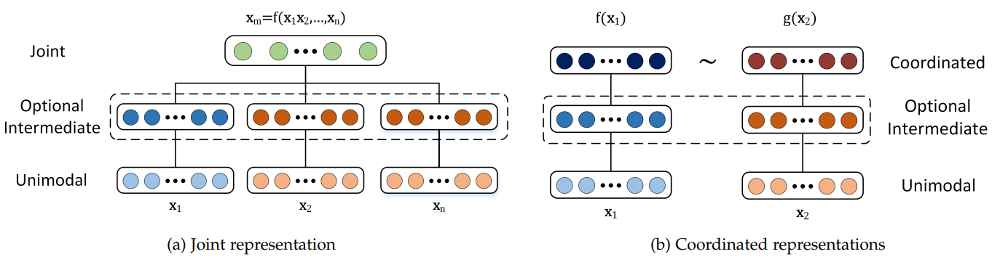
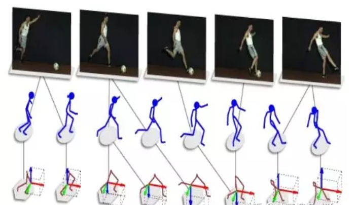
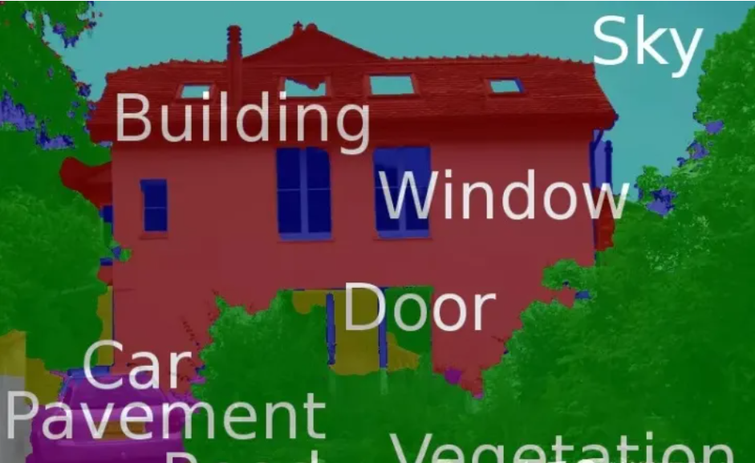
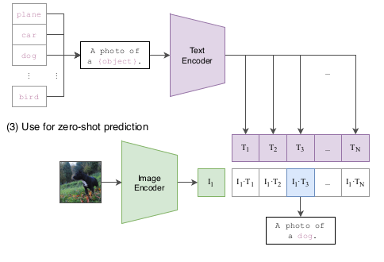
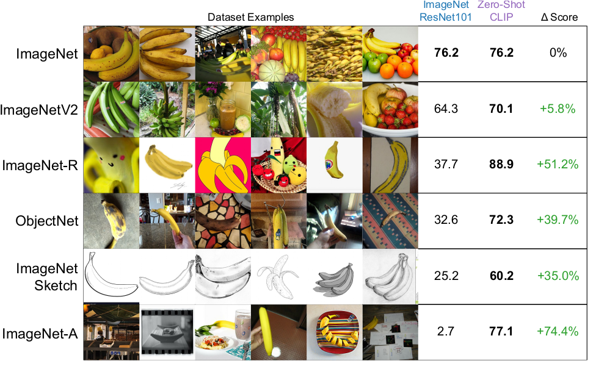

# 多模态学习

什么叫做模态（Modality）：每一种信息的来源或者形式，都可以称为一种模态。例如，人有触觉，听觉，视觉，嗅觉；信息的媒介，有语音、视频、文字等；多种多样的传感器，如雷达、红外、加速度计等。以上的每一种都可以称为一种模态。

同时，模态也可以有非常广泛的定义，比如我们可以把两种不同的语言当做是两种模态，甚至在两种不同情况下采集到的数据集，亦可认为是两种模态。

因此，多模态机器学习(MMML)，旨在通过机器学习的方法实现处理和理解多源模态信息的能力。目前比较热门的研究方向是图像、视频、音频、语义之间的多模态学习。

多模态的研究主要包括下面5个部分：

1. **表征**。如何挖掘模态间的互补性或独立性以表征多模态数据。
2. **翻译**。学习一个模态到其他模态的映射。
3. **对齐**。将多模态数据的子元素进行对齐。例如phrase grounding任务：将一幅图中的多个物体与一段话中的短语(或单词)进行对齐。在学习表征或翻译时也可能隐式地学习对齐。
4. **融合**。融合两个模态的数据，用来进行某种预测。例如：Visual Question Answering需融合图像和问题来预测答案；Audio-visual speech recognition需融合声音和视频信息用以识别说话内容。
5. **共同学习(co-learning)**。模态间的知识迁移。使用辅助模态训练的网络可以帮助该模态的学习，尤其是该模态数据量较小的情况下。

## 1 应用

多模态的早期应用之一是20世纪50年代提出的视听语音识别(audio-visual speech recognition)。

2000年左右，互联网的兴起促进了跨模态检索的应用。早期搜索引擎人们使用文本(关键词)来搜索图片、视频，近年来出现以图搜图，以图搜视频等。接着，基于多模态数据的人类社交行为理解被提出。通过分析会议录像(语言和视觉)信息可以进行人的情感识别(affect recogntion)。2015年后，联合视觉与语言的任务大量出现并逐渐成为热点。代表性任务是图像描述(image captioning)，即生成一句话对一幅图的主要内容进行描述。

常见的多模态任务如下：

**跨模态预训练**

1. 图像/视频与语言预训练。
2. 跨任务预训练

**Language-Audio**

1. Text-to-Speech Synthesis: 给定文本，生成一段对应的声音。
2. Audio Captioning：给定一段语音，生成一句话总结并描述主要内容。(不是语音识别)

**Vision-Audio**

- Audio-Visual Speech Recognition(视听语音识别)：给定某人的视频及语音进行语音识别。
- Video Sound Separation(视频声源分离)：给定视频和声音信号(包含多个声源)，进行声源定位与分离。
- Image Generation from Audio**:** 给定声音，生成与其相关的图像。
- Speech-conditioned Face generation：给定一段话，生成说话人的视频。
- Audio-Driven 3D Facial Animation：给定一段话与3D人脸模版，生成说话的人脸3D动画。

**Vision-Language**

- Image/Video-Text Retrieval (图(视频)文检索): 图像/视频<-->文本的相互检索。
- Image/Video Captioning(图像/视频描述)：给定一个图像/视频，生成文本描述其主要内容。
- Visual Question Answering(视觉问答)：给定一个图像/视频与一个问题，预测答案。
- Image/Video Generation from Text：给定文本，生成相应的图像或视频。
- Multimodal Machine Translation：给定一种语言的文本与该文本对应的图像，翻译为另外一种语言。
- Vision-and-Language Navigation(视觉-语言导航)： 给定自然语言进行指导，使得智能体根据视觉传感器导航到特定的目标。
- Multimodal Dialog(多模态对话)： 给定图像，历史对话，以及与图像相关的问题，预测该问题的回答。

**定位相关的任务**

- Visual Grounding：给定一个图像与一段文本，定位到文本所描述的物体。
- Temporal Language Localization: 给定一个视频即一段文本，定位到文本所描述的动作(预测起止时间)。
- Video Summarization from text query：给定一段话(query)与一个视频，根据这段话的内容进行视频摘要，预测视频关键帧(或关键片段)组合为一个短的摘要视频。
- Video Segmentation from Natural Language Query: 给定一段话(query)与一个视频，分割得到query所指示的物体。
- Video-Language Inference: 给定视频(包括视频的一些字幕信息)，还有一段文本假设(hypothesis)，判断二者是否存在语义蕴含(二分类)，即判断视频内容是否包含这段文本的语义。
- Object Tracking from Natural Language Query: 给定一段视频和一些文本，进行目标识别
- Language-guided Image/Video Editing: 一句话自动修图。给定一段指令(文本)，自动进行图像/视频的编辑。

**更多模态**

- Affect Computing (情感计算)：使用语音、视觉(人脸表情)、文本信息、心电、脑电等模态进行情感识别。
- Medical Image：不同医疗图像模态如CT、MRI、PET
- RGB-D模态：RGB图与深度图

### 1.1 多模态表征

表征学习是多模态任务的基础，其中包含了一些开放性问题，例如：如何结合来源不同的异质数据，如何处理不同模态的不同噪声等级，测试样本的某种模态缺失怎么办。现有多模态表征学习可分为两类：**Joint**(联合，也称为单塔结构)和**Coordinated**(协作，双塔结构)。

- **Joint结构**：将多个模态的信息一起映射到一个统一的多模态向量空间。注重捕捉多模态的互补性，融合多个输入模态获得多模态表征 ，进而使用表征完成某种预测任务。

- **Coordinated结构**并不寻求融合而是建模多种模态数据间的相关性，它将多个(通常是两个)模态映射到协作空间，其中～表示一种协作关系。网络的优化目标是这种协作关系(通常是相似性，即最小化cosine距离等度量)。

  

在测试阶段，由于Coordinated结构保留了两个模态的表示空间，它适合仅有一个模态作为输入的应用，如跨模态检索，翻译，grounding和zero-shot learning。但是Joint结构学习到的只适用于多模态作为输入，例如视听语音识别，VQA，情感识别等。

相较于多模态，基于单模态的表征学习已被广泛且深入地研究。在Transformer出现之前，不同模态所适用的最佳表征学习模型不同，例如，CNN广泛适用CV领域，LSTM占领NLP领域。较多的多模态工作仍旧局限在使用N个异质网络单独提取N个模态的特征，之后采用Joint或Coordinated结构进行训练。

不过这种思路在很快改变，随着越来越多工作证实Transformer在CV和NLP以及Speech领域都可以获得极佳的性能，仅使用Transformer统一多个模态、甚至多个跨模态任务成为可能。基于Transformer的多模态预训练模型在2019年后喷涌而出，如LXMERT[1], Oscar[2], UNITER[3]属于Joint结构，CLIP[4], BriVL[5] 属于Coordinated结构。

### 1.2 跨模态翻译

跨模态翻译的目的是学习如何将源模态映射(map)到目标模态。例如：输入一张图像，我们希望生成一句话描述它，或者输入一句话，我们生成与之匹配的一张图。

常见任务：

- **机器翻译（Machine Translation）：**将输入的语言A（即时）翻译为另一种语言B。类似的还有**唇读（Lip Reading）**和**语音翻译 （Speech Translation）**，分别将唇部视觉和语音信息转换为文本信息。
- **图片描述（Image captioning) 或者视频描述（Video captioning)：** 对给定的图片/视频形成一段文字描述，以表达图片/视频的内容。
- **语音合成（Speech Synthesis）：**根据输入的文本信息，自动合成一段语音信号。

主流方法分为两类：

- **模版法**(example-based)。模版法的特征是借助于词典（dictionary）进行翻译，词典一般指训练集中的数据对。给定测试样本，模版法直接检索在词典中找到最匹配的翻译结果 ，并将其作为最终输出。此处的检索可分为单模态检索或跨模态检索。单模态检索首先找到最相似的 。而多模态检索直接在集合中检索到与 最相似 ，性能通常优于单模态检索。为进一步增强检索结果的准确性，可选择top-K的检索结果，再融合K个结果作为最终输出。

- **生成式模型**(generative)。抛弃词典，直接生成目标模态的数据。分为三个子类别：

- 1. **基于语法模版**，即人为设定多个针对目标模态的语法模版，将模型的预测结果插入模版中作为翻译结果。通过不同类型的目标/属性/场景检测器可以获得who, what, whom, place等具体单词，进而完成翻译。
  2. **编码-解码器**(encoder-decoder)。首先将源模态的数据编码为隐特征，后续被解码器用于生成目标模态。以图像描述为例，编码器(一般为CNN+spatial pooling)将图像编码为一个或多个特征向量，进而输入到RNN中以自回归的方式生成单词序列。
  3. **连续性生成**(continuous generation)。它针对源模态与目标模态都为流数据且在时间上严格对齐的任务。以文本合成语音为例，它与图像描述不同，语音数据与文本数据在时间上严格对齐。

**模版法**面临两个问题：一是需要维护一个大词典，且每次翻译都需要进行全局检索，使得模型巨大且推理速度慢(hashing可缓解此问题)。二是此类方法较机械，仅仅是复制(或简单修改)训练集的数据，无法生成准确且新奇的翻译结果。

**生成式方法**可以生成更为灵活、相关性更强、性能更优的翻译结果。其中，基于语法模版的方式受限于模版的多样性，生成的语句多样性有限，且不是端到端训练。

现今，编码-解码器与连续性生成是主流方案，它们一般基于深度网络且端到端训练。

### 1.3 多模态对齐

多模态的对齐负责对来自同一个实例的不同模态信息的子分支/元素寻找对应关系。这个对应关系可以是时间维度的，比如下图所示的 **Temporal sequence alignment**，将一组动作对应的视频流同骨骼图片对齐。类似的还有电影画面-语音-字幕的自动对齐。

对齐又可以是空间维度的，比如**图片语义分割 （Image Semantic Segmentation）：**尝试将图片的每个像素对应到某一种类型标签，实现视觉-词汇对齐。

具体的应用方式包括显式对齐和隐式对齐。

1. **显式对齐。**如果一个模型的优化目标是最大化多模态数据的子元素的对齐程度，则称为显示对齐。包括无监督和有监督方法。。
2. **隐式对齐。**如果模型的最终优化目标不是对齐任务，对齐过程仅仅是某个中间(或隐式)步骤，则称为隐式对齐。

对齐可以作为一个单独的任务，也可以作为其他任务的隐式特征增强手段。多模态对齐可挖掘子元素间的细粒度交互，同时有可解释性，被广泛应用。

但多模态对齐面临如下挑战：仅有少量数据集包含显式的对齐标注；跨模态度量难以设计；可能存在多种对齐，也可能存在某些元素无法在其他模态中找到。

### 1.4 多模态融合

多模态融合（Multimodal Fusion ）负责联合多个模态的信息，进行目标预测（分类或者回归），属于多模态学习最早的研究方向之一，也是目前应用最广的方向，它还存在其他常见的别名，例如多源信息融合（Multi-source Information Fusion）、多传感器融合（Multi-sensor Fusion)。

常见任务：

- **视觉-音频识别（Visual-Audio Recognition）：** 综合源自同一个实例的视频信息和音频信息，进行识别工作。
- **多模态情感分析（Multimodal sentiment analysis）：** 综合利用多个模态的数据（例如文字、面部表情、声音），通过互补，消除歧义和不确定性，得到更加准确的情感类型判断结果。

若测试场景下的输入数据包含多个模态，那么必须面对多模态特征融合。

1.4.1 **模型无关的融合策略：**

前融合：指在模型的浅层(或输入层)将多个模态的特征拼接起来。

后融合：独立训练多个模型，在预测层(最后一层)进行融合。

混合融合：同时结合前融合和后融合，以及在模型中间层进行特征交互。

1.4.2 **基于模型的融合策略：**

- **多核学习** 是SVM的扩展。SVM通过核函数将输入特征映射到高维空间，使线性不可分问题在高维空间可分。在处理多个输入时，多核处理多个模态特征，使得每个模态都找到其最佳核函数；

- **基于概率图模型** 利用隐马尔可夫模型或贝叶斯网络建模数据的联合概率分布(生成式)或条件概率(判别式)**。**

- **基于神经网络的融合** 使用LSTM、卷积层、注意力层、门机制、双线性融合等设计序列数据或图像数据的复杂交互。

多模态融合是依赖于任务和数据的，现有工作中常常是多种融合手段的堆积，并未真正统一的理论支撑。

多模态融合仍存在的挑战：不同模态的序列信息可能没有对齐；信号间的关联可能只是补充(仅提高鲁棒性而无法增大信息量)而不是互补；不同数据可能存在不同程度的噪声。

## 2 常见模型

### 2.1 CLIP

Learning Transferable Visual Models From Natural Language Supervision(CLIP)

CLIP 是OpenAI 的一篇工作，它是一个视觉分类模型，预训练的模型在没有微调的情况下在下游任务上取得了很好的迁移效果。作者在30多个数据集上做了测试，涵盖了 OCR、视频中的动作检测、坐标定位等任务。

## 预训练阶段

预训练网络的输入是文字与图片的配对，每一张图片都配有一小句解释性的文字。将文字和图片分别通过一个编码器，得到向量表示。这里的文本编码器就是 Transformer；而图片编码器既可以是 Resnet，也可以是 Vision transformer。

假设现在分别得到了 N 个图片和 N  个文本的编码。接下来，我们需要对它们进行对比学习。对比学习需要一些正样本和负样本。在这里，配对的句子和文本就是一对正样本（也就是对角线上的）；反之，不配对的就是负样本（对角线之外的）。

预训练网络的目标，就是最大化正样本对的余弦相似度，并最小化负样本的余弦相似度。

这种无监督的训练方式需要大量的数据，OpenAI 专门收集了四亿个样本对的巨无霸数据集。

## 测试过程

给定一张图片，如何利用预训练好的网络去做分类呢？这里作者很巧妙地设置了一道“多项选择”。具体来说，给网络一堆分类标签，比如cat, dog, bird，利用文本编码器得到向量表示。然后分别计算这些标签与图片的余弦相似度；最终相似度最高的标签即是预测的分类结果。

相比于单纯地给定分类标签，给定一个句子的分类效果更好。比如一种句子模板 `A photo of a ...`，后面填入分类标签。这种句子模板叫做 `prompt`（提示）。这也很好理解：预训练时模型看到的大多是句子，如果在推理时突然变成单词，效果肯定会下降。作者还说，句子模板的选择很有讲究，还专门讨论了`prompt engineering`，测试了好多种类的句子模板。

 

从前的分类网络的类别数量是固定的，一般最后一层是跟着 softmax 的全连接层；如果要更改类别数量，就要更换最后一层；并且预测的内容是固定的，不能超过训练集的类别范围。

但对于 CLIP 来说，提供给网络的分类标签不仅数量不固定，内容也是自由的。如果提供两个标签，那就是一个二分类问题；如果提供1000个标签，那就是1000分类问题。标签内容可以是常规的分类标签，也可以是一些冷门的分类标签。这是 **CLIP 的一大主要贡献——摆脱了事先定好的分类标签**。

尽管 Resnet101 在 Imagenet 上的准确度很高，但如果迁移到其他数据集上，它对于香蕉的识别准确度就大幅下降。但反观 CLIP，它可以识别动漫里的、表情包里的、素描画里的各种类型的香蕉，迁移能力很强。

## 数据集

作者提到，现有的图像数据集都太小了。像 Imagenet 21k 才有 1400  万张图片。还有一些数据集虽然够大，但是标注质量很差。另外，虽然有谷歌的 JFT300 数据集（3亿个样本），但那是人家内部的，没有公开。所以  OpenAI 决定自己造一个超大号数据集。他们收集了 4亿个图片-文本对，构建了 `WebImageText` (WIT) 数据集

## 算力决定一切

在 CLIP 之前，不是没有工作试图打通文本与图像的隔阂。但它们要么是模型不够大，要么是数据集不够好，总之效果都不够惊艳。CLIP 一方面构建了超大规模数据集，另一方面用了像 Vision Transformer 这种大模型，两相加持下，终于一鸣惊人。

之前谷歌的工作——[Vision Transformer](https://link.zhihu.com/?target=https%3A//arxiv.org/pdf/2010.11929.pdf) 之所以能取得成功，强大的算力是不可缺少的条件：如果用一个TPU v3 核跑模型，需要2500天。来看看 [Vision Transformer](https://link.zhihu.com/?target=https%3A//arxiv.org/pdf/2010.11929.pdf) 这篇论文里的原话吧：

> Most related to ours is the model of Cordonnier et al. (2020), which  extracts patches of size 2 × 2 from the input image and applies full  self-attention on top. **This model is very similar to ViT, but our  work goes further to demonstrate that large scale pre-training makes  vanilla transformers competitive with (or even better than)  state-of-the-art CNNs**.

翻译：与我们最相关的是 Cordonnier 等人的模型 (2020)，它从输入图像中提取大小为 2 × 2 的块，并应用完全自注意力。 **这个模型与 ViT 非常相似，但我们的工作更进一步证明大规模预训练使 vanilla transformer 与（甚至优于）最先进的 CNN 具有竞争力**。 

你的模型效果不好，很有可能不是方法不行，而是数据不够多、模型不够大啊！

硬件的进步会推动研究的发展。

## 模型局限性

首先，虽然 CLIP 在 Imagenet 上与 Resnet 101 打成平手。但后者远远不是 state-of-art model。CLIP  离表现最好的模型还差了十几点精度。尽管大规模训练能够极大地促进模型精度，但作者预估，要媲美现今表现最好的模型，计算量至少要扩大 1000  倍！！！即使对于 OpenAI 来说，以现有的硬件也无法承担这个计算量。

另一个问题在于，如果做推理的数据真的和训练数据差得非常远 (out of distribution)，那么 CLIP  的泛化效果会很差。作者举了个例子，在MNIST数据集上（1-9手写数字图片），CLIP  只达到了88%的准确度，还不如一个作用在像素点上的逻辑回归。虽然 4  亿数据集很大，但是很有可能没有包含这种不常见的手写数字的图片。这就引起了一些疑虑：CLIP 的强大有多大程度上取决于这个高质量、大规模的数据集。

所以说**见过**很重要。一个人再聪明也回答不出来从没见过的东西，聪明的人会举一反三，但前提是有举一。

除此之外，CLIP  在推理阶段，需要我们手动地设置“多项选择题”，作者设想，如果能够让网络自动生成文本来描述图片就好了。另外作者还提到了数据利用效率不高的问题。最后，一个没有办法回避的问题——数据本身的偏见带来的模型的偏见。这个在 GPT-3 里就有所体现。