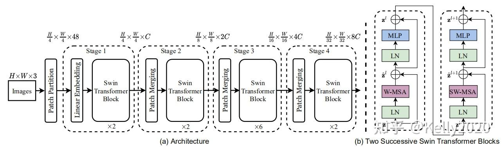
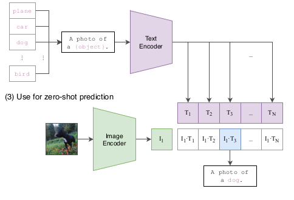

# 多模态大模型

## 1. 模型结构  Vision Trasnformer

### 1.1 ViT

模型整体结构如下图所示，主要是对图片转换成类似 token 的处理，原文引入了一个 patch 的概念，首先把图像划分为一个个的 patch，然后将 patch 映射成一个 embedding，即图中的 linear projection 层，将输入转换为类似 BERT 的输入结构，然后加上 position embedding，这里的 position 是1D的，最后加上一个learnable classification token 放在序列的前面，classification由 MLP 完成。

### 1.2 Swin Transformer

Swin Transformer 的核心设计是将 Self-Attention 层划分为 shift，shifted windows 接入上一层窗口，二者之间保持连接，由此显著增强建模能力。通过 shifted windows 操作，实现了 CNN 里面的 **hierarchical** 的结构。这类 hierarchical 的结构更适用于不同的scale，同时其计算复杂性仅与 image size 线性相关。

**Swin trasnformer 是目前视觉领域的SOTA架构，很多下游算法的架构基于他，都和他比结果**

需要注意的是Transformer架构输出都是全局向量，在做密集任务时需要注意。

## 2. 多模态大模型

### 2.1 视觉大模型

#### (1) Segament Anything (SAM)

+ 新数据集+新范式+超强零样本泛化能力
+ 这篇论文只做了一件事情：（零样本）分割一切。类似 GPT-4 已经做到的「回答一切」
+ 将 NLP 的 prompt 范式引入了 CV 领域，进而为 CV 基础模型提供更广泛的支持与深度研究
+ SAM的出现统一了分割这个任务（CV任务的一个子集）的下流应用，说明了CV的大模型是可能存在的

### 2.2 视觉语言大模型

#### (1) CLIP

+ 预训练阶段

+ 测试阶段

#### (2) MiniGPT-4

多模态问答

MiniGPT-4 是在一些开源大模型基础上训练得到的，fine tune 分为两个阶段，**先是在 4 个 A100 （80G）上用 500 万图文对训练，然后再用一个一个小的高质量数据集训练，单卡 A100 训练只需要 7 分钟**。

- MiniGPT-4冻结一个视觉编码器和LLM
- 在第一个阶段，使用100万个图像文本对进行训练。通过第一阶段后，模型能够有效理解图像，但是其生成能力变差
- 第二个阶段则使用高质量的图像文本对数据集，共3500个进行微调，以显着提高其生成可靠性和整体可用性。这个阶段的计算效率很高，使用单个 A100 只需要大约7分钟。

[MiniGPT4-搭建教程](https://zhuanlan.zhihu.com/p/625152404)

[MiniGPT4-项目github地址](https://github.com/Vision-CAIR/MiniGPT-4)

#### (2) EmbodiedGPT

open the cabinet

assemble task

place the bin

具身智能：

**具身智能任务要求机器人能够根据当前的观测做出任务对应的准确规划和可执行的动作，并能够同时与人类进行交互进行问答，包括具身规划, 具身问答, 具身控制等任务。**

这对大模型提出了非常大的挑战，目前的大模型大多数通过以人类对话、视觉caption、视觉问答等任务的数据集进行训练，和机器人有较大的domain gap，输出的内容准确规划和可执行的动作的能力还有很大提升空间。

具身智能大模型与其他深度学习大模型的最本质区别是：深度学习模型在训练时主要使用互联网数据，缺乏直接从现实世界第一人称视角获取数据的能力。这使得它们难以适应真实世界的复杂性。与此不同，人类通过观察、互动和反馈等方式在现实世界中学习，并依靠与环境持续交互来形成认知。因此，赋予机器人实践学习的能力是通向通用人工智能的关键。

具身智能面临着三大核心挑战：

1）建立第一视角下灵活的具身认知系统。

2）实现高度灵活的环境自适应决策规划能力。

3）实现目标驱动的与物理世界的精确运动交互。

举一个最简单的例子，对于一个杯子，传统大模型只要求认识到它的类别和Bounding Box等信息，而具身认知系统需要知道对于这个杯子，要把他举起来需要夹住它右面的杯把。

文章实现：

+ 1）**通过构建具备多模态思维链的人类操纵视频文本数据集EgoCOT, 将视觉信息与具体操纵任务中的sub-goal相关联在一起。**

首先我们需要一个大规模的第一视角的视觉+详细规划的视频文本数据集，在第一视角的视频数据中, Ego4D具有7T的超大体量和规模，且包含超级丰富的hand-object interaction数据，美中不足的是caption没有具体到细致的part级别，针对此问题我们通过具身思维链，通过设计合理的Prompt模版，利用Chatgpt对Ego4D数据集进行了有效的扩充，并通过后处理过滤保障了数据的对准质量。下面是一个例子：

+ 2）**提出了基于多模态思维链的视觉语言预训练方法，使模型具备根据视觉输入做出强相关的可执行性强的决策规划的能力，具备图像、视频理解和基于视觉的规划能力。且能够通过观看自身第一视角操作的视频，认知到自己的执行与实际规划的偏差在哪，以及如何更正规划的偏差。**

基于此技术构造出了大规模的视频-具身思维链数据集，以支持具身大模型认知能力的学习。针对具身大模型的训练，我们与谷歌PALM-E的方法有所不同。首先，在选择和训练基础模型方面，我们采用了对高校和非超级大厂更友好的视觉和语言模型，其中视觉模型为ViT-Large，语言模型为7B的LaMMA。网络结构如下图所示：

+ **3）基于自注意力机制，提取出当前视觉观测和planning中的具体sub-goal高度相关的特征，使模型具备仅通过少量示范数据即能够学会执行底层控制**。

我们设计了Embodied-former作为视觉和语言规划之间的桥梁。通过可学习的Embodied Queries和视觉特征以及文本特征之间的attention机制，我们能够提取出与具身规划控制任务最相关的特征信息，并将其传递给语言模型通过language mapping layer。这样的设计使得语言模型能够更好地理解具身规划任务的视觉输入。

在训练过程中，为了降低训练成本，我们将视觉基础模型和语言模型冻结。我们使用prefix adapter在锁定大语言模型的基础上，在EGOCOT数据集上进行训练，以引导Embodied-former和language mapping layer实现视觉观测和语言的Part级别对齐。通过adapter的引入，语言模型还能够生成一系列子目标的规划，从而避免了语言模型过于散漫地回答问题，同时提高了语言模型对第一视角的具身视觉输入生成结构化规划的能力。

那么上层的规划如何与底层的动作执行链接起来呢？这里Embodied-former再一次的派上了用场，Embodied-former的职能是对可学习的Embodied Queries，视觉特征和文本特征之间的attention机制进行建模，我们将EmbodiedGPT所输出的对任务的step by step的详细规划作为文本输入到Embodied-former当中，从而提取出与当前任务关系最为密切的特征, 并通过轻量级的policy network映射到底层的action输出。

基于这样任务高度相关的特征，我们只需要利用很少的demonstration demos 即可学会完成任务。同时，EmbodiedGPT强大的第一视角下的认知能力，能够通过自己在底层执行时的历史观测形成的视频输入，知道自己实际的执行情况与demonstration是否一致，以及自己当前具体执行到了所制定的Planning的哪一步。如果执行任务不成功，EmbodiedGPT通过自己执行过程中的视频输出文本形式的经验总结，也可以作为Prompt来辅助Planning的重新制定，这样的良性循环也是具身智能的提现所在。

论文链接：https://arxiv.org/abs/2305.15021

##  参考

+ [大模型发展梳理与实践参考文献](https://github.com/Mooler0410/LLMsPracticalGuide#usage-and-restrictions)
+ [一文搞懂Transformer、GPT、ChatGPT、LLM、AIGC的区别](https://zhuanlan.zhihu.com/p/647391226)
+ [关于大模型和自动驾驶的几个迷思](https://zhuanlan.zhihu.com/p/642846310)
+ [2023-seminar-多模态-张玉](https://gitee.com/pi-lab/seminar-2023-1/blob/master/20230519_%E5%A4%9A%E6%A8%A1%E6%80%81_zhangyu/%E5%A4%9A%E6%A8%A1%E6%80%81%E4%BB%8B%E7%BB%8D.md)
+ [2023-seminar-Transformer-encoder-decoder-李浩玮](https://gitee.com/pi-lab/SummerCamp/tree/master/machine_learning/3_transformer)
