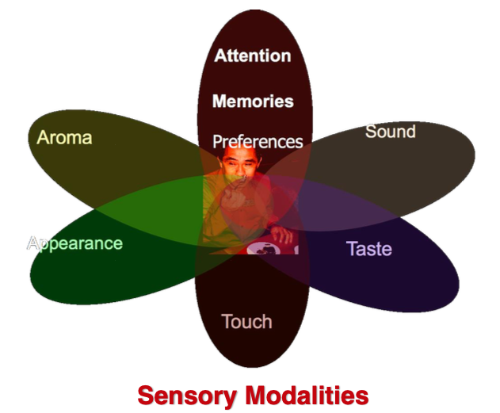

# 多模态深度学习 （Multi-Modal Deep Learaning）

多模态机器学习，英文全称 MultiModal Machine Learning (MMML)。模态（modal）是事情经历和发生的方式，我们生活在一个由多种模态（Multimodal）信息构成的世界，包括视觉信息、听觉信息、文本信息、嗅觉信息等等，当研究的问题或者数据集包含多种这样的模态信息时我们称之为多模态问题，研究多模态问题是推动人工智能更好的了解和认知我们周围世界的关键。

## 多模态学习概述

### 模态

**模态是指一些表达或感知事物的方式，每一种信息的来源或者形式，都可以称为一种模态**。例如，人有触觉，听觉，视觉，嗅觉；信息的媒介，有语音、视频、文字等；多种多样的传感器，如雷达、红外、加速度计等。以上的每一种都可以称为一种模态。

**相较于图像、语音、文本等多媒体(Multi-media)数据划分形式，“模态”是一个更为细粒度的概念，同一媒介下可存在不同的模态。** 比如我们可以把两种不同的语言当做是两种模态，甚至在两种不同情况下采集到的数据集，亦可认为是两种模态。

### 多模态

**多模态即是从多个模态表达或感知事物。** 多模态可归类为同质性的模态，例如从两台相机中分别拍摄的图片，异质性的模态，例如图片与文本语言的关系。

**多模态可能有以下三种形式：**

\- **描述同一对象的多媒体数据**。如互联网环境下描述某一特定对象的视频、图片、语音、文本等信息。下图即为典型的多模态信息形式。

\- **来自不同传感器的同一类媒体数据**。如医学影像学中不同的检查设备所产生的图像数据， 包括B超(B-Scan ultrasonography)、计算机断层扫描(CT)、核磁共振等；物联网背景下不同传感器所检测到的同一对象数据等。

\- **具有不同的数据结构特点、表示形式的表意符号与信息**。如描述同一对象的结构化、非结构化的数据单元；描述同一数学概念的公式、逻辑 符号、函数图及解释性文本；描述同一语义的词向量、词袋、知识图谱以及其它语义符号单元等。

通常主要研究模态包括"**3V**"：即**Verbal(文本)、Vocal(语音)、Visual(视觉)**。 人跟人交流时的多模态：

### 多模态学习

**多模态机器学习**是从多种模态的数据中学习并且提升自身的算法，它不是某一个具体的算法，它是一类算法的总称。

从**语义感知**的角度切入，多模态数据涉及**不同的感知通道**如视觉、听觉、触觉、嗅觉所接收到的信息;在**数据层面**理解，多模态数据则可被看作**多种数据类型**的组合，如图片、数值、文本、符号、音频、时间序列，或者集合、树、图等不同数据结构所组成的复合数据形式，乃至来自不同数据库、不同知识库的各种信息资源的组合。**对多源异构数据的挖掘分析可被理解为多模态学习**。

## CLIP (CLIP: Connecting text and images)

* https://openai.com/index/clip/

## 参考资料

* [多模态学习综述(MultiModal Learning)](https://zhuanlan.zhihu.com/p/582878508)
* [Multimodal Deep Learning](https://arxiv.org/abs/2301.04856)