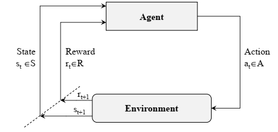
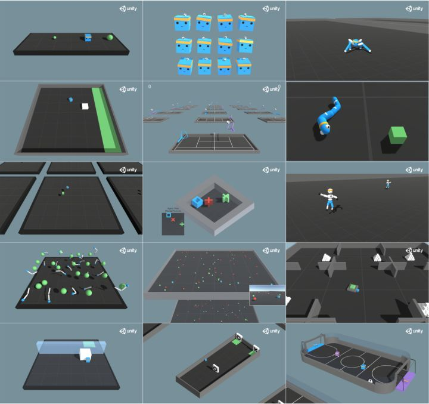
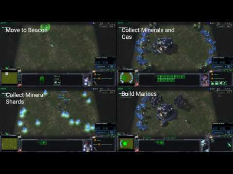
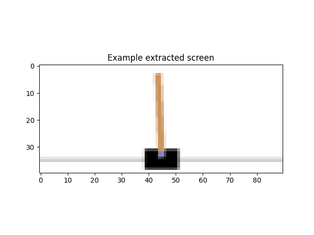
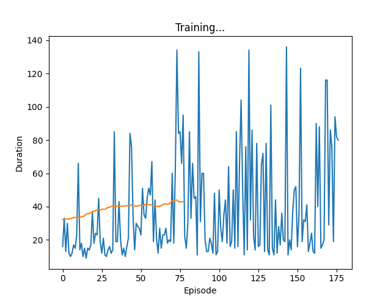

# 强化学习

[TOC]

## 基础概念

> 近年来，强化学习拥有很高的热度，在解决（机器人/无人机/自动驾驶）控制智能化等领域受到了众多关注，也在很多深度学习模型上面有所应用。（新论文都有几百、千余引用）

强化学习主要研究贯序决策（Sequential Decision）问题，主要场景是：在一个环境中，智能体能够通过学习与环境的交互，形成一套完成任务的（最优）策略，进而一步步完成任务目标。

强化学习的场景包含5大基本元素[[1]](support.md/#1)：**智能体**Agent，**环境**Environment，**状态/观测**State/Observation，**动作**Action，**奖励**Reward。

强化学习的学习与决策过程可以表示为S->A->R->S‘往复循环的马尔科夫决策过程（MDP）[[2]](support.md/#2)，如下图所示:



在这样的循环中，智能体需要学习的就是处理动作到状态映射的规律`--策略以尽可能获取最高的奖励R。在优化以取得最高奖励R的过程中，我们需要关注两个函数：

**（价）值函数--Value function**: 
$$
v_{\pi}(s) = E_{\pi}[R_{t+1} + \gamma R_{t+2} + \gamma^2 R_{t+3} + ... | S_t = s]
$$

$$
v_{\pi}(s) = \Sigma_{a \in A} \pi(a|s)q_{\pi}(s,a)
$$

(1) 式表示：在策略$\pi$下，**价值v是对于某一状态的奖励（价值）的和**，他是该状态瞬时奖励$R_{t+1}$与未来的奖励$R_{t+2}$...等的奖励期望和，其中未来的奖励将会有一个折扣系数。该式表示的是价值v的意义，但是很难通过本式进行计算。

(2) 式表示：在策略$\pi$下，某一状态的价值v可由计算给定状态与策略下每个动作的奖励的和得出。该式着重表示价值v的计算及价值函数与q函数的关系。

**动作估值函数--Q function (代表单个动作的价值)** :
$$
q_{\pi}(s,a) = R_s^a + \gamma \Sigma_{s\prime \in S}P_{ss\prime}^a v_{\pi}(s\prime)
$$
实际上，如果我们在(3)式带入价值函数，我们可以得到由下一个时间步的q函数表示的q函数，进而层层嵌套，形成类似树的结构。[[3]](support.md/#3)理论上而言，如果我们知道每个$P_{ss\prime}^a$的值以及一些初值条件（已知模型），我们就可以完全解析这颗树，那么这个问题就变成了动态规划问题。

对于经典的Q-Learning算法来说，优化策略的过程就是优化动作估值函数表--Q-table，其算法伪代码如下[[6]](support.md/#6)：

``` 
初始化函数Q(S,A)为0`
对于每个Episode循环
	设置初始状态S
	对于每个Step循环
		根据Q与状态S，选择动作A（例如ε-greedy``）
		执行动作A，观测R与S’
		令Q(S,A)<- Q(S,A)+α[R+γmaxQ(S',a)-Q(S,A)]
		令S<-S'
    直至S为终止状态
```

Q-Learning算法是经典的时间差分算法（Time difference），指每进行一个step就对状态估值，与之相关的还有蒙特卡洛算法（Monte Carlo），其每进行一个Episode才对状态进行估值（e.g. 蒲丰投针实验[[7]](support.md/#7)）。

迄今为止，我们只讨论了强化学习的基本概念。为了应对复杂的环境并完成相应的任务，应对庞大或（且）连续的动作、状态空间，我们需要更为强大的拟合能力，也就引入了DNN用于处理环境到状态(和状态到动作)的映射，实现精准的环境表达和高维度的输入处理。


从强化学习到深度强化学习的基本理念就是将动作估值函数（与价值函数）的表达与优化替换为深度神经网络，就**像**从Q-Learning到Deep Q Network (DQN) 一样；而随着研究的深入，在强化学习与深度学习的基础上，为了优化DQN算法的表现，提出了诸如经验回放（打破样本序列性）、**目标网络**（延迟网络参数更新以平稳收敛）等优化，使用双重网络（避免过估计，e.g.中彩票）、dueling（将动作价值与状态价值分离，分别学习并组合输出）等网络组合方式提升DQN的表现，等等。[[8]](support.md/#8)以上为经典的基于值优学习的算法，而与之相对的基于策略学习的算法则采用不同的思路，即使用策略梯度直接对策略求解，通过梯度上升的方式求得获取最大奖励值的策略[[9]](support.md/#9)。

若仍有疑惑，可以参考：

- 《白话强化学习与PyTorch》 高扬等著

- [DRL基本概念讲解](backup/README.md)

## 着手入门

### [环境与工具](./Envs.md)

#### [gym](https://github.com/openai/gym)

广为使用的强化学习单智能体算法测试环境，同时也是默认的基准环境，主要包含雅达利游戏、经典控制以及经典力学控制等环境。高度集成的代码接口使其成为初学者最容易上手的环境，只需要几行代码就可以运行起来简单的强化学习训练。

```
pip install gym[all]
```

#### [spinning up](https://spinningup.openai.com/en/latest/user/introduction.html)

open AI为强化学习入门者提供的强化学习算法库，采用gym作为训练环境，本身内容较少，算法种类、实验demo都不多，而且目前基本已经停止更新，但是引导较为详细，每个实验都可以根据指引可视化，适合入门学习强化学习编程的基本结构，并进行一些小实验。

#### [garage](https://garage.readthedocs.io/en/latest/)

强化学习算法库，可以直接调用库内函数进行算法测试。较spinning up而言更为复杂，库内算法更多，支持gym，dm_control(deep mind)，MetaWorld，PyBullet四种环境,，同时提供部分基准对比脚本。但是目前主要贡献人较为繁忙，不太可能会有大量更新（最近的稳定版为2020.6），可以用来学习强化学习训练代码的编写与封装。

#### [baseline](https://github.com/DLR-RM/stable-baselines3)

强化学习算法与应用库，已更新至第三版，包含多种算法与测试程序，且经过大量测试。多篇相关论文在做对比试验时引用该库的算法作为基准，具有相当的参考意义。

[and more](https://zhuanlan.zhihu.com/p/348955068)





### 代码与实践

#### [从最简单的宝藏猎人](./src/treasure_hunt.py)

```
o----T
```

#### [到经典力学控制](./src/simpleDQN.py)





#### [至雅达利游戏实验](./src/SMBtutorial.py)


## 研究现状

> last update: 2023/8

### 强化学习算法简介

> 可以参考《白话强化学习与PyTorch》这本书的8,9,10章理解相关算法

- [Drone Deep Reinforcement Learning - A Review](ref_2023/!2021 Drone Deep Reinforcement Learning - A Review.pdf) 2021
- [Deep_Reinforcement_Learning_for_Autonomous_Driving_A_Survey](ref_2023/Deep_Reinforcement_Learning_for_Autonomous_Driving_A_Survey.pdf) 2022
- 离散奖励问题、探索-开发困境

DRL approaches:

1. value-based: to find policy that maximizes a value function in long term
2. policy-based: to find policy that leads to optimum value for objective function
   - deterministic: apply same actions to any state
   - stochastic: apply varied actions based on probabilistic evaluations
3. model-based: to find specific environment model(s) and perform tasks in it/them

Model-based methods can learn experiences more efficiently yet suffers from imprecision.

Model-free methods requires many fewer experiences yet requires more computation time.


> DP: dynamic programming; TD: temporal difference; MC: Monte Carlos;
>
> I2A: imagination-augmented agent;
>
> Sarsa: S->A->R->S'->A'，on-policy经典算法，和Q-Learning显著的不同是其更新的Q值是基于与采取动作一致的同一种策略，而Q-Learning则取最大Q值而不关心是由何种策略产生的; 
>
> DQN: deep Q-network，经典强化学习算法Q-Learning并使用深度神经网络代替Q-Table实现功能的算法，在2015年引入Target网络概念，通过在一段时间内冻结Target网络参数使该时间内拟合参数保持相对稳定，利于主网络平滑收敛;
>
> Double DQN: 采用同时训练两个网络并相互采用彼此的$γmaxQ(S',a)$作为动作估值以避免一直追求max极值带来的与平均值差异而导致过拟合问题;
>
> Dueling DQN: 在最后的全连接层与softmax部分将动作估值与状态估值分离，以分离`状态`和`动作`对奖励值的影响，使算法更好的评估状态、动作与环境之间的关联，优化算法表现;
>
> DPG: deterministic policy gradient;
>
> DDPG: deep deterministic policy gradient, 与DQN等基于值的算法有显著差异，是基于策略的算法，即在策略$a = \pi(s|\theta)$的指导下智能体在环境中试图完成任务，通过梯度上升的方式求解策略得到算法模型;
>
> TPRO: trust region policy optimization, 置信区域策略优化算法，是基于策略梯度的基本算法，通过KL散度确定策略梯度上升的速度、幅度、方向（是否进行策略梯度更新）的一种算法; 
>
> ACKTR: actor critic using Kronecker-Factored trust region;
>
>  TD3: twin delayed DDPG;
>
> AC: actor critic, 算法模式是指将模型的训练分为两个环节，Actor负责学习动作（即普通的DRL网络），Critic负责学习估值的大小，也就是说，去学习优化Actor得出的动作结果与状态和奖励之间的关系; 
>
> SAC: soft actor-critic;
>
> A2C: advantage actor critic, 较使用AC的算法增加了优势函数，即增加了$A_{\pi}(s) = Q_{\pi}(s) - V_{\pi}(s)$，仅当A值为正，也就是当前采取动作取得比平均值 ( V ) 更高的价值之后才会更新当次动作的梯度至主网络中，进而加快收敛并优化网络; 
>
> A3C: asynchronous advantage actor critic, 增加了异步架构，即共享主网络而异步并行多个子网络各自进行训练，通过定期更新worker网络内的参数至全局主网络来实现博采众长的效果;

### 多智能体强化学习

- [Multi-agent deep reinforcement learning: a survey](ref_2023/Multi-agent deep reinforcement learning: a survey.pdf) 2021

  在数学理论方面，从MDP分析到纳什均衡、帕累托最优，以及奖励分配、部分可观察等问题；

  在算法方面，总结了非静态、集群通信、智能体定位、奖励分配、拓展化、部分可观察等问题对应提出的算法；

  总结表示，阶段性学习、经验学习以及多智能体通讯学习算法正在成为该领域的新兴潮流，而已经受到大量研究但并不充分的领域主要是偏向应用方面的多目标学习、多任务学习、安全强化学习和进化算法（用于提供解决奖励分配、学习阶段、动态分析等问题）。

#### 集群无人机任务分配、路径规划与集群控制


总结了当前深度强化学习在（无人机（集群））任务分配、路径规划与集群控制方面（引用较高的，较新的）二十余篇论文的特征。总的来说，这个方面（主要是（集群）路径规划）的论文数量并不多，应用的深度强化学习方法也较为“传统”，既证明该方面具有广阔研究前景，也说明该领域具有一定难度。

从**采用算法**来看，大多采用经典的DQN算法族和DDPG、TRPO[[10]](support.md/#10)算法，辅以Actor-Critic[[5]](support.md/#5)网络结构，经验回放、目标网络等机制，并加入一些算法修饰，例如控制算法中的人工势场法、深度学习中的注意力机制等等，完成对整个算法与神经网络的构建。

该部分是具有较大可优化空间的（可能难度较大），例如A3C[[11]](support.md/#11)算法模式（分布式的算法架构，非常适合分布式集群规划、控制）、UNREAL网络等等。

从**数据输入**来看，部分采用（受限视野）的网格图片，部分采用RGBD相机图片，小部分采用离散状态空间输入。

网格图片的劣势在于如果场景粒度太小（网格间隔很大）则不容易拟合现实场景，太大则会导致单次训练时间太长，难以收敛；如果采用相机图片，那么可能还需要加入特征提取等额外网络结构，复杂度较高。另外的可以优化、增加算法复杂度的点是智能体没有对全局信息的获取能力，进而需要设计对状态信息进行预测的算法，以及数据噪声的设计。

从**动作空间设计**来看，通常都是2D的动作空间，至于动作设计则几乎每篇论文的设计都有不同，总的来说有点(x,y)，速度导向(v, heading)和加速度(ax, ay)这几种，并分别进行方向、值域上的离散化。

对动作空间设计的优化难度相当大（个人而言），需要对深度神经网络和控制理论有深入的认识。一个可行的实例是：灰狼算法[GWO](reference/path_planning_based_on_reinforcement_learning/high/2020-A novel reinforcement learning based grey wolf optimizer algorithm for unmanned aerial vehicles (UAVs) path planning.pdf) and [what is GWO](https://www.jianshu.com/p/97206c3fc51f)。或是可以考虑通过对动作空间的预处理（例如去掉不朝向目标点的动作）进行优化。

从**环境设计**来看，环境通常被设计为静、动（固定线路）的障碍区域，或者是网格化迷宫，多数算法集中于避障的设计，没有太多关注其他的任务场景。

可以考虑设计类似区域搜索、目标追踪等复杂场景与任务目标。

从**奖励机制**方面来看，和动作空间设计类似，都各有特色，主要根据算法主要解决目的进行设置，例如目标达成的奖励分比例，目标奖励随时间递减，闲时惩罚，额外路径惩罚等等。


#### Research Hints

* LLM + DRL for fast learning

* LLM to generate control algorithm code


## 参考资料

* [名词详细解释](support.md)
* [仿真运行环境](Envs.md)
* [AlphaGO, AlphaZero](alphago-zero)