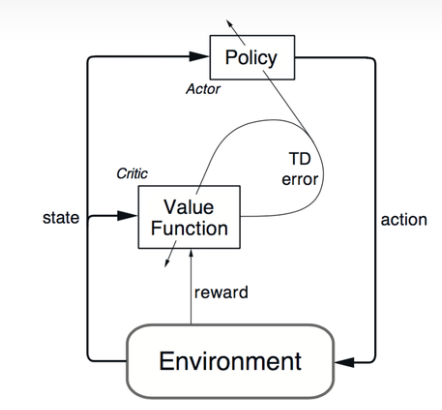
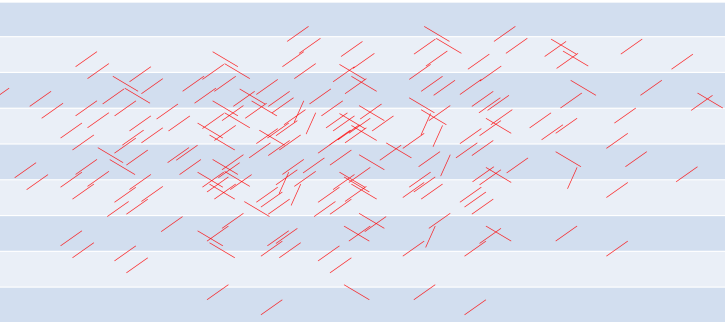
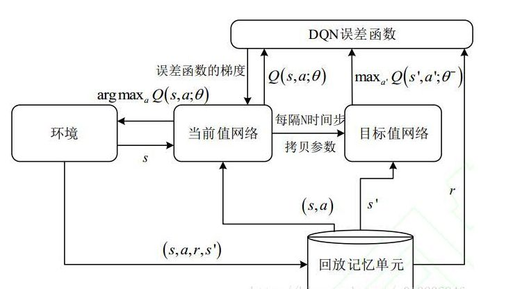
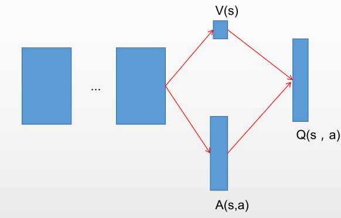
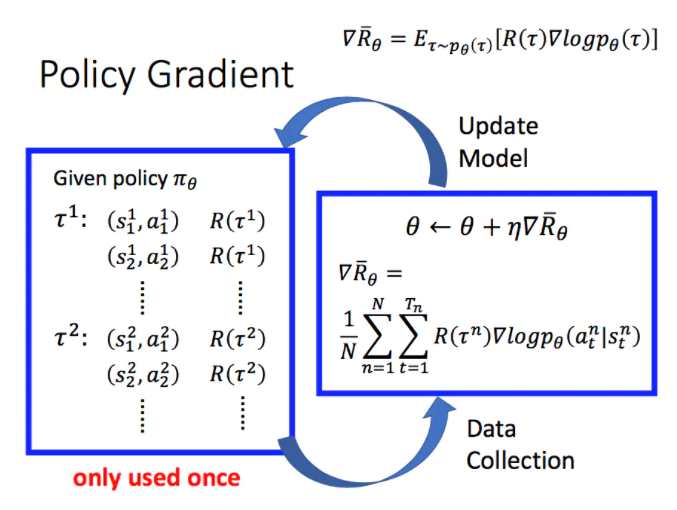
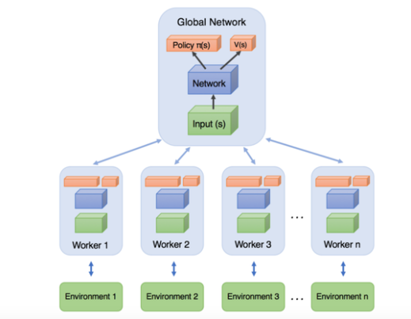

## Basics

##### 1

**agent**: the main object to explore environment and accomplish tasks

**environment**( model): environment behavior

**action**(space): actions that an agent may take to accomplish the task

**state/observation**: environment information that an agent perceives, while they both are commonly referred as the state of the system, observation is used to emphasize that the agent's perception area/ability is limited.

**reward**: values given by environment in response to state-action pair, describing desirability of environmental states

*****

##### 2

Markov Decision Process: 在一系列事件中，当前事件的概率**只取决于**前一事件，也就是说，状态转移的概率不会随着更久之前的状态加入而改变。

*****

##### 3

在这里，需要着重关注$\pi(a|s)$与$P_{ss\prime}^a$的区别：
$$
\pi(a|s) \space vs. \space P_{ss\prime}^a
$$

我的理解是：$\pi(a|s)$表示智能体选择（在给定状态下）某一特定动作的策略（概率），而$P_{ss\prime}^a$表示选择（在给定状态与动作下）下一特定状态发生概率。但是很多时候状态的发生是由于智能体的动作，也就是说策略对动作的选择决定了下一状态发生的概率，例如“向右”的动作造成了(2,3)->(3,3)的状态改变，因此容易被混为一谈。

*****

##### 4

RL ~= customized **Markov decision process** and requires accurate environment representation and high dimensional inputs, which is the gap that DNN aiming to fill, in turn we get DRL.

*****

##### 5

Actor-Critic算法模式是指将模型的训练分为两个环节，Actor负责学习动作（即普通的DRL网络），Critic负责学习估值的大小，也就是说，去学习优化Actor得出的动作结果与状态和奖励之间的关系。

具体而言，例如在DDPG中，actor网络的输入是state，输出是action，以深度神经网络进行函数拟合，对于连续动作，输出层可以用tanh或sigmod，离散动作以softmax作为输出层则达到概率输出的效果。critic网络输入为state和action，输出为Q值。

*****

##### 6

`：这里初始化Q(s,a)通常是采用冷启动，当然也可以考虑采用别的方式初始化Q(s,a)，使其在一开始就有一定的判断能力。

``：也就是贪心算法，在$\epsilon$概率下根据策略选择最优值（exploitation），在$1-\epsilon$概率下选择随机值（exploration）。

*****

##### 7

在画有多条平行线上的纸上投针（针的长度小于平行线宽度），总投针数与投下的针与平行线相交的数量之比为圆周率$\pi$

2212/704=3.14

*****

##### 8

**经验回放**单元将训练产生的数据（状态、动作等等）存储起来，进行混合后再随机输出给网络学习；

**目标网络**承担起输出估值供主网络学习的功能，这里的估值即是maxQ(s',a)，且该网络每隔N步从主网络同步参数。当N=1时，就和普通DQN的更新一致。

**双重网络**

1网络： $Q(S,A) \leftarrow Q(S,A)+α[R+γQ(S',a_2)-Q(S,A)]$

2网络： $Q(S,A) \leftarrow Q(S,A)+α[R+γQ(S',a_1)-Q(S,A)]$

其中，$a_i = argmaxQ_i(S\prime,a)$

显著的不同在于，在估值时随机选择一个网络进行更新，但是更新时使用的动作是由另一个网络决定的，这样做可以缓解过拟合的发生，不至于只在一个网络上一直叠加误差。举例：

$decide \space to \space update \space Net1 \rightarrow get \space a_2 =  argmaxQ_2(S\prime,a) \rightarrow update \space Net1$

**Dueling网络**

作了$Q^\pi(s,a) = V^\pi(s) + A^\pi(s,a)$的假设，其中V表示状态的价值，A表示动作的价值。将全连接层分为对状态的估值和对动作的估值，将其解偶学习，然后再组合输出为最终的估值。直观的理解就是在差的状态下动作的选择对Q(s,a)影响不大，不论做什么动作都于事无补。让两个子网络对不同情况的反应不同，可以提高网络整体的表达性。

*****

##### 9

策略梯度PG

即在策略$a = \pi(s|\theta)$的指导下智能体在环境中试图完成任务，产生一系列动作-状态-奖励序列，对该序列进行评估，得到
$$
R(\theta) = E[r_0 + r_1 + ... + r_t | \pi_\theta]
$$
这样一个评价函数用来评价策略$\pi$的好坏，进一步推导，可以得到：
$$
R(\theta) = {1 \over N}\Sigma_i\Sigma_tr(s_{i,t}, a_{i,t})
$$
那么将动作a带入，可得：
$$
R(\theta) = {1 \over N}\Sigma_i\Sigma_tr(s_{i,t}, \pi(s_{i,t}|\theta))
$$
那么优化策略，就是优化$R(\theta)$使其最大，即对其求导得到$\grad R(\theta)$，并套用梯度下降的方式，只是这里是为了求最大值，所以变成了梯度上升。而从(2)式至(4)式的推导就是为了使右式出现$\theta$以求偏导。

*****

##### 10

置信区域策略优化算法（TRPO）是基于策略梯度的基本算法，通过KL散度确定策略梯度上升的速度、幅度、方向（是否进行策略梯度更新）的一种算法。

##### 11

异步优势演员-评论家网络(A3C)更类似于一种架构模型，其中worker理论上来说可以是DQN,DDPG等等网络，通过定期更新worker网络内的参数至全局主网络来实现博采众长的效果。

参数更新是通过积累更新梯度$d\theta$直至给定的周期，再通过
$$
d\theta \leftarrow d\theta + {\part(y - Q(s,a;\theta^-))^2 \over \part \theta}
$$
对主网络进行更新，其中$y = r_j + \gamma Q(s',a;\theta^-)$由目标网络进行估算。
