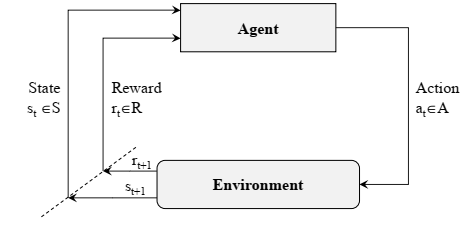
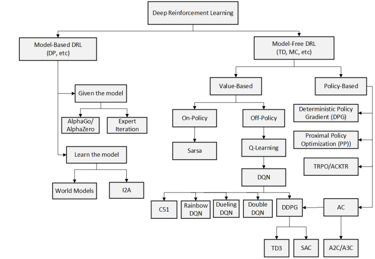
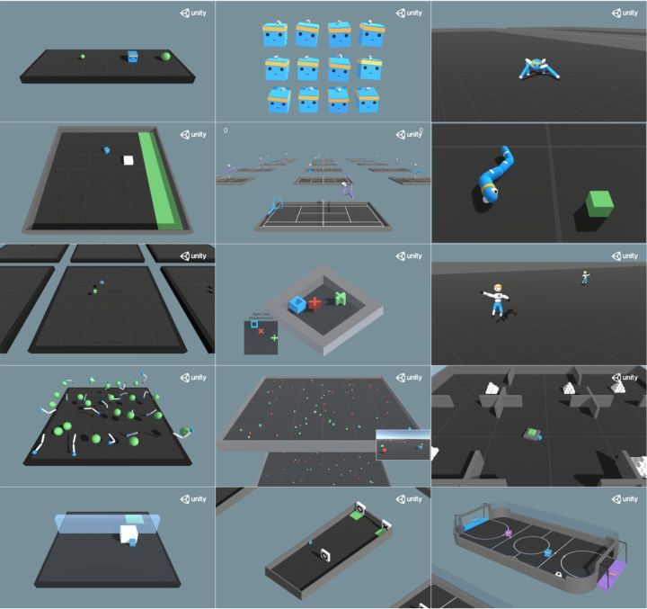
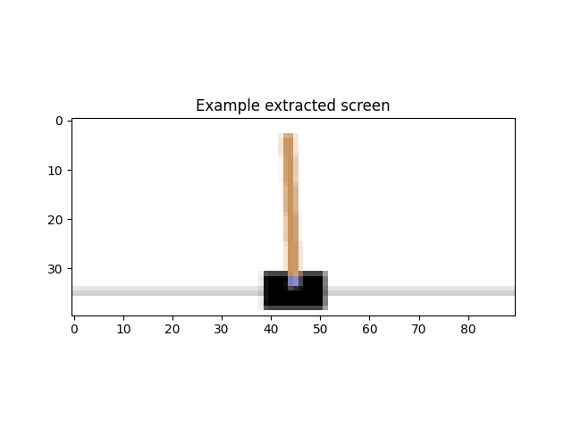
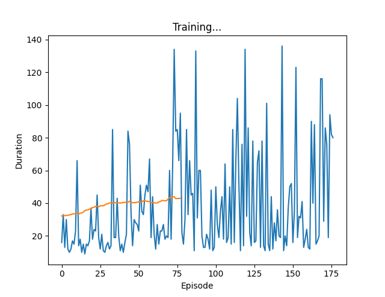

# 强化学习入门指南

[TOC]

## 引言与背景

### 什么是强化学习

> 强化学习（Reinforcement Learning, RL）是机器学习的一个重要分支，研究智能体如何通过与环境交互来学习最优策略，以最大化累积奖励。

近年来，强化学习拥有很高的热度，在解决（机器人/无人机/自动驾驶）控制智能化等领域受到了众多关注，也在很多深度学习模型上面有所应用。（新论文都有几百、千余引用）

### 历史发展脉络

强化学习的发展可以追溯到心理学和动物学习理论：

**📅 早期阶段（1950s-1980s）**
- **1950s**: 贝尔曼（Richard Bellman）提出动态规划理论，奠定了强化学习的数学基础
- **1960s**: 行为主义心理学家研究动物学习行为，提出了"试错学习"的概念
- **1970s**: 时间差分（TD）学习方法的雏形开始出现
- **1989**: Watkins提出经典的Q-Learning算法，成为强化学习的里程碑

**🚀 现代发展（1990s-2010s）**
- **1990s**: Sutton等人系统化强化学习理论，发表《强化学习：介绍》
- **1992**: TD-Gammon在西洋双陆棋中取得超人类水平
- **2000s**: 策略梯度方法兴起，Actor-Critic算法被广泛研究

**⚡ 深度强化学习时代（2010s-至今）**
- **2013**: DeepMind提出DQN，首次将深度学习与强化学习结合
- **2016**: AlphaGo击败世界围棋冠军李世石，震惊世界
- **2017**: AlphaZero实现完全自学，无需人类知识
- **2019**: OpenAI Five在Dota2中击败职业选手
- **2020s**: GPT系列使用强化学习从人类反馈中学习（RLHF）


## 核心思想与基本原理

### 基本框架

强化学习主要研究**贯序决策（Sequential Decision）问题**，其核心思想可以概括为：

> **智能体通过试错学习，在与环境的交互中发现能够获得最大累积奖励的行为策略**

强化学习的场景包含**5大基本元素**[[1]](support.md/#1)：

| 元素 | 英文 | 作用 | 示例 |
|------|------|------|------|
| **智能体** | Agent | 学习和决策的主体 | 游戏玩家、机器人、交易系统 |
| **环境** | Environment | 智能体所处的外部世界 | 游戏场景、物理空间、市场 |
| **状态** | State | 环境的当前情况描述 | 棋盘布局、机器人位置、股价 |
| **动作** | Action | 智能体可以执行的操作 | 走棋、移动、买卖 |
| **奖励** | Reward | 环境对动作的反馈信号 | 得分、距离、收益 |

### 学习循环机制

强化学习的学习与决策过程可以表示为**S→A→R→S'**往复循环的马尔科夫决策过程（MDP）[[2]](support.md/#2)：



**学习循环步骤**：
1. **感知状态**：智能体观察当前环境状态 $S_t$
2. **选择动作**：根据策略 $\pi$ 选择动作 $A_t$
3. **执行动作**：在环境中执行选定的动作
4. **获得反馈**：接收奖励 $R_{t+1}$ 和新状态 $S_{t+1}$
5. **更新策略**：基于经验优化策略
6. **重复循环**：继续下一个时间步

### 核心数学概念

在优化以取得最高奖励R的过程中，我们需要关注两个关键函数：

**（价）值函数—Value Function**: 
$$v_{\pi}(s) = E_{\pi}[R_{t+1} + \gamma R_{t+2} + \gamma^2 R_{t+3} + ... | S_t = s]$$

$$v_{\pi}(s) = \Sigma_{a \in A} \pi(a|s)q_{\pi}(s,a)$$

- 式(1)表示：在策略$\pi$下，**价值v是对于某一状态的奖励（价值）的和**，他是该状态瞬时奖励$R_{t+1}$与未来的奖励$R_{t+2}$...等的奖励期望和，其中未来的奖励将会有一个折扣系数$\gamma$。
- 式(2)表示：价值函数与动作价值函数的关系。

**动作估值函数—Q Function**: 
$$q_{\pi}(s,a) = R_s^a + \gamma \Sigma_{s\prime \in S}P_{ss\prime}^a v_{\pi}(s\prime)$$

动作估值函数表示在状态$s$下执行动作$a$的期望回报。

## 强化学习分类体系

### 按学习策略分类

#### 1. 基于价值的方法（Value-Based）
- **核心思想**：学习状态价值函数或动作价值函数
- **代表算法**：Q-Learning、DQN、Double DQN、Dueling DQN
- **优势**：样本效率高，理论保证强
- **劣势**：只适用于离散动作空间

#### 2. 基于策略的方法（Policy-Based）
- **核心思想**：直接学习策略函数
- **代表算法**：REINFORCE、TRPO、PPO、A3C
- **优势**：适用于连续动作空间，可处理随机策略
- **劣势**：方差大，收敛慢

#### 3. 演员-评论家方法（Actor-Critic）
- **核心思想**：同时学习价值函数和策略函数
- **代表算法**：A2C、A3C、DDPG、TD3、SAC
- **优势**：结合前两者优势，稳定性好
- **应用广泛**：适用于大多数强化学习任务

### 按环境建模分类

#### 1. 无模型方法（Model-Free）
- **特点**：不需要环境模型，直接从经验中学习
- **算法**：Q-Learning、Policy Gradient、Actor-Critic系列
- **优势**：适用性广，无需环境先验知识
- **劣势**：样本效率相对较低

#### 2. 基于模型的方法（Model-Based）
- **特点**：学习环境模型，然后基于模型进行规划
- **算法**：Dyna-Q、MBPO、MPC-based方法
- **优势**：样本效率高，可进行规划
- **劣势**：模型误差会影响性能

### 按策略更新方式分类

#### 1. 在线策略（On-Policy）
- **特点**：用于学习的数据来自当前策略
- **算法**：SARSA、TRPO、PPO、A3C
- **优势**：理论保证强，收敛稳定
- **劣势**：样本利用率低

#### 2. 离线策略（Off-Policy）
- **特点**：用于学习的数据可来自任何策略
- **算法**：Q-Learning、DQN、DDPG、SAC
- **优势**：样本利用率高，可重用历史数据
- **劣势**：可能存在分布偏移问题

### 按智能体数量分类

#### 1. 单智能体强化学习（Single-Agent RL）
- **场景**：一个智能体与环境交互
- **应用**：游戏AI、机器人控制、推荐系统

#### 2. 多智能体强化学习（Multi-Agent RL）
- **场景**：多个智能体同时学习和交互
- **挑战**：非静态环境、协作与竞争
- **应用**：无人机集群、交通控制、经济建模



## 强化学习的应用领域

### 🎮 游戏与娱乐

**经典案例**：
- **AlphaGo/AlphaZero**：围棋、国际象棋、将棋
- **OpenAI Five**：Dota2 MOBA游戏
- **AlphaStar**：星际争霸II实时策略游戏
- **雅达利游戏**：DQN在经典街机游戏中的突破

**技术特点**：
- 完美信息或部分可观察环境
- 复杂的状态空间和动作空间
- 长期规划和战略思考


### 🤖 机器人控制

**应用场景**：
- **机械臂操控**：抓取、装配、焊接
- **移动机器人**：路径规划、SLAM、避障
- **人形机器人**：步态控制、平衡保持
- **工业自动化**：生产线优化、质量控制

**技术挑战**：
- 连续控制空间
- 安全性要求
- 实时性约束
- 硬件限制

### 🚗 自动驾驶

**核心任务**：
- **路径规划**：全局路径和局部轨迹规划
- **行为决策**：超车、变道、停车决策
- **控制优化**：油门、刹车、转向控制
- **交通理解**：信号灯识别、交通规则遵守

**技术要点**：
- 多传感器融合
- 安全性优先
- 法规合规
- 边缘情况处理

### 💰 金融科技

**应用领域**：
- **算法交易**：高频交易、套利策略
- **投资组合管理**：资产配置、风险控制
- **风险管理**：信贷评估、欺诈检测
- **市场做市**：流动性提供、价差优化

**技术特色**：
- 高噪声环境
- 非平稳市场
- 风险收益平衡
- 实时决策要求

### 🏥 医疗健康

**创新应用**：
- **个性化治疗**：药物剂量优化、治疗方案推荐
- **医学影像**：病变检测、诊断辅助
- **药物发现**：分子设计、候选药物筛选
- **健康管理**：慢病管理、预防保健

**关键考量**：
- 数据隐私保护
- 监管合规要求
- 临床验证需求
- 医疗伦理考虑

### 📚 推荐系统

**核心功能**：
- **内容推荐**：新闻、视频、音乐推荐
- **商品推荐**：电商、广告、搜索优化
- **社交推荐**：好友推荐、内容分发
- **个性化服务**：界面定制、功能推荐

**技术优势**：
- 处理长期用户价值
- 探索-利用平衡
- 实时反馈学习
- 冷启动问题解决

### ⚡ 能源与环保

**应用场景**：
- **智能电网**：负荷预测、需求响应
- **能源交易**：电力市场、碳交易
- **设备优化**：HVAC控制、工业节能
- **可再生能源**：风光储一体化控制

**技术挑战**：
- 多时间尺度优化
- 不确定性处理
- 系统稳定性
- 经济效益平衡

### 🌐 互联网服务

**典型应用**：
- **云计算**：资源调度、负载均衡
- **网络优化**：路由选择、拥塞控制
- **用户体验**：界面优化、交互设计
- **内容分发**：CDN优化、缓存策略


## 着手入门

### [环境与工具](./Envs.md)

#### [gym](https://github.com/openai/gym)

广为使用的强化学习单智能体算法测试环境，同时也是默认的基准环境，主要包含雅达利游戏、经典控制以及经典力学控制等环境。高度集成的代码接口使其成为初学者最容易上手的环境，只需要几行代码就可以运行起来简单的强化学习训练。

```bash
pip install gym[all]
```

#### [spinning up](https://spinningup.openai.com/en/latest/user/introduction.html)

open AI为强化学习入门者提供的强化学习算法库，采用gym作为训练环境，本身内容较少，算法种类、实验demo都不多，而且目前基本已经停止更新，但是引导较为详细，每个实验都可以根据指引可视化，适合入门学习强化学习编程的基本结构，并进行一些小实验。

#### [stable-baselines3](https://github.com/DLR-RM/stable-baselines3)

强化学习算法与应用库，已更新至第三版，包含多种算法与测试程序，且经过大量测试。多篇相关论文在做对比试验时引用该库的算法作为基准，具有相当的参考意义。

[更多工具库推荐](https://zhuanlan.zhihu.com/p/348955068)



### 代码与实践

#### [从最简单的宝藏猎人开始](./src/treasure_hunt.py)

```
o----T
```

一个最基本的一维强化学习环境，智能体需要学会找到宝藏的位置。

#### [经典力学控制问题](./src/simpleDQN.py)



使用DQN算法解决CartPole平衡杆问题，这是强化学习入门的经典案例。



#### [雅达利游戏挑战](./src/SMBtutorial.py)

挑战经典的雅达利游戏，体验深度强化学习的威力。

## 学习资源与参考

### 推荐书籍

1. **《强化学习：原理与实战》** - Sutton & Barto (经典教材)
2. **《白话强化学习与PyTorch》** - 高扬等著 (中文入门)
3. **《深度强化学习》** - Maxim Lapan (实战导向)

### 在线课程

1. **CS285: Deep Reinforcement Learning** - UC Berkeley
2. **强化学习纳米学位** - Udacity
3. **DeepMind x UCL RL Course** - David Silver

### 重要会议与期刊

- **ICML**: International Conference on Machine Learning
- **NeurIPS**: Neural Information Processing Systems
- **ICLR**: International Conference on Learning Representations
- **JMLR**: Journal of Machine Learning Research


### Research Hints

* **LLM + DRL** for fast learning and adaptation
* **LLM to generate control algorithm code** automatically
* **Multi-modal RL** for complex real-world scenarios
* **Sim-to-real transfer** for robotics applications

