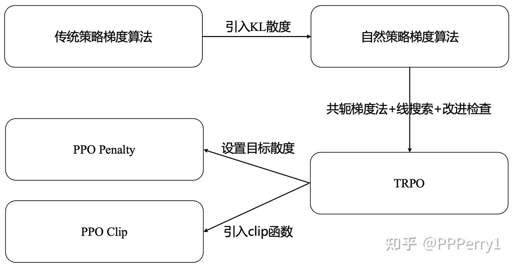

# PPO (Proximal Policy Optimization)

近端策略优化 (PPO)算法是OpenAI在2017提出的一种强化学习算法，被认为是目前强化学习领域的SOTA方法，也是适用性最广的算法之一。PPO算法的演化历程如下图所示。

## 参考资料

* [Proximal Policy Optimization (PPO) 算法理解：从策略梯度开始](https://zhuanlan.zhihu.com/p/614115887)
* [近端策略优化 (PPO) 算法深度解析](https://zhuanlan.zhihu.com/p/27444364357)
* [【强化学习】近端策略优化算法(PPO)万字详解（附代码）](https://blog.csdn.net/qq_51399582/article/details/144650295)
