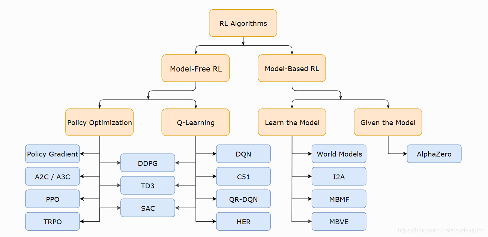

# 深度强化学习

强化学习（Reinforcement Learning，RL）是机器学习的一个重要分支，相较于机器学习经典的有监督学习、无监督学习问题，强化学习最大的特点是在交互中学习。人工智能中的很多应用问题需要算法在每个时刻做出决策并执行动作，例如围棋，每一步需要决定在棋盘的哪个位置放置棋子，以最大的可能战胜对手；无人机需要根据环境中的障碍物或者敌机的位置、态势等信息，选择最优的控制指令；对于自动驾驶算法，需要根据路况来确定当前的行驶策略以保证安全地行驶到目的地等。这类问题有一个共同的特点：智能体（Agent）在与环境的交互中根据获得的奖励或惩罚不断的学习知识，调整自己的动作策略，以达到某一预期目标，从而更加适应环境。解决这类问题的机器学习算法称为强化学习。虽然传统的强化学习理论在过去几十年中得到了不断的完善，但还是难以解决现实世界中的复杂问题。强化学习的范式非常类似于人类学习知识的过程，也正因此，强化学习被视为实现通用人工智能重要途径。

深度强化学习（DRL，Deep Reinforcement Learning）是深度学习与强化学习相结合的产物，它集成了深度学习在视觉等感知问题上强大的理解能力以及强化学习的决策能力，实现了端到端学习。深度强化学习的出现使得强化学习技术真正走向实用，应用于解决现实世界中的复杂问题。从2013年深度Q网络（Deep Q Network，DQN）出现到目前为止，深度强化学习领域出现了大量的算法以及解决实际应用问题的论文。在这一章对深度强化学习的算法与应用进行介绍，主要包括强化学习的基本原理，深度强化学习的基本思想，基于价值函数的深度强化学习算法，以及如何应用到控制方面。主要的深度强化学习如下图所示。

内容
* [Q-Learning](1-Q-Learning)
* [DQN](2-DQN)
* [DDPG](3-DDPG)
    * MADDPG
* [PPO](4-PPO)
    * MAPPO
* [SAC](5-SAC)

## 各种算法对比

* DDPG
    * 优点：简单、能够处理连续动作空间，适合较为简单的任务。
    * 缺点：对超参数敏感，训练不稳定。
    * 适用场景：机器人控制、单一任务
* TD3
    * 优点：改进了DDPG的稳定性，能够有效减少Q值过估计，提高训练稳定性。
    * 缺点：训练时间较长，对环境变化敏感。
    * 适用场景：高维连续控制问题
* PPO
    * 优点：高效、稳定，能够处理离散和连续动作空间，适用范围广。
    * 缺点：训练过程中需要大量数据，收敛较慢。
    * 适用场景：游戏、机器人控制
* SAC
    * 优点：强大的探索能力，高维度任务中表现优秀，自动调节探索与利用的平衡。
    * 缺点：训练过程较为复杂，需要较多计算资源，对超参数敏感。
    * 适用场景：高维度复杂任务、机器人控制

### DDPG（Deep Deterministic Policy Gradient）

DDPG是一种基于**策略梯度**和**Q-learning**结合的算法，旨在解决**连续动作空间**中的强化学习问题。它采用了**Actor-Critic**架构，其中“Actor”负责选择动作，而“Critic”负责评估动作的好坏。DDPG在小型任务上收敛很快效果好。

- **Actor**：输出一个确定性的动作（连续值），即策略函数 (   $\pi(s)$  )。
- **Critic**：评估当前状态-动作对的Q值，即Q函数 ( $Q(s, a)$ )。

**关键特点**

- **连续动作空间**：DDPG特别适合处理连续动作空间的问题，比如机器人控制。
- **确定性策略**：DDPG使用确定性策略来输出连续动作，不同于许多强化学习算法中的随机策略。
- **目标网络和经验回放**：为了解决训练不稳定性，DDPG引入了目标网络和经验回放机制。

**优缺点**

- **优点**：

- - 能处理高维度的连续动作空间。
    - 算法较为简单，容易实现。
    - DDPG可以并行化，但由于它依赖于稳定的Q函数估计，因此在并行训练时可能需要更多的协调。

- **缺点**：

- - 对超参数敏感，需要精细调节。
    - 训练过程可能不够稳定，尤其是在高噪声环境下。

**应用场景**

DDPG主要用于解决那些**连续动作空间**且任务较为简单的强化学习问题，如机械臂控制等。 适用于需要精确控制的应用，如机器人操作和自动驾驶。

### TD3 （Twin Delayed Deep Deterministic Policy Gradient）

TD3是在DDPG的基础上进行改进的算法，主要通过三个重要的技术来提高训练的稳定性和性能：

1. **双Q网络**：引入两个Q网络，减少Q值过估计的情况。
2. **延迟更新**：将策略网络和目标网络的更新频率降低，从而避免频繁的参数调整带来的不稳定性。
3. **噪声策略**：在目标策略上加入噪声，避免策略过度拟合。

**关键特点**

- **双Q网络**：通过引入两个独立的Q网络来减少Q值的过估计。
- **延迟更新**：延迟更新策略网络，以减少更新过快可能带来的不稳定。
- **策略平滑**：通过噪声平滑目标策略，减少训练过程中的过拟合现象。

**优缺点**

- **优点**：

- - 相比DDPG，TD3在稳定性和性能上有显著提高。
    - 有效缓解了Q值过估计和不稳定性的问题。

- **缺点**：

- - 训练时间较长，尤其是在复杂的环境中。
    - 相比PPO等算法，TD3对环境的变化较为敏感。

**应用场景**

TD3适用于那些需要在复杂环境中进行长期训练的任务，如自驾车、机器人操控等连续控制问题。

### PPO（Proximal Policy Optimization）

PPO是一种基于策略梯度的强化学习算法，提出的核心思想是**限制更新幅度**，避免大规模的策略更新导致训练不稳定。PPO通过使用**剪切（Clipping）和价值函数基准**的技巧，保证策略更新时的平滑性和稳定性。PPO类方法不一定是效果最好的方法，但一般是最稳定的方法（在SAC出来之前），调参相对友好，可以节省很多调试时间。

- **剪切目标函数**：PPO使用一个带有剪切项的目标函数来限制每一步策略更新的幅度，确保新策略不会偏离旧策略太远。
- **多步更新**：PPO允许在多个时间步上进行更新，进一步提高学习效率。

**关键特点**

- **策略优化**：采用基于目标函数剪切的策略优化方法，避免了过大策略更新带来的不稳定性。
- **适用离散和连续动作空间**：PPO可以同时应用于离散动作空间和连续动作空间，具有较强的通用性。
- **高效性**：PPO相较于DDPG和TD3，训练速度更快，尤其是在一些复杂的任务中。

**优缺点**

- **优点**：

- - 极高的稳定性和可靠性。
    - 可以广泛应用于离散和连续动作空间，且易于调参。
    - 收敛性较好，不易过拟合。
    - PPO非常适合并行化，因为它在每个环境中独立更新策略，可以轻松地扩展到多个处理器或机器上。

- **缺点**：

- - 需要大量的数据进行训练。
    - 相较于基于值函数的算法（如DDPG），PPO可能在某些任务上收敛较慢。

**应用场景**

PPO广泛应用于**大规模**的强化学习任务中，尤其适用于复杂的游戏环境（如Atari游戏）和机器人控制问题。适用于需要快速适应和灵活策略的应用，如游戏AI和多智能体系统。

### SAC（Soft Actor-Critic）

SAC是一种结合了**最大熵强化学习**（Maximum Entropy Reinforcement Learning）和**Actor-Critic**架构的算法，其核心目标是通过优化熵来提高探索性，同时保持策略和价值估计的准确性。

- **熵正则化**：SAC引入了熵正则化项，鼓励策略的多样性，从而促进探索。
- **双Q网络**：与TD3类似，SAC也使用双Q网络来减少Q值的过估计。
- **目标熵**：SAC使用一个目标熵来帮助控制探索和利用的平衡。

**关键特点**

- **最大熵方法**：通过最大化策略的熵，SAC能够在训练过程中获得更强的探索能力。
- **自动调节探索与利用的平衡**：SAC自动调节目标熵，避免探索过多导致效率低下，或探索过少导致早期收敛。
- **适应性强**：相比PPO和DDPG，SAC更适合解决连续动作空间中的复杂任务，尤其是在高维度任务中表现更为出色。

**优缺点**

- **优点**：

- - 强大的探索能力，有助于应对复杂环境。
    - 训练稳定性高，尤其在高维动作空间中表现优异。
    - 可以处理高维状态和高维动作空间。

- **缺点**：

- - 相比PPO，SAC的训练过程较为复杂，需要更多的计算资源。
    - 对超参数的敏感性较强，需要在实际应用中精细调整。

**应用场景**

SAC在一些**复杂的连续控制任务**中表现出色，如机器人控制、自动驾驶等高维度环境中的强化学习问题。

## 参考资料

* [Spinning Up - Reinforcement Learning Introduction](https://spinningup.openai.com/en/latest/spinningup/rl_intro.html)
* [【Mathematical Foundations of Reinforcement Learning】](https://github.com/MathFoundationRL/Book-Mathematical-Foundation-of-Reinforcement-Learning)
