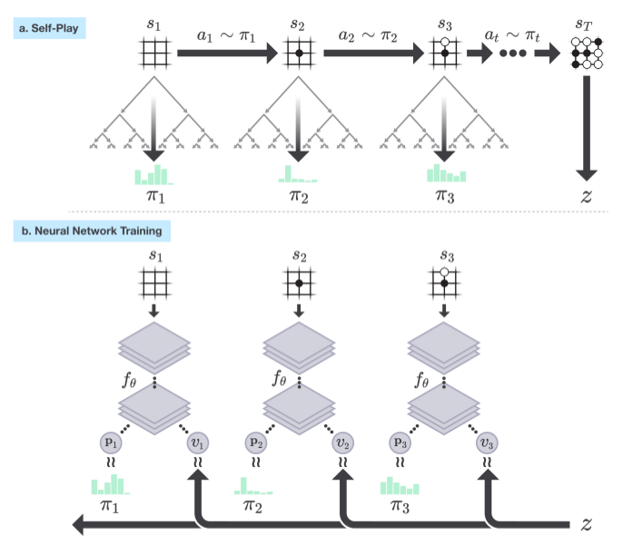
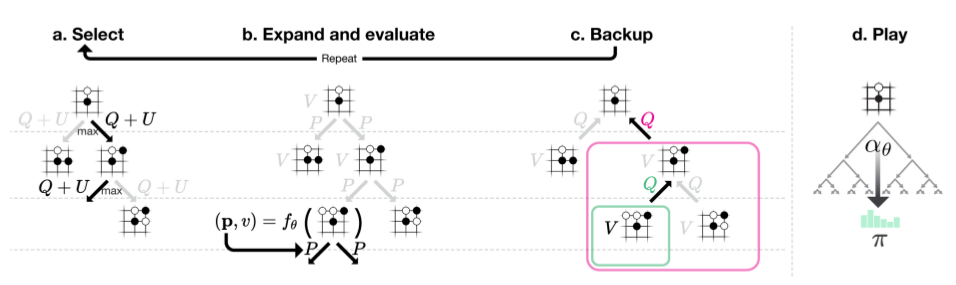

# 动机
协同任务RL按输入和输出是否离散连续分为几类：
- 输入状态离散，输出动作离散： Q-learning、SARSA
- 输入状态离散，输出动作连续： DQN、DDQN、Dueling DQN
- 输入状态连续，输出动作确定： DDPG
- 输入状态连续，输出动作随机： PPO

博弈对抗任务中，针对输入状态离散，输出动作离散最简单情况，常采用蒙特卡洛搜索，反之蒙特卡洛搜索及所有搜索算法只能处理离散状态和离散动作。搜索算法分类：
- 暴力搜索： 枚举、随机游走
- 盲目搜索： 深度优先、广度优先
- 启发搜索: A*
- 对抗搜索：MinMax搜索、蒙特卡洛搜索

前三种只适合单智能体搜索，对抗搜索适合两个及以上的搜索，其中MinMax搜索以找到最优解为目标比较耗时，且过分依赖人类提供的评估函数。蒙特卡洛搜索树能快速找到次优解，并结合强化学习找到最优解。最成功的经典案例便是alphago zero。
# Alpha Zero 算法浅析

​	2017 年 10 月,DeepMind 公司发表了一篇题为“Mastering game of Go without human knowledge”的论文,文中提出了一个新的围棋人工智能版本:AlphaGo Zero,指出其在不借鉴任何人类围棋棋谱的条件下,仅利用围棋规则本身,通过自我对弈的形式实现了对公司既往开发的各个围棋人工智能软件版本的超越,使得 AlphaGo Zero 成为这个世界上最厉害的围棋手。随后该公司将 AlphaGo Zero 算法的核心思想成功地应用到了国际象棋、日本象棋中,并将这类算法统称为 Alpha Zero 算法。2017 年 11 月斯坦福大学的一个科研团队发表了一篇题为“Learning to Play Othello Without Human Knowledge”论文,在棋盘规模较小的“黑白棋”游戏中,实现 并开源类 Alpha Zero 算法,并取得了非常不错的效果。

## Alpha Zero 算法核心思想

​	围棋、国际象棋等游戏都有一些共同的特征:它们都属于双人、零和 (zero-sum) 博弈、完美信息 (perfect information) 类游戏。其中“双人”指游戏参与者为两个人; **“双人零和博弈”**指参与游戏的双方不存在合作的可能,一方的收益额等于另一方的损失额,双方的收益和损失相加总和永远为“零”; **“完美信息”**指参与游戏的任何一方在做决策前都掌握了所有相关的历史信息, 包括游戏的初始化信息。围棋、国际象棋、黑白棋等游戏都属于完美信息游戏,而扑克牌游戏由于游戏一方不知道洗牌后的结果以及对方手中的牌,则属于非完美信息游戏。完美信息游戏产生的事件序列可以严格地使用马尔科夫过程来建模。Alpha Zero 算法则充分利用了**双人零和完美信息**类游戏的特点。

### MDP

​	游戏者可能的操作是在棋盘的任何一个位置放置一枚棋子或者放弃落子 (pass), 在游戏过程中,有些行为是合法的,而有些行为是非法的,在行为空间这一层面暂不做区分。由于其类型为的规则明确,因此只要是执行了一个合法行为那么后续状态是确定的,因此行为进入对应的后续状态的概率为 1,而进入其它状态的概率为 0。在棋类游戏的过程中,双方是无法从落子行为中获得奖励的,直到棋局结束系统判定输赢,此时的输赢可以认为是一个奖励,该奖励既是整个状态序列最后一个状态转换的即时奖励,也是该状态序列中唯一一个值可能不为 0 的奖励。可以设置某一方赢棋获得值为 1 的奖励,另一方获得-1 的奖励,双方合局则奖励为 0。由于在非终止的状态转换中奖励值都为 0,因此可以不必考虑衰减因子,或者直接设置其值为 1。

### 联合网络

将策略网络和价值网络合二为一，使用一个深度神经网络$f_{\theta}$，但是有两套输出，分别为362维的走棋概率和一个输赢评估值[-1,1].

- 网络的输入：当前的棋盘状态s为$19\times 19\times 17$,17维主要由8个黑子落子记录，8个白字落子记录以及当前走棋方的状态（0表示白子，1表示黑子）。
- 网络的输出：$f_{\theta}(s)=(p,v)$，$p$为走棋概率（362个输出），由361个棋盘落子位置概率和1个是否认输的概率组成。
- 网络结构：ResetNet(20个残差模块)or卷积神经网络

### 强化学习过程

​	Alpha Zero 算法通过自我对弈来生成一定数目的棋局,这些棋局用于进一步训练神经网络逐渐迭代更新网络的参数,并用于指导下一次的蒙特卡罗树搜索,最终使得网络对于状态价值的判断和策略函数的判断越来越准确。

​	Alpha Zero 算法针对某一棋局状态的在产生一个对战行为前,会进行 1600 次 (广度) 的蒙特卡罗树搜索 (MCTS),而每次搜索的深度至少是到达树的叶子节点后,如果该叶子节点代表的状态不是终盘,则还通过神经网络给出的估计结果再扩展一层。

自我对弈完成一个完整棋局进而产生一个完整的状态序列 s 1 , s 2 , . . . , s T的过程,T 时刻棋局结束,产生了针对某一方的最终奖励 z。在棋局的每一个时间 t,棋盘状态为s t 。该状态下通过在神经网络$f_{\theta}$引导下的一定次数模拟的蒙特卡罗树搜索产生最终的落子行为a t 。神经网络 $f_{\theta}$的输入是某时刻 t 的棋局状态st 外加一些历史和额外信息 (包括当前棋手信息),输出是行为概率向量 pt 和一个标量 vt ,前者表示的在当前棋局状态下采取每种可能落子方式的概率,后者则表示当前棋局状态下当前棋手估计的最终奖励。神经网络的训练目标就是要尽可能的缩小两方面的差距:一是搜索得到的概率向量 π t 和网络输出概率向量 p t 差距,二是网络预测的当前棋手的最终结果 v t 和实际最终结果(用 1,-1 表示) 的差距。网络训练得到的新参数会被用来指导下一轮迭代中自我对弈时的 MCTS搜索。

- Alpha Zero算法使用 f θ 指导的蒙特卡罗树搜索 (MCTS) 来模拟人类棋手的思考过程。

- MCTS 给出的各行为的概率比单纯从神经网络 $f_{\theta}$得到的策略函数给出的各行为的概率更加强大,从这个角度看, MCTS 搜索可以被认为是一个强大的策略优化工具。

- 通过搜索来进行自我对弈——使用改善了的基于 MCTS 的策略来指导行为选择,然后使用棋局结果(哪一方获胜,用-1 和 1 分别表示白方和黑方获胜)来作为标签数据——则可以被认为是一个强大的策略评估工具。

- Alpha Zero 算法主体思想就是在策略迭代过程中重复使用上述两个工具:神经网络$f_{\theta}$的参数得以更新,这样可以使得神经网络输出的各位置落子概率和当前状态的获胜奖励更接近与经过改善了的搜索得到的概率以及通过自我对弈得到的棋局结果,后者用 (π, z) 表示。网络得到的新参数可以在下一次自我对弈的迭代过程中让搜索变得更加强大

**目标函数**：$$l=(z-v)^{2}-\pi_{t}log(p)+c\left \| \theta  \right \|^{2}$$

### MCTS

​	蒙特卡罗树搜索中的几个概念。“对战”指的是游戏一方与自身或其他游戏者进行博弈时实际落子的过程,对战包括自我对弈和与其它游戏者对弈,其特点是产生实际的落子行为,其结果是对局结束产生输赢或和局形成一个完整的状态序列。“思考”指的是游戏一方在面对当前棋盘状态时通过模拟双方虚拟落子来分析棋局演化形势进而估计当前最优落子行为的过程。对棋局的思考有“深度”和“广度”两个方面,深度指的是在当前状态下模拟的步数多少观察当前棋局状态的演化过程;广度指在当前状态下多个可能的落子行为,观察在当前棋局状态下朝着不同的方向演化。在蒙特卡罗树搜索中,一次搜索 (one search)”或“一次模拟 (one simulation)”与广度相对应,指在当前状态下产生一个较优的行为并沿着该路径进行一定深度的思考的过程。

蒙特卡罗搜索树中的每一个节点 s 表示棋盘的一个状态,它包含一系列的边 (s, a),每一条边对应状态 s 下的合法行为空间 A(s) 中的一个行为 a,并且每一条边中存储着下列统计数据:
                           {N (s, a), W (s, a), Q(s, a), P (s, a)}
其中 N (s, a) 是该边的访问次数,W (s, a) 是该边总的行为价值,Q(s, a) 是该边的平均行为价值,P (s, a) 是该边的先验概率。在棋局进行至某一个状态时,搜索算法会构建一个以当前状态 s 0 为根节点的搜索树,并进行多次搜索 (模拟),代表一次思考过程,其中每一次的搜索从根节点状态 s 0 开始进行前向搜索。

它分为三个阶段:

**选择**：

当前向搜索在第 L 时间步长时到达搜索树的某一叶子节点 s L 时,对于其中的任何时刻 t < L 对应的状态 s_{t} ,使用不确定价值行为优先探索中的置信区间上限的方法来生成状态 s t 下的模拟行为$a_{t}$,见程序mcts-alphazero.py中的_playout函数、select函数和getvalue函数 :
$$a_{t} = argmax (Q(s_{t} , a) + U (s_{t} , a))$$

$$U(s,a)=c_{puct}P(s,a)\frac{\sqrt{\sum_{a^{'}}(s,a^{'}) }}{1+N(s,a)}$$

这种搜索控制策略在一开始时会倾向于选择那些概率较高且访问次数较低的行为,但是伴随着搜索的深入逐渐过渡到选择最大行为价值的行为。

**扩展和评估阶段**:

如果该叶子结点是代表终止状态的节点,那么该叶子节点将不再扩展,同时会直接返回当前棋盘状态对应的价值(v s L ∈ [−1, 0, 1]) 的相反数 v = −v s L ;如果该叶子结点并不代表终止状态,则将节点 s L 送入到神经网络 f θ 中进行评估:
(di (p), v) = fθ (di (s L ))
这里使用了数据扩增 (data augamentation) 技术,由于许多棋盘类游戏的状态和对应的行为都可以从前后左右四个方向进行描述,也就是说把棋盘旋转个 90、180、或 270 度再呈现给游戏者棋盘中棋子的位置对于观察者是发生了变化,但整个棋盘状态的价值并没有发生任何变化;类似的事情还发生在镜像转换时。因此对于任何一个状态,都可以产生 8 个不同的描述,而这 8个不同描述对应状态价值是一样的。上式中的 d i (s) 指的就是针对状态 s 的 8 个状态描述中的一个 (i ∈ [1, . . . , 8])。在得到网络的评估结果后,节点 sL会将会扩展,其下会对每一个合法行为a ∈ A(sL ) 添加一条边 (sL , a) 连接对应的后续节点,并设置:$${N (sL , a) = 0, W (sL , a) = 0, Q(sL , a) = 0, P (s, a) = Pa }$$
同时节点 sL 的价值为来自神经网路的输出 v,该价值将会得到回溯来更新搜索路径中的其它价值。

**回溯 (backup) 过程**:

对于任何时间步 t < L,搜索路径中的边计数都会增加一次:
$$N (s_{t}  , a_{t} ) = N (s_{t}  , a_{t}) + 1$$
同时,某边的总价值 W (s t , a t ) 和平均价值 Q(s t , a t ) 也会随着更新:
$$W (s_{t}  , a_{t}  ) = W (s_{t}  , a_{t} ) + v$$

$$Q (s_{t}  , a_{t}  )=\frac{ W (s_{t}  , a_{t} )}{ N (s_{t}  , a_{t} )}$$

**行动**

当进行了指定搜索次数的思考后,Alpha Zero 将针对当前状态选择实际对战的骡子行为,对于当前状态 s 0 下的每一个合法行为 a,其被算法选择额概率为，见mcts-alphazero.py中get_move_probs函数:

$$\pi(a|s_{0})=\frac{N(s_{0},a)^{1/\tau}}{\sum_{a^{'}}N(s_{0},a^{'}) }$$

## 与纯RL的差别
无论什么纯RL算法，更新的策略将直接进行下一次的采样，并且这些策略(Qlearning和ddpg中的目标策略和行动策略 or ppo的新旧策略)均是real-policy，而这个有simulation policy和real policy, simulation policy有树内策略和树外策略，用于模拟推理过程，real policy和落子次数有关，用于真实的落子。

[some details about the implementation in Chinese:](https://zhuanlan.zhihu.com/p/32089487) 