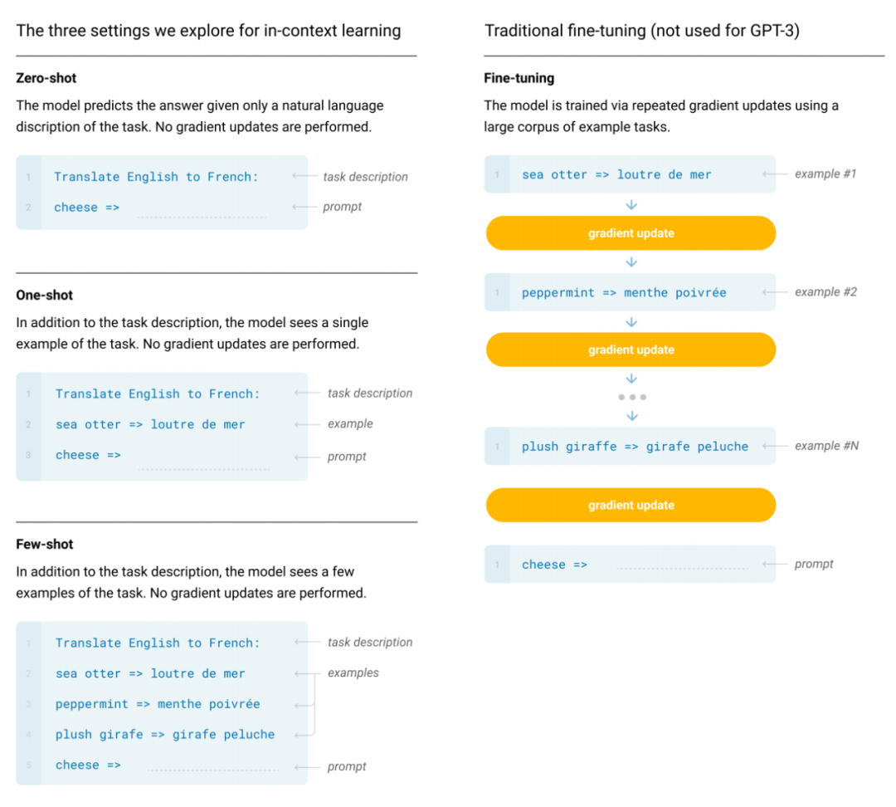
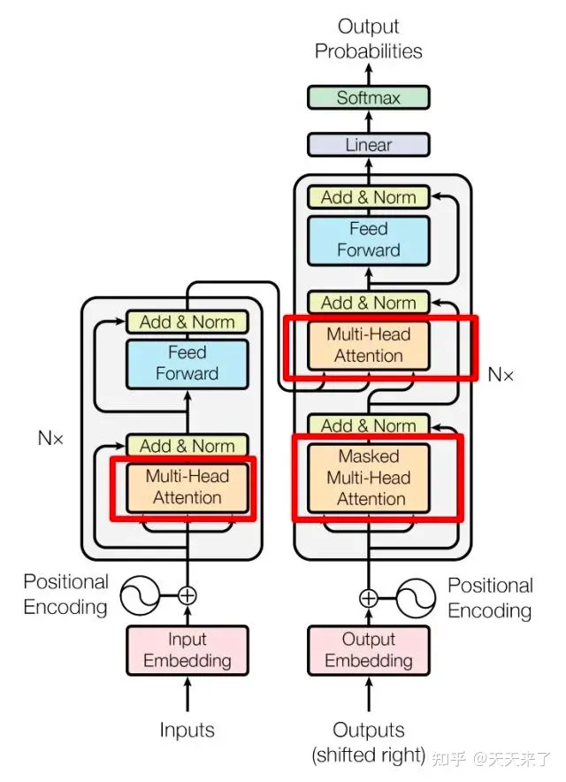
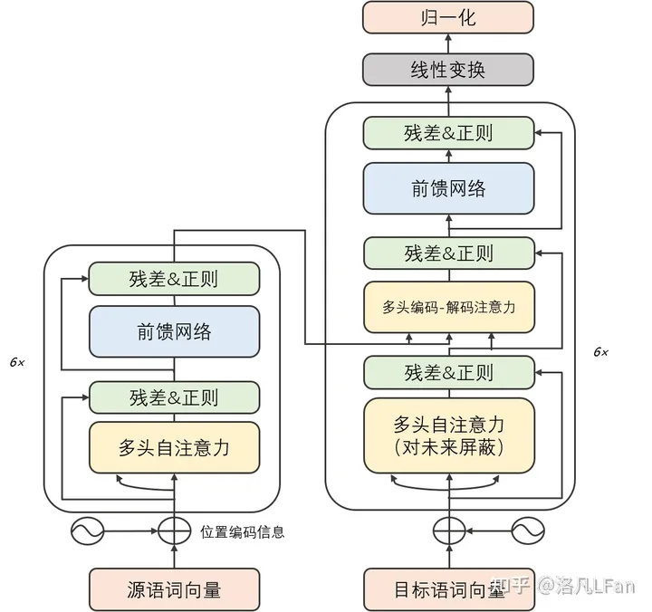
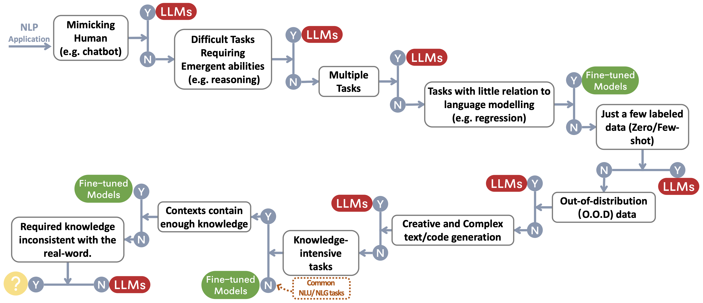

# 大语言视觉模型(Large Language and Vision Model)

## 1. 大模型介绍

### 1.1.  大模型发展史

追寻大模型的“万恶之源”，大抵应该从那篇《Attention is All You Need》开始，基于这篇由谷歌机器翻译团队提出的由多组 Encoder、Decoder 构成的机器翻译模型 Transformer 开始，大模型的发展大致走上了两条路，**一条路是舍弃 Decoder 部分，仅仅使用 Encoder 作为编码器的预训练模型，其最出名的代表就是 Bert 家族。**这些模型开始尝试“无监督预训练”的方式来更好的利用相较其他数据而言更容易获得的大规模的自然语言数据，而**“无监督”的方式就是 Masked Language Model（MLM），通过让 Mask 掉句子中的部分单词，让模型去学习使用上下文去预测被 Mask 掉的单词的能力。**在 Bert 问世之处，在 NLP 领域也算是一颗炸弹，同时在许多自然语言处理的常见任务如情感分析、命名实体识别等中都刷到了 SOTA，Bert 家族的出色代表除了谷歌提出的 Bert 、ALBert之外，还有百度的 ERNIE、Meta 的 RoBERTa、微软的 DeBERTa等等。

可惜的是，Bert 的进路没能突破 **Scale Law**，而这一点则由当下大模型的主力军，即**大模型发展的另一条路，通过舍弃 Encoder 部分而基于 Decoder 部分的 GPT 家族真正做到了**。GPT 家族的成功来源于一个研究人员惊异的发现：**“扩大语言模型的规模可以显著提高零样本（zero-shot）与小样本（few-shot）学习的能力”**，这一点与基于微调的 Bert 家族有很大的区别，也是当下大规模语言模型神奇能力的来源。GPT 家族基于给定前面单词序列预测下一个单词来进行训练，因此 GPT 最初仅仅是作为一个文本生成模型而出现的，而 GPT-3 的出现则是 GPT 家族命运的转折点，GPT-3 第一次向人们展示了大模型带来的超越文本生成本身的神奇能力，显示了这些自回归语言模型的优越性。而从 GPT-3 开始，当下的 ChatGPT、GPT-4、Bard 以及 PaLM、LLaMA 百花齐放百家争鸣，带来了当下的大模型盛世。

从合并这家谱树的两支，可以看到早期的 Word2Vec、FastText，再到预训练模型的早期探索 ELMo、ULFMiT ，再到 Bert 横空出世红极一时，到 GPT 家族默默耕耘直到 GPT-3 惊艳登场，ChatGPT 一飞冲天，技术的迭代之外也可以看到 OpenAI 默默坚持自己的技术路径最终成为目前 LLMs 无可争议的领导者，看到 Google 对整个 Encoder-Decoder 模型架构做出的重大理论贡献，看到 Meta 对大模型开源事业的持续慷慨的参与，当然也看到从 GPT-3 之后 LLMs 逐渐趋向于“闭”源的趋势，未来很有可能大部分研究不得不变成 API-Based 的研究。

### 1.2. 数据——大模型力量源泉

归根结底，大模型的神奇能力是来源于 GPT 么？我觉得答案是否定的，**GPT 家族几乎每一次能力的跃迁，都在预训练数据的数量、质量、多样性等方面做出了重要的提升**。大模型的训练数据包括书籍、文章、网站信息、代码信息等等，这些数据输入到大模型中的目的，实质在于全面准确的反应“人类”这个东西，通过告诉大模型单词、语法、句法和语义的信息，让模型获得识别上下文并生成连贯响应的能力，以捕捉人类的知识、语言、文化等等方面。

一般而言，**面对许多 NLP 的任务，我们可以从数据标注信息的角度将其分类为零样本、少样本与多样本**。无疑，零样本的任务 LLMs 是最合适的方法，几乎没有例外，**大模型在零样本任务上遥遥领先于其他的模型**。同时，少样本任务也十分适合大模型的应用，通过为大模型展示“问题-答案”对，可以增强大模型的表现性能，这种方式我们一般也称为上下文学习（In-Context Learning）。而多样本任务尽管大模型也可以去覆盖，但是微调可能仍然是最好的方法，当然在一些如隐私、计算等约束条件下，大模型可能仍然有用武之地。

同时，微调的模型很有可能会面对训练数据与测试数据分布变化的问题，显著的，**微调的模型在 OOD** **数据上一般表现都非常差**。而相应的，**LLMs 由于并没有一个显式的拟合过程，因此表现要好许多**，**典型的 ChatGPT 基于人类反馈的强化学习（RLHF）在大部分分布外的分类与翻译任务中都表现优异，在专为 OOD 评估设计的医学诊断数据集 DDXPlus 上也表现出色**。

OOD(out od Distribution,分布外泛化， OOD 方法在近年来的工作可以分为三个角度：无监督的表征学习（比如去分析数据间的因果关系）、有监督的模型学习（比如不同数据间的 Generalization）以及优化方式（如何不同分布式的鲁棒优化或是去捕捉一些不变的特征使优化更泛化）

下图反映了传统的微调模型与zero-shot,one-shot,few-shot的区别

## 2. 语言大模型组成

在大模型发展历程中，有两个比较重要点：**第一，Transformer 架构**。它是模型的底座，但 Transformer 不等于大模型，但大模型的架构可以基于 Transformer；**第二，GPT。严格意义上讲，GPT 可能不算是一个模型，更像是一种预训练范式**，它本身模型架构是基于 Transformer，但 GPT 引入了“预测下一个词”的任务，即不断通过前文内容预测下一个词。之后，在大量的数据上进行学习才达到大模型的效果。

之所以说 Transformer 架构好，是因为 Transformer 能够解决之前自然语言处理中最常用的 RNN 的一些核心缺陷，具体来看：一是，难以并行化，反向传播过程中需要计算整个序列；二是，长时依赖关系建模能力不够强；三是，模型规模难以扩大。

### 2.1. 网络架构

#### 2.1.1. 大模型网络架构分类

##### (1) 编码器-解码器结构

传统 Transformer 模型是建立在编码器-解码器架构上，由两个 Transformer 块分别作为编码器和解码器。编码器采用堆叠的多头自注意层对输入序列进行编码以生成其潜在表示，而解码器对这些表示进行交叉注意并自回归地生成目标序列。编码器-解码器 PLM（例如 T5 和 BART ）能有效完成各种 NLP 任务。目前，只有少数LLM 是基于编码器-解码器架构构建的，例如 Flan-T5 。

##### (2) 因果解码器架构

因果解码器架构采用单向注意力掩码，以确保每个输入 token 只能关注过去的 token 和它本身。输入和输出 token 通过解码器以相同的方式进行处理。作为这种架构的代表性语言模型，GPT 系列模型是基于因果解码器架构开发的。特别地，GPT-3 成功展示了这种架构的有效性，同时也展示了 LLM 惊人的 ICL 能力。有趣的是，GPT-1 和 GPT-2 没有展现出与 GPT-3 相同的卓越能力，表明了模型规模的扩大在增加这种模型架构的能力方面起到了重要作用。至今，因果解码器已被广泛用作为各种现有 LLM 的体系结构，例如 OPT、BLOOM 和 Gopher。注意，接下来讨论的因果解码器和前缀解码器都属于仅解码器体系架构。当提到“仅解码器架构”时，除非另有说明，否则主要是指现有文献中的因果解码器架构.

##### (5) 前缀解码器架构

前缀解码器架构（也称非因果解码器架构）修正了因果解码器的掩码机制，以使其能够对前缀 token 执行双向注意力，并仅对生成的 token 执行单向注意力。这样，与编码器-解码器架构类似，前缀解码器可以双向编码前缀序列并自回归地逐个预测输出 token，其中在编码和解码过程中共享相同的参数。实用的建议是不从头开始进行预训练，而是继续训练因果解码器，然后将其转换为前缀解码器以加速收敛，例如 U-PaLM  是从 PaLM演化而来。基于前缀解码器架构的现有代表性 LLM 包括 GLM-130B 和 U-PaLM 。

**那么，Transformer 具体是如何工作的？**

首先，是对输入进行标识符化，基于单词形式，或字母，或字符子串，将输入文本切分成几个 token，对应到字典中的 ID 上，并对每个 ID 分配一个可学习的权重作为向量表示，之后就可以针对做训练，这是一个可学习的权重。

在输入 Transformer 结构之后，其核心的有自注意力模块和前向传播层。而在自注意力模块中，Transformer 自注意力机制建模能力优于 RNN 序列建模能力。因此，有了 Transformer 架构后，基本上就解决了运行效率和训练很大模型的问题。

+ **自编码模型**，如 BERT，简单讲就是给到一句话，然后把这句话的内容挖空，当问及挖空的内容时，就把内容填回去，这其实是典型地用来做一个自然语言理解的任务，但做生成任务是非常弱的；

+ **自回归模型**，如 GPT，它是通过不断地预测下一个词，特点是只能从左到右生成，而看不到后面的内容。GPT-1 最后接了一个 Linear 层做分类或选题题等任务，到了 GPT-2 ，已经将一些选择任务或者分类任务全部都变成文本任务，统一了生成的范式；

#### 2.1.2. Transformer

Transformer 是一种基于自注意力机制（self-attention Mechanism）的深度学习模型，最初是为了处理序列到序列（sequence-to-sequence）的任务，比如机器翻译，它是由论文《Attention is All You Need》提出。得益于其优秀的性能和灵活性，它现在被广泛评估各种自然语言处理（NLP）任务。

Transformer**模型主要由以下几部分组成：**

**（1）自注意力机制（Self-Attention Mechanism）**

自注意力机制是Transformer模型的核心。它允许模型在处理一个序列的时候，考虑序列中的所有单词，并根据它们的重要性赋予不同的权重。这种机制使得模型能够捕获到一个序列中的长距离依赖关系。

**（2）位置编码（Positional Encoding）**

由于Transformer模型没有明确的处理序列顺序的机制，所以需要添加位置编码来提供序列中单词的位置信息。位置编码是一个向量，与输入单词的嵌入向量相加，然后输入到模型中。

（**3）编码器和解码器（Encoder and Decoder）**

Transformer模型由多层的编码器和解码器很好完成。编码器用于处理输入序列，解码器用于生成输出序列。编码器和解码器都由自注意力机制和前馈神经网络（Feed-Forward Neural）组成网络）组成。

**（4）多头注意力（Multi-Head Attention）**

在处理自我注意力时，Transformer模型并不只满足于一个注意力分配，而是产生多个注意力分配，这就是所谓的多头注意力。多头注意力可以让模型在多个不同的表示空间中学习输入序列的表示。

（**5）前馈神经网路（Feed-Forward Neural Network）**

在自注意力之后，Transformer模型会通过一个前反馈神经网络路来进一步处理序列。这个网络路由两层全连接层和一个ReLU启动函数组成。

**（6）残差连接和层归一化（Residual Connection and Layer Normalization）**

Transformer模型中的每一个子层（自注意力和前馈神经网路）都有一个残差连接，而其输出会通过层归一化。这有助于模型处理深度网路中常见的峰值消失和突然爆炸的问题。

下图示例了架构图：

左边为Encoder block，右边为Decoder block。红色圈中间的部分为Multi-Head Attention，是由多个Self-Attention组成的，可以看到Encoder block包含一个Multi-Head Attention，而Decoder block包含两个Multi-Head Attention -Head Attention（其中有一个可用Masked）。Multi-Head Attention上面还包括一个Add & Norm层，Add表示残差连接（Residual Connection）用于防止网路损伤，Norm表示Layer Normalization，用于对每层层次的启动值进行归一化。

**Transformer 模型的优点在于，它能够高效处理序列中的所有单词，这使得它在处理长序列时比回圈神经网络（RNN）有更机制。另外，自注意力使得模型能够捕获到序列中长距离的依赖关系，这是RNN难以实现的。**

更详细的**Transformer实现原理与步骤可以参考文章：**

[天天来了：手把手教你了解Transformer —Part 1](https://zhuanlan.zhihu.com/p/643798823)

### 2.2. 关键技术

#### 2.2.1. 数据预处理

##### (1) 质量过滤

为删除收集到的语料库中的低质量数据，现有的工作通常采用两种方法：

+ 基于分类器的方法：基于高质量文本训练选择分类器，bing利用他来识别和过滤低质量数据。通常，使用高质量数据（维基百科的数据）作为正样本，采样候选低质量数据作为负样本训练二元分类器，衡量每个数据的质量的分数。

+ 基于启发式的方法：通过一组精心设计的规则来消除低质量文本，这些规则可以总结如下：

  + 基于语言的过滤：如果LLM主要用于某项语言的任务重，那么其他的语言的文本可以被过滤掉
  + 基于度量的过滤：可以利用生成文本的评估度量，例如困惑度(Perplexity)，来检测和删除不自然的句子
  + 基于统计的过滤：可以利用语料库的统计特征，例如标点符号分布，符号与单词比率和句子偿付，来衡量文本质量，过滤低质量数据
  + 基于关键词的过滤：基于特定的关键词几何，可以识别和删除文本中的噪声或无用元素，例如HTML标签、超链接、模板和攻击性词语

  

##### (2) 去重

现有的研究 发现，语料库中的重复数据会降低语言模型的多样性，可能导致训练过程不稳定，从而影响模型性能。因此，需要对预训练语料库进行去重处理。具体来说，可以在句子级、文档级和数据集级等不同粒度上去重。首先，在句子级别上，应删除包含重复单词和短语的低质量句子，因为它们可能会在语言建模中引入重复模式 。在文档级别上，现有研究主要依靠文档之间的表层特征（例如单词和 n元的重叠）的重叠比率来检测和删除包含相似内容的重复文档 。此外，为了避免数据集污染问题，还必须通过从训练集中删除测试集可能出现的重复文本，来防止训练集和评估集之间的重叠 。现有研究已经证明，这三个级别的去重都有助于改善 LLM 的训练，在实践中应该共同使用这三个级别的去重。

##### (3) 隐私去除

大多数预训练文本数据来自网络来源，包括涉及敏感或个人信息的用户生成内容，这可能增加隐私泄露的风险 。因此，需要从预训练语料库中删除可识别个人信息（*PII*）。一种直接有效的方法是采用基于规则的方法，例如关键字识别，来检测和删除 PII，例如姓名、地址和电话号码 。此外，研究人员还发现，LLM 在隐私攻击下的脆弱性可能归因于预训练语料库中存在的重复 PII 数据。因此，去重也可以在一定程度上降低隐私风险

##### (5) 分词

分词也是数据预处理的关键步骤。它的目的是将原始文本分割成词序列，随后用作 LLM 的输入。虽然直接利用已有的分词器是方便的（例如 OPT 和 GPT-3 利用了 GPT-2  的分词器），但是使用专门为预训练语料库设计的分词器可能会更加有效，特别是对于由多种领域、语言和格式组成的语料库。因此，最近的几个LLM 使用SentencePiece  为预训练语料库训练定制化的分词器。同时利用字节级的 *Byte Pair Encoding (BPE)* 算法 来确保分词后的信息不会丢失 。然而需要注意的是，BPE 中的归一化技术，例如 NFKC，可能会降低分词性能。

#### 2.2.2. Prompt tuning & Instruct tuning

#### 2.2.3. Scaling

#### 2.2.4. 优化设置

##### (1) 批量训练

对于语言模型的预训练，现有的研究通常将批量大小设置为较大的数字（如 2,048 个例子或 400 万个 token），以提高训练的稳定性和吞吐量。像 GPT-3 和 PaLM 这样的LLM 引入了一种新的策略，即在训练过程中动态增加批量大小，最终达到百万级别。具体而言，GPT-3 的批量大小从 **3.2万逐渐增加到 320 万个 token**。实证结果表明，动态调整批量大小的策略可以有效地稳定 LLM 的训练过程

##### (2) 学习率

现有的 LLM 通常在预训练过程中采用类似的学习率调整策略，包括预热（**warm-up**）和衰减（decay）。具体而言，在训练的初始 0.1% 到 0.5% 的步骤中，采用线性预热策略逐渐增加学习率到最大值，这个最大值通常在 5 *×* 10−5 到 1 *×* 10*−*4 之间（例如 GPT-3 的学习率为 6 *×* 10*−*5）。然后，在后续步骤中采用余弦衰减策略，逐渐将学习率降低到其最大值的约 10%，直到训练损失的收敛

##### (3) 优化器

**Adam 优化器 和 AdamW 优化器** 被广泛应用于 LLM（例如 GPT-3）的训练中，这些优化器使用了基于一阶梯度优化的低阶矩自适应估计。通常，它的超参数设置如下：*β*1 = 0*.*9，*β*2 = 0*.*95 和 *ϵ* = 10*−*8。同时，Adafactor优化器也被用于训练 LLM（例如 PaLM 和 T5），它是一种 Adam 优化器的变体，经过特殊设计以在训练过程中节省显存。Adafactor 优化器的超参数设置如下：*β*1 = 0*.*9， *β*2 = 1*.*0 *− k**−*0*.*8，其中 *k* 表示训练步骤的数量。

##### (4) 稳定训练

在 LLM 的预训练过程中，常常会遇到训练不稳定的问题，这可能会导致模型崩溃。为了解决这个问题，通常会广泛使用**权重衰减（weight decay）和梯度裁剪（gradientclipping）**。现有的研究通常将梯度裁剪的阈值设置为 1*.*0，将权重衰减率设置为 0*.*1。然而，随着 LLM规模的扩展，训练损失的突增也更容易发生，导致训练不稳定。为了缓解这个问题，PaLM和 OPT使用了一种简单的策略，即从发生突增之前的一个检查点重新开始训练过程，并跳过可能导致问题的数据。此外，GLM发现嵌入层的异常梯度通常会导致突增，因此提出缩减嵌入层梯度以缓解这个问题。

#### 2.2.5. 可扩展的训练技术

随着模型和数据规模的增加，有限的计算资源下高效地训练LLM 变得具有挑战性。尤其是两个主要的技术问题需要解决，即提高训练吞吐量和加载更大模型到显存中。现有公众，广泛用于解决上述两个挑战的2种方法如下：

##### (1) 3D 并行

+ **数据并行**： 数据并行是提高训练吞吐量的最基本方法之一。它将模型参数和优化器状态复制到多个 GPU 上，然后将整个训练语料库分配到这些 GPU 上。这样，每个 GPU 只需要处理分配给它的数据，并执行前向和反向传播以获取梯度。在不同 GPU 上计算的梯度将进一步聚合以获得整个批量的梯度，以更新所有 GPU 上的模型。这样，由于梯度的计算在不同 GPU 上是独立进行的，数据并行机制具有高度可扩展性，可以通过增加 GPU 数量来提高训练吞吐量。此外，该技术的实现简单，大多数现有的流行深度学习库已经实现了数据并行，例如 TensorFlow 和 PyTorch。
+ **流水线并行**：流水线并行旨在将 LLM 的不同层分配到多个 GPU 上。特别地，在 Transformer 模型中，流水线并行将连续的层加载到同一 GPU 上，以减少在 GPU 之间传输已经计算的隐藏状态或梯度的成本。然而，流水线并行的朴素实现可能导致 GPU 利用率降低，因为每个 GPU 必须等待前一个 GPU 完成计算，从而导致不必要的气泡开销 。为了减少流水线并行中的这些气泡，GPipe  和 PipeDream]提出了填充多个数据批量和异步梯度更新技术，以提高流水线效率。
+ **张量并行**：张量并行也是一种常用的技术，旨在为多GPU 加载而分解 LLM。与流水线并行不同，张量并行专注于分解 LLM 的张量（参数矩阵）。对于 LLM 中的矩阵乘法操作 *Y* = *XA*，参数矩阵 *A* 可以按列分成两个子矩阵 *A*1 和 *A*2，从而将原式表示为 *Y* = [*XA*1*, XA*2]。通过将矩阵 *A*1 和 *A*2 放置在不同的 GPU 上，矩阵乘法操作将在两个 GPU上并行调用，并且可以通过跨 GPU 通信将两个 GPU 的输出组合成最终结果。目前，张量并行已经在几个开源库中得到支持，例如 Megatron-LM ，并且可以扩展到更高维度的张量。此外，Colossal-AI 还为更高维度的张量实现了张量并行，并特别针对序列数据提出了序列并行，可以进一步分解 Transformer 模型的注意力操作

##### (2) 混合精度训练

以前的PLM（例如 BERT）主要使用 32位浮点数（FP32）进行预训练。近年来，为了预训练极大的语言模型，一些研究开始利用 16 位浮点数（FP16），以减少内存使用和通信开销。此外，由于流行的 NVIDIA GPU（例如 A100）具有的 FP16 计算单元是 FP32 的两倍，FP16 的计算效率可以进一步提高。然而，现有的研究发现，FP16 可能导致计算精度的损失，影响最终的模型性能。为了缓解这个问题，一种替代方案称为 *Brain Floating Point (BF16)*，已被用于训练，**它比 FP16 分配更多的指数位和更少的有效位**。对于预训练而言，BF16 通常比 FP16 在表示准确性方面表现更好。

## 3. 任务导向上手语言大模型

### 3.0. 大模型or微调模型

很多时候，“大模型很好！”这个断言后紧跟着的问题就是“大模型怎么用，什么时候用？”，面对一个具体任务时，我们是应该选择微调、还是不假思索的上手大模型？这篇论文总结出了一个实用的“决策流”，根据“是否需要模仿人类”，“是否要求推理能力”，“是否是多任务”等一系列问题帮我们判断是否要去使用大模型。

而从 NLP 任务分类的角度而言：

### 3.1. 传统自然语言理解
目前拥有大量丰富的已标注数据的很多 NLP 任务，微调模型可能仍然牢牢把控着优势，在大多数数据集中 LLMs 都逊色于微调模型，具体而言：

+ 文本分类：在文本分类中，LLMs 普遍逊色于微调模型；
+ 情感分析：在 IMDB 与 SST 任务上大模型与微调模型表现相仿，而在如毒性监测任务中，几乎所有的大模型都差于微调模型；
+ 自然语言推理：在 RTE 与 SNLI 上，微调模型优于 LLMs，在 CB 等数据中，LLMs与微调模型相仿；
  问答：在 SQuADv2、QuAC 和许多其他数据集上，微调模型具有更好的性能，而在 CoQA 上，LLMs 表现与微调模型性能相仿；
+ 信息检索：LLMs 尚未在信息检索领域广泛应用，信息检索的任务特征使得没有自然的方式为大模型建模信息检索任务；
+ 命名实体识别：在命名实体识别中，大模型仍然大幅度逊色于微调模型，在 CoNLL03 上微调模型的性能几乎是大模型的两倍，但是命名实体识别作为一个经典的 NLP 中间任务，很有可能会被大模型取代。

​       总之，对于大多数传统自然语言理解的任务，微调模型的效果更好。当然 LLMs 的潜力受限于 Prompt 工程可能仍未完全释放（其实微调模型也并未达到上限），同时，在一些小众的领域，如 Miscellaneous Text Classification，Adversarial NLI 等任务中 ，LLMs 由于更强的泛化能力因而具有更好的性能，但是在目前而言，对于有成熟标注的数据而言，微调模型可能仍然是对传统任务的最优解。

### 3.2. 自然语言生成
相较于自然语言理解，自然语言生成可能就是大模型的舞台了。自然语言生成的目标主要是创建连贯、通顺、有意义的符合序列，通常可以分为两大类，一类是以机器翻译、段落信息摘要为代表的任务，一类是更加开放的自然写作，如撰写邮件，编写新闻，创作故事等的任务。具体而言：

+ 文本摘要：对于文本摘要而言，如果使用传统的如 ROUGE 等的自动评估指标，LLMs 并没有表现出明显的优势，但是如果引入人工评估结果，LLMs 的表现则会大幅优于微调模型。这其实表明当前这些自动评估指标有时候并不能完整准确的反应文本生成的效果；
+ 机器翻译：对于机器翻译这样一个拥有成熟商业软件的任务而言，LLMs 的表现一般略逊于商业翻译工具，但在一些冷门语言的翻译中，LLMs 有时表现出了更好的效果，譬如在罗马尼亚语翻译英语的任务中，LLMs 在零样本和少样本的情况下击败了微调模型的 SOTA；
+ 开放式生成：在开放式生成方面，显示是大模型最擅长的工作，LLMs 生成的新闻文章几乎与人类编写的真实新闻无法区分，在代码生成、代码纠错等领域 LLMs 都表现了令人惊讶的性能。

### 3.3. 知识密集型任务
知识密集型任务一般指强烈依赖背景知识、领域特定专业知识或者一般世界知识的任务，知识密集型任务区别于简单的模式识别与句法分析，需要对我们的现实世界拥有“常识”并能正确的使用，具体而言：

+ 闭卷问答：在 Closed-book Question-Answering 任务中，要求模型在没有外部信息的情况下回答事实性的问题，在许多数据集如 NaturalQuestions、WebQuestions、TriviaQA 上 LLMs 都表现了更好的性能，尤**其在 TriviaQA 中，零样本的 LLMs 都展现了优于微调模型的性别表现；
+ 大规模多任务语言理解：大规模多任务语言理解（MMLU）包含 57 个不同主题的多项选择题，也要求模型具备一般性的知识，在这一任务中最令人印象深刻的当属 GPT-4，在 MMLU 中获得了 86.5% 的正确率。

​       值得注意的是，在知识密集型任务中，大模型并不是百试百灵，有些时候，大模型对现实世界的知识可能是无用甚至错误的，这样“不一致”的知识有时会使大模型的表现比随机猜测还差。如重定义数学任务（Redefine Math）中要求模型在原含义和从重新定义的含义中做出选择，这需要的能力与大规模语言模型的学习到的知识恰恰相反，因此，LLMs 的表现甚至不如随机猜测。

### 3.4. 推理任务
LLMs 的扩展能力可以极大的增强预训练语言模型的能力，当模型规模指数增加时，一些关键的如推理的能力会逐渐随参数的扩展而被激活，LLMs 的算术推理与常识推理的能力肉眼可见的异常强大，在这类任务中：

+ 算术推理：不夸张的说，GPT-4 的算术与推理判断的能力超过了以往的任何模型，在 GSM8k、SVAMP 和 AQuA 上大模型都具有突破性的能力，值得指出的是，通过思维链（CoT）的提示方式，可以显著的增强 LLMs 的计算能力；
+ 常识推理：常识推理要求大模型记忆事实信息并进行多步推理，在大多数数据集中，LLMs 都保持了对微调模型的优势地位，特别在 ARC-C （三-九年级科学考试困难题）中，GPT-4 的表现接近 100%（96.3%）。
  除了推理之外，随着模型规模的增长，模型还会浮现一些 Emergent Ability，譬如符合操作、逻辑推导、概念理解等等。但是还有类有趣的现象称为“U形现象”，指随着 LLMs 规模的增加，模型性能出现先增加后又开始下降的现象，典型的代表就是前文提到的重定义数学的问题，这类现象呼唤着对大模型原理更加深入与细致的研究。

### 3.5. 经典工作参考

#### 3.5.1. Practical Guide for Models

##### (1) BERT-style Language Models: Encoder-Decoder or Encoder-only

- BERT **BERT: Pre-training of Deep Bidirectional Transformers for Language Understanding**, 2018, [Paper](https://aclanthology.org/N19-1423.pdf)
- RoBERTa **RoBERTa: A Robustly Optimized BERT Pretraining Approach**, 2019, [Paper](https://arxiv.org/abs/1907.11692)
- DistilBERT **DistilBERT, a distilled version of BERT: smaller, faster, cheaper and lighter**, 2019, [Paper](https://arxiv.org/abs/1910.01108)
- ALBERT **ALBERT: A Lite BERT for Self-supervised Learning of Language Representations**, 2019, [Paper](https://arxiv.org/abs/1909.11942)
- UniLM **Unified Language Model Pre-training for Natural Language Understanding and Generation**, 2019 [Paper](https://arxiv.org/abs/1905.03197)
- ELECTRA **ELECTRA: PRE-TRAINING TEXT ENCODERS AS DISCRIMINATORS RATHER THAN GENERATORS**, 2020, [Paper](https://openreview.net/pdf?id=r1xMH1BtvB)
- T5 **"Exploring the Limits of Transfer Learning with a Unified Text-to-Text Transformer"**. *Colin Raffel et al.* JMLR 2019. [Paper](https://arxiv.org/abs/1910.10683)
- GLM **"GLM-130B: An Open Bilingual Pre-trained Model"**. 2022. [Paper](https://arxiv.org/abs/2210.02414)
- AlexaTM **"AlexaTM 20B: Few-Shot Learning Using a Large-Scale Multilingual Seq2Seq Model"**. *Saleh Soltan et al.* arXiv 2022. [Paper](https://arxiv.org/abs/2208.01448)
- ST-MoE **ST-MoE: Designing Stable and Transferable Sparse Expert Models**. 2022 [Paper](https://arxiv.org/abs/2202.08906)

##### (2) GPT-style Language Models: Decoder-only

- GPT **Improving Language Understanding by Generative Pre-Training**. 2018. [Paper](https://s3-us-west-2.amazonaws.com/openai-assets/research-covers/language-unsupervised/language_understanding_paper.pdf)
- GPT-2 **Language Models are Unsupervised Multitask Learners**. 2018. [Paper](https://d4mucfpksywv.cloudfront.net/better-language-models/language_models_are_unsupervised_multitask_learners.pdf)
- GPT-3 **"Language Models are Few-Shot Learners"**. NeurIPS 2020. [Paper](https://arxiv.org/abs/2005.14165)
- OPT **"OPT: Open Pre-trained Transformer Language Models"**. 2022. [Paper](https://arxiv.org/abs/2205.01068)
- PaLM **"PaLM: Scaling Language Modeling with Pathways"**. *Aakanksha Chowdhery et al.* arXiv 2022. [Paper](https://arxiv.org/abs/2204.02311)
- BLOOM **"BLOOM: A 176B-Parameter Open-Access Multilingual Language Model"**. 2022. [Paper](https://arxiv.org/abs/2211.05100)
- MT-NLG **"Using DeepSpeed and Megatron to Train Megatron-Turing NLG 530B, A Large-Scale Generative Language Model"**. 2021. [Paper](https://arxiv.org/abs/2201.11990)
- GLaM **"GLaM: Efficient Scaling of Language Models with Mixture-of-Experts"**. ICML 2022. [Paper](https://arxiv.org/abs/2112.06905)
- Gopher **"Scaling Language Models: Methods, Analysis & Insights from Training Gopher"**. 2021. [Paper](http://arxiv.org/abs/2112.11446v2)
- chinchilla **"Training Compute-Optimal Large Language Models"**. 2022. [Paper](https://arxiv.org/abs/2203.15556)
- LaMDA **"LaMDA: Language Models for Dialog Applications"**. 2021. [Paper](https://arxiv.org/abs/2201.08239)
- LLaMA **"LLaMA: Open and Efficient Foundation Language Models"**. 2023. [Paper](https://arxiv.org/abs/2302.13971v1)
- GPT-4 **"GPT-4 Technical Report"**. 2023. [Paper](http://arxiv.org/abs/2303.08774v2)
- BloombergGPT **BloombergGPT: A Large Language Model for Finance**, 2023, [Paper](https://arxiv.org/abs/2303.17564)
- GPT-NeoX-20B: **"GPT-NeoX-20B: An Open-Source Autoregressive Language Model"**. 2022. [Paper](https://arxiv.org/abs/2204.06745)
- PaLM 2: **"PaLM 2 Technical Report"**. 2023. [Tech.Report](https://arxiv.org/abs/2305.10403)
- LLaMA 2: **"Llama 2: Open foundation and fine-tuned chat models"**. 2023. [Paper](https://arxiv.org/pdf/2307.09288)
- Claude 2: **"Model Card and Evaluations for Claude Models"**. 2023. [Model Card](https://www-files.anthropic.com/production/images/Model-Card-Claude-2.pdf)

#### 3.5.2. Practical Guide for Data

##### (1) Pretraining data

+ **RedPajama**, 2023. [Repo](https://github.com/togethercomputer/RedPajama-Data)
+ **The Pile: An 800GB Dataset of Diverse Text for Language Modeling**, Arxiv 2020. [Paper](https://arxiv.org/abs/2101.00027)
+ **How does the pre-training objective affect what large language models learn about linguistic properties?**, ACL 2022. [Paper](https://aclanthology.org/2022.acl-short.16/)
+ **Scaling laws for neural language models**, 2020. [Paper](https://arxiv.org/abs/2001.08361)
+ **Data-centric artificial intelligence: A survey**, 2023. [Paper](https://arxiv.org/abs/2303.10158)
+ **How does GPT Obtain its Ability? Tracing Emergent Abilities of Language Models to their Sources**, 2022. [Blog](https://yaofu.notion.site/How-does-GPT-Obtain-its-Ability-Tracing-Emergent-Abilities-of-Language-Models-to-their-Sources-b9a57ac0fcf74f30a1ab9e3e36fa1dc1)

##### (2) Finetuning data

+ **Benchmarking zero-shot text classification: Datasets, evaluation and entailment approach**, EMNLP 2019. [Paper](https://arxiv.org/abs/1909.00161)
+ **Language Models are Few-Shot Learners**, NIPS 2020. [Paper](https://proceedings.neurips.cc/paper/2020/hash/1457c0d6bfcb4967418bfb8ac142f64a-Abstract.html)
+ **Does Synthetic Data Generation of LLMs Help Clinical Text Mining?** Arxiv 2023 [Paper](https://arxiv.org/abs/2303.04360)

##### (3) Test data/uesr data

+ **Shortcut learning of large language models in natural language understanding: A survey**, Arxiv 2023. [Paper](https://arxiv.org/abs/2208.11857)
+ **On the Robustness of ChatGPT: An Adversarial and Out-of-distribution Perspective** Arxiv, 2023. [Paper](https://arxiv.org/abs/2302.12095)
+ **SuperGLUE: A Stickier Benchmark for General-Purpose Language Understanding Systems** Arxiv 2019. [Paper](https://arxiv.org/abs/1905.00537)

#### 3.5.3. Practical Guide for NLP Tasks

##### (1)  Traditional NLU tasks

- **A benchmark for toxic comment classification on civil comments dataset** Arxiv 2023 [Paper](https://arxiv.org/abs/2301.11125)
- **Is chatgpt a general-purpose natural language processing task solver?** Arxiv 2023[Paper](https://arxiv.org/abs/2302.06476)
- **Benchmarking large language models for news summarization** Arxiv 2022 [Paper](https://arxiv.org/abs/2301.13848)

##### (2) Generation tasks

- **News summarization and evaluation in the era of gpt-3** Arxiv 2022 [Paper](https://arxiv.org/abs/2209.12356)
- **Is chatgpt a good translator? yes with gpt-4 as the engine** Arxiv 2023 [Paper](https://arxiv.org/abs/2301.08745)
- **Multilingual machine translation systems from Microsoft for WMT21 shared task**, WMT2021 [Paper](https://aclanthology.org/2021.wmt-1.54/)
- **Can ChatGPT understand too? a comparative study on chatgpt and fine-tuned bert**, Arxiv 2023, [Paper](https://arxiv.org/pdf/2302.10198.pdf)

##### (3) Knowledge-intensive tasks

- **Measuring massive multitask language understanding**, ICLR 2021 [Paper](https://arxiv.org/abs/2009.03300)
- **Beyond the imitation game: Quantifying and extrapolating the capabilities of language models**, Arxiv 2022 [Paper](https://arxiv.org/abs/2206.04615)
- **Inverse scaling prize**, 2022 [Link](https://github.com/inverse-scaling/prize)
- **Atlas: Few-shot Learning with Retrieval Augmented Language Models**, Arxiv 2022 [Paper](https://arxiv.org/abs/2208.03299)
- **Large Language Models Encode Clinical Knowledge**, Arxiv 2022 [Paper](https://arxiv.org/abs/2212.13138)

##### (4) Abilities with Scaling

- **Training Compute-Optimal Large Language Models**, NeurIPS 2022 [Paper](https://openreview.net/pdf?id=iBBcRUlOAPR)
- **Scaling Laws for Neural Language Models**, Arxiv 2020 [Paper](https://arxiv.org/abs/2001.08361)
- **Solving math word problems with process- and outcome-based feedback**, Arxiv 2022 [Paper](https://arxiv.org/abs/2211.14275)
- **Chain of thought prompting elicits reasoning in large language models**, NeurIPS 2022 [Paper](https://arxiv.org/abs/2201.11903)
- **Emergent abilities of large language models**, TMLR 2022 [Paper](https://arxiv.org/abs/2206.07682)
- **Inverse scaling can become U-shaped**, Arxiv 2022 [Paper](https://arxiv.org/abs/2211.02011)
- **Towards Reasoning in Large Language Models: A Survey**, Arxiv 2022 [Paper](https://arxiv.org/abs/2212.10403)

##### (5) Specific tasks

- **Image as a Foreign Language: BEiT Pretraining for All Vision and Vision-Language Tasks**, Arixv 2022 [Paper](https://arxiv.org/abs/2208.10442)
- **PaLI: A Jointly-Scaled Multilingual Language-Image Model**, Arxiv 2022 [Paper](https://arxiv.org/abs/2209.06794)
- **AugGPT: Leveraging ChatGPT for Text Data Augmentation**, Arxiv 2023 [Paper](https://arxiv.org/abs/2302.13007)
- **Is gpt-3 a good data annotator?**, Arxiv 2022 [Paper](https://arxiv.org/abs/2212.10450)
- **Want To Reduce Labeling Cost? GPT-3 Can Help**, EMNLP findings 2021 [Paper](https://aclanthology.org/2021.findings-emnlp.354/)
- **GPT3Mix: Leveraging Large-scale Language Models for Text Augmentation**, EMNLP findings 2021 [Paper](https://aclanthology.org/2021.findings-emnlp.192/)
- **LLM for Patient-Trial Matching: Privacy-Aware Data Augmentation Towards Better Performance and Generalizability**, Arxiv 2023 [Paper](https://arxiv.org/abs/2303.16756)
- **ChatGPT Outperforms Crowd-Workers for Text-Annotation Tasks**, Arxiv 2023 [Paper](https://arxiv.org/abs/2303.15056)
- **G-Eval: NLG Evaluation using GPT-4 with Better Human Alignment**, Arxiv 2023 [Paper](https://arxiv.org/abs/2303.16634)
- **GPTScore: Evaluate as You Desire**, Arxiv 2023 [Paper](https://arxiv.org/abs/2302.04166)
- **Large Language Models Are State-of-the-Art Evaluators of Translation Quality**, Arxiv 2023 [Paper](https://arxiv.org/abs/2302.14520)
- **Is ChatGPT a Good NLG Evaluator? A Preliminary Study**, Arxiv 2023 [Paper](https://arxiv.org/abs/2303.04048)

##### (6) Real-World ''Tasks''

- **Sparks of Artificial General Intelligence: Early experiments with GPT-4**, Arxiv 2023 [Paper](https://arxiv.org/abs/2303.12712)

##### (7) Efficiency

1. Cost

- **Openai’s gpt-3 language model: A technical overview**, 2020. [Blog Post](https://lambdalabs.com/blog/demystifying-gpt-3)
- **Measuring the carbon intensity of ai in cloud instances**, FaccT 2022. [Paper](https://dl.acm.org/doi/abs/10.1145/3531146.3533234)
- **In AI, is bigger always better?**, Nature Article 2023. [Article](https://www.nature.com/articles/d41586-023-00641-w)
- **Language Models are Few-Shot Learners**, NeurIPS 2020. [Paper](https://proceedings.neurips.cc/paper_files/paper/2020/file/1457c0d6bfcb4967418bfb8ac142f64a-Paper.pdf)
- **Pricing**, OpenAI. [Blog Post](https://openai.com/pricing)

1. Latency

- HELM: **Holistic evaluation of language models**, Arxiv 2022. [Paper](https://arxiv.org/abs/2211.09110)

1. Parameter-Efficient Fine-Tuning

- **LoRA: Low-Rank Adaptation of Large Language Models**, Arxiv 2021. [Paper](https://arxiv.org/abs/2106.09685)
- **Prefix-Tuning: Optimizing Continuous Prompts for Generation**, ACL 2021. [Paper](https://aclanthology.org/2021.acl-long.353/)
- **P-Tuning: Prompt Tuning Can Be Comparable to Fine-tuning Across Scales and Tasks**, ACL 2022. [Paper](https://aclanthology.org/2022.acl-short.8/)
- **P-Tuning v2: Prompt Tuning Can Be Comparable to Fine-tuning Universally Across Scales and Tasks**, Arxiv 2022. [Paper](https://arxiv.org/abs/2110.07602)

1. Pretraining System

- **ZeRO: Memory Optimizations Toward Training Trillion Parameter Models**, Arxiv 2019. [Paper](https://arxiv.org/abs/1910.02054)
- **Megatron-LM: Training Multi-Billion Parameter Language Models Using Model Parallelism**, Arxiv 2019. [Paper](https://arxiv.org/abs/1910.02054)
- **Efficient Large-Scale Language Model Training on GPU Clusters Using Megatron-LM**, Arxiv 2021. [Paper](https://arxiv.org/abs/2104.04473)
- **Reducing Activation Recomputation in Large Transformer Models**, Arxiv 2021. [Paper](https://arxiv.org/abs/2104.04473)

##### (7) Trustworthiness

1. Robustness and Calibration

- **Calibrate before use: Improving few-shot performance of language models**, ICML 2021. [Paper](http://proceedings.mlr.press/v139/zhao21c.html)
- **SPeC: A Soft Prompt-Based Calibration on Mitigating Performance Variability in Clinical Notes Summarization**, Arxiv 2023. [Paper](https://arxiv.org/abs/2303.13035)

1. Spurious biases

- **Large Language Models Can be Lazy Learners: Analyze Shortcuts in In-Context Learning**, Findings of ACL 2023 [Paper](https://aclanthology.org/2023.findings-acl.284/)
- **Shortcut learning of large language models in natural language understanding: A survey**, 2023 [Paper](https://arxiv.org/abs/2208.11857)
- **Mitigating gender bias in captioning system**, WWW 2020 [Paper](https://dl.acm.org/doi/abs/10.1145/3442381.3449950)
- **Calibrate Before Use: Improving Few-Shot Performance of Language Models**, ICML 2021 [Paper](https://arxiv.org/abs/2102.09690)
- **Shortcut Learning in Deep Neural Networks**, Nature Machine Intelligence 2020 [Paper](https://www.nature.com/articles/s42256-020-00257-z)
- **Do Prompt-Based Models Really Understand the Meaning of Their Prompts?**, NAACL 2022 [Paper](https://aclanthology.org/2022.naacl-main.167/)

1. Safety issues

- **GPT-4 System Card**, 2023 [Paper](https://cdn.openai.com/papers/gpt-4-system-card.pdf)
- **The science of detecting llm-generated texts**, Arxiv 2023 [Paper](https://arxiv.org/pdf/2303.07205.pdf)
- **How stereotypes are shared through language: a review and introduction of the aocial categories and stereotypes communication (scsc) framework**, Review of Communication Research, 2019 [Paper](https://research.vu.nl/en/publications/how-stereotypes-are-shared-through-language-a-review-and-introduc)
- **Gender shades: Intersectional accuracy disparities in commercial gender classification**, FaccT 2018 [Paper](https://proceedings.mlr.press/v81/buolamwini18a/buolamwini18a.pdf)

##### (8) Benchmark Instruction Tuning

- FLAN: **Finetuned Language Models Are Zero-Shot Learners**, Arxiv 2021 [Paper](https://arxiv.org/abs/2109.01652)
- T0: **Multitask Prompted Training Enables Zero-Shot Task Generalization**, Arxiv 2021 [Paper](https://arxiv.org/abs/2110.08207)
- **Cross-task generalization via natural language crowdsourcing instructions**, ACL 2022 [Paper](https://aclanthology.org/2022.acl-long.244.pdf)
- Tk-INSTRUCT: **Super-NaturalInstructions: Generalization via Declarative Instructions on 1600+ NLP Tasks**, EMNLP 2022 [Paper](https://aclanthology.org/2022.emnlp-main.340/)
- FLAN-T5/PaLM: **Scaling Instruction-Finetuned Language Models**, Arxiv 2022 [Paper](https://arxiv.org/abs/2210.11416)
- **The Flan Collection: Designing Data and Methods for Effective Instruction Tuning**, Arxiv 2023 [Paper](https://arxiv.org/abs/2301.13688)
- **OPT-IML: Scaling Language Model Instruction Meta Learning through the Lens of Generalization**, Arxiv 2023 [Paper](https://arxiv.org/abs/2212.12017)

##### (9) Alignment

- **Deep Reinforcement Learning from Human Preferences**, NIPS 2017 [Paper](https://arxiv.org/abs/1706.03741)
- **Learning to summarize from human feedback**, Arxiv 2020 [Paper](https://arxiv.org/abs/2009.01325)
- **A General Language Assistant as a Laboratory for Alignment**, Arxiv 2021 [Paper](https://arxiv.org/abs/2112.00861)
- **Training a Helpful and Harmless Assistant with Reinforcement Learning from Human Feedback**, Arxiv 2022 [Paper](https://arxiv.org/abs/2204.05862)
- **Teaching language models to support answers with verified quotes**, Arxiv 2022 [Paper](https://arxiv.org/abs/2203.11147)
- InstructGPT: **Training language models to follow instructions with human feedback**, Arxiv 2022 [Paper](https://arxiv.org/abs/2203.02155)
- **Improving alignment of dialogue agents via targeted human judgements**, Arxiv 2022 [Paper](https://arxiv.org/abs/2209.14375)
- **Scaling Laws for Reward Model Overoptimization**, Arxiv 2022 [Paper](https://arxiv.org/abs/2210.10760)
- Scalable Oversight: **Measuring Progress on Scalable Oversight for Large Language Models**, Arxiv 2022 [Paper](https://arxiv.org/pdf/2211.03540.pdf)

###### a) Safety Alignment (Harmless)

- **Red Teaming Language Models with Language Models**, Arxiv 2022 [Paper](https://arxiv.org/abs/2202.03286)
- **Constitutional ai: Harmlessness from ai feedback**, Arxiv 2022 [Paper](https://arxiv.org/abs/2212.08073)
- **The Capacity for Moral Self-Correction in Large Language Models**, Arxiv 2023 [Paper](https://arxiv.org/abs/2302.07459)
- **OpenAI: Our approach to AI safety**, 2023 [Blog](https://openai.com/blog/our-approach-to-ai-safety)

###### b) Truthfulness Alignment (Honest)

- **Reinforcement Learning for Language Models**, 2023 [Blog](https://gist.github.com/yoavg/6bff0fecd65950898eba1bb321cfbd81)

###### c) Practical Guides for Prompting (Helpful)

- **OpenAI Cookbook**. [Blog](https://github.com/openai/openai-cookbook/blob/main/techniques_to_improve_reliability.md)
- **Prompt Engineering**. [Blog](https://lilianweng.github.io/posts/2023-03-15-prompt-engineering/)
- **ChatGPT Prompt Engineering for Developers!** [Course](https://www.deeplearning.ai/short-courses/chatgpt-prompt-engineering-for-developers/)

###### d) Alignment Efforts of Open-source Communtity

- **Self-Instruct: Aligning Language Model with Self Generated Instructions**, Arxiv 2022 [Paper](https://arxiv.org/abs/2212.10560)
- **Alpaca**. [Repo](https://github.com/tatsu-lab/stanford_alpaca)
- **Vicuna**. [Repo](https://github.com/lm-sys/FastChat)
- **Dolly**. [Blog](https://www.databricks.com/blog/2023/04/12/dolly-first-open-commercially-viable-instruction-tuned-llm)
- **DeepSpeed-Chat**. [Blog](https://github.com/microsoft/DeepSpeedExamples/tree/master/applications/DeepSpeed-Chat)
- **GPT4All**. [Repo](https://github.com/nomic-ai/gpt4all)
- **OpenAssitant**. [Repo](https://github.com/LAION-AI/Open-Assistant)
- **ChatGLM**. [Repo](https://github.com/THUDM/ChatGLM-6B)
- **MOSS**. [Repo](https://github.com/OpenLMLab/MOSS)
- **Lamini**. [Repo](https://github.com/lamini-ai/lamini/)/[Blog](https://lamini.ai/blog/introducing-lamini)

## 4. 大模型的未来与挑战

大模型必然是未来很长一段时间我们工作生活的一部分，而对于这样一个与我们生活高度同频互动的“大家伙”，除了性能、效率、成本等问题外，大规模语言模型的安全问题几乎是大模型所面对的所有挑战之中的重中之重，机器幻觉是大模型目前还没有极佳解决方案的主要问题，大模型输出的有偏差或有害的幻觉将会对使用者造成严重后果。同时，随着 LLMs 的“公信度”越来越高，用户可能会过度依赖 LLMs 并相信它们能够提供准确的信息，这点可以预见的趋势增加了大模型的安全风险。

除了误导性信息外，由于 LLMs 生成文本的高质量和低成本，LLMs 有可能被利用为进行仇恨、歧视、暴力、造谣等攻击的工具，LLMs 也有可能被攻击以未恶意攻击者提供非法信息或者窃取隐私，据报道，三星员工使用 ChatGPT 处理工作时意外泄漏了最新程序的源代码属性、与硬件有关的内部会议记录等绝密数据。

除此之外，大模型是否能应用于敏感领域，如医疗保健、金融、法律等的关键在于大模型的“可信度”的问题，在当下，零样本的大模型鲁棒性往往会出现降低。同时，LLMs 已经被证明具有社会偏见或歧视，许多研究在口音、宗教、性别和种族等人口统计类别之间观察到了显着的性能差异。这会导致大模型的“公平”问题。

最后，如果脱开社会问题做个总结，也是展望一下大模型研究的未来，目前大模型主要面临的挑战可以被归类如下：

1. **实践验证**：当前针对大模型的评估数据集往往是更像“玩具”的学术数据集，但是这些学术数据集无法完全反应现实世界中形形色色的问题与挑战，因此亟需实际的数据集在多样化、复杂的现实问题上对模型进行评估，确保模型可以应对现实世界的挑战；
2. **模型对齐**：大模型的强大也引出了另一个问题，模型应该与人类的价值观选择进行对齐，确保模型行为符合预期，不会“强化”不良结果，作为一个高级的复杂系统，如果不认真处理这种道德问题，有可能会为人类酝酿一场灾难；
3. **安全隐患**：大模型的研究要进一步强调安全问题，消除安全隐患，需要具体的研究确保大模型的安全研发，需要更多的做好模型的可解释性、监督管理工作，安全问题应该是模型开发的重要组成部分，而非锦上添花可有可无的装饰；
4. **模型未来**：模型的性能还会随着模型规模的增加而增长了，这个问题估计 OpenAI 也难以回答，我们针对大模型的神奇现象的了解仍然十分有限，针对大模型原理性的见解仍然十分珍贵。

## 参考

+ [大模型发展梳理与实践参考文献](https://github.com/Mooler0410/LLMsPracticalGuide#usage-and-restrictions)
+ [一文搞懂Transformer、GPT、ChatGPT、LLM、AIGC的区别](https://zhuanlan.zhihu.com/p/647391226)
+ [关于大模型和自动驾驶的几个迷思](https://zhuanlan.zhihu.com/p/642846310)
+ [2023-seminar-多模态-张玉](https://gitee.com/pi-lab/seminar-2023-1/blob/master/20230519_%E5%A4%9A%E6%A8%A1%E6%80%81_zhangyu/%E5%A4%9A%E6%A8%A1%E6%80%81%E4%BB%8B%E7%BB%8D.md)
+ [2023-seminar-Transformer-encoder-decoder-李浩玮](https://gitee.com/pi-lab/SummerCamp/tree/master/machine_learning/3_transformer)
