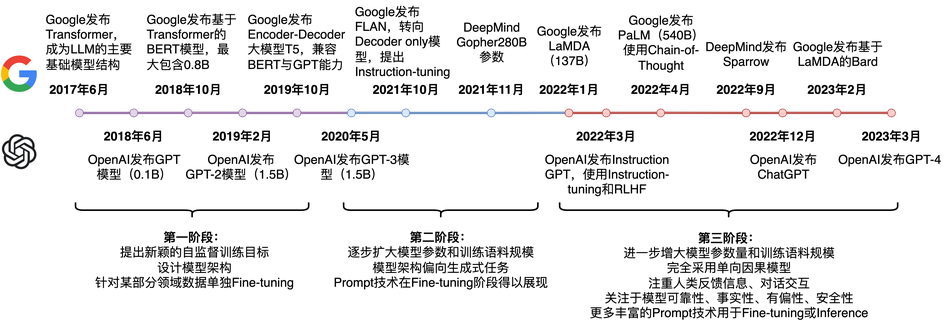

# 大语言模型调优

## 1 Prompt Learning(提示学习)介绍

众所周知，数据标注很大程度上决定了AI算法上限，并且成本非常高，无论是对比学习还是提示学习都着重解决少样本学习而提出，甚至在没有标注数据的情况下，也能让模型表现比较好的效果。

### 1.1 NLP的训练范式有哪些

目前学术界一般将NLP任务的发展分为四个阶段即NLP四范式：

1. 第一范式：**基于传统机器学习模型的范式**，如 tf-idf 特征+朴素贝叶斯等机器算法；
2. 第二范式：**基于深度学习模型的范式**，如 word2vec 特征 + LSTM 等深度学习算法，相比于第一范式，模型准确有所提高，特征工程的工作也有所减少；
3. 第三范式：**基于预训练模型 + finetuning的范式**，如 BERT + finetuning 的NLP任务，相比于第二范式，模型准确度显著提高，但是模型也随之变得更大，但小数据集就可训练出好模型；
4. 第四范式：**基于预训练模型 + Prompt + 预测的范式**，如 BERT + Prompt 的范式相比于第三范式，模型训练所需的训练数据显著减少。

在整个NLP领域，你会发现整个发展是朝着精度更高、少监督，甚至无监督的方向发展的，而 Prompt Learning 是目前学术界向这个方向进军最新也是最火的研究成果。

### 1.2  为什么需要提示学习

从它的上一个范式来说起，就是预训练模型 PLM + finetuning范式 常用的是 BERT+ finetuning：

这一范式的特点是：先在大的无监督数据集上进行预训练，学习到一些通用的语法和语义特征，然后利用预训练好的模型在下游任务的特定数据集上进行fine-tuning，使模型更适应下游任务。GPT、Bert等模型都属于第三范式，其特点是不需要大量的有监督下游任务数据，模型主要在大型无监督数据上训练，只需要少量下游任务数据来微调少量网络层即可。
问题和缺陷： 需要较多的数据来适应新的形式，需要将预训练模型从最初的预训练能力（学习惯性）扭转到全新的下游任务上，所以会丧失预训练模型上已经学习到的能力。因此在微调模型上少样本学习能力差/容易过拟合；预训练模型参数数量极大，为了一个特定任务去fine-tuning一个模型，然后去部署，会造成部署资源的极大浪费

1.  零样本/少样本学习能力差

2.  模型专用性导致成本高昂的大规模预训练模型，无法通用到不同任务。

所以针对这么缺陷，我们希望能有一个范式可以利用预训练模型学习到的知识(和预训练模型的训练形式大致相关)，且做到部分通用性，finetuning的部分减少。

### 1.3 什么是提示学习

首先我们应该有的**共识**是：预训练模型中存在大量知识；预训练模型本身具有少样本学习能力

GPT-3提出的 In-Context Learning，有效证明了在零样本、少样本场景下，模型不需要更新任何参数，能够实现不错的效果。

**Prompt Learning 的本质：**将所有下游任务统一成预训练任务；**以特定的模板，将下游任务的数据转成自然语言形式**，充分挖掘预训练模型本身的能力。

就是设计一个比较契合上游预训练任务的模板，通过模板的设计挖掘出上游预训练模型的潜力，让上游的预训练模型在尽量不需要标注数据的情况下比较好的完成下游的任务，关键包括3个步骤：

1.  设计预训练语言模型的任务
2.  设计输入模板样式(Prompt Engineering)
3.  设计label 样式 及模型的输出映射到label 的方式(Answer Engineering)

**举个例子：**

以电影评论情感分类任务为例，模型需要根据输入的句子做二分类模型:

 原始输入:特效非常炫酷，我很喜欢。

 根据预训练模型构造Prompt输入：特效非常炫酷，我很喜欢。这是一部[MASK]电影

 PLM模型会将mask预测为词表中的各个词的概率。

预训练模型的词表数量很大，我们有时候不需要关注那么多词。比如在这个例子中我们可能只需要关注mask预测出来的是“好"还是”坏“(关注对分类有效的词，可以是多个词)。

所以引入了类别映射(Verbalizer)的概念。类别映射就是将我们所关注的词映射为二分类问题中的两个类别[“好”--“positive”，“坏”—“negative”]；

**提示模板Prompt的作用**在于：将训练数据组装成自然语言的形式，并在合适位置[mask]，以激发预训练模型的能力。

**类别映射/Verbalizer**：选择合适的预测词，并将这些词对应到不同的类别

## 2 大模型训练中的 Prompt-Tuning

Prompt-Tuning自从GPT-3被提出以来，从传统的离散、连续的Prompt的构建、走向面向超大规模模型的In-Context Learning、Instruction-tuning和Chain-of-Thought。

简单的来说，Prompt-Tuning的动机旨在解决目前传统Fine-tuning的两个痛点问题：

-  **降低语义差异（Bridge the gap between Pre-training and Fine-tuning）** ：预训练任务主要以Masked Language Modeling（MLM）为主，而下游任务则重新引入新的训练参数，因此两个阶段的目标通常有较大差异。因此需要解决如何缩小Pre-training和Fine-tuning两个阶段目标差距过大的问题；
-  **避免过拟合（Overfitting of the head）** ：由于在Fine-tuning阶段需要新引入额外的参数以适配相应的任务需要，因此在样本数量有限的情况容易发生过拟合，降低了模型的泛化能力。因此需要面对预训练语言模型的过拟合问题。

### 2.1 预训练语言模型

现如今常用的语言模型大多数是BERT及其变体，它的主体结构Transformer模型。之所以选择Transformer，是因为 **其完全以Attention作为计算推理技术** ，任意的两个token均可以两两交互，使得推理完全可以由矩阵乘机来替代，实现了 **可并行化计算** ，因此Transformer也可以认为是一个全连接图， **缓解了序列数据普遍存在的长距离依赖和梯度消失等缺陷** 。

#### 2.1.1 经典预训练语言任务 Masked Language Modeling（MLM）

#### 

MLM是一种自监督的训练方法，其先从大规模的无监督语料上通过固定的替换策略获得自监督语料，设计预训练的目标来训练模型，具体的可以描述为：

- 替换策略：在所有语料中，随机抽取15%的文本。被选中的文本中，则有80%的文本中，随机挑选一个token并替换为 `[mask]`，10%的文本中则随机挑选一个token替换为其他token，10%的文本中保持不变。
- 训练目标：当模型遇见 `[mask]` token时，则根据学习得到的上下文语义去预测该位置可能的词，因此，训练的目标是对整个词表上的分类任务，可以使用交叉信息熵作为目标函数。

以BERT为例，首先喂入一个文本`It is very cold today, we need to wear more clothes.` ，然后随机mask掉一个token，并结合一些特殊标记得到：`[cls] It is very cold today, we need to [mask] more clothes. [sep]` ，喂入到多层的Transformer结构中，则可以得到最后一层每个token的隐状态向量。

#### 2.1.2 Task-specific Fine-tuning

获得了预训练的语言模型后，在面对具体的下游任务时，则需要进行微调。通常微调的任务目标取决于下游任务的性质。

- **Single-text Classification（单句分类）** ：常见的单句分类任务有短文本分类、长文本分类、意图识别、情感分析、关系抽取等。给定一个文本，喂入多层Transformer模型中，获得最后一层的隐状态向量后，再输入到新添加的分类器MLP中进行分类。在Fine-tuning阶段，则通过交叉信息熵损失函数训练分类器；

- **Sentence-pair Classification（句子匹配/成对分类）** ：常见的匹配类型任务有语义推理、语义蕴含、文本匹配与检索等。给定两个文本，用于判断其是否存在匹配关系。此时将两个文本拼接后喂入模型中，训练策略则与Single-text Classification一样；

- **Span Text Prediction（区间预测）** ：常见的任务类型有抽取式阅读理解、实体抽取、抽取式摘要等。给定一个passage和query，根据query寻找passage中可靠的字序列作为预测答案。通常该类任务需要模型预测区间的起始位置，因此在Transformer头部添加两个分类器以预测两个位置。

- **Single-token Classification（字符分类）** ：此类涵盖序列标注、完形填空、拼写检测等任务。获得给定文本的隐状态向量后，喂入MLP中，获得每个token对应的预测结果，并采用交叉熵进行训练

- **Text Generation（文本生成）** ：文本生成任务常用于生成式摘要、机器翻译、问答等。通常选择单向的预训练语言模型实现文本的自回归生成，当然也有部分研究探索非自回归的双向Transformer进行文本生成任务。BART等模型则结合单向和双向实现生成任务。

这几类任务基本可以涵盖现有的自然语言处理场景中，而这五类任务在Fine-tuning阶段几乎都涉及 **在模型头部引入新参数** 的情况，且都存在 **小样本场景过拟合** 的问题，因此Prompt-Tuning的引入非常关键。

### 2.2 Prompt-Tuning的定义

**Prompt的目的是将Fine-tuning的下游任务目标转换为Pre-training的任务**

依然以二分类的情感分析作为例子，描述Prompt-tuning的工作原理。给定一个句子`[CLS] I like the Disney films very much. [SEP]` 传统的Fine-tuning方法是将其通过BERT的Transformer获得 `[CLS]`表征之后再喂入新增加的MLP分类器进行二分类，预测该句子是积极的（positive）还是消极的（negative），因此需要一定量的训练数据来训练。

而Prompt-Tuning则执行如下步骤：

-  **构建模板（Template Construction）** ：通过人工定义、自动搜索、文本生成等方法，生成与给定句子相关的一个含有`[MASK]`标记的模板。例如`It was [MASK].`，并拼接到原始的文本中，获得Prompt-Tuning的输入：`[CLS] I like the Disney films very much. [SEP] It was [MASK]. [SEP]`。将其喂入BERT模型中，并复用预训练好的MLM分类器，即可直接得到`[MASK]`预测的各个token的概率分布；
-  **标签词映射（Label Word Verbalizer）** ：因为`[MASK]`部分我们只对部分词感兴趣，因此需要建立一个映射关系。例如如果`[MASK]`预测的词是“great”，则认为是positive类，如果是“terrible”，则认为是negative类。

-  **训练** ：根据映射，则可以获得指定label word的预测概率分布，并采用交叉信息熵进行训练。此时因为只对预训练好的MLM head进行微调，所以避免了过拟合问题

[测试演示](https://huggingface.co/roberta-base?text=I+love+study.+It+was+%3Cmask%3E)

### 2.3 Prompt-Tuning的研究进展

#### 2.3.1 Prompt-Tuning的鼻祖——GPT-3与PET

Prompt-Tuning起源于GPT-3的提出《Language Models are Few-Shot Learners》（NIPS2020），其认为超大规模的模型只要配合好合适的模板就可以极大化地发挥其推理和理解能力。

其开创性提出 **in-context learning** 概念，即无须修改模型即可实现few-shot/zero-shot learning。同时引入了demonstrate learning，即让模型知道与标签相似的语义描述，提升推理能力。

-  **In-context Learning** ：是Prompt的前身。其通过从训练集中挑选一些样本作为任务的提示提示（Natural Language Prompt），来实现免参数更新的模型预测；
-  **Demonstration Learning** ：添加一些新的文本作为提示。例如在对“I like the Disney film. It was [MASK]”进行情感分析时，可以拼接一些相似场景的ground-truth文本“I like the book, it was great.”、“The music is boring. It is terrible for  me.”等。此时模型在根据新添加的两个样例句子就可以“照葫芦画瓢”式地预测结果了。

不过以GPT-3为首的这类方法有一个明显的缺陷是—— **其建立在超大规模的预训练语言模型上** ，此时的模型参数数量通常超过100亿， **在真实场景中很难应用** ，因此众多研究者开始探索GPT-3的这套思路在小规模的语言模型（BERT）上还是否适用？事实上，这套方法在小规模的语言模型上是可行的，但是需要注意几点：

- 模型参数规模小了，Prompt直接用在Zero-shot上效果会下降，因此需要考虑将in-context learning和demonstrate learning应用在Fine-tuning阶段；
- GPT-3中提供的提示（Natural Language Prompt）过于简单，需要单独设计一套组件实现。

因此，大名鼎鼎的PET模型问世

**PET（Pattern-Exploiting Training）**出自《Exploiting Cloze Questions for Few Shot Text Classification and Natural Language  Inference》（EACL2021），根据论文题目则可以猜出，Prompt-Tuning启发于文本分类任务，并且试图将所有的分类任务转换为与MLM一致的完形填空。

PET详细地设计了Prompt-Tuning的重要组件——Pattern-Verbalizer-Pair（PVP），并描述了Prompt-tuning如何实现Few-shot/Zero-shot Learning，如何应用在全监督和半监督场景（iPET）。PET的详细讲解可参考PET的论文解读

PET设计了两个很重要的组件：

-  **Pattern（Template）** ：记作  ，即上文提到的Template，其为额外添加的带有`[mask]`标记的短文本，通常一个样本只有一个Pattern（因为我们希望只有1个让模型预测的`[mask]`标记）。上文也提到，不同的任务、不同的样本可能会有其更加合适的pattern，因此 **如何构建合适的pattern是Prompt-Tuning的研究点之一** ；
-  **Verbalizer** ：记作  ，即标签词的映射，对于具体的分类任务，需要选择指定的标签词（label word）。例如情感分析中，我们期望Verbalizer可能是 ，  （positive和negative是类标签）。同样，不同的任务有其相应的label  word，但需要注意的是，Verbalizer的构建需要取决于对应的Pattern。因此 **如何构建Verbalizer是另一个研究挑战** 。

上述两个组件被称为Pattern-Verbalizer-Pair（PVP），一般记作 ，在后续的大多数研究中均采用这种PVP组件。

另外，PET提供了简单的集成思路，即集成多个PVP组件。

- **Patterns Ensembling** ：同一个句子设计多个不同的pattern，例如`It was [mask].`，`I think it is [mask].`，`This comment denotes as [mask].` 等，此时，原先只有一个句子，却可以生成多个不同的样本，也变相起到数据增强的作用。在训练时，可以当作单独的样本进行训练，推理时，则可以对所有Pattern的结果进行投票或加权。

- **Verbalizers Ensembling** ：同样，在给定的某个Pattern下，并非只有1个词可以作为label  word。例如positive类，则可以选择“great”、“nice”、“wonderful”。当模型预测出这三个词时，均可以判定为positive类。在训练和推理时，可以对所有label word的预测概率进行加权或投票处理，并最后获得概率最大的类

- **PVPs Ensembling（Prompt Ensembling）** ：Pattern和Verbalizer均进行集成，此时同一个句子有多个Pattern，每个Pattern又对应多个label word。如下图所示（以2个PVP集成为例），在训练时可以采用加权，在推理时可以采用加权或投票法

PET主要包括三个步骤：

- 对于每个pattern，分别使用一个语言模型（PLM）在小规模的数据集上进行微调；
- 集成所有的语言模型并为unlabeled数据集上进行标注，标注结果为soft-label（即每个label的概率分布）；
- 使用带有soft-label的数据，使用标准的classifier进行分类。

**总结：**PET提供Prompt-Tuning比较成熟的框架——PVP，基于这套框架，目前的研究开始关注 **如何选择或构建合适的Pattern和Verbalizer** 。一种简单的方法是根据特定任务的性质和先验知识人工设计模板。例如上文例子中通常会选择`It was [mask].` 作为情感分析类的模板。人工构建方法虽然直观简单，但是致命问题也很突出。有相关工作在实验中发现，在同样的数据集和训练条件下， **选择不同的Pattern和Verbalizer会产生差异很大的结果** .

#### 2.3.2 如何挑选合适的Pattern

几种成熟的Pattern（Template）构建方法

-  **人工构建（Manual Template）** ：在前文已经描述过，不再详细说明；
-  **启发式法（Heuristic-based Template）** ：通过规则、启发式搜索等方法构建合适的模板；
-  **生成（Generation）** ：根据给定的任务训练数据（通常是小样本场景），生成出合适的模板；
-  **词向量微调（Word Embedding）** ：显式地定义离散字符的模板，但在训练时这些模板字符的词向量参与梯度下降，初始定义的离散字符用于作为向量的初始化；
-  **伪标记（Pseudo Token）** ：不显式地定义离散的模板，而是将模板作为可训练的参数；

前面3种也被称为 **离散的模板构建** 法（记作 **Hard Template** 、 **Hard Prompt** 、 **Discrete Template** 、 **Discrete Prompt** ），其旨在直接与原始文本拼接显式离散的字符，且在训练中 **始终保持不变** 。这里的保持不变是指 **这些离散字符的词向量（Word Embedding）在训练过程中保持固定** 。通常情况下， **离散法不需要引入任何参数** 。

后面2种则被称为 **连续的模板构建** 法（记作 **Soft Template** 、 **Soft Prompt** 、 **Continuous Template** 、 **Continuous Prompt** ），其旨在让模型在训练过程中根据具体的上下文语义和任务目标对模板参数进行连续可调。这套方案的动机则是认为离散不变的模板无法参与模型的训练环节，容易陷入局部最优，而如果将模板变为可训练的参数，那么不同的样本都可以在连续的向量空间中寻找合适的伪标记，同时也增加模型的泛化能力。因此， **连续法需要引入少量的参数并让模型在训练时进行参数更新** 。

## 3 面向超大规模模型的Prompt-Tuning

Prompt-Tuning发展的两年来，有诸多工作发现，对于超过10亿参数量的模型来说，Prompt-Tuning所带来的增益远远高于标准的Fine-tuning，小样本甚至是零样本的性能也能够极大地被激发出来，得益于这些模型的 **参数量足够大** ，训练过程中使用了 **足够多的语料** ，同时设计的 **预训练任务足够有效** 

几个面向超大规模的Prompt-Tuning方法，分别为：

-  **上下文学习 In-Context Learning（ICL）** ：直接挑选少量的训练样本作为该任务的提示；
-  **指令学习 Instruction-tuning** ：构建任务指令集，促使模型根据任务指令做出反馈；
-  **思维链 Chain-of-Thought（CoT）** ：给予或激发模型具有推理和解释的信息，通过线性链式的模式指导模型生成合理的结果。

### 3.1 上下文学习 In-Context Learning（ICL）

In-Context learning（ICL）最早在GPT-3中提出， **旨在从训练集中挑选少量的标注样本，设计任务相关的指令形成提示模板，用于指导测试样本生成相应的结果** 。

**ICL的工作原理:**挑选了K = 3个训练样本作为Demonstration（黄色部分），指令模板则是换行符“\n”，旨在区分样本的句子和标签。在预测时，不断地更换测试样本（绿色部分），并在末尾留出空间让模型生成。

ICL在预测过程中，存在 **方差大** 、 **不稳定** 的问题.

### 3.2 Instruction-tuning（指令调优）

Instruction-Tuning 是一种通过给定指令或指导来训练模型，使其按照给定的指导执行特定的任务。这种技术通常结合了强化学习的方法，通过奖励模型正确执行指导的任务，从而优化生成的结果。Instruction-Tuning 可以用于执行复杂的任务，如编程、游戏策略等。

**Instruction-tuning、Fine-tuning、Prompt-Tuning的区别:**

- Fine-tuning：先在大规模语料上进行预训练，然后再在某个下游任务上进行微调；
- Prompt-tuning：先选择某个通用的大规模预训练模型，然后为具体的任务生成一个prompt模板以适应大模型进行微调，如GPT-3；
- Instruction-tuning：仍然在预训练语言模型的基础上，先在多个已知任务上进行微调（通过自然语言的形式），然后再推理某个新任务上进行zero-shot。

**举个例子：**

有两个任务的描述如下：

1. 带女朋友去了一家餐厅，她吃的很开心，这家餐厅太__了！

2. 判断这句话的情感：带女朋友去了一家餐厅，她吃的很开心。选项：A=好，B=一般，C=差

**Prompt就是第一种模式，Instruction就是第二种。**

Instruction Tuning和Prompt的核心一样，就是去发掘语言模型本身具备的知识。而他们的不同点就在于，Prompt是去激发语言模型的**补全能力**，比如给出上半句生成下半句、或者做完形填空；而Instruction Tuning则是激发语言模型的**理解能力**，通过给出更明显的指令/指示，让模型去理解并做出正确的action。

假设是一个Question Generation任务，那么可以为这个任务定义一些指令，例如：

- Title：任务的名称；
- Definition：任务的定义，说明这个任务的本质和目的；
- Things to avoid：说明这个任务的注意事项，例如需要避免什么等等；
- Positive / Negative Examples：给出正确和错误的例子，作为提示；
- Prompt：当前任务的提示信息；

 

​    当许多任务都按照这种模式定义好模板，让模型在指令化后的数据上进行微调，模型将可以学会如何看到指令做预测。包括FLAN、LaMDA和InstructionGPT，它们都是遵循Instruction-tuning实现统一范式。

#### 3.2.1 FLAN

在62个任务上进行多任务训练，每个任务都设计了Instruction，最后得到137B的大模型

#### 3.2.2 LaMDA

谷歌提出的LaMDA模型，其完全采用自回归生成式模型，并在大量的对话语料上进行预训练，得到137B的大模型。与ChatGPT类似的Bard大模型则是基于LaMDA微调的模型。

为了提高模型的安全性和事实性，LaMDA涉及到两个微调策略：

- 一个是通过人工标注形式标注一些存在安全隐患的数据。
- 另一种微调策略则是引入互联网搜索机制，提高模型生成结果的事实性

#### 3.2.3 InstructionGPT

另一个典型的例子是OpenAI的InstructionGPT，其主要流程如下：

- **Step1** ：先采样一些demonstration数据，其包括prompt和labeled answer。基于这些标注的数据，对GPT-3进行fine-tuning，得到SFT（Supervised Fine-tuning）；

- **Step2** ：Fine-tuning完之后，再给一个prompt让SFT模型生成出若干结果（可以通过beam  search等方法），例如生成ABCD四种结果，通过人工为其排序，例如D>C>A=B，可以得到标注的排序pair；基于标注的排序结果，训练一个Reward Model；

- **Step3** ：继续用生成出来的结果训练SFT，并通过强化学习的PPO方法，最大化SFT生成出排序靠前的answer

### 3.3 Chain-of-Thought（思维链）

思维链在2022年初由谷歌团队提出，其旨在进一步提高超大规模模型在一些复杂任务上的推理能力。其认为现有的超大规模语言模型可能存在下面潜在的问题：

- 增大模型参数规模对于一些具有挑战的任务（例如算术、常识推理和符号推理）的效果并未证明有效；
- 期望探索如何对大模型进行推理的简单方法

直观理解很简单，思维链是一种特殊的In-Context Learning，对于每个挑选的In-Context  Example，除了给出Input-Output Mapping外，还需要给出一个推理过程，称为Relationale或Reasoning  Path，其是一个具有逻辑推理过程的短文本。

通过引入推理路径作为提示，可以激发大模型按照这种推理的模式生成出合理的结果，引导大模型如何思考、如何推理

**举个例子：**

更多例子：

## 参考资料

[Prompt-Tuning——深度解读一种新的微调范式](https://wjn1996.blog.csdn.net/article/details/120607050#t24)

[Instruction Tuning｜谷歌Quoc V.Le团队提出精调新范式！香过Prompt！](https://zhuanlan.zhihu.com/p/411273785)

[Instruction Tuning（FLAN、instructGPT、chatGPT）](https://blog.csdn.net/qq_39388410/article/details/128265846)

[Tuning系列论文笔记](https://zhuanlan.zhihu.com/p/600119509)

[大模型思维链（Chain-of-Thought）技术原理](https://zhuanlan.zhihu.com/p/629087587?utm_id=0)

[解读 PET：Exploiting Cloze Questions for Few Shot Text Classification and Natural Language Inference](https://zhuanlan.zhihu.com/p/495711245)

**论文：**

[BERT: Pre-training of Deep Bidirectional Transformers for Language Understanding](https://arxiv.org/pdf/1810.04805.pdf)

[Chain-of-Thought Prompting Elicits Reasoning in Large Language Models](https://arxiv.org/pdf/2201.11903.pdf)

[Exploiting Cloze Questions for Few Shot Text Classification and Natural Language Inference](https://aclanthology.org/2021.eacl-main.20.pdf)

[A Survey of Large Language Models](./LLM综述.pdf)