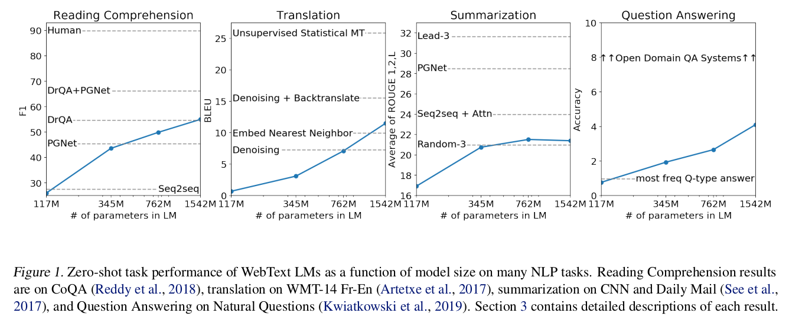

# Generative Pre-Training (GPT)

# 1 背景

## 1.1 语言模型

在自然语言处理领域，语言模型是指用于对自然语言序列进行建模和生成的统计模型。语言模型旨在估计一个给定上下文的条件概率分布，即给定前面的词或字符序列，预测下一个词或字符的概率。

语言模型可以用于多种任务，例如：

1. 语言生成：给定一个上下文，语言模型可以用来生成连贯、合乎语法的句子或文本段落。
2. 机器翻译：语言模型在机器翻译任务中扮演重要角色，可以用来生成目标语言的翻译结果。
3. 文本摘要：语言模型可以生成简洁、概括性的文本摘要，提取关键信息。
4. 对话系统：语言模型可用于生成自然的对话回应，使得对话系统能够与用户进行交互。

语言模型的训练可以基于统计方法（如n-gram模型）或基于神经网络的方法（如循环神经网络、Transformer等）。近年来，由于神经网络模型的引入，如GPT（Generative Pre-trained Transformer）模型，语言模型在自然语言处理领域取得了显著的进展。

总而言之，语言模型是一种用于对自然语言序列建模的统计模型，可以用于生成文本、机器翻译、文本摘要、对话系统等任务。它在自然语言处理中具有广泛的应用。 

## 1.2 发展历程

# 2.GPT-1 Semi-supervised

## **2.1 背景**

在自然语言理解中有很多不一样的任务，有大量的无标号数据，但是有标号的数据是很少的，如果在仅有的有标号数据中训练出分辨模型的话会很困难，**解决方法是：**先在**没有标号的数据**上面训练一个预训练模型，再在**少量标号数据**上面训练一个**分辨的微调模型，**以上的方法八、九年前在cv领域已经很流行，但是在nlp领域一直没有火起来，因为nlp领域没有像imagenet那样大规模（一百万）标好的数据，直到gpt和bert的出现才打开了局面，因为它们是使用的无标号的数据做的预训练。

**困难：**1、**不知道用什么样的优化目标函数？**因为不同的任务目标函数设定是不一样的，没有一种通用的效果好的目标函数。2、**怎么有效的把学习到的文本表示传递到下游的子任务中？**因为nlp下游子任务差别较大，没有一种有效的表示可以一致的迁移到所有子任务上面。

## **2.2 方法**

GPT提出了一种半监督**（有一些标号的数据，但是有大量无标号的数据，我们如何把那些没有标号的数据用过来）**的方法（现在大家把gpt和bert这种方法叫做自监督而不是半监督），先在无标号大数据集上面训练一个语言模型，再在有标号子任务上面进行微调。**

**模型：****使用transformer架构，相对于rnn，使用**transformer学习到的特征更加稳健——transformer里面又更结构化的记忆可以处理更长的文本信息，从而可以抽取出更好的句子层面和段落层面的语义信息。在做迁移学习的时候使用的是一个任务相关的输入表示，在做微调的时候选用了两个训练的目标函数。

1. 怎么在无标号数据上面预训练大模型
2. 怎么做模型微调
3. 怎么根据任务的不同改变下游输入

**(1).怎么在无标号数据上面预训练大模型**

里面使用了语言模型预测下一个次的词的出现概率，使用log作为相加作为模型的**L1loss**，使用**transformer的解码器**（因为有掩码不能看到完整的句子信息），其中使用了position embedding引入了位置信息。   

条件概率P使用参数为Θ的神经网络进行预测 GPT和bert区别在于GPT是预测下一个词，bert是做完形填空，所以GPT的任务要比bert要难很多。

**(2).怎么做模型微调**

微调时使用的是带有标号的数据集，每次输入长度为m的一条序列x，这条序列有一个标号y。模型根据输入的序列x预测其标号y（标准分类任务）。

虽然在微调时只关注分类精度，但是如果将之前的语言模型的loss放进来效果也不错，所以在做微调时有**两个目标函数**：第一个是给一些序列预测序列的下一个词（**L1**），第二个是给一些完整序列预测这些序列的标号（**L2**）。两个目标函数一起训练是最佳的，通过lambda作为L1的权重（是一个**超参数**，可以调整），将两个目标函数加和作为微调阶段的目标函数。

接下来要考虑的是如何将nlp下游的子任务表示成我们想要的形式，即一些序列和其相应的标号。

**(3).怎么根据任务的不同改变下游输入。**

如下图所示，其中**start（起始）、delim （分割）和 extract（终止）是特殊字符，**文本中不会出现的字符。

**不管输入输出是什么，transformer不会变。**

**对于分类任务（classification），**输出是分类类别。

**对于蕴含任务（entailment），**输出是是与否，是否蕴含这个关系。

**对于相似性任务，**因为相似是一个对称关系，text1和text2相似就相当于text2和text1相似，但是语言模型是有顺序的，所以做了两种拼接，最后输出是二分类，相似或不相似。

**对于多选题，**问一个问题给出几个答案选出认为正确的问题，输出的是每个答案对于这个问题是正确答案的置信度。

**实验部分：**GPT用的两层transformer，hz=768；BERT（base）12层transformer，hz=768。

BERT数据集使用了数据量大概是GPT的四倍，参数量是gpt的三倍左右。

# 3.GPT-2 Zero-Shot

## 3.1 背景

Q：但是当文本数据集增大，模型参数量增大的基础上，模型的优势没有那么高的情况下应该怎么办？

A：找到另一个卖点（另辟蹊径）——zero shot

现在主流是对于一个任务收集一个数据集，在上面训练模型做预测。——现在的模型泛化性不是很好，在一个数据集一个应用上训练好的模型很难直接用到下一个任务上面。有人做**多任务学习**，在训练一个模型时使用多个数据集，并且使用多个损失函数，使得一个模型可以应用在多个任务上面。但是多任务模型在nlp任务中应用不多，nlp中主流还是**bert和gpt1**——**但是对于下游任务还是要重新训练模型，并且还要收集带标号的数据，导致拓展到新的任务上还是有一定时间成本的。**

**GPT2虽然还是在做语言模型，但是下游任务使用了一个叫做zero-shot的设定，即做下游任务时不需要下游任务的任何标注信息，也不需要训练模型——只要预训练一个大模型来预测子任务，这个预训练的大模型在任何地方都可以用！**

## 3.2 与GPT-1的区别

在**GPT1**时我们在构建下游任务输入时引入了**起始、截断和终止符**，这些模型在开始的预训练阶段时没有看到的，但是有微调的情况时，模型可以再学习到这些符号的意思。但是**GPT2**要做zero-shot时，在做下游任务时模型不能被调整了，再引入这些特殊字符时模型会感到很困惑，所以在构建下游任务输入时不能引入那些模型没见过的符号，而需要使下游任务的输入和之前预训练时模型看到的文本长得一样，输入形式应该更像一个自然语言。 

例如：在做**句子翻译**任务时，训练的句子可以被写为： (translate to french, english text, french text). 其中**translate to french在后文叫做prompt也叫做提示，相当于做了一个特殊的提示词。**

如果要做**阅读理解**任务时：可以写作(answer the question, document（阅读的文本）, question, answer)，**answer the question**相当于任务提示

这些构建提示词的方式是前人提出的，假设为如果训练的模型足够强大就可以理解这些提示词的意思，而且这种提示词在文本中也比较常见，模型可以理解。

如下图所示，随着模型的增大，训练效果是有提升的，虽然在一些任务上模型的表现不好，但是这种缺憾可以通过更大的数据量和更大的模型规模来弥补。 GPT-3

# 4.GPT-3 Few-Shot

## 4.1 背景

**GPT-3是一个自回归模型，有1759亿个可学习参数**（比现在非稀疏的模型大十倍——稀疏模型里面权重0的含量很多），**因为模型很大了，所以再在子任务上面做训练那么成本是很难的，所以GPT3在作用在子任务上面不做任何的梯度更新或者是微调，即使是在few-shot情况下GPT3也不是做微调，因为大模型如果算梯度是很难的事情，所以不做梯度更新。在nlp任务上相对于GPT2取得了很好的成绩。**

在做nlp任务使用大模型预训练时，需要在做下游子任务时使用子任务的数据集，并且进行微调，**但是有三个问题：**

**1、需要大量有标号的数据集。**

**2、样本没有出现在数据分布里面，大模型的泛化性不见得比小模型更好。微调效果好不能说明预训练模型泛化性好，因为可能是过拟合预训练的训练数据，这些训练数据与微调使用的数据刚好有一定的重合性。**

**3、人类不需要一个很大的数据集做任务，**

## **4.2 方法**

**meta-learning**（自己定义的，训练了一个很大的模型，泛化性还不错）**+ in-context learning**（在子任务时即使给了一些训练样本，但是不更新权重）在做不同任务时，因为模型输入的数据时多元化的，每个段落或者每个文章来源不同可能会教模型不同的东西，那么如果是在大量多样性的文章中做训练时，模型有在做元学习的过程，学习了大量的任务。 大力出奇迹。

## 4.3 评估

1、few-shot learning

每个子任务提供大概10~100个训练样本，

2、one-shot learning 

few-shot learning的特殊情况，每个任务只提供一个训练样本

3、zero-shot learning

一个样本都不告诉，直接执行任务

1750亿参数！给一些不多的样本，来提升模型性能。模型参数，大量提升，性能也特别好。微调里需要大量数据，一个比较厉害的人在学习新的任务时，不要太多样本。有告诉我们的样本，不需要进行梯度更新。

# 5.InstructGPT

## 5.1 背景

模型的行为，就真的取决于你文本收集的怎么样，文本其实挺大的，大概都是几十亿几百亿的这种词，给大家训练，所以你也不知道里面到底有什么东西，大概是我知道这些质量还不错，把它拿过来做一定的清洗，在精细度肯定就不够了，所以你对整个模型的控制上面，是比较弱的，反正就是大力出奇迹，反正数据拿过去，然后模型出来，结果是什么就是什么。

- 但这样子有很大的问题，第一个是有效性的问题，就是说我想让模型去干某个事情，但是模型死活学不会怎么办，因为你的文本里面没有这个东西。
- 第二个是安全性的问题，就是说模型输出一些，你不应该输出的东西怎么办，对大公司这是一个很大的灾难，我们等会再来讲。

## 5.2 方法

所以你最简单办法是怎么办，就标一点数据，就是我们 **标一点数据，再把语言模型，最后做一次微调**，这样子效果更好一点。InstructGPT 在GPT3 上微调，ChatGPT 在GPT3.5 上进行微调。

1. 首先它标的数据是这样子一个东西，首先它**找了一些人，来写了各种各样的问题，这个问题在 GPT 里面叫做 Prompt**，GPT-3的模型，在人类标注这些数据上，微调出来的模型，他把它叫做SFT，就是有监督的微调。
2. 上述模型也能用，但是它的一个问题是说，他写这个答案是一件很贵的事情，所以你很难让人把所有这种，各式各样的答案，都给你写出来，所以他干了第二个事情，他在标注上会更加简单一点。具体来讲，它是这样子的事情，就我还是给你一个问题，给我之前训练好的，这一个预训练模型，让你生成答案，我们知道 GPT 每一次，就预测一个词它的概率，你可以根据这个概率采样，采样出很多答案。这个地方，他生成了4个这样子的答案，进行排序标注，那么有了这些排序之后，他接下来训练一个模型，这个模型叫做 RM，在强化学习里面叫做奖励模型。这个模型干的事情是说，你给我你的  prompt，你给我你的输出，对它生成一个分数，你可认为它是一个奖励也好，或者是一个打分也好。
3. 第三步干的事情是，继续去微调前面训练好的 SFT，使得他生成的答案，能够尽量的得到一个比较高的一个分数，就是每一次我把它生成答案，然后放进 RM 里面打个分数，然后去优化它的参数，使得它生成答案，使得分数更高一些。

第一项：它本身一开始，它就初始化成它，所以这两个模型在一开始是一样的。更新这个东西，来最大化目标函数，所以目标函数，它这个 θ 就是可学习的。第 1  项，你的 XY 来自于当前这一个 RL 模型。X 我们知道是之前我们说，把 Prompt  的标出来之后，构建了三个数据集，这个就是第三个数据集，就是那里面有 31,000 个Prompt。然后对每一个  Prompt，我们丢进当前这个模型，是当前的 RL 的模型，产生一个 Y。产生了 Y 之后，我们要干嘛，我们要去把这个XY丢进，我们之前训练好的 RM  模型里面，然后算出它的分数，我们希望这个分数是最大的，就是说我们要优化这一项。优化这一项之后，这样子，我们新训练出来的模型，生成的这一个回复，是总是能够，是人类觉得排序比较高的那一个。

第二项：首先我们 Rθ 是怎么训练来的，是在第二个训练数据来的，就训练它的时候，你的 Y 是产生来自于，但是现在我们输入进去做推理的Y，是来自于 RL  的新的模型。所以当你这个模型，随着更新变得越来越跟之前不一样的情况下，那么你这个 Y 就放进去的  Y，和训练它用的Y的统计，可能会发生一些偏移，导致说它的估算会没那么准，因为你初始值是来自于它，就跟它不要跑太远。对吧，这个其实第二项就是干这个事情，就是说我希望 RL 的新模型，跟我们之前模型是做一些改动就行了，不要跑太远，当你很多办法干这个事情，具体来讲，它这里用的办法，这个项其实就是一个 KL散度。

第三项：假设你就用这个目标函数算的时候，有什么问题，就是说你可能把整个训练出来的模型，就真的只对这一个任务，就是对你生出来的Y，对人类的排序比较好，在这个任务上做比较好，做的就没那么好了，就可能会发生性能下降，所以在这个地方，就把原始的这一个目标函数，重新拿了回来。

# 参考文献

- [InstructGPT 论文精读](https://www.bilibili.com/video/BV1hd4y187CR/?spm_id_from=333.337.search-card.all.click&vd_source=6d9a3bf0aa736e90be2bf85ca031f921)

- [GPT，GPT-2，GPT-3 论文精读](https://www.bilibili.com/video/BV1AF411b7xQ/?spm_id_from=333.337.search-card.all.click&vd_source=6d9a3bf0aa736e90be2bf85ca031f921)

- [GPT: Improving Language Understanding by Generative Pre-Training.](./ref/Improving Language Understanding by Generative Pre-Training.pdf)

- GPT-2:Language Models are Unsupervised Multitask Learners.

- GPT-3: Language Models are Few-Shot Learners.

- InstructGPT :Training language models to follow instructions with human feedback. 

* [【NLP-14】GPT模型（Generative Pre-Training）](https://www.cnblogs.com/yifanrensheng/p/13167796.html)
* [GPT系列论文详解](https://blog.csdn.net/qq_52852138/article/details/127230465)
* GPT论文解读 https://zhuanlan.zhihu.com/p/625872003
