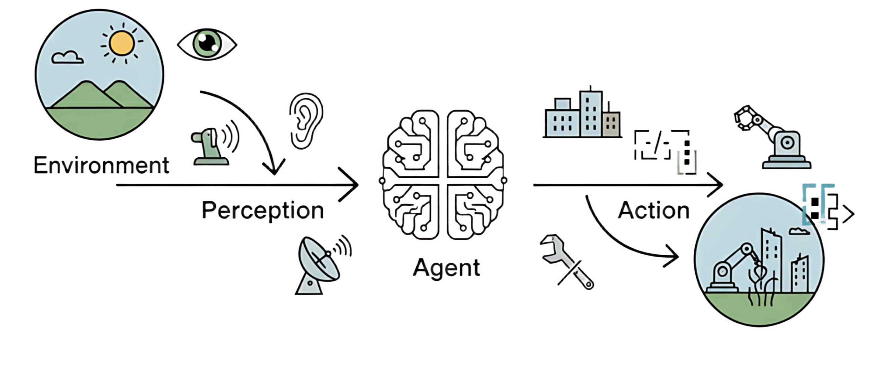

# Agent

欢迎来到智能体的世界！在人工智能浪潮席卷全球的今天，**智能体（Agent）**已成为驱动技术变革与应用创新的核心概念之一。无论你的志向是成为 AI 领域的研究者、工程师，还是希望深刻理解技术前沿的观察者，掌握智能体的本质，都将是你知识体系中不可或缺的一环。

## 什么是智能体？

在探索任何一个复杂概念时，我们最好从一个简洁的定义开始。在人工智能领域，智能体被定义为任何能够通过**传感器（Sensors）**感知其所处**环境（Environment）**，并**自主**地通过**执行器（Actuators）**采取**行动（Action）**以达成特定目标的实体。

这个定义包含了智能体存在的四个基本要素。环境是智能体所处的外部世界。对于自动驾驶汽车，环境是动态变化的道路交通；对于一个交易算法，环境则是瞬息万变的金融市场。智能体并非与环境隔离，它通过其传感器持续地感知环境状态。摄像头、麦克风、雷达或各类**应用程序编程接口（Application Programming Interface, API）**返回的数据流，都是其感知能力的延伸。

获取信息后，智能体需要采取行动来对环境施加影响，它通过执行器来改变环境的状态。执行器可以是物理设备（如机械臂、方向盘）或虚拟工具（如执行一段代码、调用一个服务）。

然而，真正赋予智能体"智能"的，是其**自主性（Autonomy）**。智能体并非只是被动响应外部刺激或严格执行预设指令的程序，它能够基于其感知和内部状态进行独立决策，以达成其设计目标。这种从感知到行动的闭环，构成了所有智能体行为的基础，如上图所示。

## References

### Course

* [Agentic AI](https://www.deeplearning.ai/courses/agentic-ai/)
* [从零开始的智能体原理与实践教程](https://github.com/datawhalechina/hello-agents)
* [《Agentic Design Patterns》中文翻译版](https://github.com/ginobefun/agentic-design-patterns-cn)

### Tutorial
* [从 Prompts 到 Context：深入解析 AI Agent 系统化设计新范式](https://mp.weixin.qq.com/s/CoUckS6VY0ZSA3yRKo-CdA)
  * [Effective context engineering for AI agents](https://www.anthropic.com/engineering/effective-context-engineering-for-ai-agents)
  * [How we built our multi-agent research system](https://www.anthropic.com/engineering/multi-agent-research-system)

* [Prompt engineering: overview and guide](https://cloud.google.com/discover/what-is-prompt-engineering)