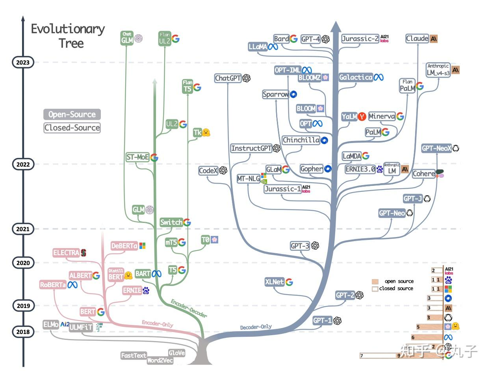

# 大语言模型

大规模语言模型（大语言模型或大型语言模型），英文名（Large Language Model,LLM）它的大体现在参数量上，量级至少在百万以上，匹配这种参数量，大量的训练数据以及大规模的计算资源自然是不可缺少的。再说说语言模型，网上有很多关于自然语言模型的发展历程，借鉴一个我觉得最合理的，大致分为四个阶段：统计语言模型、神经网络语言模型、预训练语言模型、大语言模型。

机器学习研究人员已经多年努力开发语言大模型（LLM），但早期大众并没有太关注，也没有意识到它们的强大能力。随着GPT的爆火，现在几乎每个人都听说过LLM，并有数千万人使用过它们，但真正了解其工作原理的人却很少。训练LLM就是用于“预测下一个词”，而且它们需要大量的文本来实现这一点。那么它们如何预测下一个词的细节如何？却不容易找到答案。

内容：
* [大模型基础](0_basic)
* [BERT](1_BERT)
* [GPT](2_GPT)
* [DeepSeek-V3， DeepSeek-R1](3_DeepSeek)
* [RAG](4_RAG)
* [CoT](5_CoT)
* [Agent](6_Agent)
* [Workflow](7_Workflow)

## 参考资料

### 图书
* [【大模型基础】](https://github.com/ZJU-LLMs/Foundations-of-LLMs)
* [【Hands-On Large Language Models】](https://github.com/HandsOnLLM/Hands-On-Large-Language-Models)

### 教程
* [Implementing a ChatGPT-like LLM in PyTorch from scratch, step by step](https://github.com/rasbt/LLMs-from-scratch)
* [一文读懂：大语言模型的实现与原理](https://zhuanlan.zhihu.com/p/669245797)
* [Course to get into Large Language Models (LLMs) with roadmaps and Colab notebooks.](https://github.com/mlabonne/llm-course)

### 视频教程
* [How large language models work, a visual intro to transformers | Chapter 5, Deep Learning](https://www.youtube.com/watch?v=wjZofJX0v4M)
* [LLM大模型教程](https://www.bilibili.com/video/BV1XS411w7qr)
* [54个大模型实战项目](https://www.bilibili.com/video/BV1kDpme9EwU)
* [从零开始学习大语言模型](https://www.bilibili.com/video/BV1v4421w7pU)
