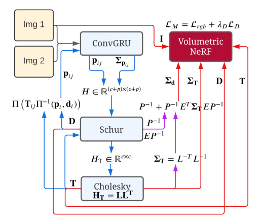
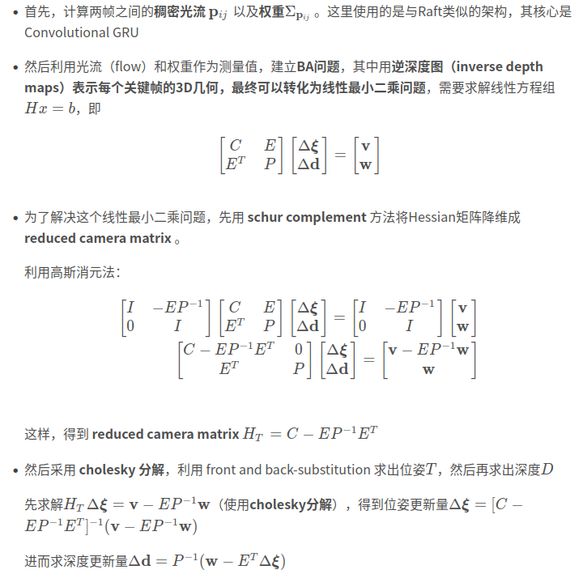
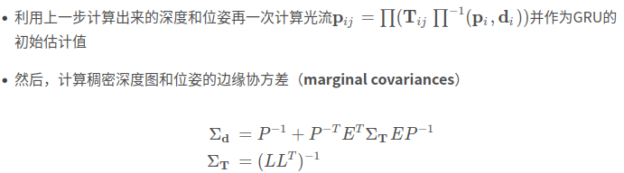
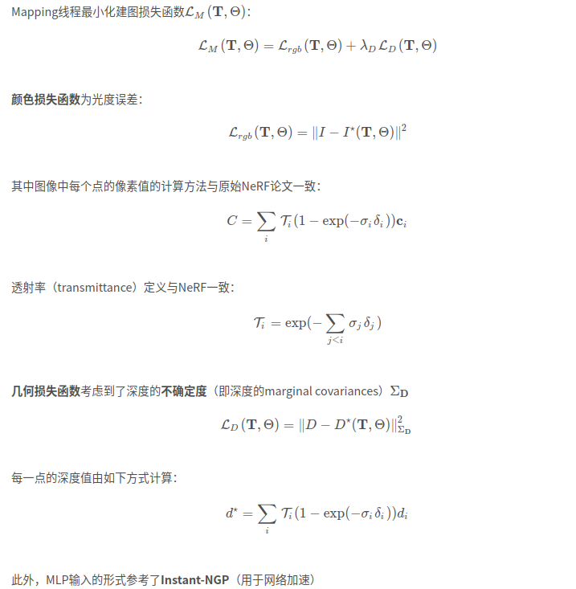

# NeRF-SLAM

> - 参考https://blog.csdn.net/weixin_42262385/article/details/127706162
>
> - code：https://github.com/ToniRV/NeRF-SLAM
> - video：https://www.youtube.com/watch?v=-6ufRJugcEU
> - Nice-SLAM

## Abstract

提出了一种新的几何和光度3D mapping pipeline，用于**从单目图像中精确和实时地重建场景**。为了实现这一点，我们利用了**密集单目SLAM**和**实时分层体积神经辐射场**的最新进展。我们的见解是，**密集单目SLAM通过提供精确的姿势估计和具有相关不确定性的深度图，提供了正确的信息来实时拟合场景的神经辐射场**。通过我们提出的基于不确定性的深度损失，我们不仅获得了良好的光度精度，而且获得了很高的几何精度。事实上，我们提出的mapping pipeline实现了比竞争方法更好的几何和光度精度（高出179%的PSNR和86%的L1深度），同时实时工作并仅使用单目图像。

## Introduction

- 深度学习的单目SLAM很多，但是随便拍就能重建的还是不可能
- NeRF好，但还存在渲染慢的问题。但是最新工作表示姿态信息不需要实时给出。
- 研究发现，NeRF会出现表面重影的现象，但如果添加深度的监督就可以改善并更快收敛。
- **拥有一个密集的单目SLAM管道，输出接近完美的姿态估计，再加上密集的深度图和不确定性估计，为实时构建场景的神经辐射场提供了正确的信息。**

## Related Work

- 总体而言，工作利用了最近在密集单目SLAM（Droid-SLAM [31]）、概率体积融合（Rosinol等人[23]）和基于哈希的分层体积辐射场（Instant-NGP [17]）方面的工作，以实时估计场景的几何和光度图，而无需深度图像或姿势。

- Rosinol等人 基于方差对深度估计值赋予权重，然后将它们融合到体素表征中，从而构建准确的场景表征（3D网格）。

  > Rosinol et al. [23] further show that dense monocular SLAM can reconstruct faithful 3D meshes of the scene by **weighting the depths** estimated in dense SLAM by their **marginal covariance**, and subsequently fusing them in a volumetric representation

  本文从上述工作中获得启发，用他们的方法来**计算深度和位姿不确定度**。但是将场景表征由 volumetric TSDF 换成了 hierarchical volumetric neural radiance field

  **Instant-NGP** 用了 基于哈希的层次化体素表征 hash-based hierarchical volumetric representation 来表征场景，实现实时的神经辐射场训练。

  **Droid-SLAM** 使用了SOTA的稠密光流估计架构（a state-of-the-art dense optical flow estimation architecture ）作为视觉里程计，同时，使用了降采样后的深度图来规避维度问题。

  > Droid-SLAM avoids the dimensionality problem by using downsampled depth maps that are subsequently upsampled using a learned upsampling operator

  本文用Droid-SLAM**作为前端**（**tracking frontend**），使用了其预训练的权重

## Method

本文算法包含**tracking**和mapping两个并行运行的线程，其中 tracking 作为前端，**使用稠密单目（dense monocular）SLAM估计稠密深度图（dense depth maps）和相机位姿**，同时会输出对深度和位姿的不确定度估计；**mapping 后端**使用前端的输出信息作为监督，训练一个**辐射场（radiance field）**，其损失函数是颜色误差（color loss）和带权重的深度误差（depth loss weighted by the depths’ marginal covariances），权重值由先前的不确定度得到。

### Tracking : Dense SLAM with Covariance

跟踪线程使用Driod-SLAM，由每个关键帧计算 dense depth maps 和位姿。

### Mapping: Probabilistic Volumetric NeRF

### Architecture
**Tracking 和 Mapping 线程间的交互**

仅当有新关键帧生成时，Tracking线程将新关键帧的位姿、RGB图、深度图以及深度的边缘协方差传递给Mapping线程

只有在Tracking线程滑动窗口内的信息会被传给Mapping
**关键帧的选取原则**

滑动窗口法中最多包含8个关键帧

当当前帧与先前关键帧之间的平均光流大于一定阈值时，会生成新的关键帧

## Limitation

内存占用很大

