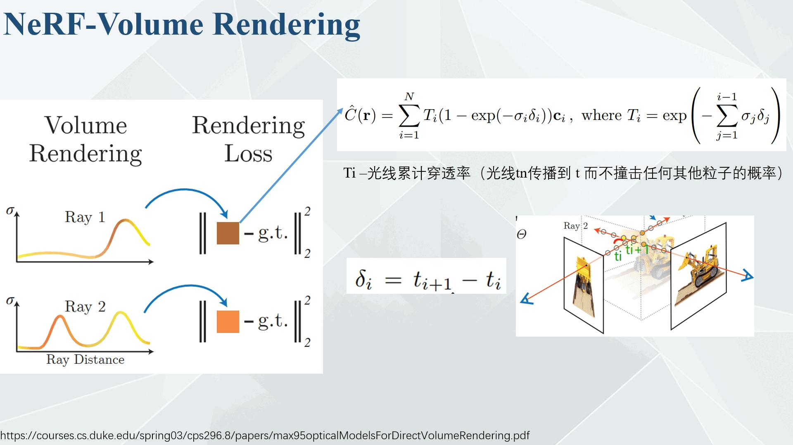
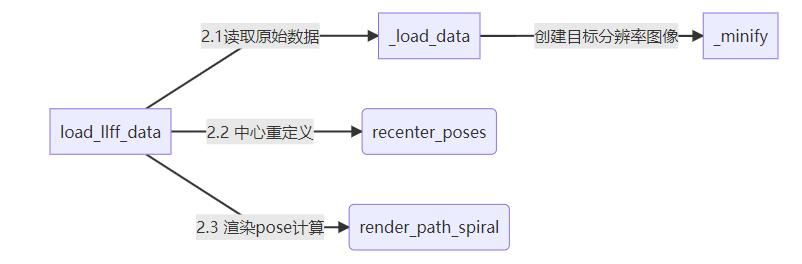

# NeRF（**神经辐射场**）

>  视频课程路径/home/a409/user/zhangyizhu/video/下

## 基础知识

### 什么是三维模型？

抽象来说，三维模型主要分为**形状（shape）**和**外观（appearance）**，外观又可以粗略分为**材质（material**）和**光照（lighting）**，在我们得到这些基础信息后，我们只需要经过一定的渲染算法，就能够得到图像。这个从模型到图像的正向过程我们就称之为**渲染（rendering）**，而从图像得到模型这个逆向过程，我们称为**反渲染（Inverse rendering）。**


那么显而易见，我们从模型到渲染的这一过程，我们是通过一个渲染方程来完成的，相当于我们将一系列的参数输入这个渲染方程，最终渲染出的图片就是我们得到的解。

但我们是否可以根据这个方程的解来反向推导出初始参数呢? 这就是NeRF要解决的问题，即从图像中得到模型的信息。我们先逐一介绍NeRF的表征方法。

### **形状的表示法**

主流的表示法有以下四种，即**网格**(Mesh)，**点云**（Point Cloud），**占据场**（Occupancy field），**有向距离场**（Signed distance field）。


当然，还有一些表示法，例如**体素(voxel)**，多视图等等。

- 三维shape的表征方式：

  - 显式表达

    

  - 隐式表达

    

- 隐式表达和显式表达 [参考:GAMES101-现代计算机图形学入门-闫令琪 哔哩哔哩_bilibili](https://www.bilibili.com/video/BV1X7411F744?p=10)

  

  - 隐式表达：

    告诉你3D点满足特定的关系，而不是告诉你点具体在哪。例如，3D球面上的任意一点都满足。只要找到所有的x,y,z满足F(x,y,z)=0，就能将图像画出来。

    

    **优点：**

    1. 通常表示出来很容易(例如用一个函数就能表示)
    2. 做某些查询容易(判断在物体里面还是外面,计算到表面的距离等)。给你一个点，判断在里面还是外面是很简单的。将点代入F(x,y,z)，如果小于零在里面，大于零在外面，等于零在面上。
    3. 很容易对光线与表面求交点
    4. 对于简单的物体们,用隐式的表示方法是很精确的,没有采样错误
    5. 易于处理拓扑结构(比如流体)
  
    **缺点：**
  
    很难去描述复杂的物体(比如给你一个奶牛去描述)。仅根据表达式F(x,y,z)很难直接看出来是什么样子，面上都有哪些点也不容易知道，面上采样起来比较困难(找到所有点)，下面例子有。
    
  - 显式表达
  
    3D点直接给出或通过参数映射的方式(例如:深度图投影得到3D点云)。可以方便看模型,很难判断点是否在模型上或模型内外。


NeRF使用的形状表征方式叫**soft shape**，即从一片什么都没有的三维空间中，通过图像的需要逐步的创建三维物体。NeRF是在一条Ray上分出许多点，如下图所示：


### **外观的表示法**

如下图所示，最常见的肯定还是**材质纹理贴图+环境光照**这种表示法，这种方法易于编辑修改，在渲染工作中用途十分广泛。但缺点是表示方法十分繁琐，不仅要对贴图进行映射，还分不同的表面对不同的光线进行求交。

然后就是辐射场（Radiance Field）或叫表面光场（Surface light  filed），这种方法给出每个表面点（x，y，z）处不同的观察角度（θ，φ）的颜色（r，g，b）。用这种方式可以很方便的描述物体表面的颜色，反射，和阴影等效果。但缺点是不易于修改和编辑。


**综合两种方式各自的优缺点，NeRF最终选择使用的是第二种表示方式。**

**渲染的表示法**：

因为NeRF的输入图片往往是真实的照片等等，因此我们主要需要了解到的渲染方法就是**光线追踪**（Ray tracing）了，这部分后面展开说。

## 1. NeRF简介

NeRF(Neural Radiance Fields)是2020年ECCV会议上的Best Paper，其将隐式表达推上了一个新的高度，仅用 2D 的 posed images 作为监督，即可表示复杂的三维场景。一石激起千层浪，自此之后NeRF迅速发展起来被应用到多个技术方向上例如新视点合成、三维重建等等,并取得非常好的效果，其影响力是十分巨大的。

### 1.1 什么是NeRF

NeRF即神经辐射场其**输入稀疏的多角度带pose的图像**训练得到一个神经辐射场模型，根据这个模型可以渲染出**任意视角下的清晰的照片**，如下图所示。也可以简要概括为用一个MLP神经网络去隐式地学习一个三维场景。


在这个过程中有一个非常重要的概念即Volume Rendering with Radiance Fields(辐射场体素渲染)，如下所示后面我们会在第三章节详细介绍。


### 1.2 NeRF应用简介

NeRF最先是应用在新视点合成方向，由于其超强的隐式表达三维信息的能力后续在三维重建方向迅速发展起来。接下来介绍下NeRF的几个主流应用方向。

1.2.1 新视点合成(View Synthesis)

https://www.matthewtancik.com/nerf

1.2.2 360°重建

https://jonbarron.info/mipnerf360/

1.2.3 大场景重建

http://waymo.com/research/block-nerf

1.2.4 人体重建

https://zhaofuq.github.io/humannerf/

1.2.5 3D风格迁移

比如已有的多视角图像通过学习一张水墨风格或油画风格，来风格迁移

https://www.youtube.com/watch?v=0Z8FYd8MV1k&list=PL6liSIqFR4BW3FTN5lpruLIVGqv3wMpMG&index=13

1.2.6 镜面反射场景重建

https://bennyguo.github.io/nerfren/

### 1.3 NeRF关于渲染

NeRF的本质其实是完成了图形学里面的3D渲染(Render)功能，3D信息的隐式表达。参考：Advances in Neural Rendering　https://arxiv.org/pdf/2111.05849.pdf

- 3D渲染

  将场景定义(包括摄像机、灯光、表面几何和材料)转换为模拟摄像机图像的过程称为渲染。 简单来说就是模拟相机的拍照过程，生成的结果是该视角下看到的一张照片。参考:State of the Art on Neural Renderinghttps://arxiv.org/pdf/2004.03805.pdf
  用照相机拍照是一个现实世界的物理过程，主要是光学过程，拍照对象是现实世界中真实的万事万物，形成照片的机制主要就是：光经过镜头，到达传感器，被记录下来。如下图所示:		

  传统的3D渲染方法是光栅化(rasterization)，光线追踪(ray tracing)。

  参考

  - [GAMES101 现代计算机图形学入门](https://sites.cs.ucsb.edu/~lingqi/teaching/games101.html)　

  - [参考理解渲染的两种方法：光栅化和光线追踪](https://blog.csdn.net/qq_37366618/article/details/121928355?ops_request_misc=%257B%2522request%255Fid%2522%253A%2522169131734516800211510768%2522%252C%2522scm%2522%253A%252220140713.130102334.pc%255Fall.%2522%257D&request_id=169131734516800211510768&biz_id=0&utm_medium=distribute.pc_search_result.none-task-blog-2~all~first_rank_ecpm_v1~rank_v31_ecpm-2-121928355-null-null.142^v92^chatsearchT0_1&utm_term=%E5%85%89%E6%A0%85%E5%8C%96%E5%A6%82%E4%BD%953d%E6%B8%B2%E6%9F%93&spm=1018.2226.3001.4187)

  - [光栅化和光线追踪](渲染.md)

  - **光栅化**

    简单理解为把直线、三角形连续的形状离散化的投影到屏幕上。光栅化的效果进步得益于渲染方程，即三维物体上每个顶点颜色的计算公式。

    

  - **光线追踪**
  
    https://zhuanlan.zhihu.com/p/618627358
  
    光线追踪就是追踪每条光线的传播行为，计算每条光线对我们人眼观察的贡献值，即颜色值。**我们要模拟的只需要模拟那些进入我们眼睛的光线**。
  
    得益于英伟达20系显卡RTX技术的推出后，将普及光线追踪实时应用变为可能。
  
    虚幻引擎5 https://www.unrealengine.com/zh-CN/unreal-engine-5


### 1.4 三维重建方法


## 2. 运行

使用的是[nerf-pytorch](https://github.com/yenchenlin/nerf-pytorch.git)，按照2.1进行安装配置

> 同时服务器上放在了/home/a409/user/zhangyizhu/Nerf下，可以直接来测试

### 2.1 安装使用

- pytorch版代码下载并配置环境

```bash
git clone https://github.com/yenchenlin/nerf-pytorch.git
cd nerf-pytorch
pip install -r requirements.txt
```

- 数据下载

```bash
bash download_example_data.sh
```

- 数据训练

```bash
python run_nerf.py --config configs/lego.txt   # 或者fern.txt
```

- 数据测试(训练好后仅渲染)

```bash
python run_nerf.py --config configs/lego.txt --render_only
```

### 2.2 服务器下一键使用

文件放在了**/home/a409/user/zhangyizhu/Nerf**下，使用的是192.168.1.8机，conda环境配置是**NerfingMVS**，可以直接拿来测试。

- 文件构成说明

  ```
  - nerf-pytorch          			运行代码
  - SampleSet							dtu数据集
  - nerf_data_dtu  				从dtu数据集中抽取的49张图像
  - COLMAP-3.8-windows-cuda    使用windows版的colmap来对数据集生成pose文件
  - LLFF									    pose文件格式转换工具
  ```

- 使用说明

  由于配置好了环境，我已经训练过fern和lego的数据，结果可以直接在logs中查看。想要重新训练并测试的可以直接运行2.1内的训练和测试代码。

- 自己构建数据并使用

  以dtu提供的数据为例，由于需要位姿信息并特定的格式，使用colmap软件来计算生成，使用说明见[Nerf课件]()32-37页。例如已经构建的box文件夹，使用直接`python3 run_nerf.py --config configs/box.txt`训练数据。

- 结果查看

  fern、lego、box结果放在logs下，可以看到video和png的结果。同时也可以看到自己构建的pislam所用的下视镜头的数据集不可行。

## 3. 论文讲解


### **Abstract**

文章提出了一种合成复杂场景的新视角图片的方法，使用一组稀疏的输入视图来优化底层的连续体积场景函数。**算法只需要使用全连接网络（而不需要卷积），仅需的输入是单个连续 5D 坐标，也就是空间位置$ ( x , y , z )$ 和观察方向 $( θ , φ )$，而输出是在那个空间位置的volume density（体积密度）和依赖于视图的radiance**。我们通过沿相机光线查询 5D 坐标来合成视图，并使用经典的体素渲染技术将输出的颜色和密度投影到图像中。因为volume rendering是可微分的，所以输入方面只需要已知pose的图片了。文章描述了如何有效地优化神经辐射场以渲染新视图，并展示了优于先前神经渲染和视图合成工作的结果。

### **Introduction**

将静态场景表示为一个连续的 5D 函数，该函数输出空间中每个点$(x, y, z)$ 在每个方向 $( θ , φ ) $发射的辐射，以及每个点的density，其作用类似于不透明度，控制穿过$(x, y, z)$的光线会累积很多少辐射。文章通过MLP来表示这个映射。
为了渲染从特定角度的神经辐射场，我们：1) 将相机光线穿过场景以生成一组采样的 3D 点，2) 使用这些点及其对应的 2D 观察方向作为神经网络的输入，以生成一组颜色和密度的输出，以及 3) 使用经典的体积渲染技术将这些颜色和密度累积到 2D 图像中。整个pipeline如下图：


针对复杂场景优化神经辐射场表示的基本不能实现收敛到足够高分辨率的表示，并且在每条摄像机光线所需的样本数量方面效率低下。所以文章将5D输入通过位置编码得到新的形式，使得MLP表征更高的频率，我们还使用层级式的采样，以减少采样此高频场景所需的查询数量。

总的来说文章主要贡献有：

- 把一种复杂的场景表示为 5D 神经辐射场的方法，并参数化为 MLP 网络。
- 基于可微渲染过程，我们优化这种场景表示。 这包括分层采样策略，用于将 MLP 的容量分配给具有可见场景内容的空间。
- 一种位置编码方式被使用，使我们可以成功优化神经辐射场以表示高频场景内容。

### **Related work**

- 现有3D shape表征方法无法表达连续、复杂的几何形状，且要求有较好的ground truth
- 体素渲染时间和空间复杂度高

### **NeRF场景表征**

我们将一个连续的场景表示成一个3D坐标点x = (x, y, z)和2D视角方向(θ, φ)作为输入、颜色c = (r, g, b)和体素密度σ作为输出的函数。实践中，我们把方向表示为3D 笛卡尔单位向量 d。我们用 MLP 逼近这种连续的 5D 场景表示 $F _Θ : ( x , d ) → ( c , σ )$ 并优化权重 $Θ$ 。我们通过让网络把体积密度 $σ$预测为仅与位置 x有关，来保证这种表征方法在不同视图下是一致的，同时将 RGB 颜色 c预测为位置和观察方向的函数。为了达到这个，MLP首先把3D坐标x通过**8层全连接层**（激活函数为ReLU，每层256通道），**输出体素密度 σ**和一个256维的特征向量。然后将该特征向量与**相机光线的观察方向d** concatenate起来，并传递到一个额外的全连接层（激活函数为ReLU，128 个通道），该层输出与视图相关的 RGB 颜色。


### **体素渲染**

> https://zhuanlan.zhihu.com/p/574351707

5D 神经辐射场将场景表示为空间中任意点的体素密度和定向发射的辐射。我们使用经典体素渲染的原理，来渲染任何穿过场景的光线的颜色。体积密度 $σ ( x )$可以解释为射线终止在位置 x处无穷小粒子的**微分概率**。而期望的颜色 $C ( r )$, 相机光线 $r ( t ) = o + t d$，近处远处界限为$ t_n$和 $t_f$可以被表示为：

> 这个σ很多人叫soft shape，NeRF++的作者理解这可以是一种“雾”。个人感觉这就是前面所说的为什么这种表达方法会占有整个空间，只不过概率不同。


函数$T(t)$表示沿着光线从tn到t的accumulated transmittance（累计透射率），也就是**光线从tn穿到t却不打到任何粒子的概率**。从我们的连续神经辐射场渲染新视图，需要估算积分 $C(r)$，虚拟相机上的每个像素都需要一条光线。
我们使用quadrature(正交)来求这个连续积分。通常用于渲染离散体积网格的deterministic quadrature将限制我们表示的分辨率，因为 MLP 只会在固定的离散位置集上被查询。取而代之的是，我们使用分层抽样方法，将 $t_n$到 $t_f$拆分为N个均匀分布的区间， i从1到N，然后从每个区间中随机均匀抽取一个样本：


尽管我们使用一组离散的样本来估算积分，但**分层采样**使我们能够表示连续的场景表示，因为它导致在优化过程中在连续位置对 MLP 进行评估。我们使用这些样本通过quadrature rule估计 $C(r)$，也就是文中的等式3：


其中$ δ_i = t_{ i + 1} − t i $是相邻样本之间的距离。这个从 $( c_i , σ_i ) $值的集合中计算$C (r)$ 的函数是微分的，并简化为alpha 值 $α_i = 1 − e x p ( − σ_i δ_i ) $的传统alpha合成。


### 优化方法


我们引入了两项改进以支持表示高分辨率复杂场景。 第一个是输入坐标的位置编码，有助于 MLP 表示高频函数，第二个是分层采样过程，它允许我们有效地采样这个高频表示。

**位置编码**

 $F_Θ$重新定义为两个函数的组合 $F_Θ = F_{Θ}^` ◦ γ$，一个是学习的，一个不是，明显提高了性能。 $γ$是一个实数域向更高维度空间的映射，另一个仍然是前文提到的那个简单MLP。


**层级采样**

先粗糙的采样若干点，归一化得到概率分布，对于概率大的部分精细采样。比如先６４个等分，然后某一部分再采样若干。


## 4. 代码讲解

### 4.1 代码框架


### 4.2 数据加载



### 4.3 NeRF网络

网络构建初始化：


## 优点与局限性


## 参考

- https://zhuanlan.zhihu.com/p/622380174
- https://www.bilibili.com/video/BV1d34y1n7fn/?spm_id_from=333.788&vd_source=40624598d065801be6ca5a3842483e95
- https://zhuanlan.zhihu.com/p/618627358

