# 3D Gaussian Splatting中的数学

[TOC]

## 1. 体渲染

体渲染的提出时为了解决如云、烟等非刚体的光学行为。可以理解为用于解决对光学**不是完全反射**，有复杂**透射**的光学行为。为了对这个光学行为建模，我们将云团（为了叙述方便，我们后面统一将被渲染物体称为云团）视为一团飘忽不定的粒子。使用高斯法对这个光学行为进行建模，光沿直线方向穿过一堆粒子 (粉色部分)，如果能计算出每根光线从最开始发射，到最终打到成像平面上的辐射强度，我们就可以渲染出投影图像。而渲染要做的就是对这个过程进行建模。为了简化计算，我们就假设光子只跟它附近的粒子发生作用，这个范围就是图中圆柱体大小的区间。

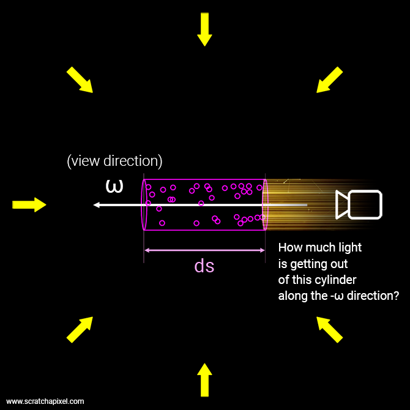

### 1.1. 渲染行为分析

光线与粒子发生发生的作用有如下几类：

1. **吸收 (absorption)**：光子被粒子吸收，会导致入射光的辐射强度减弱
2. **放射 (emission)**：粒子本身可能发光，这会进一步增大辐射强度。
3. **外散射 (out-scattering)**：光子在撞击到粒子后，可能会发生弹射，导致方向发生偏移，会减弱入射光强度。
4. **内散射 (in-scattering)**：其他方向的光子在撞到粒子后，可能和当前方向上的光子重合，从而增强当前光路上的辐射强度。

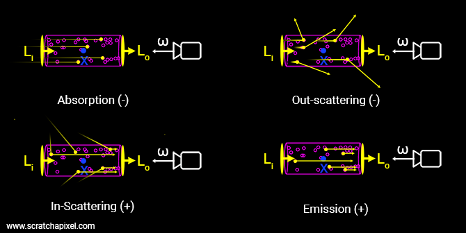

那么对于任意一个云团块而言，出射光与入射光之间的变化量，可以表示为这四个过程的叠加。我们假设入射光线的强度为$I_i$，出射光线为$I_o$，那么有：

$$
l_o-\mathrm{I}_i= dL(x,\omega) =emission+inscattering-outscatting-absorption
$$
下面针对吸收、发射、内散射、外散射四个环节进行分析。

#### 1.1.1 吸收

我们假设半透明物体中的每个粒子的半径为$r$， 每个粒子的投影面积为$A=$ $\pi r^2$， 并假设圆柱体中粒子的密度为$\rho$，圆柱体的底面积是$E$，并且圆柱体的厚度足够薄。

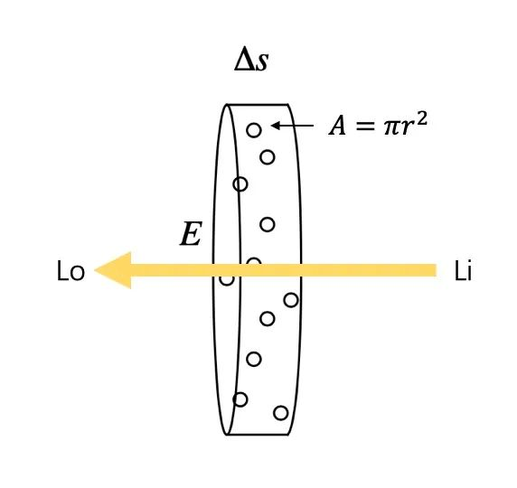

假定这个厚度是$\Delta s$，那么在这个厚度内，圆柱体体积为$E\Delta s$，粒子总数为$\rho E \Delta s$。这些粒子遮挡的面积为$\rho E \Delta s A$，占整个底面积的比例为$\rho E\Delta sA/E=\rho A\Delta s_{\mathrm{o}}$。也就是说，当一束光通过这个圆柱体的时候，有$\rho A\Delta s$的概率会被遮挡。

换句话说，如果我们在圆柱体的一端发射无数光线 (假设都朝相同的方向)，在另一端接收，会发现有些光线安然通过，有些则被粒子遮挡 (吸收)。但可以确定的是，这些接受到的光线总强度，相比入射光线总强度而言，会有$\rho A\Delta s$比例的衰减，即接受到的光的强度均值是入射光的$\rho A\Delta s$倍。其数学形式可以写作：
$$
I_0 - I_i = \Delta I = -\rho(s)AI(s)\Delta s
$$
这是一个关于粒子密法$\rho$和$s$的函数，在空间中每个位置的密度是不同的。我们将上面的薄的圆柱体仍为时一个微元，那么可以将其转化为微分方程：

$$
\frac{dI}{ds}=-\rho(s)AI(s)=-\tau_{a}(s)I(s)
$$

那么有：

$$
I(s)=I_{0}\exp(-\int_{0}^{s}\tau_{a}(t)dt)
$$

其中$I_o$时表示了光线的起始点。那么针对出射光而言有：

$$
I_{o}=I_{i}\exp(-\int_{i}^{o}\tau_{a}(t)dt)_{0}
$$

此式的物理含义是显而易见的：如果离子云是均匀的，那么射入粒子云的光线会指数衰减，这被称为：比尔-朗伯吸收定律 (Beer-Lambert law)。

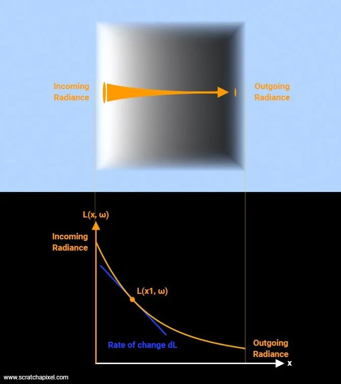

我们可以接着定义出投射比：

$$
T(s)=\frac{I_o}{I_i}=\exp(-\int_i^o\tau_a(t)dt)
$$

投射比代表了一个粒子云团的透明度。数值越大，说明粒子云团越透明，光线衰减越小。透明度本身时$\tau_a(t)$的函数。$\tau_a(t)$越大，透明度$T(s)$越小。我们称$\tau_a(t)$为光学厚度。

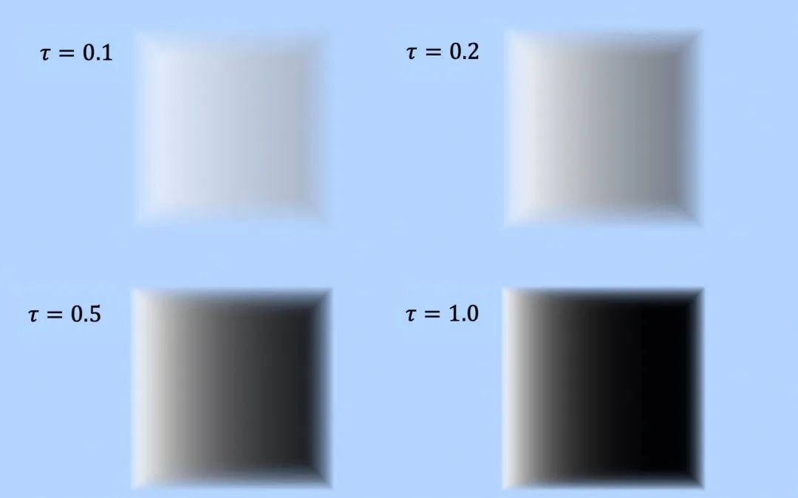

#### 1.1.2. 放射

这里主要考虑粒子发光的情况。假设某个自立发射出的一束光的辐射强度为$I_e$，那么按照前文的描述，在圆柱体足够薄的情况下，粒子总数是$\rho E \Delta s A$，总发光强度为$I_e\rho E \Delta s A$。我们在接收粒子发出的光线时，并不是所有的光线都能接收到（因为光线路径上可能没有发光粒子）。能接收到光线的概率是$\frac {\rho AE\Delta s}{E}=\rho A\Delta s$。那么接收到光线的平均强度为$I_e\rho \Delta s$。那么可以写出放射光强接受的微分方程：

$$
\frac{dI}{ds}=I_e(s)\rho(s)A=I_e(s)\tau_a(s)
$$

#### 1.1.3. 外散射

除了吸收光子外，还可能会弹开光子，这个过程成为外散射。或者说光子被弹开原来的光路，导致之前的光线强度变弱。同吸收一样，外散射对光线有削弱作用也和光学厚度有关系。只不过这里的光学厚度影响因素负责很多。我们用$\tau_s$来表示外散射对光线的削弱能力。那么有：
$$
\frac{dI}{ds}=-\tau_{s}(s)I(s)
$$

#### 1.1.4. 内散射

光线可以被弹离原本的光路，自然而然也会有其他光路的光子被弹到了我们看到的光路上，这个过程就是内散射。内散射要复杂很多，我们直接给出结论：假设其他光路的辐射强度为$I_s$，弹射到其他光路的能量损失为$\tau_s$（因为都是散射损失，这里与外散射的损失系数相同）。那么这个过程可以描述为：

$$
\frac{dI}{ds}=\tau_{s}(s)I_{s}(s)
$$

### 1.2. 渲染方程

我们将上面几个方程统一到一起，有：

$$
\frac{dI}{ds}=  -\tau_a(s)I(s)  -\tau_s(s)I(s)  +\tau_a(s)I_e(s)  +\tau_s(s)I_s(s)
$$

其中$-\tau_a(s)I(s)  -\tau_s(s)I(s)$会衰减辐射强度，成为衰减项，$\tau_a(s)I_e(s)  +\tau_s(s)I_s(s)$是独立的光源，称为源项。

定义$\tau = \tau_a + \tau_s$，那么有：

$$
\frac{dI}{ds}=-\tau(s)I(s)+\tau_a(s)I_e(s)+\tau_s(s)I_s(s)
$$

求解，则有：

$$
\begin{aligned}
I(s) =&\int_0^s\exp(-\int_0^r\tau_t(t)dt)[\tau_a(t)I_e(t)+\tau_s(t)I_s(t)]dt\\
	&+I_{0}\exp(-\int_{0}^{s}\tau_{t}(t)dt)
\end{aligned}
$$

可以看到，最终到达像平面的某一条光线主要由背景光$I_0$、发光$I_e$和其他光线$I_s$三个光构成。在传播的过程中都伴随着相同的衰减。由于从$I_0$到$I_s$的整个光路上处处都会发生我们所说的光学现象，因此需要从光源开始（$0$）积分到像平面（$s$），因此对应的积分就是$\int ^s_0$

为了方便运算对系统进行一定的简化，我们假设$\tau， \tau_a, \tau_s$是不变且相等的，用$\sigma$来表示。同时令：$C = I_e + I_s$，那么有：

$$
\begin{aligned}
I(s)  =&\int_0^s\exp(-\int_0^t\sigma(u)du)\sigma(t)C(t)dt  \\
&+I_{0}\exp(-\int_{0}^{s}\sigma(t)dt) \\
=&\int_0^sT(s)\sigma(t)C(t)dt+T(s)I_0
\end{aligned}
$$

其中$T(s) = exp(-\int^s_o\sigma(t)dt)$

这就是Nerf论文中所给出的渲染公式了。在3D Gaussian Splatting中，渲染方程还可以更简化一些，因为每个点都是由多个高斯函数叠加而来的，那么实际上渲染方程将简化为多个高斯函数的不透明度的叠加：
$$
C=\sum_{i\in\mathcal{N}}c_i\alpha_i\prod_{j=1}^{i-1}(1-\alpha_j)
$$
其中$c_\mathrm{i}$是每个高斯函数的颜色，$\alpha_\mathrm{i}$则由三维高斯向像平面投影的二维高斯的协方差$\Sigma$乘以所优化的该点的不透明度信息(三维高斯向二维高斯投影的方法将在快速光栅化中介绍)。

## 2. 快速光栅化

3D Gaussian Splatting通过使用三维高斯函数描述场景，实现了可微渲染的同时给出了解析的渲染方程，从而实现了将三维场景快速光栅化。快速光栅化的过程是将场景中的高斯球投影到相机的平面上。论文中给出的$\Sigma$投影在二维像平面的形式为：
$$
\Sigma^{\prime}=JW\Sigma W^TJ^T
$$

第一步我们仍然将源空间（世界坐标系）下的坐标转换到相机空间里，这是一步仿射变换。此时我们使用的相机模型为针孔模型，此时存在一个视体（frustum），此时我们投影的光线并不平行，而是一个锥体：

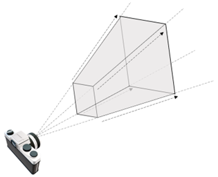

直接通过仿射变换投影得到的二维高斯球和像素坐标是没有对齐的，此时与其计算相机空间里的每个基元关于平面的投影，然后计算哪些部分属于哪些像素；不如直接应用一个投影变换，将从相机原点发射的光线，映射为平行光。这样，被变换后的坐标，就可以很方便的进行体渲染了。变换后得到的空间我们称为“光线空间”。

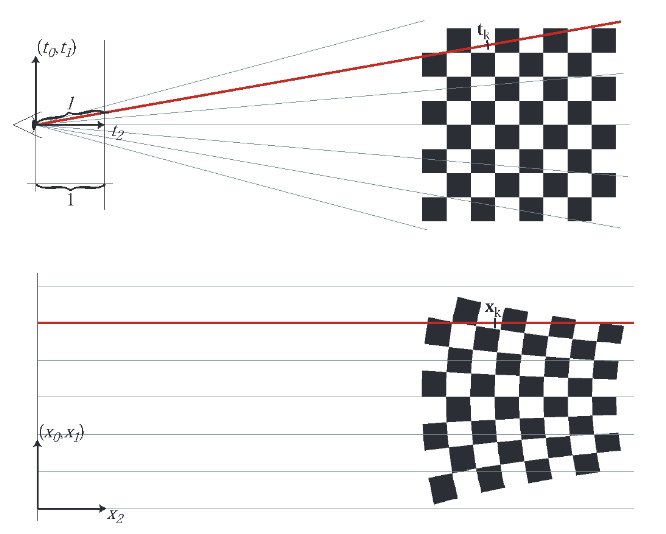

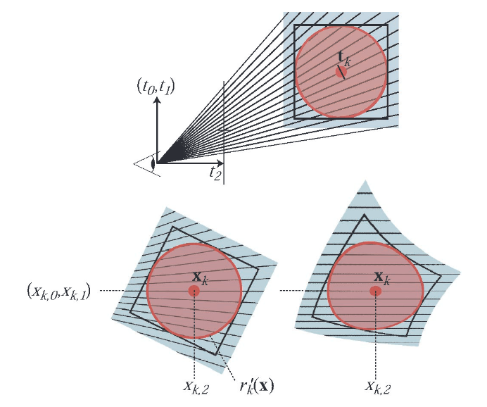

上图中上面的图片是相机空间的，可以看到从光心透出的光线会斜着穿过多个高斯球，如果直接投影计算会导致像素坐标和对应的高斯球并不对齐，无法计算。因此需要像下图一样，将光线变换为平行光，此时计算就十分容易了。考虑相机空间里的坐标$t=(t_0,t_1,t_2)^T$, 其中$t_2$所在的维度是我们$z$轴，即相机镜头的方向。记变换后坐标$x=(x_1,x_2,x_3)^T$, 那么整个变成：
$$
\begin{pmatrix}x_0\\x_1\\x_2\end{pmatrix}=\phi(\mathbf{t})=\begin{pmatrix}\frac{t_0}{t_2}\\\frac{t_1}{t_2}\\\parallel(t_0,t_1,t_2)\parallel^T\end{pmatrix}
$$
这里每次都计算不同方向的光线可能和哪些高斯椭球是“接触”( 斯椭球时我们往往会用其协方差矩阵作为轴的长度，类似一维时熟悉的比较麻烦的。需要注意的是投影形式中的$||(t_0,t_1,t_2)\parallel^T$是有着重要意果是常规的透视变换，这里储存的“深度”往往是$t_2$，在3DGS需要这个来判定基元之间的前后顺序。这样带来了一些好处。但是不难察觉到投影变换是一个非线性变换，而高斯分布对非线性变换并不封闭。高斯分布有优良性质消失了。

EWA Splatting 里提出一种办法，他们称其为“local affine approximation”。我们至少在每次投影时，其实都是知道高斯函数的位置(均值)的，所以我们可以直接计算$\mathbf{x}_k=\phi(\mathbf{t}_k)$。但是此时的投影变换是非线性的，如果直接作用在高斯函数上会破坏原有的优雅的性质（协方差不再是一个线性变换）。因此我们需要将投影变换线性近似，进行泰勒展开，雅可比矩阵会自然的提供一个线性变换，来提供一个$\mathbf{t}_k$邻域到$\mathbf t_k$邻域之间的变换。即：

$$
\phi_k(\mathbf{t})=\phi_k(\mathbf{t}_k)+J_k(\mathbf{t}-\mathbf{t}_k)
$$
这里的$J_k$可以由$\phi_k(\mathbf{t})$直接求偏导得到：
$$
\mathbf{J}_k=\dfrac{\partial\phi}{\partial\mathbf{t}}(\mathbf{t}_k)=\begin{pmatrix}1/t_{k,2}&0&-t_{k,0}/t_{k,2}^2\\0&1/t_{k,2}&-t_{k,1}/t_{k,2}^2\\t_{k,0}/l'&t_{k,1}/l'&t_{k,2}/l'\end{pmatrix}
$$
我们利用二阶近似，解决了投影变换非线性的问题。考虑一个世界坐标系下的坐标$u$，仿射变换$t=\varphi(\mathbf{u})$ 可以得到在特定相机空间下的坐标$t$，$x=\phi_k(t)$可以得到在光线空间下的坐标表示。我们已经保证了这两个映射是线性的，所以他们的复合也是线性的，我们将其记作$\mathbf{m}_k(\mathbf{u})$。我们可以将这个复合变换展开：
$$
\begin{gathered}
\mathbf{t}=\varphi(\mathbf{u})=\mathbf{M}\mathbf{u}+\mathbf{b} \\
\mathbf{x}=\phi_{k}(\mathbf{t})=\mathbf{x}_{k}+\mathbf{J}_{k}(\mathbf{t-t}_{k}) \\
=\mathbf{x}_k+\mathbf{J}_k(\mathbf{M}\mathbf{u}+\mathbf{b}-\mathbf{t}_k) \\
=\mathbf{J}_k\mathbf{M}\mathbf{u}+\mathbf{x}_k+\mathbf{J}_k(\mathbf{b}-\mathbf{t}_k) 
\end{gathered}
$$
此时的投影变换是三维形式的，在二维形式下（我们投影到像平面下再做投影变换）：
$$
\left.\left(\begin{array}{c}x_0\\x_1\end{array}\right.\right)=\phi(\mathbf{t})=\left(\begin{array}{c}t_0/t_2\\t_1/t_2\end{array}\right).
$$
类似的，我们做

因为高斯函数在放射变化前后仍然保持不变，我们可以写出变换后的协方差矩阵和均值满足：
$$
\begin{aligned}
\Sigma'=\textbf{JR}_{cw}^{-1}\Sigma\textbf{R}_{cw}^{-T}\textbf{J}^{T}
\end{aligned}
$$
这样我们实现了将三维高斯球函数投影到像平面的二维高斯函数的办法。结合前述的可微渲染，就可以实现高斯函数所表达的场景的快速光栅化了。

## 3. 为什么使用高斯函数

在使用3DGS时，我们似乎很自然的认为使用高斯函数作为表达的基本单元是一个很理所当然的，以为它可微，且足够优雅。但是不妨再进一步，为什么一定是高斯函数，和点云、三角面片、简单的球体，甚至是更复杂的流形相比，它的优势究竟在哪？

事实上，无论是点云、三角面片还是3DGS，作为以一种通过离散形式表达真实的、连续的世界的方式，都难免会涉及到将连续转换为离散的过程。在数学中这个过程被称为**采样**。对采样的分析和理解是现代计算机科学的基础，事实上我们常用的三维点云就是通过$\sigma$函数对真实世界的采样，具体为什么在后面会给出介绍。

### 3.1 采样、混叠和抗混叠

我们简单的回顾（学习）一些离散信号处理的知识。有一个特殊的函数称为$\sigma$函数，也叫冲击函数或者狄拉克函数。（事实上一般的狄拉克函数会在$0$处为$\infty$，但是一般在采样时会使用为$1$的形式）
$$
\left.\delta(t)=\left\{\begin{matrix} 1&t=0\\0&t\neq 0\end{matrix}\right.\right.
$$
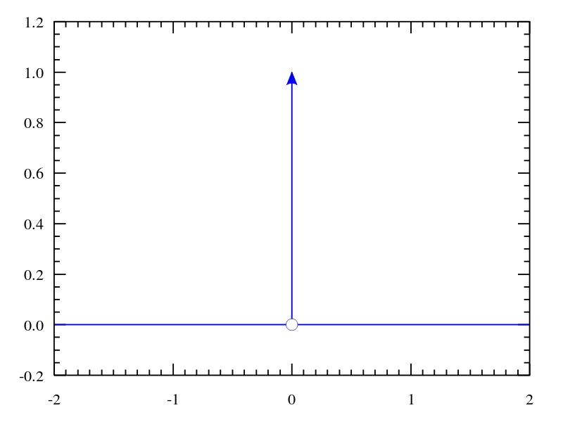

假设我们有一个连续函数$f(t)$，通过$\sigma$函数可以简单且解析的将$f(t)$在$t=0$处的值取出：
$$
f(0) = f(t)\delta(t)
$$
虽然我们取出了$f(0)$的值，但是好的是并没有破坏原本的$f(t)$的性质。那么显然的，如果我们需要将$f(t)$按照间隔$m$离散化，只需要构建一个采样序列（也叫狄拉克梳子）：
$$
Shah(t) = \sum_{n=-\infty}^{\infty} \delta(t-nm)
$$
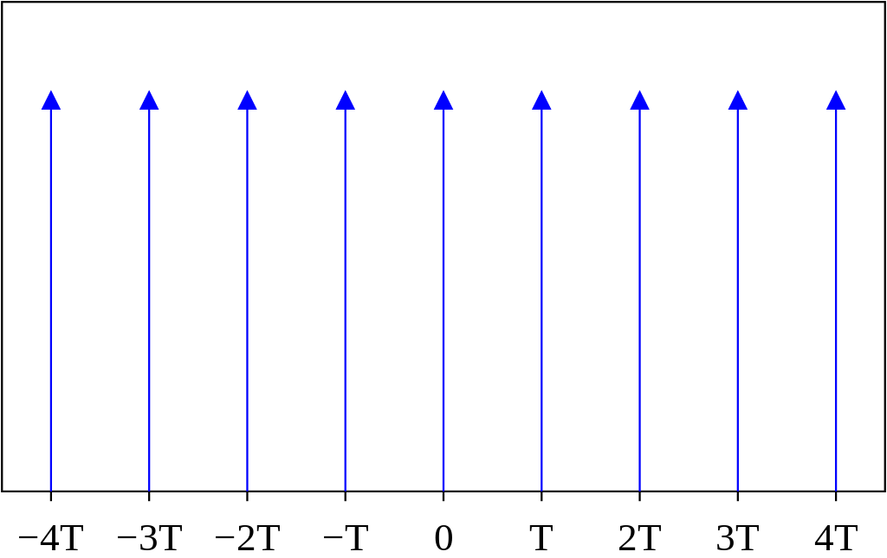

将这个采样序列作用在连续函数$f(t)$上：
$$
f(k) = f(t)\sum_{n=-\infty}^{\infty} \delta(t-nm)
$$
就得到了原始的连续函数$f(x)$按照间隔$m$采样后的结果$f(k)$。

这里我们不加证明的给出关于信号、卷积和时频域的几条性质：

> 1. 时域下的乘法通过傅里叶变换至频域后变为卷积。
> 2. 一个信号与$\sigma$函数卷积后仍为这个信号本身。
> 3. $Shah$的傅里叶变换仍然为$Shah$函数，只不过间距变为：$SHAH(s)=\frac 1 T\sum_{n=-\infty}^{\infty}\delta(s-n\frac{1}{m})$

我们假设连续函数傅里叶变换后的结果为$F(s)$，那么连续信号$f(t)$离散化的离散信号$f(k)$在频域下的形式为：
$$
F(s)*SHAH(s) = \frac 1 T\sum_{n=-\infty}^{\infty}F(s-n\frac1m)
$$
可以看到，原始的信号$f(t)$的频谱被以$\frac1m$为周期做了时移后叠加。由于傅里叶变换是一个无损变换，即时域所包含的信息被完全的转换到了频域上。那么频域上的混叠自然而然会导致时域上的失真。

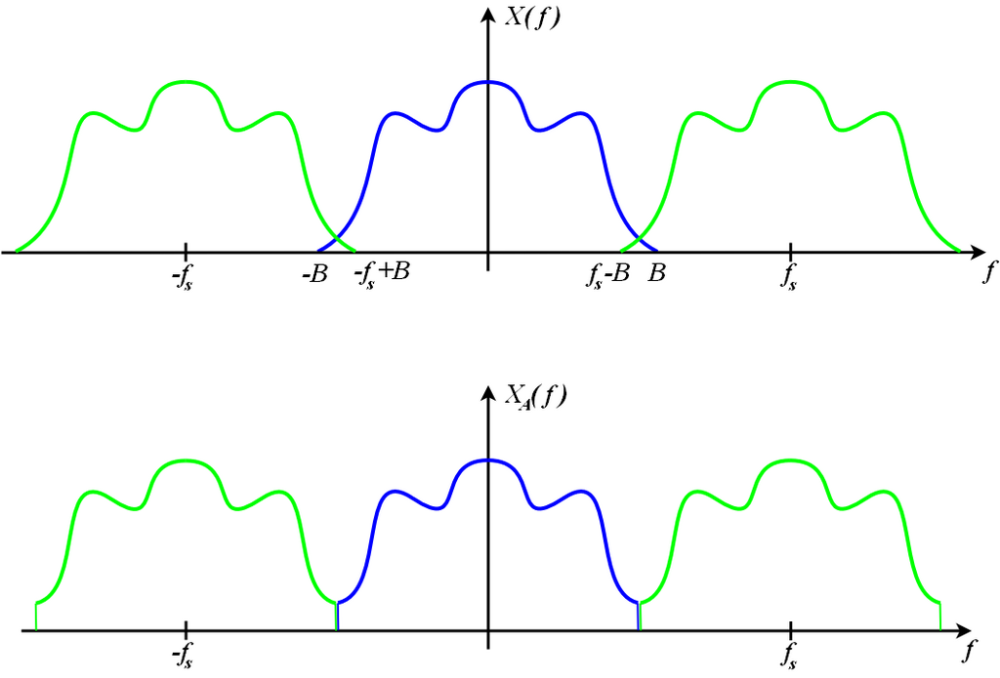

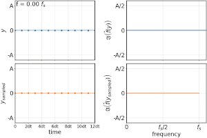

上图中左侧两张照片是一个频率不断在变化的正弦信号。我们知道正弦信号的傅里叶变换是一条对应周期的频线，就如右上图片所示。而右下则是将正弦信号离散化（采样）后的频谱，很容易看到原本的一条谱线变为了多条（但是只显示了两条），发生了混叠。

更贴近我们工作的一个例子是摩尔纹。摩尔纹在对图片进行下采样时产生。下图中左右两张照片由于下采样的范围不同（与信号上的采样周期有着相同的含义）。

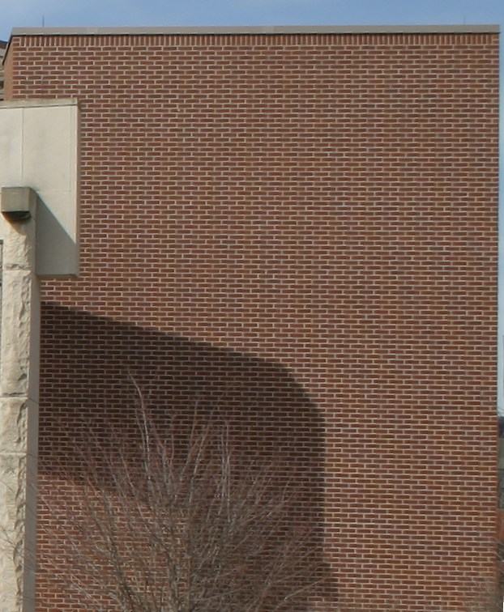

不妨进一步的思考，看看三维场景的离散化上。我们可以认为真实场景是一个连续的三维场景，当我们使用点云描述三维场景时，实际上是使用一个三维上的采样序列作用在真实的场景上。那么必然的，会在频域上产生混叠，在时域上产生高频信息的丢失（因为混叠的产生导致高频信息被混叠的低频信号覆盖了）。可以看到此时点云描述并不是一个很好的主义，这也将引出后面使用Gaussian 函数描述（采样）为什么会有着比点云描述更好的效果。

在搞明白采样的混叠的理论之后，我们对其进行简单的总结：

1. 假设对于一个连续信号$x_a(t)$按照频率$f=\frac1T$进行采样，得到的离散序列为：

$$
\hat{x}_{a}\left(t\right)=\sum_{n=-\infty}^{\infty}x_{a}\left(t\right)\delta\left(t-nT\right)
$$

2. 延拓后的频谱$\hat{X}_a(j\Omega)$为：

$$
\hat{X}_{a}(j\Omega)=\frac{1}{T}\sum_{n=-\infty}^{\infty}X_{a}\left(j\Omega-jn\frac{2\pi}{T}\right)
$$

面对混叠，我们显而易见的有两种办法来对抗它：

1. 增加采样频率，增加频域下混叠发生的距离。一般我们认为采样频域至少应该大于被采样信号的频带的一倍，才可以较好的重建信号；这就是大名鼎鼎的*奈奎斯特采样定理*。
2. 在频域下使用一个门函数，滤去高频下的混叠。

我们主要考虑使用门函数进行滤波的情形。

### 3.2 重建核

我们假设在频域下存在这样一个函数$G(j\Omega)$，用于截掉混叠的频率：
$$
\left.G\left(j\Omega\right)=\left\{\begin{array}{l}T_s,|\Omega|\leqslant\Omega_s/2\\0,|\Omega|>\Omega_s/2\end{array}\right.\right.
$$
其反变换回时域为：
$$
g\left(t\right)=\mathrm{Sa}\left(\frac{\Omega_{s}}{2}t\right)=\frac{\sin\left(\frac{\Omega_{s}}{2}t\right)}{\frac{\Omega_{s}}{2}t}
$$
其图像为：

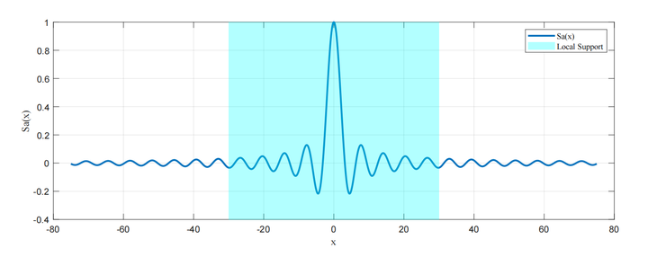

可以看到其只在0附近一个区域内有较大的值，我们称这个性质为*局部支撑*。我们直接对采样后的信号$\hat{x}_a(t)$及进行卷积，并令数学专业同学心脏骤停的交换求和和积分的顺序：

$$
\begin{gathered}
y\left(t\right)=\hat{x}_{a}\left(t\right)*g\left(t\right) \\
=\int_{-\infty}^{+\infty}\left[\sum_{n=-\infty}^{\infty}x_{a}\left(\tau\right)\delta\left(\tau-nT\right)\right]g\left(t-\tau\right)\mathrm{d}\tau  \\
=\sum_{n=-\infty}^{\infty}\int_{-\infty}^{+\infty}x_{a}\left(\tau\right)g\left(t-\tau\right)\delta\left(\tau-nT\right)\mathrm{d}\tau  \\
=\sum_{n=-\infty}^\infty x_a\left(nT\right)g\left(t-nT\right) \\
=\sum_{n=-\infty}^\infty x_a\left(nT\right)\frac{\sin\left(\frac\pi Tt-n\pi\right)}{\left(\frac\pi Tt-n\pi\right)} 
\end{gathered}
$$
可以看到最后结果的形势十分特殊，是原始的连续信号的抽样与$\frac{\sin\left(\frac\pi Tt-n\pi\right)}{\left(\frac\pi Tt-n\pi\right)}$相互作用。我们称$\frac{\sin\left(\frac\pi Tt-n\pi\right)}{\left(\frac\pi Tt-n\pi\right)} $为当前采样（重建）形式下的重建核。最后的重建结果是由**原始信号的采样值和重建核张成的**。在EWA splatting中，我们将重建过程看作了对一个连续的空间函数进行采样的结果（事实上大部分的三维表达形式都可以这样理解）。我们假设这个有待描述的连续场景的数学形式为$f_c(u)$，其中$u$是采样的空间位置。那么通过一个重建核进行描述时可以写成：
$$
f_c\left(\mathbf{u}\right)=\sum_{k\in\mathbb{IN}}w_kr_k\left(\mathbf{u}\right)
$$
上式中$\omega_k$时采样的值，具体的物理意义由重建核的结构决定（有可能是体密度，有可能是别的形式）；$r_k(u)$时重建核。在EWA splating中，第一步是将待描述的原空间里的形式$f_c(u)$映射到像空间中，之后得到在像空间中的连续函数$g_c(\mathbf x)$，可以描述为：
$$
g_c\left(\mathbf{x}\right)=\left\{\mathcal{P}\left(f_c\right)\right\}\left(\mathbf{x}\right)
$$
其中$\mathcal{P}$是一个投影算子，$\mathbf x$是屏幕上的二维坐标。我们对二维上的形式使用重建核进行重建，并交换投影算则$\mathcal{P}$与求和算子的顺序，即先让投影算子作用在重建核上。则有：
$$
\begin{aligned}
	g_c(\mathbf x) 
		&= \mathcal P \sum_{k\in\mathbb{IN}}w_kr_k\left(\mathbf{u}\right)\\
		&= \sum_{k\in\mathbb{IN}}w_k \mathcal P r_k\left(\mathbf{u}\right)\\
		&= \sum_{k\in\mathbb{IN}}w_k p_k\left(\mathbf{u}\right)
\end{aligned}
$$
我们给屏幕上的信号先加一个限（因为表达的有限），使用预滤波器$h(x)$（形式并不重要）：
$$
\hat g_{c}\left(\mathbf{x}\right)=g_{c}\left(\mathbf{x}\right)\otimes h\left(\mathbf{x}\right)
$$
我们将上面的卷积形式展开进行计算，则有：
$$
\begin{gathered}
g_{c}\left(\mathbf{x}\right)=\int_{\mathbb{R}^{2}}\left\{\mathcal{P}\left(\sum_{k\in\mathbb{IN}}w_{k}r_{k}\right)\right\}\left(\boldsymbol{\eta}\right)h\left(\mathbf{x}-\boldsymbol{\eta}\right)\mathrm{d}\boldsymbol{\eta} \\
=\sum_{k\in\mathbb{N}}w_k\int_{\mathbb{IR}^2}p_k\left(\boldsymbol{\eta}\right)h\left(\mathbf{x}-\boldsymbol{\eta}\right)\mathrm{d}\boldsymbol{\eta} \\
=\sum_{k\in\mathbb{IN}}w_k\rho_k\left(\mathbf{x}\right) 
\end{gathered}
$$
其中有：
$$
\rho_k(\mathbf x) = g_c \otimes h (\mathbf x)
$$
不难注意到，**对于场景的任何操作都可以归结为对重建核做操作。**3DGS使用了高斯分布作为重建核，我们可以直观的知道高斯函数对旋转、平移、缩放均保持封闭；其他的优良形式我们后面再讨论。

### 3.3 Splatting过程

我们回忆一下前面体渲染和快速光栅化中所构建的重建过程，并使用重建核来形式化的描述这个过程。我们再回忆一下，splatting过程分两步，第一步是将场景的三维坐标投影到二维像平面上，是一个仿射变换；第二步是一个线性化后的投影变换。我们称投影为平行光的空间为光线空间。我们记这个**仿射变换为**$\varphi(\cdot)$，将**投影变换**记作$\phi(\cdot)$。

我们记前两个维度$(x_0, x_1, x_2)^T$为$(\mathbf x, x_2)^T$。在 EWA Splatting 中使用的渲染方程在形式上更加严谨（并没有粗暴的假设不透明度和颜色的分布是均匀的），但是不重要，我们按照其形式进行推导：
$$
I\left(\mathbf{x}\right)=\int_{0}^{L}c\left(\mathbf{x},\xi\right)f_{c}^{\prime}\left(\mathbf{x},\xi\right)e^{-\int_{0}^{\xi}f_{c}^{\prime}\left(\mathbf{x},\mu\right)\mathrm{d}\mu}\mathrm{d}\xi
$$
$I(\cdot)$指的是光强。然后$f_c^{\prime}\left(\mathbf{x},\xi\right)$是“消光系数”,用于建模光的“自我遮挡”。然后也有熟悉的 $I(\cdot)$指的是光强。负指数作为衰减因子。$c\left(\mathbf{x},\xi\right)$是“发射系数”。这些含义有些繁琐，我们不必拘泥于这些复杂的含义中，就按照前面介绍的形式理解即可。

我们使用重建核对渲染方程中的消光系数进行重建。由于我们将源空间到相机空间记作$\varphi(\cdot)$。相机空间到光线空间记作$\phi(\cdot)$。那么对于之前定义的$f_c(\mathbf{u})$，对于一个光线空间里的坐标$\mathbf{x}$，我们可以依次进行逆变换，然后计算此时光线空间里坐标为$x$的位置，其对应的属性是多少。我们这里假设$f_c(\mathbf{u})$就是源空间里的消光系数，所以自然有：
$$
f_c^{\prime}\left(\mathbf{x}\right)=f_c\left(\varphi^{-1}\left(\phi^{-1}\left(\mathbf{x}\right)\right)\right)=\sum_{k\in\mathbb{IN}}w_kr_k^{\prime}\left(\mathbf{x}\right)
$$
显然的，变换的作用可以直接吸收到重建核中。我们先将$f^\prime_c(\mathbf x)$带入渲染方程中：
$$
\begin{gathered}
\begin{aligned}I\left(\mathbf{x}\right)&=\int_{0}^{L}c\left(\mathbf{x},\xi\right)\sum_{k\in\mathbb{IN}}w_{k}r'_{k}\left(\mathbf{x},\xi\right)e^{-\int_{0}^{\xi}\sum_{j\in\mathbb{IN}}w_{j}r'_{j}(\mathbf{x},\mu)\mathrm{d}\mu}\mathrm{d}\xi\end{aligned} \\
=\sum_{k\in\mathbb{IN}}w_k\left(\int_0^Lc\left(\mathbf{x},\xi\right)r_k^{\prime}\left(\mathbf{x},\xi\right)e^{-\sum_{j\in\mathbb{N}}w_j\int_0^\xi r_j^{\prime}(\mathbf{x},\mu)\mathrm{d}\mu}\mathrm{d}\xi\right) \\
=\sum_{k\in\mathbb{N}}w_k\left(\int_0^Lc\left(\mathbf{x},\xi\right)r_k^{\prime}\left(\mathbf{x},\xi\right)\prod_je^{-w_j\int_0^\xi r_j^{\prime}(\mathbf{x},\mu)\mathrm{d}\mu}\mathrm{d}\xi\right) 
\end{gathered}
$$
此时的$I(\mathbf x)$的形式是一个加权和，其与前式中的$g_c(\mathbf x)$具有类似的含义，为了表达的一般性，我们使用$g_c(\mathbf x)$代替$I(\mathbf x)$。想要精确的计算上面这个形式是复杂甚至的不可能的，我们需要对齐进行一些简化假设：

> 1. 重建核是局部支撑的，这就意味着再积分过程中我们只对重建核显著非0的部分感兴趣，可以将积分区域变为重建核支撑的部分积分。
> 2. 一般在这条光路上这些支撑区域是不重合的。于是我们自然的假设，在对应的支撑区域内部$c(\mathbf x, \xi)$是不变的。

通过这个假设，我们可以把$c(\mathbf x, \xi)$从积分中提出来，并对指数函数做线性展开$e^x \approx 1-x$，则有：
$$
g_{c}\left(\mathbf{x}\right)=\sum_{k\in\mathbb{N}}w_{k}c\left(\mathbf{x}\right)\left(\int_{0}^{L}r_{k}^{\prime}\left(\mathbf{x},\xi\right)\prod_{j}\left(1-w_{j}\int_{0}^{\xi}r_{j}^{\prime}\left(\mathbf{x},\mu\right)\mathrm{d}\mu\right)\mathrm{d}\xi\right)
$$
为了对齐$\Pi$内外的积分形式，摆脱前面的积分符号的复杂形式。需要再引入一个假设，即认为我们不关注穿过基元中光线的消耗（即$\int^\xi_0$），只关注穿过整个不透明区域后的结果（即$\int^L_0$）。此时形式变为：
$$
g_{c}\left(\mathbf{x}\right)=\sum_{k\in\mathbb{N}}w_{k}c\left(\mathbf{x}\right)\left(\int_{0}^{L}r_{k}^{\prime}\left(\mathbf{x},\xi\right)\prod_{j}\left(1-w_{j}\int_{0}^{L}r_{j}^{\prime}\left(\mathbf{x},\mu\right)\mathrm{d}\mu\right)\mathrm{d}\xi\right)
$$
可以注意到连乘的整个形式和前面的积分和求和无关了：
$$
\begin{gathered}
g_{c}\left(\mathbf{x}\right)=\sum_{k\in\mathbb{IN}}w_{k}c\left(\mathbf{x}\right)\left(\int_{0}^{L}r_{k}^{\prime}\left(\mathbf{x},\xi\right)\prod_{j}\left(1-w_{j}\int_{0}^{L}r_{j}^{\prime}\left(\mathbf{x},\mu\right)\mathrm{d}\mu\right)\mathrm{d}\xi\right) \\
=\sum_{k\in\mathbb{N}}w_kc\left(\mathbf{x}\right)\left(\int_0^Lr_k^{\prime}\left(\mathbf{x},\xi\right)\mathrm{d}\xi\right)\prod_j\left(1-w_j\int_0^Lr_j^{\prime}\left(\mathbf{x},\mu\right)\mathrm{d}\mu\right) 
\end{gathered}
$$
我们记：
$$
q_{k}\left(\mathbf{x}\right)=\int_{\mathbb{R}}r_{k}^{\prime}\left(\mathbf{x},\xi\right)\mathrm{d}\xi
$$
此时$q_k(x)$可以很大程度的简化$g_c$的形式：
$$
g_{c}\left(\mathbf{x}\right)=\sum_{k\in\mathbb{IN}}w_{k}c\left(\mathbf{x}\right)q_{k}\left(\mathbf{x}\right)\prod_{j=0}^{k-1}\left(1-w_{j}q_{j}\left(\mathbf{x}\right)\right)
$$
形式$q_k(x)$挺有用的，它被称为**足迹函数**，描述了重建核沿着一个维度积分的结果，描述了三维的重建核被投影到二维（降维）的过程。此时的$g_c(x)$是一个真正意义上的二维连续函数，也是最朴素含义上的splatting，已经十分接近朴素的重建核的$g_{c}\left(\mathbf{x}\right)=\sum_{k\in\mathbb{IN}}w_{k}p_{k}\left(\mathbf{u}\right)$。此时$g_c(\mathbf x)$还是一个连续函数，我们希望通过$g_{c}^{\prime}\left(\mathbf{x}\right)=g_{c}\left(\mathbf{x}\right)\otimes h\left(\mathbf{x}\right)$。的处理将其变为带限的。我们尝试展开卷积：
$$
\begin{gathered}
\begin{aligned}g'_c\left(\mathbf{x}\right)=g_c\left(\mathbf{x}\right)\otimes h\left(\mathbf{x}\right)\end{aligned} \\
=\sum_kw_k\int_{\mathbb{IR}^2}c_k\left(\eta\right)q_k\left(\eta\right)\prod_{j=0}^{k-1}\left(1-w_jq_j\left(\eta\right)\right)h\left(\mathbf{x}-\eta\right)\mathrm{d}\eta  
\end{gathered}
$$
我们假设$c_k(\cdot)$是常数，足迹函数所造成的衰减$\prod_{j=0}^{k-1}\left(1-w_jq_j\left(\mathbf{x}\right)\right)$也近似的是一个常数$o_k$那么可以得到：
$$
\begin{gathered}
\begin{aligned}\prod_{j=0}^{k-1}\left(1-w_jq_j\left(\mathbf{x}\right)\right)\approx o_k\end{aligned} \\
\begin{aligned}g_{k}\left(\mathbf{x}\right)\otimes h\left(\mathbf{x}\right)=\sum_{k}w_{k}c_{k}o_{k}\int_{\mathbb{R}^{2}}q_{k}\left(\eta\right)h\left(\mathbf{x}-\eta\right)\mathrm{d}\eta\end{aligned} \\
=\sum_{k}w_{k}c_{k}o_{k}\left(q_{k}\left(\mathbf{x}\right)\otimes h\left(\mathbf{x}\right)\right) \\
=\sum_kw_kc_ko_k\rho_k\left(\mathbf{x}\right) 
\end{gathered}
$$
不难察觉到，经过经过了对于$c_k(\cdot)$的简化假设后，第$k$个元（高斯球）的颜色与坐标无关，正好对应了每个高斯球的颜色是一样的并且不随距离发生变化。

### 3.4 高斯分布作为重建核所带来的特殊结构

在前面的推导中，我们没有指明重建核的具体形式。但是也能察觉到，假如这个重建核函数和预滤波器作卷积（当然预滤波器也是我们可以选择的）后仍然有和原来一样的表达，假如这个重建核函数经过线性变换后，其函数参数也可以被线性的变化，假如这个重建函数，沿某个维度积分后，也能保持类似的函数结构，推导的形式将会简化非常非常多。高斯分布此处有很多重要且有意义的性质，我们不做具体的推导了，但是在此处将高斯分布所具有的性质列出。具体的证明在附录给出：

1. 高斯分布对傅里叶变换封闭
2. 高斯分布对平移和旋转封闭
3. 高斯分布对卷积封闭
4. 高斯分布对仿射变换封闭
5. 高斯分布对边缘分布算子封闭

我们根据上面推导的高斯重构核进行积分，得到高斯足迹函数$q_k$
$$
\begin{aligned}q_k(\mathbf{x})&=\int_{\mathrm{IR}}\frac1{|\mathbf{W}^{-1}\mathbf{J}_k^{-1}|}\mathcal{G}_{\mathbf{V}_k^{\prime}}(\mathbf{x}-\mathbf{x}_k,x_2-x_{k2})dx\\&=\frac1{|\mathbf{W}^{-1}\mathbf{J}_k^{-1}|}\mathcal{G}_{\hat{\mathbf{V}}_k^{\prime}}(\mathbf{x}-\mathbf{x}_k),\end{aligned}
$$
选择高斯函数作为低通滤波器，得到EWA体积重采样滤波器或EWA体积飞溅：
$$
\begin{aligned}
\rho_{k}(\mathbf{x})& =(p_k\otimes h)(\mathbf{x})  \\
&=c_ko_k\frac{1}{|\mathbf{W}^{-1}\mathbf{J}_k^{-1}|}(\mathcal{G}_{\hat{\mathbf{V}}_k^{\prime}}\otimes\mathcal{G}_{\mathbf{V}^h})(\mathbf{x}-\mathbf{x}_k) \\
&=c_ko_k\frac1{|\mathbf{W}^{-1}\mathbf{J}_k^{-1}|}\mathcal{G}_{\mathbf{\hat{V}}_k^{\prime}+\mathbf{V}^h}(\mathbf{x}-\mathbf{x}_k).
\end{aligned}
$$

## 参考

[体渲染简明教程](http://www.bimant.com/blog/volume-rendering-brief-intro/)

[NeRF入门之体渲染 (Volume Rendering)](https://mp.weixin.qq.com/s?__biz=Mzg4ODA3MDkyMA==&mid=2247485148&idx=1&sn=4e6acc1b358e624ac2301729d35cc89d&chksm=cf81f0bbf8f679ad3f990f91d5c84fcc67cc6948c3cbc0c34c59874f7795e9263f2382979414&token=400584181&lang=zh_CN#rd)

[EWA Splatting](https://www.cs.umd.edu/~zwicker/publications/EWASplatting-TVCG02.pdf)

[3D Gaussian Splatting   for Real-Time Radiance Field Rendering](https://repo-sam.inria.fr/fungraph/3d-gaussian-splatting/)

[3D Gaussian Splatting中的数学推导](https://zhuanlan.zhihu.com/p/666465701)

[wiki狄拉克函数](https://zh.wikipedia.org/wiki/%E7%8B%84%E6%8B%89%E5%85%8B%CE%B4%E5%87%BD%E6%95%B0)

[wiki Aliasing](https://en.wikipedia.org/wiki/Aliasing)

## 附录

### A. 如何解常微分方程

对于形如：
$$
\dot y(x) + p(x)y(x) = 0
$$
的微分方程，有：
$$
\frac{\dot y(x)}{y(x)} = -p(x)
$$
两边积分，有：
$$
\ln y(x) = \int p(x)dx
$$
则有：
$$
y(x)=Ce^{\int p(x)dx}
$$

### B. 时域、频域、卷积

TODO：补充附录内容

### 

### C. 在重建中高斯分布的重要性质证明

TODO：补充附录内容