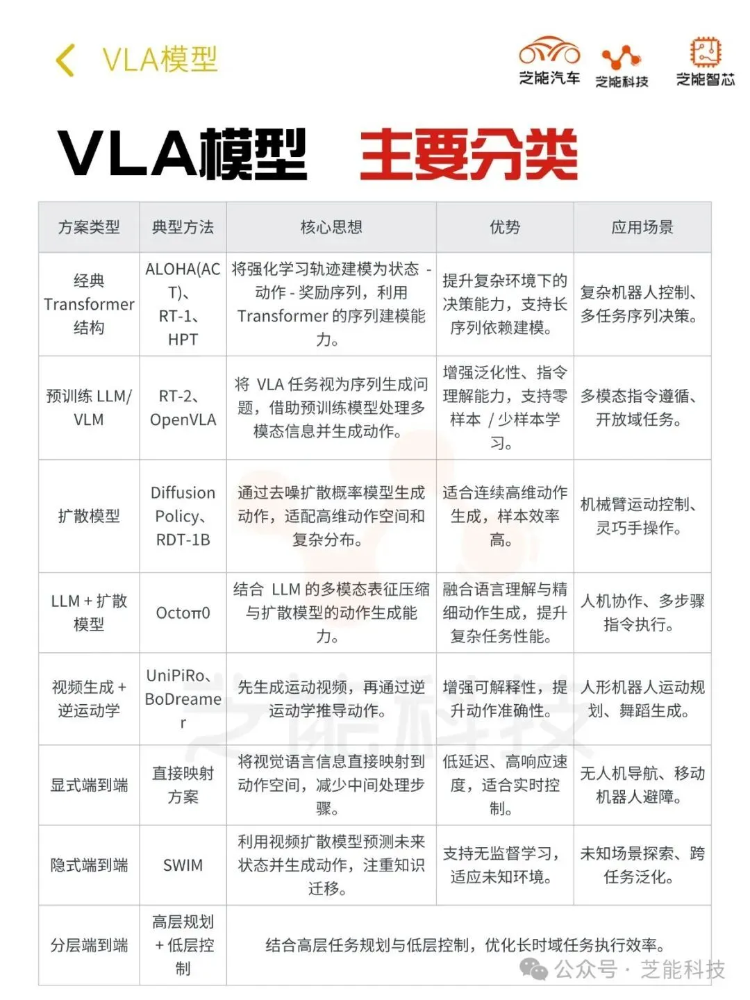

# VLA (Vision Language Action)

VLA模型最早见于机器人行业。2023年7月28日，谷歌DeepMind发布了全球首个控制机器人的视觉语言动作（VLA）模型RT-2。其后，这个模型概念快速扩散到智驾领域。具身智能旨在让智能体在物理世界中通过感知、决策和行动实现目标，视觉-语言-动作（VLA）模型作为其核心技术，近年来备受关注。VLA模型能够处理视觉、语言和动作信息，使智能体理解人类指令并执行任务。

VLA模型是在视觉语言模型（VLM）的基础上发展而来的。VLM是一种能够处理图像和自然语言文本的机器学习模型，它可以将一张或多张图片作为输入，并生成一系列标记来表示自然语言。然而，VLA不仅限于此，它还利用了机器人或汽车运动轨迹的数据，进一步训练这些现有的VLM，以输出可用于机器人或汽车控制的动作序列。通过这种方式，VLA可以解释复杂的指令并在物理世界中执行相应的动作。

## VLA的特点与优势

### 1. 端到端架构

首先，VLA是一个端到端的大模型，这意味着它可以简化传统上需要多个独立模块才能完成的任务流程。例如，在自动驾驶领域，传统的做法是将感知、预测、规划等步骤分开处理，而VLA则试图用一个统一的框架来替代这种分立的方法。这不仅可以提高系统的效率，还能增强其灵活性和适应性。

### 2. 泛化能力

其次，VLA具有强大的泛化能力。以谷歌DeepMind推出的RT-2为例，该模型可以在新的物体、背景和环境中表现出显著改善的性能。它可以理解并响应那些在训练数据集中未曾出现过的命令，并基于底层语言模型提供的思路链进行推理，从而做出合理的决策。比如，当被要求选择一块石头作为临时锤子时，或者推荐给疲惫的人一杯能量饮料，这些都是RT-2所展示出的能力。

### 3. 通用性

再者，VLA具备高度的通用性。由于它是建立在一个通用的大规模预训练基础上，因此理论上几乎所有的“智能机器设备”都可以使用这套算法。无论是汽车、飞行器还是其他类型的机器人，只需要经过适当的微调就能满足特定应用场景的需求。这也解释了为什么近年来许多企业都在积极探索如何将通用AI应用于不同的机械设备上，以实现所谓的“具身智能”。

## VLA的主要方法

VLA模型通过多种技术路径实现视觉、语言和动作的融合，其方案多样，各具特色。

* **基于经典Transformer结构的方案**，如ALOHA(ACT)系列、RT-1、HPT等，利用Transformer的序列建模能力，将强化学习轨迹建模为状态-动作-奖励序列，提升复杂环境下的决策能力；

* **基于预训练LLM/VLM的方案**，如RT-2、OpenVLA等，将VLA任务视为序列生成问题，借助预训练模型处理多模态信息并生成动作，增强泛化性和指令理解能力；

* **基于扩散模型的方案**，如Diffusion Policy、RDT-1B等，通过去噪扩散概率模型生成动作，适用于高维动作空间和复杂动作分布；

* **LLM+扩散模型方案**，如Octoπ0等，结合LLM的多模态表征压缩与扩散模型的动作生成能力，提高复杂任务中的性能；

* **视频生成+逆运动学方案**，如UniPiRo、BoDreamer等，先生成运动视频再通过逆运动学推导动作，提升可解释性和准确性；

* **显示端到端方案**直接将视觉语言信息映射到动作空间，减少信息损失；

* **隐式端到端方案**，如SWIM等，利用视频扩散模型预测未来状态并生成动作，注重知识迁移；

*  分层端到端方案结合高层任务规划与低层控制，提升长时域任务的执行效率。

这些方案通过不同架构和技术手段，为具身智能在机器人控制、任务执行等场景中的应用奠定了基础。

## 参考资料

* [具身人工智能：主流VLA方案分类和对比](https://cloud.tencent.com/developer/news/2284111)