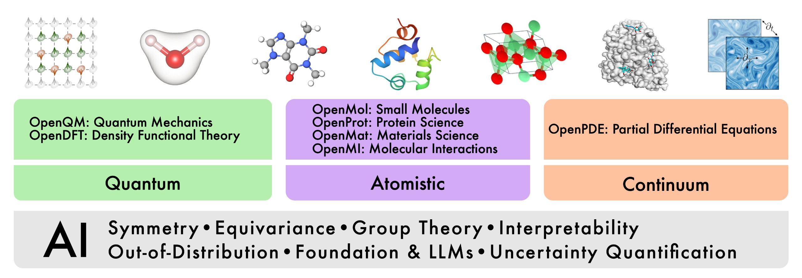

# 科学智能（AI4Science）

AI4Science 简单来说，是科学发现的第5范式，是使用AI能力加速自然规律的发现。

图灵奖获得者、前微软技术院士 Jim Gray 用“[四种范式](https://www.microsoft.com/en-us/research/wp-content/uploads/2009/10/Fourth_Paradigm.pdf)”描述了科学发现的历史演变。
* 第一范式的起源可以追溯到几千年前，它纯粹是经验性的，基于对自然现象的直接观察。虽然在这些观察中，有许多规律是显而易见的，但没有系统性的方法来捕获或表达这些规律。
* 第二范式以自然理论模型为特征，例如17世纪的牛顿运动定律，或19世纪的麦克斯韦电动力学方程。这些方程由经验观察，归纳推导得出，可以推广到比直接观察更为广泛的情形。
* 虽然这些方程可以在简单场景下解析求解，但直到20世纪有了电子计算机的发展，它们才得以在更广泛的情形下求解，从而产生了基于数值计算的第三范式。
* 21世纪初，计算再次改变了科学，这一次则是通过收集、存储和处理大量数据的能力，催生了数据密集型科学发现的第四范式。机器学习是第四范式中日益重要的组成部分，它能够对大规模实验科学数据进行建模和分析。这四种范式是相辅相成，并存不悖的。

在过去的几年里，我们看到了深度学习的一个新用途——兼顾科学发现的速度与准确性的强大工具。这种使用机器学习的新方式与第四范式数据建模截然不同，因为用于训练神经网络的数据来自科学基本方程的数值解，而非经验观察。我们可以将科学方程的数值解看作自然界的模拟器，以较高的计算成本，对众多我们感兴趣的应用进行计算——例如预测天气、模拟星系碰撞、优化聚变反应堆设计，或计算候选药物分子与目标蛋白的结合自由能。然而，从机器学习的角度来看，模拟过程的中间细节可以被视为训练数据，能够用于深度学习仿真器的训练。此类数据是完全标注的，数据的数量仅取决于计算开销。一旦完成训练，仿真器就可以高效执行新的计算，并大大提升计算速度，有时甚至能够达到几个数量级。

科学发现的“第五范式”代表了机器学习和自然科学领域最激动人心的前沿方向之一。虽然这些模拟器要变得足够快、鲁棒、通用并成为业界主流，还有很长的路要走，但它们对现实世界的潜在影响是显而易见的。例如，仅小分子候选药物的数量估计就多达$10^{60}$种，而稳定材料的总数则约为$10^{180}$种（大约是已知宇宙中原子数量的平方）。找到更有效的方法来探索这些广阔的空间，将增强我们发现新物质的能力——例如更好的治疗疾病的药物、更好的捕获大气二氧化碳的基质、更好的电池材料、能够为氢经济提供动力的新型燃料电池电极，以及无数的其他应用。

## 研究方向

- [**OpenQM**](https://github.com/divelab/AIRS/tree/main/OpenQM): AI for Quantum Mechanics
- [**OpenDFT**](https://github.com/divelab/AIRS/tree/main/OpenDFT): AI for Density Functional Theory
- [**OpenMol**](https://github.com/divelab/AIRS/tree/main/OpenMol): AI for Small Molecules
- [**OpenProt**](https://github.com/divelab/AIRS/tree/main/OpenProt): AI for Protein Science
- [**OpenMat**](https://github.com/divelab/AIRS/tree/main/OpenMat): AI for Materials Science
- [**OpenMI**](https://github.com/divelab/AIRS/tree/main/OpenMI): AI for Molecular Interactions
- [**OpenBio**](https://github.com/divelab/AIRS/tree/main/OpenBio): AI for Biological Science
- [**OpenPDE**](https://github.com/divelab/AIRS/tree/main/OpenPDE): AI for Partial Differential Equations
- [**OpenODE**](https://github.com/divelab/AIRS/tree/main/OpenODE): AI for Ordinary Differential Equations

## References
* [Artificial Intelligence for Science in Quantum, Atomistic, and Continuum Systems](https://www.air4.science/)
