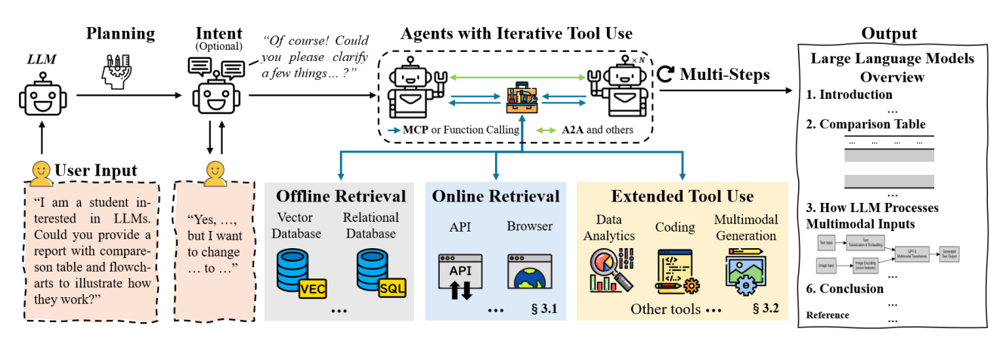
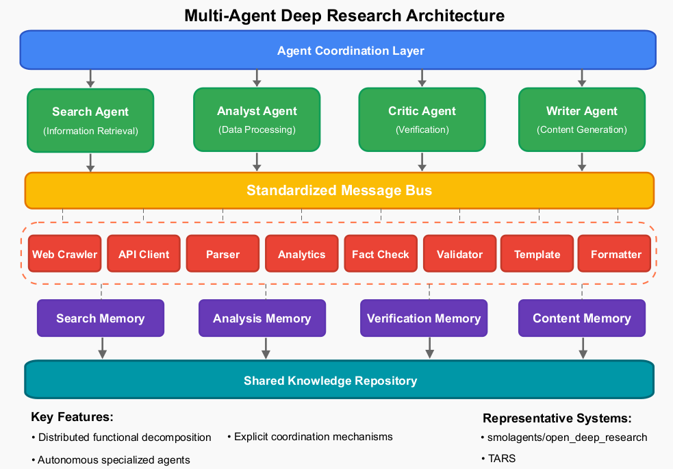

# AI for Research

人工智能（AI）技术正在引发知识发现、验证与应用方式的范式转变——传统研究方法依赖手动文献综述、实验设计和数据分析，如今正逐渐被能够自动化实现端到端研究工作流的智能系统所补充或替代。Deep Research 的出现，标志着大语言模型（LLM）、先进信息检索系统与自动化推理框架的融合，重新定义了学术研究与实际问题解决之间的边界。

下图是自动研究智能体的基本原理示意

下图是多智能协同的深度研究的框图

## References

### Survey
* [2025 - A Comprehensive Survey of Deep Research: Systems, Methodologies, and Applications](https://arxiv.org/abs/2506.12594)
    - [Awesome Deep Research list](https://github.com/scienceaix/deepresearch)
* [2025 - Deep Research Agents: A Systematic Examination And Roadmap](https://arxiv.org/abs/2506.18096)
    - [github - awesome-deep-research-agent](https://github.com/ai-agents-2030/awesome-deep-research-agent)

### System
* [doubao - 深入研究](https://www.doubao.com/chat/)
* https://autoglm.zhipuai.cn/
* [秘塔AI搜索](https://metaso.cn/)
* https://www.accio.com/
* https://www.perplexity.ai/

### code / programs

* [DeepResearchAgent - a hierarchical multi-agent system designed not only for deep research tasks but also for general-purpose task solving](https://github.com/SkyworkAI/DeepResearchAgent)
* [AI-Researcher: Autonomous Scientific Innovation](https://github.com/HKUDS/AI-Researcher)
    - https://arxiv.org/abs/2505.18705
* [DeepScientist - Advancing Frontier-Pushing Scientific Findings Progressively](https://github.com/ResearAI/DeepScientist)
    - https://arxiv.org/abs/2509.26603
* [AI-Scientist - Towards Fully Automated Open-Ended Scientific Discovery](https://github.com/SakanaAI/AI-Scientist)
    - https://github.com/SakanaAI/AI-Scientist-v2
    - https://arxiv.org/abs/2408.06292

    
### Tools / libs

#### data/doc collection
* https://github.com/xgzlucario/githubhunt 基于 AI Agent 的自然语言 Github 仓库搜索工具
* https://github.com/4everWZ/DailyPaper/tree/main grab everyday new paper from arxiv

#### Programming / Video / PPT
* https://github.com/HKUDS/AI-Researcher
* https://github.com/HKUDS/DeepCode
* https://github.com/jmiao24/Paper2Agent
* https://github.com/ResearAI/DeepScientist
* https://github.com/showlab/Paper2Video