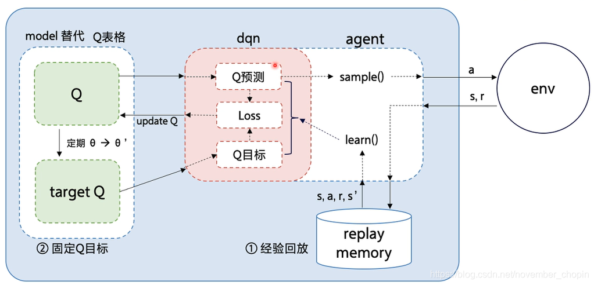
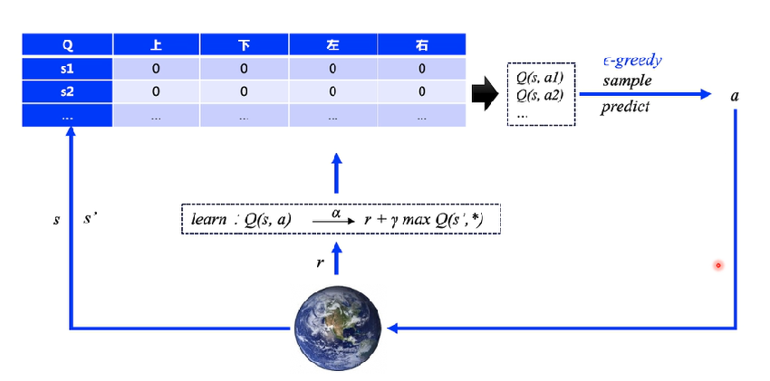
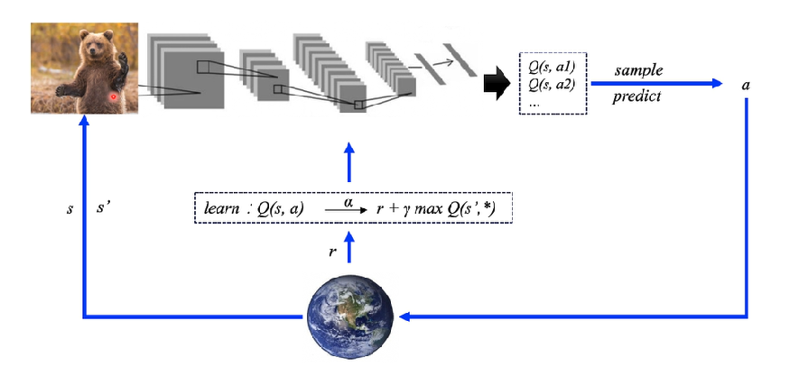

# Deep Q-Learning (DQN) 

Deep Q-Learning (DQN) 算法是 DeepMind 团队在2015年提出的算法，对于强化学习训练困难问题，其开创性的提出了两个解决办法，在atari游戏上都有不俗的表现。论文发表在了 Nature 上，此后的一些DQN相关算法都是在其基础上改进，可以说是打开了深度强化学习的大门，意义重大。

DQN的整体流程如下：

DQN算法的可以应用在多种控制、优化问题中，比如游戏控制、机器人控制、自动驾驶等。例如有一个Agent（智能体）需要控制小车的移动从而让倒立摆能够保持平衡，那么这个Agent就是一个智能体，它需要通过学习来找到最优的控制策略，从而让小车能够保持平衡。这个环境的具体的信息可以访问 [CartPole](https://gymnasium.farama.org/environments/classic_control/cart_pole/) 获取。

当代理观察环境的当前状态并选择动作时，环境会转换到新状态，并返回一个奖励，指示该动作的后果。在此任务中，每个增量时间步的奖励为 +1，如果杆倒下或小车偏离中心超过 2.4 个单位，环境就会终止。这意味着性能更好的场景将运行更长时间，从而累积更大的回报。

[CartPole](https://gymnasium.farama.org/environments/classic_control/cart_pole/) 任务的设计使得代理的输入是 4 个代表环境状态（位置、速度等）的实数值。我们将这 4 个输入不做任何缩放，并将它们传递到一个小型全连接网络，该网络有两个输出，每个输出对应一个动作。该网络经过训练，可以根据输入状态预测每个动作的预期值。然后选择预期值最高的动作。

其实DQN就是 Q-Learning 算法 + 神经网络。我们知道，Q-Learning 算法需要维护一张 Q 表格，按照下面公式来更新：
$$
Q(S_t, A_t) \leftarrow Q(S_t, A_t) + \alpha (R_{t+1} + \gamma \max_{a} Q(S_{t+1}, a) - Q(S_t, A_t))
$$

然后学习的过程就是更新 这张 Q表格，传统的Q-Learning的学习过程如下图所示：

而DQN就是用神经网络来代替这张 Q 表格，其余相同，如下图：

其更新方式为：
$$
Q(S_t, A_t, w) \leftarrow Q(S_t, A_t, w) + \alpha (R_{t+1} + \gamma \max_{a} \hat{q}(S_{t+1}, a, w) - Q(S_t, A_t, w))
$$

其中 $\Delta w$ 为：
$$
\Delta w = \alpha (R_{t+1} + \gamma \max_{a} \hat{q}(S_{t+1}, a, w) - \hat{q}(S_t, A_t, w)) \nabla_w \hat{q}(S_t, A_t, w)
$$

## 参考资料
* [Reinforcement Learning (DQN) Tutorial](https://pytorch.org/tutorials/intermediate/reinforcement_q_learning.html)
* [循序渐进讲解Deep Q-Networks（DQN）](https://blog.csdn.net/qq_43510916/article/details/135163557)
* [什么是 DQN](https://mofanpy.com/tutorials/machine-learning/torch/intro-DQN/)
* [一文读懂 Deep Q-Learning（DQN）算法](https://blog.csdn.net/november_chopin/article/details/107912720)
