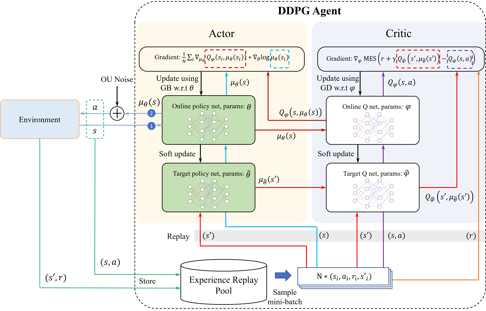
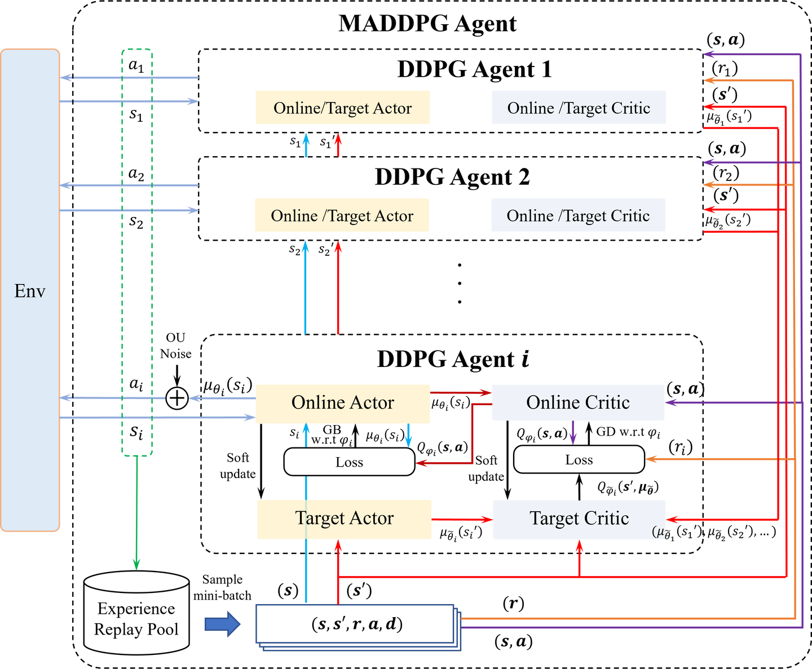

# DDPG（Deep Deterministic Policy Gradient）

深度确定性策略梯度算法，全称deep deterministic policy gradient，DDPG和PPO一样，依然保持AC架构，不同地方在于DDPG构造的是一个确定性策略，然后用梯度上升的方法来最大化Q值。它解决了Actor-Critic 神经网络每次参数更新前后都存在相关性，导致神经网络只能片面的看待问题这一缺点。从起源上讲，DDPG源于DQN，而非AC。

## MADDPG  (Multi-agent deep deterministic policy gradient)

传统RL算法面临的一个主要问题是由于每个智能体都是在不断学习改进其策略，因此从每一个智能体的角度看，环境是一个动态不稳定的，这不符合传统RL收敛条件。并且在一定程度上，无法通过仅仅改变智能体自身的策略来适应动态不稳定的环境。由于环境的不稳定，将无法直接使用之前的经验回放等DQN的关键技巧。policy gradient算法会由于智能体数量的变多使得本就有的方差大的问题加剧。

MADDPG算法具有以下三点特征： 

1. 通过学习得到的最优策略，在应用时只利用局部信息就能给出最优动作。 
2. 不需要知道环境的动力学模型以及特殊的通信需求。 
3. 该算法不仅能用于合作环境，也能用于竞争环境。

MADDPG算法具有以下三点技巧：

1. 集中式训练，分布式执行：训练时采用集中式学习训练critic与actor，使用时actor只用知道局部信息就能运行。critic需要其他智能体的策略信息，本文给了一种估计其他智能体策略的方法，能够只用知道其他智能体的观测与动作。
2. 改进了经验回放记录的数据。为了能够适用于动态环境，每一条信息由 $(x, x', a_q, ..., a_n, r_1, ..., r_n)$ 组成, $x=(o_1, ..., o_n)$ 表示每个智能体的观测。
3. 利用策略集合效果优化（policy ensemble）：对每个智能体学习多个策略，改进时利用所有策略的整体效果进行优化。以提高算法的稳定性以及鲁棒性。

其实MADDPG本质上还是一个DPG算法，针对每个智能体训练一个需要全局信息的Critic以及一个需要局部信息的Actor，并且允许每个智能体有自己的奖励函数（reward function），因此可以用于合作任务或对抗任务。并且由于脱胎于DPG算法，因此动作空间可以是连续的。

## 参考资料

DDPG:

* [DDPG 核心思想介绍](https://zhuanlan.zhihu.com/p/644773034)
* [Spining Up - DDPG](https://spinningup.openai.com/en/latest/algorithms/ddpg.html)
* [深度确定性策略梯度算法(DDPG)详解（附代码）](https://blog.csdn.net/qq_51399582/article/details/144651290)

MADDPG:

* [多智能体强化学习入门（四）——MADDPG算法](https://zhuanlan.zhihu.com/p/53811876)
* [多智能体强化学习——超详细的MADDPG原理及代码实现](https://juejin.cn/post/7243413799348518968v)
* [多智能体深度确定性策略梯度(MADDPG)算法介绍及代码实现](https://zhuanlan.zhihu.com/p/691363204)
* [MADDPG 核心思想介绍](https://zhuanlan.zhihu.com/p/645518155)