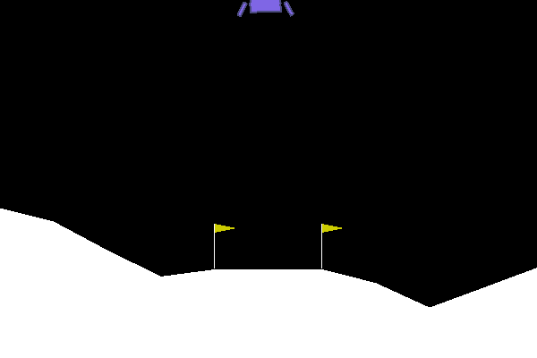

# DDPG

基于PyTorch的DDPG的示例程序，把虚拟环境改进成gymnasium，更好的和最新的Python，Numpy等库兼容。

## 仿真环境
gymnasium中的`LunarLanderContinuous-v3`

## 环境依赖
* gymnasium
* numpy
* matplotlib
* python3.6
* pytorch1.6

## 文件描述
* `train.py`为训练脚本，配置好环境后直接运行即可，不过需要在当前目录下创建`output_images`文件夹，用于放置生成的仿真结果；
* `test.py`为测试脚本，通过加载训练好的权重在环境中进行测试，测试训练效果。
* `network.py`为网络脚本，包括演员网络和评论家网络；
* `buffer.py`为经验回放池脚本；
* `DDPG.py`为DDPG算法的实现脚本；
* `utils.py`为工具箱脚本，里面主要放置一些通过函数；

## 仿真结果
详见`output_images`文件夹

## TODO
* [ ] 并行训练
  * 多环境并行采样​，同时运行多个环境实例，收集多样化的经验数据。​​创建多个环境​​：使用 SubprocVecEnv 或 DummyVecEnv（需 gym 或 gymnasium）。​​集中存储​​：将所有经验存入共享的 Replay Buffer。
  * Actor-Learner 解耦（分布式框架）​: 分离 Actor（交互）和 Learner（更新）进程，使用 ​​Ray​​ 或 ​​PyTorch 分布式库​​ 实现。​​全局网络（Global Network）​​：Learner 维护并定期同步参数。​​多个 Actor 进程​​：每个 Actor 从全局网络拉取参数，独立与环境交互，推送经验到 Buffer。​​中央 Learner​​：从 Buffer 采样并更新全局网络。

