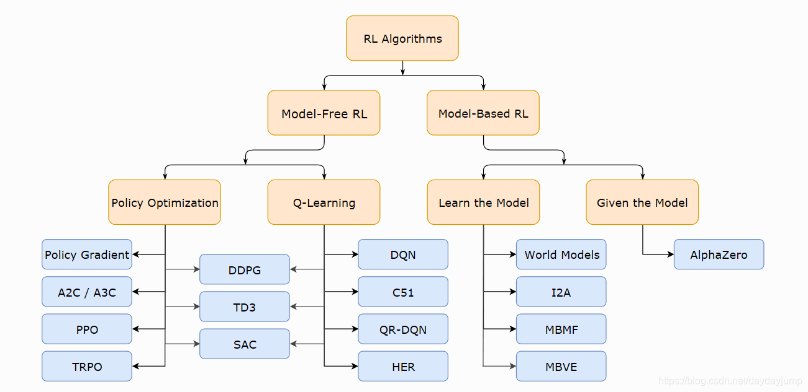

# 深度强化学习

强化学习（Reinforcement Learning，RL）是机器学习的一个重要分支，相较于机器学习经典的有监督学习、无监督学习问题，强化学习最大的特点是在交互中学习。人工智能中的很多应用问题需要算法在每个时刻做出决策并执行动作，例如围棋，每一步需要决定在棋盘的哪个位置放置棋子，以最大的可能战胜对手；无人机需要根据环境中的障碍物或者敌机的位置、态势等信息，选择最优的控制指令；对于自动驾驶算法，需要根据路况来确定当前的行驶策略以保证安全地行驶到目的地等。这类问题有一个共同的特点：智能体（Agent）在与环境的交互中根据获得的奖励或惩罚不断的学习知识，调整自己的动作策略，以达到某一预期目标，从而更加适应环境。解决这类问题的机器学习算法称为强化学习。虽然传统的强化学习理论在过去几十年中得到了不断的完善，但还是难以解决现实世界中的复杂问题。强化学习的范式非常类似于人类学习知识的过程，也正因此，强化学习被视为实现通用人工智能重要途径。

深度强化学习（DRL，Deep Reinforcement Learning）是深度学习与强化学习相结合的产物，它集成了深度学习在视觉等感知问题上强大的理解能力以及强化学习的决策能力，实现了端到端学习。深度强化学习的出现使得强化学习技术真正走向实用，应用于解决现实世界中的复杂问题。从2013年深度Q网络（Deep Q Network，DQN）出现到目前为止，深度强化学习领域出现了大量的算法以及解决实际应用问题的论文。在这一章对深度强化学习的算法与应用进行介绍，主要包括强化学习的基本原理，深度强化学习的基本思想，基于价值函数的深度强化学习算法，以及如何应用到控制方面。主要的深度强化学习如下图所示。

