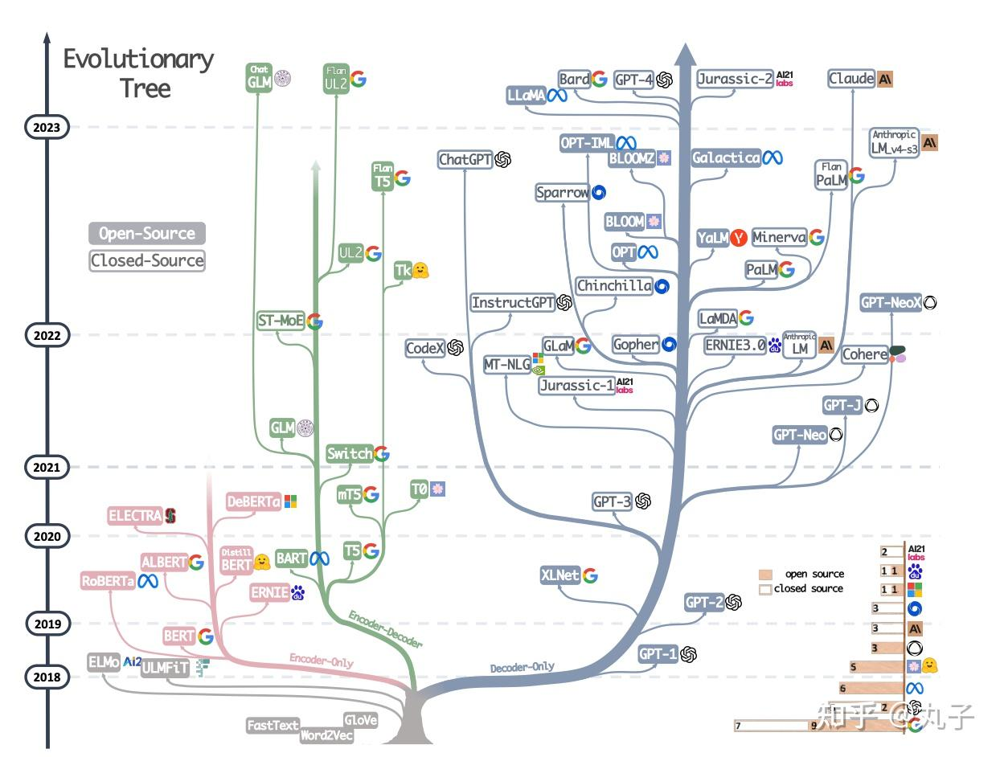

# 大语言模型

大规模语言模型（大语言模型或大型语言模型），英文名（Large Language Model,LLM）它的大体现在参数量上，量级至少在百万以上，匹配这种参数量，大量的训练数据以及大规模的计算资源自然是不可缺少的。再说说语言模型，网上有很多关于自然语言模型的发展历程，借鉴一个我觉得最合理的，大致分为四个阶段：统计语言模型、神经网络语言模型、预训练语言模型、大语言模型。

机器学习研究人员已经多年努力开发语言大模型（LLM），但早期大众并没有太关注，也没有意识到它们的强大能力。随着GPT的爆火，现在几乎每个人都听说过LLM，并有数千万人使用过它们，但真正了解其工作原理的人却很少。训练LLM就是用于“预测下一个词”，而且它们需要大量的文本来实现这一点。那么它们如何预测下一个词的细节如何？却不容易找到答案。

## 参考资料

* [一文读懂：大语言模型的实现与原理](https://zhuanlan.zhihu.com/p/669245797)

### 视频教程
* [LLM大模型教程](https://www.bilibili.com/video/BV1XS411w7qr)
* [54个大模型实战项目](https://www.bilibili.com/video/BV1kDpme9EwU)
* [从零开始学习大语言模型](https://www.bilibili.com/video/BV1v4421w7pU)
