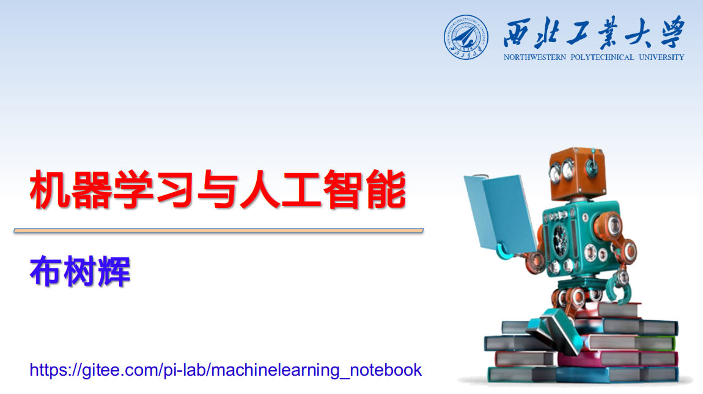

# 机器学习与人工智能

机器学习越来越多应用到飞行器、机器人等领域，其目的是利用计算机实现类似人类的智能，从而实现装备的智能化与无人化。本课程旨在引导学生掌握机器学习的基本知识、典型方法与技术，通过具体的应用案例激发学生对该学科的兴趣，鼓励学生能够从人工智能的角度来分析、解决飞行器、机器人所面临的问题和挑战。本课程主要内容包括Python编程基础，机器学习模型，无监督学习、监督学习、深度学习基础知识与实现，并学习如何利用机器学习解决实际问题，从而全面提升自我的[综合能力](Targets.md)。

本课程有配套教材[《机器学习算法与实现》](http://www.adv-ci.com/blog/mlai/)，该书以机器学习的算法原理与实现贯穿始终，通过算法、数据结构、面向对象、编程实现一步一步地引入，让读者无需额外学习算法与数据结构等知识，就能理解并应用机器学习到各自的专业。本书配有教学视频、在线讲义、习题和练习项目，适合各专业读者作为教材或者自学，能够给相关领域的工程师提供全面而又丰富资料，因此能够更好的掌握机器学习的理论、算法和应用。购买的方式：[《淘宝购买》](https://detail.tmall.com/item.htm?id=690461235159), [《当当网购买》](http://product.dangdang.com/11305232248.html)， [《JD购买》](https://item.jd.com/13493037.html) 。

由于 **本课程需要大量的编程练习才能取得比较好的学习效果** ，因此需要认真去完成[《机器学习与人工智能-作业和报告》](https://gitee.com/pi-lab/machinelearning_homework)，写作业的过程可以查阅网上的资料，但是不能直接照抄，需要自己独立思考并独立写出代码。本教程的Python等运行环境的安装说明请参考[《Python环境安装》](references_tips/InstallPython.md)。

为了让大家更好的自学本课程，课程讲座的视频在[《B站 - 机器学习与人工智能》](https://www.bilibili.com/video/BV1oZ4y1N7ei/)，欢迎大家观看学习。

## 一、 内容
1. [课程简介](CourseIntroduction.pdf) ([PPT文件下载](https://pan.baidu.com/s/10zreXtK_d5rZTh6Hw08x4w?pwd=yvm4))
2. [Python](0_python/README.md)
   - [Install Python](references_tips/InstallPython.md)
   - [ipython & notebook](0_python/0-ipython_notebook.ipynb)
   - [Python Basics](0_python/1_Basics.ipynb)
   - [Print Statement](0_python/2_Print_Statement.ipynb)
   - [Data Structure 1](0_python/3_Data_Structure_1.ipynb)
   - [Data Structure 2](0_python/4_Data_Structure_2.ipynb)
   - [Control Flow](0_python/5_Control_Flow.ipynb)
   - [Function](0_python/6_Function.ipynb)
   - [Class](0_python/7_Class.ipynb)
3. [numpy & matplotlib](1_numpy_matplotlib_scipy_sympy/README.md)
   - [numpy](1_numpy_matplotlib_scipy_sympy/1-numpy_tutorial.ipynb)
   - [matplotlib](1_numpy_matplotlib_scipy_sympy/2-matplotlib_tutorial.ipynb)
4. [kNN](2_knn/knn_classification.ipynb)
5. [kMeans](3_kmeans/1-k-means.ipynb)
   - [kMeans - Image Compression](3_kmeans/2-kmeans-color-vq.ipynb)
   - [Cluster Algorithms](3_kmeans/3-ClusteringAlgorithms.ipynb)
6. [Logistic Regression](4_logistic_regression/)
   - [Least squares](4_logistic_regression/1-Least_squares.ipynb)
   - [Logistic regression](4_logistic_regression/2-Logistic_regression.ipynb)
   - [PCA and Logistic regression](4_logistic_regression/3-PCA_and_Logistic_Regression.ipynb)
7. [Neural Network](5_nn/)
   - [Perceptron](5_nn/1-Perceptron.ipynb)
   - [Multi-layer Perceptron & BP](5_nn/2-mlp_bp.ipynb)
   - [Softmax & cross-entroy](5_nn/3-softmax_ce.ipynb)
8. [PyTorch](6_pytorch/README.md)
   - [Tensor](6_pytorch/1-tensor.ipynb)
   - [autograd](6_pytorch/2-autograd.ipynb)
   - [linear-regression](6_pytorch/3-linear-regression.ipynb)
   - [logistic-regression](6_pytorch/4-logistic-regression.ipynb)
   - [nn-sequential-module](6_pytorch/5-nn-sequential-module.ipynb)
   - [deep-nn](6_pytorch/6-deep-nn.ipynb)
   - [param_initialize](6_pytorch/7-param_initialize.ipynb)
   - [optim/sgd](6_pytorch/optimizer/6_1-sgd.ipynb)
   - [optim/adam](6_pytorch/optimizer/6_6-adam.ipynb)
9. [Deep Learning](7_deep_learning/README.md)
   - [CNN](7_deep_learning/1_CNN)
      - [CNN Introduction](7_deep_learning/1_CNN/CNN_Introduction.pptx)
      - [CNN simple demo](demo_code/3_CNN_MNIST.py)
      - [Basic of Conv](7_deep_learning/1_CNN/01-basic_conv.ipynb)
      - [LeNet5](7_deep_learning/1_CNN/02-LeNet5.ipynb)
      - [AlexNet](7_deep_learning/1_CNN/03-AlexNet.ipynb)
      - [VGG Network](7_deep_learning/1_CNN/04-vgg.ipynb)
      - [GoogleNet](7_deep_learning/1_CNN/05-googlenet.ipynb)
      - [ResNet](7_deep_learning/1_CNN/06-resnet.ipynb)
      - [DenseNet](7_deep_learning/1_CNN/07-densenet.ipynb)
      - [Batch Normalization](7_deep_learning/1_CNN/08-batch-normalization.ipynb)
      - [Learning Rate Decay](7_deep_learning/1_CNN/09-lr-decay.ipynb)
      - [Regularization](7_deep_learning/1_CNN/10-regularization.ipynb)
      - [Data Augumentation](7_deep_learning/1_CNN/11-data-augumentation.ipynb)
   - [RNN](7_deep_learning/2_RNN)
      - [RNN基础](7_deep_learning/2_RNN/pytorch-rnn.ipynb)
      - [RNN应用于图像](7_deep_learning/2_RNN/rnn-for-image.ipynb)
      - [LSTM与时序列数据分析](7_deep_learning/2_RNN/time-series/lstm-time-series.ipynb)
   - [GAN](7_deep_learning/3_GAN)
      - [AutoEncoder](7_deep_learning/3_GAN/autoencoder.ipynb)
      - [VAE](7_deep_learning/3_GAN/vae.ipynb)
      - [GAN](7_deep_learning/3_GAN/gan.ipynb)
      - [StableDiffusion](7_deep_learning/3_GAN/StableDiffusion.md)
   - [Transformer](7_deep_learning/5_Transformer)
   - [多模态深度学习](7_deep_learning/6_MultiModal)
   - [构建深度神经网络的一些实战建议](references_tips/构建深度神经网络的一些实战建议.md)
10. [机器学习的应用](8_app)
   - [目标识别与语义分割](8_app/1_object-detection_segmentation)
      - [目标识别](8_app/1_object-detection_segmentation/1_object-detection)
      - [语义分割](8_app/1_object-detection_segmentation/2_segmentation)
   - [强化学习](8_app/2_drl)
      - [Q-Learning](8_app/2_drl/1-Q-Learning)
      - [DQN](8_app/2_drl/2-DQN)
      - [DDPG](8_app/2_drl/3-DDPG)
      - [PPO](8_app/2_drl/4-PPO)
      - [SAC](8_app/2_drl/5-SAC)
   - [大语言模型](8_app/3_llm)
      - [BERT](8_app/3_llm/1_BERT)
      - [GPT](8_app/3_llm/2_GPT)
      - [DeepSeek-V3， DeepSeek-R1](8_app/3_llm/3_DeepSeek)
      - [RAG](8_app/3_llm/4_RAG)
      - [CoT](8_app/3_llm/5_CoT)
      - [Agent](8_app/3_llm/6_Agent)
      - [Workflow](8_app/3_llm/7_Workflow)
   - [机器视觉与3D重建](8_app/4_cv_3d)
      - [NeRF](8_app/4_cv_3d/1_NeRF)
      - [Gaussian Splatting](8_app/4_cv_3d/2_3DGS)
      - [VGGT](8_app/4_cv_3d/3_VGGT)
   - [视觉-语言-动作 VLA](8_app/5_VLA)
11. [机器学习的高级技巧](9_advanced)
      - [应用部署](9_advanced/1_deploy)
      - [蒸馏](9_advanced/2_distillation)
      - [模型微调](9_advanced/3_fine-tuning)

## 二、学习的建议
1. 为了更好的学习本课程，需要大家把[Python编程](0_python)能力培养好，通过一定数量的练习题、小项目培养Python编程思维，为后续的机器学习理论与实践打好坚实的基础。
2. 机器学习是一门应用、实践性质很强的学科，需要理论结合实践并在实际应用中进行学习。学习一门知识最好的办法就是使用它，因此建议读者一定要自己动手实操，不要嫌麻烦，尽可能把本书中的代码全部自己敲一下这样才能对内容有更加深刻的理解。
3. 本课程各个章节都有[作业](https://gitee.com/pi-lab/machinelearning_homework)，此外还有[综合练习项目](https://gitee.com/pi-lab/machinelearning_homework)，通过完成作业和练习项目来加深对所学知识的理解。
4. 每个课程前半部分是理论基础，后半部分是代码实现。如果想学的更扎实，可以自己把各个方法的代码亲自实现一下。做的过程如果遇到问题尽可能自己想解决办法，因为最重要的目标不是代码本身，而是学会分析问题、解决问题的能力。
5. 有些同学看完数学公式后觉得自己理解了，可是要写程序时却不知如何下手，然后就会发现自己其实并没有完全理解。因此，编写程序是一种验证自己是否真正理解数学和理论的重要方法。另外，即使无法理解数学公式，通过运行别人编写好的程序（与数学公式对应且可运行的)，并与公式相互验证、分析也可以帮助自己理解。
6. **不能直接抄已有的程序，或者抄别人的程序**，如果自己不会要自己去想，去找解决方法，或者去问。如果直接抄别人的代码，这样的练习一点意义都没有。**如果感觉太难，可以做的慢一些，但是坚持自己思考、自己编写练习代码**。
7. **请先遍历一遍所有的文件夹，了解有什么内容，资料**。各个目录里有很多说明文档，如果不会，可先找找有没有相关的文档，如果找不到合适的文档就去网上找找。通过这个过程锻炼自己搜索文献、资料的能力。
8. 人的时间和精力是有限的，在目前学科大融合的背景下，各位同学不单单是学这一门课，还有很多专业课需要学习。即使最终理解并掌握了这门课，但如果花费了太多时间，那就耽误其他课程的学习。如果为了准备数学``装备”而从指数、对数、导数、矩阵、概率和统计等一一学起，那么光是这些就需要花费很长时间，很不现实。此外，在攀登机器学习这座高山时，假如你想把各种各样的方法和概念全都理解，那么你可能因为追寻绝佳景色的道路过于漫长而中途放弃。
9. 因此建议同学们先建立感性认识，虽然不是很全面，但是足以去解决一些实际问题，在解决问题的过程加深对理论、算法、编程、验证等方面的理解。此外，尽可能在掌握基本知识的情况下就开始做习题、小项目，在做的过程去查资料，并不断完善自己的知识和技能。**尽可能采用循环迭代的方式去学习，不要强求自己一步就学会，而是在做、学的过程不断强化感性认识，并牵引理论学习。**
10. 本课程的练习题最好使用[《Linux》](https://gitee.com/pi-lab/learn_programming/blob/master/6_tools/linux)以及Linux下的工具来做。逼迫自己使用[《Linux》](https://gitee.com/pi-lab/learn_programming/blob/master/6_tools/linux)，只有多练、多用才能快速进步。如果实在太难，先在虚拟机（建议VirtualBox）里装一个Linux（例如Ubuntu，或者LinuxMint等），先熟悉一下。但是最终需要学会使用Linux。

## 三、[参考资料](References.md)
* [教程、代码](References.md)
* 资料速查
  * [相关学习参考资料汇总](References.md)
  * [一些速查手册](references_tips/cheatsheet)
* 机器学习方面技巧等
  * [Confusion Matrix](references_tips/confusion_matrix.ipynb)
  * [Datasets](references_tips/datasets.ipynb)
  * [构建深度神经网络的一些实战建议](references_tips/构建深度神经网络的一些实战建议.md)
  * [Intro to Deep Learning](references_tips/Intro_to_Deep_Learning.pdf)
* Python技巧等
  * [安装Python环境](references_tips/InstallPython.md)
  * [Python tips](references_tips/python)
* [Git教程](https://gitee.com/pi-lab/learn_programming/blob/master/6_tools/git/README.md)
* [Markdown教程](https://gitee.com/pi-lab/learn_programming/blob/master/6_tools/markdown/README.md)

