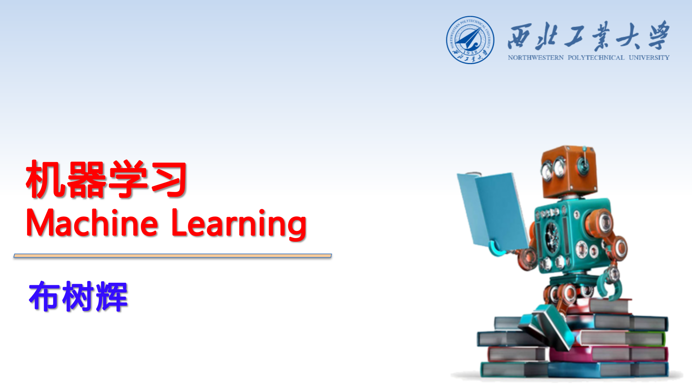

# 机器学习

本教程主要讲解机器学习的基本原理与实现，通过本教程的引导来快速学习Python、Python常用库、机器学习的理论知识与实际编程，并学习如何解决实际问题。

由于**本课程需要大量的编程练习才能取得比较好的学习效果**，因此需要认真去完成[作业和报告](https://gitee.com/pi-lab/machinelearning_homework)，写作业的过程可以查阅网上的资料，但是不能直接照抄，需要自己独立思考并独立写出代码。

## 1. 内容
1. [课程简介](CourseIntroduction.pdf)
2. [Python](0_python/)
   - [Install Python](tips/InstallPython.md)
   - [Introduction](0_python/0_Introduction.ipynb)
   - [Python Basics](0_python/1_Basics.ipynb)
   - [Print Statement](0_python/2_Print_Statement.ipynb)
   - [Data Structure 1](0_python/3_Data_Structure_1.ipynb)
   - [Data Structure 2](0_python/4_Data_Structure_2.ipynb)
   - [Control Flow](0_python/5_Control_Flow.ipynb)
   - [Function](0_python/6_Function.ipynb)
   - [Class](0_python/7_Class.ipynb)
3. [numpy & matplotlib](1_numpy_matplotlib_scipy_sympy/)
   - [numpy](1_numpy_matplotlib_scipy_sympy/numpy_tutorial.ipynb)
   - [matplotlib](1_numpy_matplotlib_scipy_sympy/matplotlib_simple_tutorial.ipynb)
   - [ipython & notebook](1_numpy_matplotlib_scipy_sympy/ipython_notebook.ipynb)
4. [knn](2_knn/knn_classification.ipynb)
5. [kMenas](3_kmeans/k-means.ipynb)
6. [Logistic Regression](4_logistic_regression/)
   - [Least squares](4_logistic_regression/Least_squares.ipynb)
   - [Logistic regression](4_logistic_regression/Logistic_regression.ipynb)
7. [Neural Network](5_nn/)
   - [Perceptron](5_nn/Perceptron.ipynb)
   - [Multi-layer Perceptron & BP](5_nn/mlp_bp.ipynb)
   - [Softmax & cross-entroy](5_nn/softmax_ce.ipynb)
8. [PyTorch](6_pytorch/)
   - Basic 
      - [short tutorial](6_pytorch/PyTorch_quick_intro.ipynb)
      - [basic/Tensor-and-Variable](6_pytorch/0_basic/Tensor-and-Variable.ipynb)
      - [basic/autograd](6_pytorch/0_basic/autograd.ipynb)
      - [basic/dynamic-graph](6_pytorch/0_basic/dynamic-graph.ipynb)
   - NN & Optimization
      - [nn/linear-regression-gradient-descend](6_pytorch/1_NN/linear-regression-gradient-descend.ipynb)
      - [nn/logistic-regression](6_pytorch/1_NN/logistic-regression.ipynb)
      - [nn/nn-sequential-module](6_pytorch/1_NN/nn-sequential-module.ipynb)
      - [nn/bp](6_pytorch/1_NN/bp.ipynb)
      - [nn/deep-nn](6_pytorch/1_NN/deep-nn.ipynb)
      - [nn/param_initialize](6_pytorch/1_NN/param_initialize.ipynb)
      - [optim/sgd](6_pytorch/1_NN/optimizer/sgd.ipynb)
      - [optim/adam](6_pytorch/1_NN/optimizer/adam.ipynb)
   - CNN
      - [CNN simple demo](demo_code/3_CNN_MNIST.py)
      - [cnn/basic_conv](6_pytorch/2_CNN/basic_conv.ipynb)
      - [cnn/minist (demo code)](./demo_code/3_CNN_MNIST.py)
      - [cnn/batch-normalization](6_pytorch/2_CNN/batch-normalization.ipynb)
      - [cnn/regularization](6_pytorch/2_CNN/regularization.ipynb)
      - [cnn/lr-decay](6_pytorch/2_CNN/lr-decay.ipynb)
      - [cnn/vgg](6_pytorch/2_CNN/vgg.ipynb)
      - [cnn/googlenet](6_pytorch/2_CNN/googlenet.ipynb)
      - [cnn/resnet](6_pytorch/2_CNN/resnet.ipynb)
      - [cnn/densenet](6_pytorch/2_CNN/densenet.ipynb)
   - RNN
      - [rnn/pytorch-rnn](6_pytorch/3_RNN/pytorch-rnn.ipynb)
      - [rnn/rnn-for-image](6_pytorch/3_RNN/rnn-for-image.ipynb)
      - [rnn/lstm-time-series](6_pytorch/3_RNN/time-series/lstm-time-series.ipynb)
   - GAN
      - [gan/autoencoder](6_pytorch/4_GAN/autoencoder.ipynb)
      - [gan/vae](6_pytorch/4_GAN/vae.ipynb)
      - [gan/gan](6_pytorch/4_GAN/gan.ipynb)

## 2. 学习的建议
1. 为了更好的学习本课程，需要大家把Python编程的基础能力培养好，这样后续的机器学习方法学习才比较扎实。
2. 每个课程前部分是理论基础，然后是代码实现。个人如果想学的更扎实，可以自己把各个方法的代码亲自实现一下。做的过程尽可能自己想解决办法，因为重要的学习目标不是代码本身，而是学会分析问题、解决问题的能力。

## 3. 其他参考资料
* 资料速查
  * [相关学习参考资料汇总](References.md)
  * [一些速查手册](tips/cheatsheet)

* 机器学习方面技巧等
  * [Confusion Matrix](tips/confusion_matrix.ipynb)
  * [Datasets](tips/datasets.ipynb)
  * [构建深度神经网络的一些实战建议](tips/构建深度神经网络的一些实战建议.md)
  * [Intro to Deep Learning](tips/Intro_to_Deep_Learning.pdf)

* Python技巧等
  * [安装Python环境](tips/InstallPython.md)
  * [Python tips](tips/python)

* Git
  * [Git Tips - 常用方法速查，快速入门](https://gitee.com/pi-lab/learn_programming/blob/master/6_tools/git/git-tips.md)
  * [Git快速入门 - Git初体验](https://my.oschina.net/dxqr/blog/134811)
  * [在win7系统下使用TortoiseGit(乌龟git)简单操作Git](https://my.oschina.net/longxuu/blog/141699)
  * [Git系统学习 - 廖雪峰的Git教程](https://www.liaoxuefeng.com/wiki/0013739516305929606dd18361248578c67b8067c8c017b000)

* Markdown
  * [Markdown——入门指南](https://www.jianshu.com/p/1e402922ee32)

## 4. 相关学习资料参考

在上述内容学习完成之后，可以进行更进一步机器学习、计算机视觉方面的学习与研究，具体的资料可以参考：
1. [《一步一步学编程》](https://gitee.com/pi-lab/learn_programming)
2. 智能系统实验室-培训教程与作业
    - [《智能系统实验室-暑期培训教程》](https://gitee.com/pi-lab/SummerCamp)
    - [《智能系统实验室-暑期培训作业》](https://gitee.com/pi-lab/SummerCampHomework)
3. [智能系统实验室研究课题](https://gitee.com/pi-lab/pilab_research_fields3. [智能系统实验室研究课题](https://gitee.com/pi-lab/pilab_research_fields)
4. [编程代码参考、技巧集合](https://gitee.com/pi-lab/code_cook)
    - 可以在这个代码、技巧集合中找到某项功能的示例，从而加快自己代码的编写
