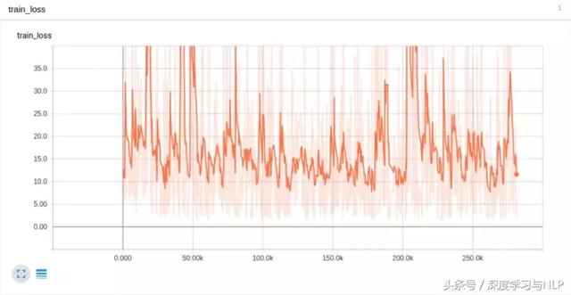
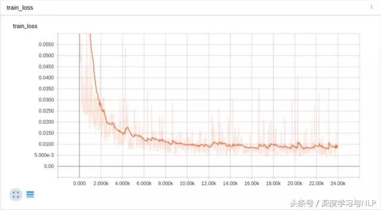
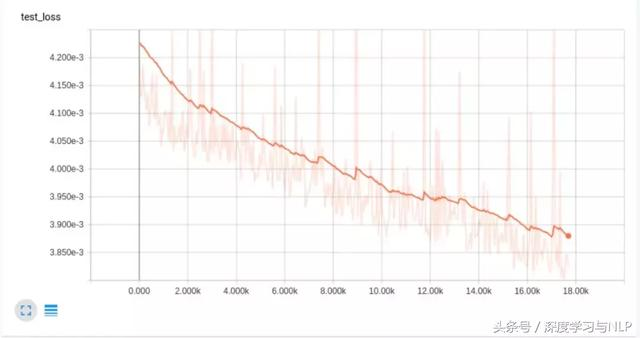
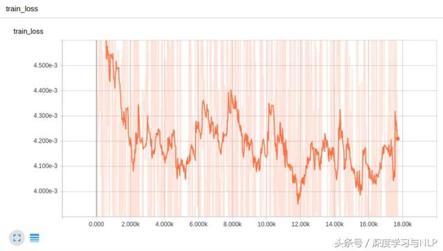

# 构建深度神经网络的一些实战建议

我们将整理在训练神经网络实战过程中用到的很多有用的tips（主要基于Tensorflow平台）。一些建议可能对你非常用有用，有些可能没有太大的启发意义。一些建议可能对于你不太实用，限于个人都统一整理，大家根据个人经验、场景选择。

更多详细的深度学习技巧等可以参考：
* [Machine Learning Yearning 中文版 - 《机器学习训练秘籍》](https://github.com/deeplearning-ai/machine-learning-yearning-cn) ([在线阅读](https://deeplearning-ai.github.io/machine-learning-yearning-cn/))

* [33个神经网络「炼丹」技巧](https://www.toutiao.com/a6761273383452672524)

* Image Segmentation: Tips and Tricks from 39 Kaggle Competitions (2020)
	- https://neptune.ai/blog/image-segmentation-tips-and-tricks-from-kaggle-competitions
	- https://www.jiqizhixin.com/articles/2020-05-01

## 常见的一些tips

**1、使用Adam作为优化器。** Adam优化效果非常好。与传统的优化器（optimizer），如传统的梯度下降法，它应该是首选。Tensorflow实践笔记：当保存和回复模型参数时，设置AdamOptimizer之后，一定记得设置Saver，因为Adam有些state也需要恢复（即每个weight的学习率）。

**2、采用ReLu作为非线性激活函数。** Relu训练速度非常快，简单，而且训练效果非常好，不存在梯度消失的问题。尽管sigmoid是最常见的激活函数，但其存在梯度消失的问题，随着梯度反传深度的加深，梯度传递效率大大降低。

**3、在网络的输出层不要使用激活函数。** 这很明显，但如果你默认在每一层都设置激活函数就很容易犯这个错误，所以一定记得在输出层取消掉激活函数。

**4、在每一层都添加偏置项（bias）。** 因为偏置项很重要，可以把一个平面转换成一个best-fitting position。比如，y=mx+b，b就是偏置项，它使得一条直线上线移动，以便找到最优的position。

**5、使用variance-scaled 初始化。** 在Tensorflow中，就是这个接口：`tf.contrib.layers.variance_scaling_initializer()`。在我们的经验中，这种generalizes/scales比其他常用的初始化方法要好，如Gaussian，truncated normal和Xavier。一般来说，方差调整初始化方法基于每一层输入和输出的神经元（Tensorflow中默认输入神经元数目）的数目来调整随机初始化的权重的偏差。因此，在没有额外的“hacks”，如clipping或batch normalization，帮助下，可以帮助signals传递到更深的网络中。Xavier也比较类似，除非所有的层都有相似的偏差，但网络不同的层具有非常不同的形状（shapes）（在CNN中很常见），所有的层具有相同的偏差不能处理这样的场景。

**6、Whiten（规范化，normalize）输入数据。** 训练时，减去输入数据的均值，然后除以输入数据的方差。模型的权重延伸和拓展的角度越小，网络学习更容易且速度越快。保持输入数据是零均值的（mean-centered）且具有恒大的方差，可以帮助实现这一点。对于所有的测试数据也需要执行这一点，所以一定要确保你的训练数据与真实数据高度相似。

**7、在保留输入数据dynamic range的情况下，对输入数据进行尺度变换。** 这个操作与normalization相关，但应先于normalization执行。举个例子，数据X实际的变化范围是[0, 140000000]，这可以被激活函数tanh（x）或tanh（x/c）所驯服（c是一个常量，延展曲线，在输入数据的变化范围匹配（fit）输入的动态特性，即tanh函数倾斜（激活）部分）。特别是你的输入数据根本没有一个上下限变化范围时，神经网络可以在（0，1）范围内，学得更好。

**8、不要改变learning rate的衰减。** 学习速率的衰减在SGD中很常见，而且ADAM中也会自然调整它。如果你想直接一点点的调整学习速率，比如，在训练一段时间后，减小学习速率，误差曲线可能会突然drop一点点，随后很快恢复平整。

**9、如果你使用的卷积层使用64或128的卷积核，这已经足够了。** 特别是对于深度网络，确实，128已经很大了。如果你已经有了一个更大的卷积核了，增加更多的卷积核，并不会带来效果的提升。

**10、Pooling（池化）以保持转移不变性。** Pooling主要是让网络对于图片输入的“该部分”具有一个“普适的作用”。比如说，最大池化（Max pooling）可以帮助CNN对于发生旋转、偏置和特征尺度变换的输入图像，也能够具有的鲁棒性。

## 神经网络诊断tips

如果网络不学习（意思是：loss/accuracy在训练过程中不收敛，或者没有得到你预期的结果），尝试下面的tips：

**1、过拟合。** 如果你的模型不学习，首先应该想到模型是否陷入了过拟合情况。在一个很小的数据集上训练模型，准确率达到了100%或99.99%，或者error接近于0。如果你的神经网络不能实现过拟合，说明你的网络结构存在一些严重的问题，但也可能不是很明显。如果你的模型在小数据上过拟合，但在大数据集上任然不收敛，试一试下面的suggestion。

**2、减小学习速率。** 模型的学习速度会变慢，但模型可以到达一个更小的局部极小值，这个点因为之前的步长过大而跳不进来。

**3、增大学习速率。** 这可以加速模型的训练，尽快收敛，帮助模型跳出局部极小值。尽管神经网络很快就收敛了，但是其结果并不是最好的，其“收敛”得到的结果可能会及其稳定，即不同训练，得到结果差别很大。（使用Adam，我们发现0.001是一个很好的初始值）。

**4、减小（mini）batch size。** 减小batch size至1可以得到模型参数调整最细粒度的变化，你可以在Tensorboard（或其他debugging/可视化工具）中观察到，确定梯度更新是否存在问题。

**5、去除batch normalization。** 当你把batch size减小至1时，起初BN可以帮助你发现模型是否存在梯度爆炸或梯度消失的问题。曾经，我们有一个神经网络不收敛，仅当我们去除BN之后我们才发现模型的输入在第二个iteration是变成了NaN。BN是一种锦上添花的措施，它只有在你确定你的模型不存在其他问题时才能正常发挥其强大的功能。

**6、增大（mini-）batch size。** 增加batch size是必须的，越大的batch size可以减小梯度更新的方差，使得每一轮的梯度更新更加准确。换句话说，梯度更新会沿着准确的方向移动。但是！我们不可能无限制的增加batch size，因为计算机的物理内存是有限的。经验证明，这一点没有之前提出的两个suggestion重要，即减小batch size和去除BN。

**7、检查你的reshape操作。** 频繁的进行reshape操作（比如，改变图像X和Y的维度）可能会破环空间的局部特性（spatially local features），使得神经网络几乎不能准确学习，因为它们必须学习错误的reshape。（自然的features变得破碎不堪，因为CNN的卷积操作高度依赖这些自然情况下的局部空间特征）同时对多个图片/channels进行reshape操作时必须非常的小心，使用numpy.stack()进行正确的对齐。

**8、监视你loss函数的变化。** 如果使用的时一个复杂的函数作为目标函数，尽量使用L1或L2约束去去简化它。我们发现，L1对于边界没有那么敏感，当模型遇到噪声训练数据时，模型参数调整没有那么剧烈。

**9、尽可能的进行模型训练可视化。** 如果你有可视化的工具，如matplotlib、OpenCV、Tensorboard等等，尽量可视化网络中值得scale、clipping等得变化，并保证不同参数着色策略得一致性。

## 给出一些实际得例子

为了帮助你理解上面所讲得tips，我们这里给出我们构建了CNN网络，得到的一些loss得图（通过TensorBoard给出）来辅助说明。

首先，模型根本没有学习情况：

我们尝试着对value进行clipping（裁剪）操作，保证它们不会超过一个固定得bounds，得到以下结果：

然而，loss曲线仍然不够平滑。学习速率是否任然过大呢？我们又尝试对学习速率进行衰减操作，同时采用一个训练样本进行训练：

可以发现，大约在第300和3000 steps时，学习速率的变化情况。很明显，学习速率下降太快了。所以，需要让学习速率每一次衰减的时间间隔变得更长，这样得到的结果更好：

可以发现，在step 2000和5000的时候，进行decay，这样得到的结果更好，但也并不非常理想，loss并没有下降至0。

下面，我们去除掉LR衰减策略，把输入经过一个tanh函数处理，把输入数据最大最小值压缩到一个更小的范围。尽管很明显，这个操作对于小于1的值会带来一些误差，但我们人道没能实现达到过拟合的目标。

通过实践我们发现，去掉BN之后，在1或2个iteration之后，网络的输出就变成了NaN。我们去除了BN，同时对参数初始化策略添加方差幅度进行约束（variance scaling）。这一操作使得结果发生了巨大变化。对于几个输入训练样本，模型终于过拟合了。尽管误差值超过了5，但是最终的误差降低了4个数量级。

上面这张图得loss曲线非常平滑，可以发现它在测试数据上过拟合了，在训练数据上得loss曲线只是降到了0.01。这是因为没有对学习速率进行衰减操作，所以loss降不下去了。随后我们把学习速率降低了一个数量级，得到了更好得结果：

可以发现，上面得结果更好了！但倘若只是衰减学习速率，而不把训练分为两个部分呢？

通过给学习率每一个step都乘以一个衰减系数0.9995，得到的结果并不是很好：

出现这种情况，可能是因为衰减过快了。因此我们把衰减系数变成0.999995，结果则更好一点，但最终的结果也基本类似，loss并没有继续减小。通过这一些列的实验，我们推测可能是因为BN掩盖了由于poor参数初始化导致的梯度爆炸问题。而且，对于Adam优化器来说，衰减学习速率并不能带来很大的帮助，除非是在训练快结束时进行deliberate的衰减。当使用BN时，对权值等value进行裁减只会掩盖真正的问题。我们同样可以使用tanh来处理具有high-variance的输入数据。

我们希望上面tips可以对你有所帮助，助你掌握构建深度神经网络的一些基本方法。很多时候，仅仅一些简单的操作就能导致巨大的差别。

## References

* https://www.toutiao.com/a6611803073100644868
